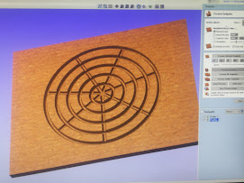

# Modelado 2D -3D

## **¿Qué es el modelado 2D?**

Cuando hablamos de modelado 2D hacemos alusión a las **imágenes que se componen por dos dimensiones: ancho y largo**. Estas figuras **no poseen profundidad**.

Las herramientas de dibujo en 2D integran entidades geométricas vectoriales como puntos, líneas, arcos y polígonos. En esta profesión, el diseño bidimensional está prácticamente omnipresente, ya que se utiliza para la confección de logos, tipografías, ilustraciones y otros productos digitales propios de su labor.

Las animaciones de este tipo son planas, aunque puedan dar la sensación de profundidad en algunos de los elementos que usan luz y sombra, esto suele estar restringido a un segundo plano. Los dibujos animados y las películas que normalmente vemos en televisión representan un ejemplo claro de animación 2D, puesto que aunque den una impresión de profundidad, la imagen aparece plana en la pantalla.


Los planos vectoriales que utilizamos para el diseño de objetos como la lámpara de Grasshopper, yendo al punto, cualquier diseño procesable en la cortadora láser y la fresadora CNC son diseños 2D.


<figure><figcaption></figcaption></figure>

 

<figure><figcaption></figcaption></figure>

 

<figure><figcaption></figcaption></figure>

 

<figure><figcaption></figcaption></figure>

## &#x20;¿Qué es el M**odelado 3D?**

**En esta técnica los elementos, personajes y escenarios se construyen o modelan en 3 dimensiones o ejes.** Un gráfico 3D se diferencia principalmente de uno 2D por la forma en que ha sido generado. Este tipo de gráficos **se originan mediante un proceso de cálculos matemáticos sobre entidades geométricas tridimensionales, producidas en un ordenador.** Mientras que, en el caso de los 2D, el propósito es conseguir una proyección visual en dos dimensiones para ser mostrada en una pantalla o impresa en papel.

Actualmente, en **el diseño gráfico 3D se utilizan miles de técnicas, normalmente computarizadas, con las que se crean las imágenes animadas.** Te aseguramos que la animación tiene muchas más aplicaciones de las que te imaginas. Los **videojuegos**, la **publicidad** e incluso la **medicina** **son sectores en los que también se necesitan profesionales de la animación**.&#x20;

Son innumerables **las disciplinas y profesiones que requieren de la técnica del modelado 3D, entre ellas destacan: arquitectura, diseño industrial, animación 3D, la geometría, entre otros**.


Los modelados como la extrusión de los cilindros que conforman el retrato de Maya Amano, o el banco realizado en Grasshopper son diseños 3D.


<figure><figcaption>
Vista 3D del modelo del Cerro León.
</figcaption></figure>

 

<figure><figcaption></figcaption></figure>

<figure><figcaption>
Visualización 3D de nuestro Test de Grabado.
</figcaption></figure>

<figure><figcaption>
Modelado 3D de Black Frost y Jack Frost.
</figcaption></figure>
