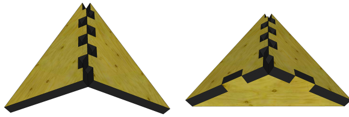

# Encastre oblicuo en forma de 'V'

<figure><figcaption></figcaption></figure>

Aunque la junta de tuerca empotrada realmente no funciona a menos que las dos partes estén en ángulos rectos entre sí, en general, las juntas en forma de "L" se pueden utilizar para ángulos agudos u obtusos también.

<figure><figcaption></figcaption></figure>

Una variante interesante de este método, en la que los dedos están redondeados, ha sido utilizada por Sebastien Wierinck en su modelo de silla 01, como se muestra:

