# Blender CNC

Ingresar al modo CAM Todos los paneles de CAM se encuentran en la configuración de Datos de Renderización.

Para poner Blender en modo CAM, sigue estos pasos. El complemento BlenderCAM ya debe estar habilitado.

En primer lugar, cambia el motor de renderización a CAM para utilizar la herramienta de CAM de Blender.

<figure><figcaption></figcaption></figure>

Selecciona Blender CAM como motor de renderizado

<figure>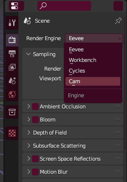<figcaption></figcaption></figure>

 

<figure>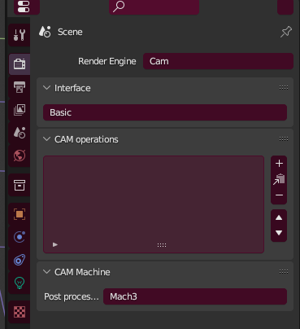<figcaption></figcaption></figure>

&#x20;Selecciona el editor de Propiedades&#x20;

Selecciona Datos de Renderización para ver los paneles de CAM

## <mark style="color:purple;">Panel de Operaciones de CAM</mark>

<figure><figcaption></figcaption></figure>

<table><thead><tr><th width="197">Función</th><th>Descripción</th></tr></thead><tbody><tr><td><mark style="color:purple;"><strong>Calcular trayectoria</strong></mark></td><td>Esto calcula la operación que está actualmente seleccionada en la lista de operaciones de CAM. El botón permanecerá seleccionado hasta que se complete el cálculo.</td></tr><tr><td><mark style="color:purple;"><strong>Simular operación</strong></mark></td><td>Funciona para operaciones de 3 ejes, pero no para todas. Crea un nuevo objeto que muestra la simulación. La subdivisión del objeto se puede aumentar, y la resolución de la simulación también depende de los detalles de muestreo de la rasterización de la simulación, que se encuentra en el panel de optimización.</td></tr><tr><td><mark style="color:purple;"><strong>Nombre de la operación</strong></mark></td><td>Selecciona este campo para cambiar el nombre de la operación actualmente seleccionada.</td></tr><tr><td><mark style="color:purple;"><strong>Nombre de archivo</strong></mark></td><td>Nombre del archivo de código G. La extensión del archivo utilizada se determinará por el postprocesador de código G seleccionado. Consulta el panel de Máquina de CAM para configurar el postprocesador.</td></tr><tr><td><mark style="color:purple;"><strong>Fuente de datos</strong></mark></td><td>Puede ser un objeto, un grupo de objetos o una imagen.</td></tr><tr><td><mark style="color:purple;"><strong>Objeto</strong></mark></td><td>Un objeto de Blender. Puede ser un mallado o una curva.</td></tr><tr><td><mark style="color:purple;"><strong>Grupo</strong></mark></td><td>Objetos en un grupo. Selecciona todos los objetos que deseas usar y presiona Ctrl+G para crear un nuevo grupo. Luego, escribe el nombre del grupo en el campo (Grupo será el nombre del primer grupo que crees).</td></tr><tr><td><mark style="color:purple;"><strong>Imagen</strong></mark></td><td>Abre una imagen que se utilizará como mapa de altura/profundidad.</td></tr><tr><td><mark style="color:purple;"><strong>Objeto</strong></mark></td><td>El objeto de Blender que se utilizará en la operación de CAM. Selecciona el objeto de una lista desplegable. Escribe su nombre en el campo; debería autocompletarse y dar una lista de objetos para seleccionar. NOTA: si cambias el nombre del objeto más adelante, también debes cambiarlo aquí. El campo se volverá rojo si no se puede encontrar el objeto.</td></tr></tbody></table>

<figure>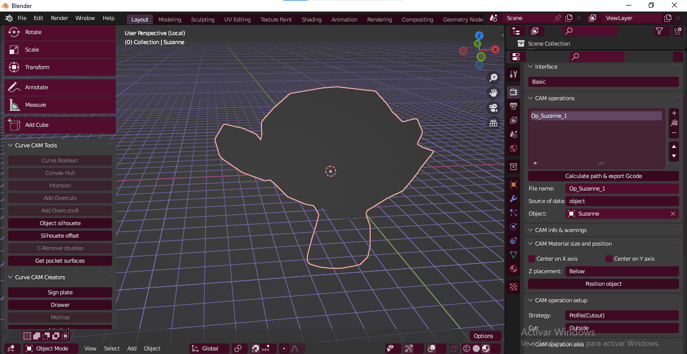<figcaption></figcaption></figure>

<figure>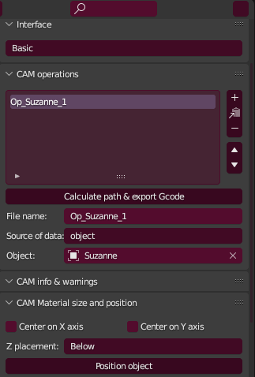<figcaption></figcaption></figure>

 

<figure>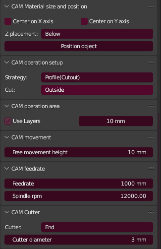<figcaption></figcaption></figure>

<figure>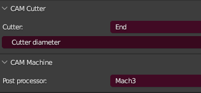<figcaption></figcaption></figure>

### <mark style="color:purple;">CAM info and Warnings Panel</mark>

Este panel mostrará cualquier problema encontrado durante el cálculo, el tiempo estimado de la operación y los datos de carga del filo de corte (chipload).

<figure>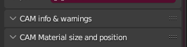<figcaption></figcaption></figure>

 

<figure>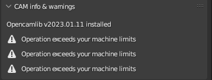<figcaption></figcaption></figure>

<figure>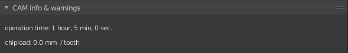<figcaption></figcaption></figure>

<mark style="color:purple;"><strong>¿Qué es Chipload?</strong></mark>

"Chipload" se refiere a la cantidad de material (viruta) que una herramienta de corte, como una fresa o una broca, retira por cada vuelta completa o avance durante una operación de corte. Es una medida importante en el mecanizado y fresado CNC, ya que afecta la velocidad de corte y la calidad del acabado de la pieza.

La carga de viruta, o chipload, se expresa generalmente en unidades de distancia por revolución (por ejemplo, mm/rev o pulgadas/rev). Controlar la carga de viruta es crucial para optimizar el rendimiento de la herramienta y evitar problemas como el desgaste prematuro de la herramienta, la generación de calor excesivo y la mala calidad del acabado superficial.

En el contexto de la información proporcionada sobre la herramienta de CAM, los datos de carga del filo de corte (chipload data) se refieren a información sobre cómo la herramienta interactúa con el material durante la operación de mecanizado, incluida la cantidad de material que se retira en cada paso o revolución. Estos datos son esenciales para ajustar la configuración de mecanizado y lograr resultados óptimos.

## <mark style="color:purple;">Panel de configuración de operaciones de CAM.</mark>

<figure>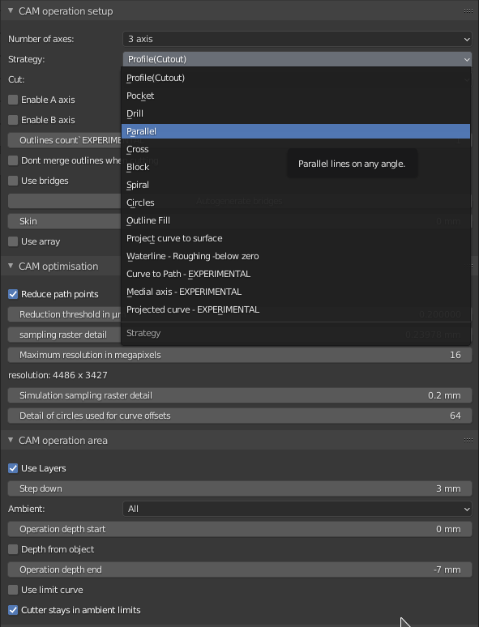<figcaption></figcaption></figure>

<figure>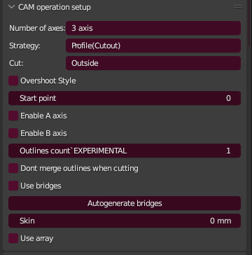<figcaption></figcaption></figure>

### <mark style="color:purple;">Tipos de estrategias</mark>

<figure><figcaption></figcaption></figure>

| Parámetro                                                                                                  | Descripción                                                                                                                                                                                                                                                                                                                                                                                                                                                                                                                               |
| ---------------------------------------------------------------------------------------------------------- | ----------------------------------------------------------------------------------------------------------------------------------------------------------------------------------------------------------------------------------------------------------------------------------------------------------------------------------------------------------------------------------------------------------------------------------------------------------------------------------------------------------------------------------------- |
| <mark style="color:purple;">**Distancia entre trayectorias**</mark>                                        | También llamada paso de solape en otras aplicaciones..png>)                                                                                                                                                                                                                                                                                                                                                                                                                                           |
| <mark style="color:purple;">**Distancia a lo largo de trayectorias**</mark>                                | Determina la densidad de la trayectoria de la operación, lo cual puede influir en la precisión del mecanizado..png>)                                                                                                                                                                                                                                                                                                                                                                                  |
| <mark style="color:purple;">**Ángulo de las trayectorias**</mark>                                          | Rota las estrategias paralelas y cruzadas por la cantidad especificada. Nota que, por ejemplo, rotar por 90 grados cambia el eje básico de X a Y.                                                                                                                                                                                                                                                                                                                                                                                         |
| <mark style="color:purple;">**Retroceso paralelo**</mark>                                                  | Esta función es solo para el pase de acabado, cuando aún necesitas cortar una cantidad sustancial de material y también deseas ahorrar la fresa. Si configuras un movimiento de subida, ingresa con subida al material y luego retrocede un paso en la otra dirección, utilizando el movimiento hacia atrás de la máquina para terminar la superficie. Nota que esto significa que el corte en el material ocurrirá a una velocidad que es el doble de la distancia entre trayectorias. Si no comprendes todo esto, no uses esta función. |
| <mark style="color:purple;">**Capa (Skin)**</mark>                                                         | Útil para desbaste, deja una capa en la superficie para el acabado.                                                                                                                                                                                                                                                                                                                                                                                                                                                                       |
| <mark style="color:purple;">**Fresado inverso**</mark>                                                     | Se utiliza si deseas fresar directamente desde la positiva del objeto. No funciona en modo exacto y solo para estrategias de 3 ejes.                                                                                                                                                                                                                                                                                                                                                                                                      |
| <mark style="color:purple;">**Dirección**</mark>                                                           | Para estrategias de bloque y espiral, decide si la trayectoria progresa desde el interior o desde el exterior.                                                                                                                                                                                                                                                                                                                                                                                                                            |
| <mark style="color:purple;">**Profundidad de talla (Carve depth)**</mark>                                  | Decide cuán profunda será la operación de talla por debajo de la superficie.                                                                                                                                                                                                                                                                                                                                                                                                                                                              |
| <mark style="color:purple;">**No fusionar contornos al cortar (Don't merge outlines when cutting)**</mark> | Para la estrategia de recorte. No fusiona los contornos, lo que resulta en cortar en la zona del objeto. Útil para fresar PCBs, donde no necesitas la forma exacta pero necesitas separar áreas con grabado.                                                                                                                                                                                                                                                                                                                              |
| <mark style="color:purple;">**Usar puentes (Use bridges)**</mark>                                          | Para la operación de recorte, coloca automáticamente puentes según las reglas establecidas por las opciones que aparecerán después de habilitar esto: ancho, altura, mínimo por curva, distancia.                                                                                                                                                                                                                                                                                                                                         |

<mark style="color:purple;"><strong>Milling</strong></mark>

La operación de fresado (milling en inglés) es un proceso de mecanizado que implica la remoción de material de una pieza de trabajo utilizando una herramienta de corte rotativa. Este proceso es común en la fabricación y la ingeniería para dar forma a materiales como metal, plástico, madera y otros.

Durante el fresado, la herramienta de corte gira alrededor de su eje y se desplaza a lo largo de la superficie de la pieza de trabajo para cortar y dar forma al material. Hay diferentes estrategias y técnicas de fresado, como el fresado de acabado, desbaste, ranurado y perforación, cada una diseñada para cumplir con objetivos específicos de mecanizado.

.png>)\

## <mark style="color:purple;">Panel de optimización de CAM.</mark>

<figure>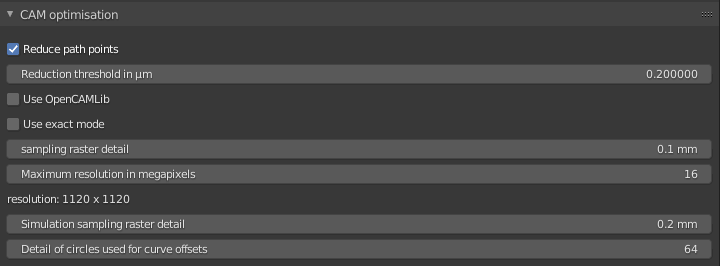<figcaption></figcaption></figure>

<figure>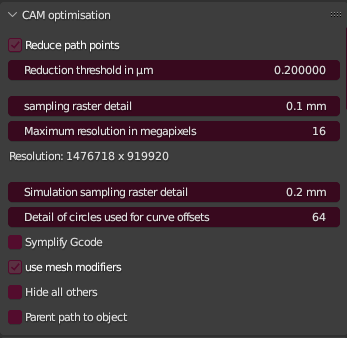<figcaption></figcaption></figure>

<table><thead><tr><th width="205">Parámetro</th><th>Descripción</th></tr></thead><tbody><tr><td><mark style="color:purple;"><strong>Reducir puntos de trayectoria</strong></mark></td><td>
Reduce el número de comandos en la operación, lo que hace que el código G resultante sea más corto y pueda ejecutarse de manera más suave en la máquina.

</td></tr><tr><td><mark style="color:purple;"><strong>Umbral de reducción en µm</strong></mark></td><td>Los puntos con una distancia más pequeña (en micrómetros) hacia la dirección de la trayectoria se reducirán.</td></tr><tr><td><mark style="color:purple;"><strong>Usar modo exacto</strong></mark></td><td>El modo exacto está relacionado con las estrategias que son completamente 3D, como paralelo, cruzado, bloque, espiral, círculos, línea de agua, relleno de contorno y talla. Es una configuración muy importante.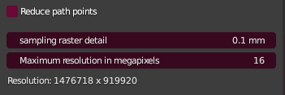</td></tr><tr><td><mark style="color:purple;"><strong>Modo no exacto</strong></mark></td><td>En modo no exacto, se utiliza una imagen para estimar los desplazamientos de la fresa y el detalle de muestreo de la trama se utiliza para estimar la resolución de la imagen. Es bueno para mallas de alta poligonalidad, pero el detalle de muestreo de la trama es crucial. Puede producirse un desbordamiento de memoria con objetos grandes.</td></tr><tr><td><mark style="color:purple;"><strong>Modo exacto</strong></mark></td><td>Se utiliza una simulación real de colisión, por lo que las colisiones son exactas. La velocidad disminuye con el aumento del número de polígonos. Se recomienda en situaciones en las que el modelo es demasiado grande para el modo no exacto, se necesita alta precisión o el modelo no tiene demasiadas caras.</td></tr><tr><td><mark style="color:purple;"><strong>Detalle de muestreo de la trama</strong></mark></td><td>Este parámetro es crucial para el uso de memoria y, principalmente, la velocidad de Blender CAM. En modo no exacto, BlenderCAM utiliza una imagen para calcular las posiciones de desplazamiento de la fresa.</td></tr><tr><td><mark style="color:purple;"><strong>Detalle de muestreo para simulación</strong></mark></td><td>Igual que el detalle de muestreo de la trama, pero solo para la simulación.</td></tr><tr><td><mark style="color:purple;"><strong>Detalle de círculos para compensación de curvas</strong></mark></td><td>Exactamente lo que dice.</td></tr><tr><td><mark style="color:purple;"><strong>Usar OpenCAMLib</strong></mark></td><td>Utiliza una biblioteca externa para calcular las trayectorias de herramientas, mejorando la calidad de las trayectorias (especialmente con líneas de agua) y el tiempo de cálculo. Debe usarse con el modo exacto. [[Uso-de-BlenderCAM-con-OpenCAMLib]]</td></tr></tbody></table>

## <mark style="color:purple;">Panel de área de operación de CAM.</mark>

<figure><figcaption></figcaption></figure>
