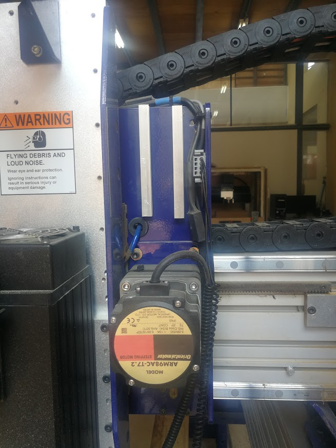

# CORNER (“L”) JOINTS

<figure><figcaption></figcaption></figure>

Esta disposición de lengüetas y ranuras entrelazadas en un ángulo de noventa grados es, por supuesto, antigua y rudimentaria. La mayoría de las personas la llaman "unión de caja". También puede ser mejorada al romper la simetría.

<figure><figcaption>
Es adaptable a la disposición de tuerca empotrada atornillada.
</figcaption></figure>

El material a utilizar es el MDF

<mark style="color:purple;">Qué es el MDF</mark>

El fibropanel de densidad media o MDF (por sus siglas en inglés medium density fibreboard o también llamado DM, Trupán​ o Fibrofácil) es un producto de madera reconstituida que se obtiene descomponiendo residuos de madera dura o blanda en fibras de madera, a menudo en un desfibrador, combinándolo con cera y un aglutinante de resina, y formando paneles mediante la aplicación de alta temperatura y presión. El MDF es por lo general más denso que el contrachapado. El MDF es más fuerte y denso que el aglomerado.

L a dimensión del grosor del MDF es de 12 mm, para nuestro corte en MDF debemos crear un archivo 2D y enviarlo al programa como .dxf

Utilizaremos un material de dimenciones de 300x300x120 mm

## <mark style="color:purple;">Diseñar el encastre</mark>





## <mark style="color:purple;">Preparar el material</mark>

#### Cortar el material a utilizar

<figure><figcaption></figcaption></figure>

## <mark style="color:purple;">Prender la máquina</mark>

<figure><figcaption></figcaption></figure>

 

<figure><figcaption></figcaption></figure>

<figure><figcaption></figcaption></figure>

 

<figure><figcaption></figcaption></figure>

#### Medir las dimensiones

<figure><figcaption></figcaption></figure>

 

<figure><figcaption>
Dimensionar los ejes desde esta vista, en este caso el eje sería el X.
</figcaption></figure>

 

<figure><figcaption>
Pensar esta dirección como el eje Y.
</figcaption></figure>

<figure><figcaption>
Utilizaremos el calibre y una cinta métrica.
</figcaption></figure>

Dimensiones en el eje X&#x20;

<figure><figcaption></figcaption></figure>

Dimensiones del eje Y

<figure><figcaption></figcaption></figure>

Dimension en el eje Z

<figure><figcaption></figcaption></figure>

#### Fijar el material a la mesa con un taladro y tornillos

<figure><figcaption></figcaption></figure>

 

<figure><figcaption></figcaption></figure>

 

<figure><figcaption></figcaption></figure>

Podemos cambiar las brocas del taladro de acuerdo a las necesidades

<figure><figcaption></figcaption></figure>

Debemos tener en cuenta que la distancia que utilizaremos se enuentra dentro del espacio que delimitan los tornillos que fijamos, debemos tener en cuenta la distancia de este margen.

<figure><figcaption></figcaption></figure>

## <mark style="color:purple;">Establecer los ejes X, Y, Z</mark>&#x20;

#### Eje X e Y

Para acercar a los ejes X e Y se utiliza Software de **SnapBot** en la PC para guiar a la máquina CNC.

<figure><figcaption></figcaption></figure>

 

<figure><figcaption></figcaption></figure>

<figure><figcaption></figcaption></figure>

**Eje Z**

Para ubicar el eje Z utilizaremos la pinza y un objeto de metal,

<figure><figcaption></figcaption></figure>

 

<figure><figcaption></figcaption></figure>

 

<figure><figcaption></figcaption></figure>

## <mark style="color:purple;">**VCarve**</mark>

## <mark style="color:purple;">Resultado</mark>

Al finalizar el corte destornillamos el pedazo de MDF, empujamos las piezas resultantes.

Luego tenemos que lijar

<figure><figcaption></figcaption></figure>

 

<figure><figcaption></figcaption></figure>

<figure><figcaption></figcaption></figure>

<figure><figcaption></figcaption></figure>

 

<figure><figcaption></figcaption></figure>

