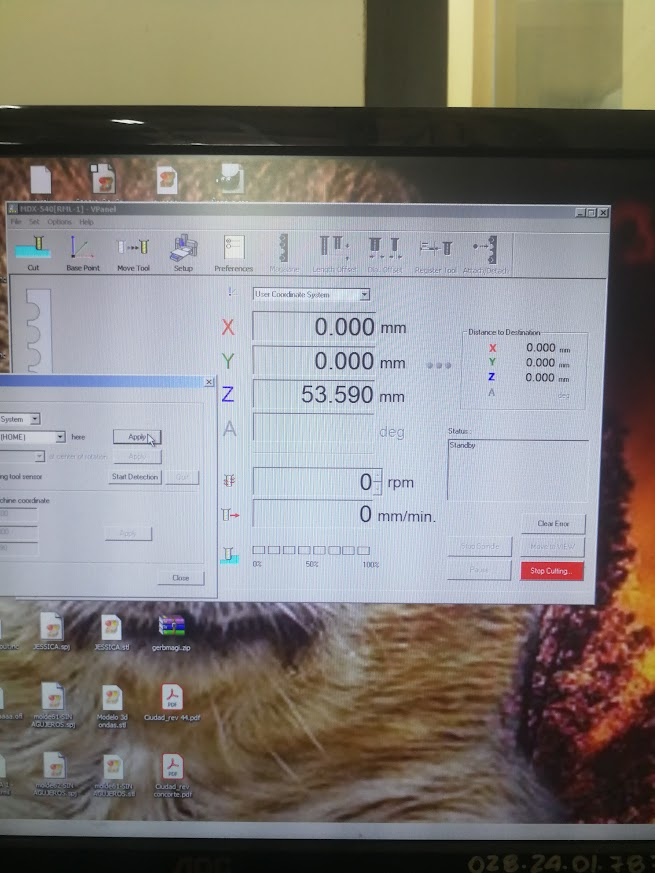

# Hacer un fresado del Cerro León

<figure><figcaption></figcaption></figure>

<figure><figcaption></figcaption></figure>

<figure><figcaption></figcaption></figure>

<figure><figcaption></figcaption></figure>

<figure><figcaption></figcaption></figure>

<figure><figcaption></figcaption></figure>

<figure><figcaption></figcaption></figure>

## Fijar el material en el tablero

Para fijar el isopor al tablero usaremos cinta doble faz.

<figure><figcaption></figcaption></figure>

Ubicamos la pieza guiándonos por alguna referencia para que quede encuadrado.

<figure><figcaption></figcaption></figure>

 

<figure><figcaption></figcaption></figure>

De no contar con una placa para este fin, debemos atornillar alguna a la base.

<figure><figcaption></figcaption></figure>

Marcar el centro

Para marcar el centro podemos hacer dos diagonales con una regla desde los vértices, la intersección resultante es nuestro punto del centro.

## Prender

Para prender nuestra máquina utilizaremos el interruptor que se encuentra al lateral derecho. Una vez prendido podemos ver la botonera para mover nuestra fresa prendida.

<figure><figcaption></figcaption></figure>

 

<figure><figcaption></figcaption></figure>

Dependiendo de dónde indica la luz de la máquina cargaremos el tipo de archivo, el RLM indica el formato de la empresa fabricante Roland, el formato NC es un formato genérico.

<figure><figcaption></figcaption></figure>

 

<figure><figcaption></figcaption></figure>

## Establecer los ejes en x, y z

Con ayuda de este control podemos mover nuestra fresa en los ejes x, y, z. Funciona seleccionando el botón del eje a mover, y luego utilizamos la rueda giratoria que se encuentra en la zona inferior del control.

<figure><figcaption></figcaption></figure>

 

<figure><figcaption></figcaption></figure>

<figure><figcaption></figcaption></figure>

Establecemos los ejes X e Y en VPanel y luego procedemos a encontar el eje Z.

<figure><figcaption></figcaption></figure>

 

<figure><figcaption></figcaption></figure>

Podemos cambiar la broca de la fresa. Para evitar pérdidas debemos utilizar un trapo de amortiguador en caso de caídas. Abrimos el portabrocas con ayuda de una llave y así podemos reemplazar la pieza.

<figure><figcaption></figcaption></figure>

<figure><figcaption></figcaption></figure>

 

<figure><figcaption></figcaption></figure>

 

<figure><figcaption></figcaption></figure>

<figure><figcaption></figcaption></figure>

 

<figure><figcaption></figcaption></figure>

 

<figure><figcaption></figcaption></figure>

 

<figure><figcaption></figcaption></figure>

<figure><figcaption></figcaption></figure>

## Ubicar el eje

<figure><figcaption></figcaption></figure>

<figure><figcaption></figcaption></figure>

 

<figure><figcaption></figcaption></figure>

## SRPP

<figure><figcaption></figcaption></figure>

 

<figure><figcaption></figcaption></figure>

<figure><figcaption></figcaption></figure>

 

<figure><figcaption></figcaption></figure>

<figure><figcaption></figcaption></figure>

<figure><figcaption></figcaption></figure>

 

<figure><figcaption></figcaption></figure>

<figure><figcaption></figcaption></figure>

 

<figure><figcaption></figcaption></figure>

<figure><figcaption></figcaption></figure>

 

<figure><figcaption></figcaption></figure>

<figure><figcaption></figcaption></figure>

<figure><figcaption></figcaption></figure>

 

<figure><figcaption></figcaption></figure>

<figure><figcaption></figcaption></figure>

<figure><figcaption></figcaption></figure>

<figure><figcaption></figcaption></figure>

 

<figure><figcaption></figcaption></figure>

<figure><figcaption></figcaption></figure>

<figure><figcaption></figcaption></figure>

