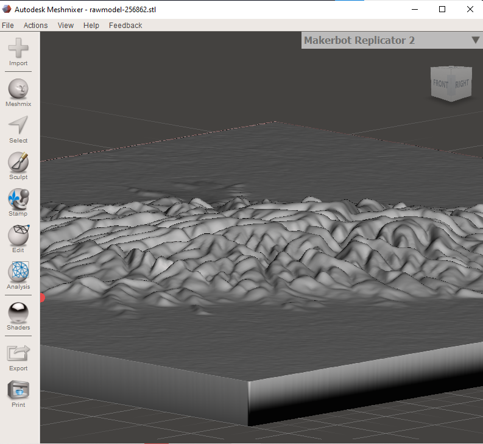

# Obtener un modelo 3D del Cerro León

El cerro León o macizo cerro León es una zona de colinas en el departamento de Alto Paraguay en la zona noroeste de Paraguay, la zona montañosa abarca unos 52 km de diámetro, y se eleva hasta 624 m snm.&#x20;

<figure><figcaption>
Vista aérea del Cerro León.
</figcaption></figure>

El cerro León se encuentra en la zona central del parque nacional Defensores del Chaco.

<figure><figcaption>
Vista del cerro león en el distrito de Fuerte Olimpo.
</figcaption></figure>

La flora de la región comprende quebracho blanco, palo santo, samuù (palo borracho), bosques bajos y arbustos espinosos y varias especies de cactus.

&#x20;En cuanto a fauna en la zona viven felinos tales como yaguaretés, pumas, tirika, yaguarundí, varias especies de armadillos y monos (ka’i mirikina y ka’i pyhare).

<figure><figcaption>
Vista del cerro desde la página.
</figcaption></figure>

<figure><figcaption>
Vista de los parámetros del menú de Detalles del Modelo.
</figcaption></figure>

<figure><figcaption>
Menú del menú de Configuraciones de Agua y Base
</figcaption></figure>

<figure><figcaption>
Generar Modelo y Descargar.
</figcaption></figure>

<figure><figcaption>
Vista del Modelo generado en Meshmixer.
</figcaption></figure>


Enlace del terreno en formato .stl


<figure><figcaption>
Zoom al objeto stl del enlace.
</figcaption></figure>
