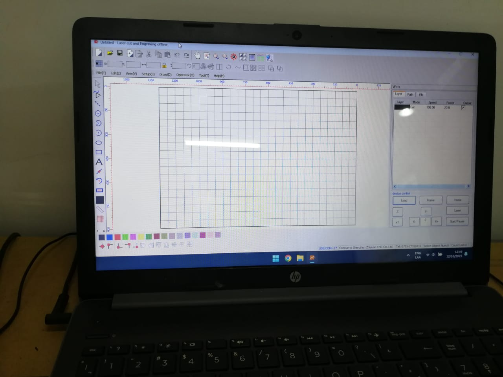

# Corte Láser

La tecnología de corte láser es un proceso de fabricación avanzado que utiliza un rayo láser altamente concentrado y enfocado para cortar, grabar, marcar o perforar materiales diversos.

## <mark style="color:red;">La cortadora láser</mark>

Teniendo en cuenta que cada cortadora láser funciona diferente, es posible que no se cuenten con los mismos resultados aplicando la misma configuración en otras cortadores, aclararemos con qué máquina estaremos trabajando. Se trata de una cortadora láser de origen chino de la marca JQ.

A lo largo del proceso a desarrollar enviaremos la información a cortar por medio del programa propio de la empresa JQ, es un programa que tiene mucho por mejorar, pero estamos condicionados a su uso ya que la máquina es estrictamente compatible con él y no acepta alternativas.


Link a la página oficial de la empresa.


<figure><figcaption>
Vista Frontal de la máquina.
</figcaption></figure>

 

<figure><figcaption>
Por medio de la computadora enviaremos los archivos a la máquina.
</figcaption></figure>

## Pasos generales de uso que se repetirán en todas las actividades a realizar

* Conectar una de las extractoras

<figure><figcaption></figcaption></figure>

 

<figure><figcaption>
Extractor de la cortadora láser.
</figcaption></figure>

 

<figure><figcaption></figcaption></figure>

<figure><figcaption>
La cortadora que utilizaremos cuenta con uno en su interior, pero en este caso contamos con otro en el techo.
</figcaption></figure>

* Prender la máquina

<figure><figcaption></figcaption></figure>

 

<figure><figcaption></figcaption></figure>

* Encender la Cortadora Láser

<figure><figcaption></figcaption></figure>

 

<figure><figcaption>
Al encontrarse la cortadora apagada las luces no encienden
</figcaption></figure>

* Ubicar el material a cortar en la parrilla y fijarlo con cinta de papel

<figure><figcaption></figcaption></figure>

 

<figure><figcaption></figcaption></figure>

<figure><figcaption></figcaption></figure>

 

<figure><figcaption></figcaption></figure>

 

<figure><figcaption></figcaption></figure>

* Calibrar la cabeza del material

<figure><figcaption></figcaption></figure>

 

<figure><figcaption></figcaption></figure>

La calibración de la cabeza del láser es un proceso importante en el funcionamiento de dispositivos que utilizan tecnología láser, como impresoras láser, máquinas de corte láser o sistemas de grabado láser. La calibración se realiza para garantizar que el láser se enfoque correctamente y se ajuste a la posición deseada.&#x20;

<mark style="color:purple;"><strong>Razones clave por las cuales es necesario calibrar la cabeza del láser:</strong></mark>

* <mark style="color:purple;">**Precisión y calidad de salida:**</mark> La calibración asegura que el láser apunte con precisión a los puntos o líneas deseados en el material de trabajo. Esto es crucial para mantener la calidad y la precisión de la salida, como la impresión, el corte o el grabado.

<!---->

* <mark style="color:purple;">**Evitar daños:**</mark> Un láser mal calibrado puede causar daños a la máquina, al material o incluso representar un riesgo para la seguridad. La calibración adecuada garantiza que el láser se mantenga dentro de los límites de seguridad y no cause daños no deseados.

<!---->

* <mark style="color:purple;">**Alineación:**</mark> En muchas aplicaciones, es fundamental que el láser esté alineado de manera precisa con respecto al material de trabajo. La calibración permite lograr esta alineación, lo que es especialmente importante en máquinas de corte y grabado láser.

<!---->

* <mark style="color:purple;">**Consistencia:**</mark> La calibración regular ayuda a mantener la consistencia en la calidad de producción. Asegura que el láser produzca resultados consistentes a lo largo del tiempo y a lo largo de múltiples trabajos.

<!---->

* <mark style="color:purple;">**Corrección de errores:**</mark> Con el tiempo, la alineación y la precisión del láser pueden desviarse debido al uso y al desgaste. La calibración permite corregir cualquier desviación o error que pueda surgir.

<!---->

* <mark style="color:purple;">**Optimización de recursos:**</mark> La calibración también puede ayudar a optimizar el uso de recursos, como la energía del láser y el tiempo de producción. Un láser bien calibrado utiliza sus recursos de manera más eficiente.

<!---->

* <mark style="color:purple;">**Cumplimiento de normativas y estándares:**</mark> En algunas industrias y aplicaciones, existen normativas y estándares específicos que requieren una calibración periódica de las máquinas láser. Esto es especialmente importante en aplicaciones médicas o aeroespaciales.

* Abrir el software **PowerCut**

<figure><figcaption>
Programa propio de la cortadora láser.
</figcaption></figure>

 

<figure><figcaption></figcaption></figure>

* Descargar desde Gmail los trabajos a realizar&#x20;
* Muchas veces deberemos convertir los vectores enviados en un pdf a .dxf por nuestra cuenta
* Importar el archivo .dxf a cortar en **PowerCut**

<figure><figcaption></figcaption></figure>

 

<figure><figcaption></figcaption></figure>

 

<figure><figcaption></figcaption></figure>

<figure><figcaption>
Ubicar la unidad en mm.
</figcaption></figure>


Debemos asegurarnos de que la unidad de medida sea en mm.


* De ser posible se debe eliminar las líneas dobles superpuestas para evitar que se corte dos veces y se queme el material

<figure><figcaption>
Línea discontinua que indica que hay un solo trazo en esa región.
</figcaption></figure>


Un problema común es las líneas superpuestas, cuando se encuentran de esta manera notaremos que aparenta una línea continua al seleccionar, si procesamos con líneas superpuestas el láser cortará o grabará dos veces en esa región, así que puede perjudicarnos. Por esta razón debemos eliminar las líneas superpuestas. Al contar con una sola línea en la interface se ve como línea discontinua.



Podemos candadear la posición de nuestros objetos en la mesa de trabajo seleccionando el candado.



<figure><figcaption>
Ícono del candado en el menú superior.
</figcaption></figure>

* Establecer la jerarquía de orden de los vectores a grabar y cortar para evitar diversos problemas con mucha atención para no desperdiciar el material

<figure><figcaption>
Seleccionar en cada capa con los colores diferentes seleccionados para cambiar los parámetros de speed y potencia.   
</figcaption></figure>

<figure><figcaption>
Pestaña emergente para configurar la capa.
</figcaption></figure>

* Ubicar estas líneas en diversas capas con parámetros establecidos para su fin (corte o grabado)


Es de suma importancia realizar primero los grabados antes de los cortes.

Para evitar cortar una pieza que también necesita grabado.


Creamos nuevas capas y seleccionamos un color para cada uno, de esta forma se cortará y grabará con diferentes parámetros que estableceremos.

<mark style="color:purple;">Funciones de cada parámetro de las capas.</mark>

**Work Mode:** Se selecciona el tipo de trabajo, si será corte (cut) o grabado (engraving).&#x20;

**Speed:** Ajusta la velocidad de corte.

**Acceleration:** Ajusta la aceleración de corte, no se suele modificar.

Laser 1: Ajusta la potencia del corte.

Laser 2: En este caso contamos con un solo láser, pero en caso de contar con dos, este parámetro indica la potencia del segundo láser.

Igual sin contar con dos láseres introduciremos el mismo parámetro de potencia en Laser 2 igualmente.

**Engraving:** Establece la distancia entre cada línea en el grabado.

<figure><figcaption>
Seleccionar el 70% y ubicar uno de los colores de la paleta del menú inferior.
</figcaption></figure>

<figure><figcaption>
Capas las distintas velocidades y la misma potencia de la primera hilera horizontal.
</figcaption></figure>

* El orden de las líneas a cortar se configuran en función al orden de las capas&#x20;


Si observamos las capas encontraremos cuadrados a marcar o desmarcar para que una capa sea visible para la máquina.

Desmarcaremos la capa negra para no cortar los elementos que no modificamos o no queremos cortar ahora mismo.


* Debemos ubicar nuestros vectores en la esquina superior izquierda, ahí se iniciará el corte en el eje que fijaremos.

<figure><figcaption></figcaption></figure>

<figure><figcaption></figcaption></figure>

 

<figure><figcaption></figcaption></figure>

* Una vez establecidos por parámetros exportamos los archivos a la cortadora con **LOAD**

<figure><figcaption></figcaption></figure>

 

<figure><figcaption></figcaption></figure>

 

<figure><figcaption></figcaption></figure>

* Fijamos el eje en nuestro espacio disponible en el material con **FIXED**

<figure><figcaption>
Botones de comando de la Cortadora Láser.
</figcaption></figure>

<mark style="color:purple;"><strong>Funciones de los botones de comando</strong></mark>

<mark style="color:purple;">**Flechas**</mark>

Mover el láser de dirección.

<mark style="color:purple;">**File**</mark>

Acceder a los archivos cargados anteriormente.

<mark style="color:purple;">**Laser**</mark>

Señala la posición exacta del puntero láser, marcando el punto en que se encuentra.

 (1) (1).png>)

<mark style="color:purple;">**Frame**</mark>

Dibuja un recuadro si marcar con el láser para saber dónde se realizará el dibujo.

Puede ser muy útil antes de marcar en u lugar equivocado de haberse olvidado actualizar el eje de coordenada.

<mark style="color:purple;">**Botón Verde**</mark>

Iniciar la operación.

<mark style="color:purple;">**Botón Rojo**</mark>

Parar la operación.

* Podemos usar LASER para ver dónde se encuentra nuestra cabeza del láser, realiza un punto que nos puede servir para guiarnos.

<figure><figcaption></figcaption></figure>

* También usamos con frecuencia FRAME para ver cuánto espacio delimita nuestro archivo en el material
* Una vez seguros iniciamos el corte

<figure><figcaption></figcaption></figure>

***
