# Lámpara cortada en cartón gris

## <mark style="color:purple;">Proceso de Corte</mark>

Abriremos nuestro programa PowerCut, luego importaremos nuestro archivo .dxf que contiene nuestros vectores.

<figure><figcaption>
Ícono Load a seleccionar para importar el archivo.
</figcaption></figure>

 

<figure>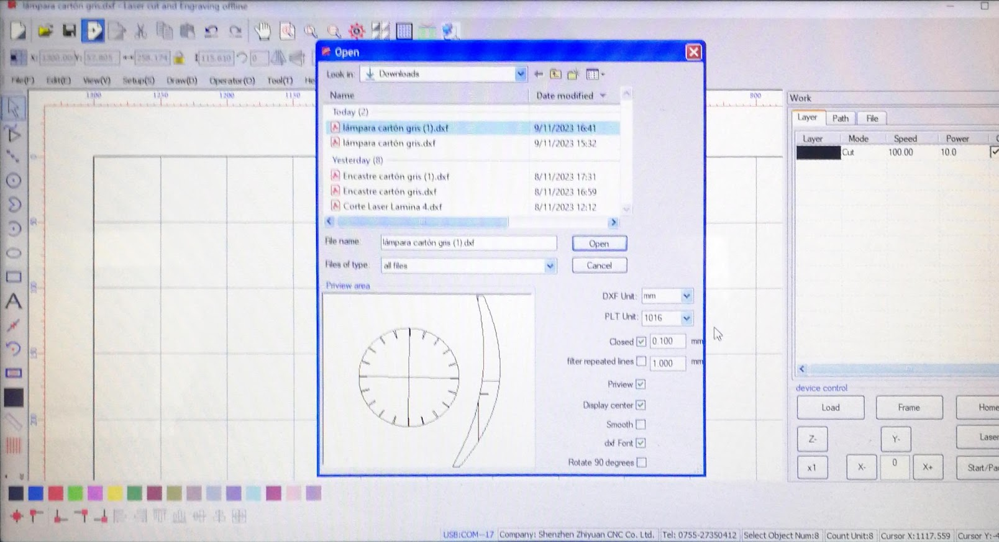<figcaption></figcaption></figure>

Una vez abierto seleccionaremos el conjunto total y seleccionamos el ícono de ubicar a la esquina superior izquierda.

<figure>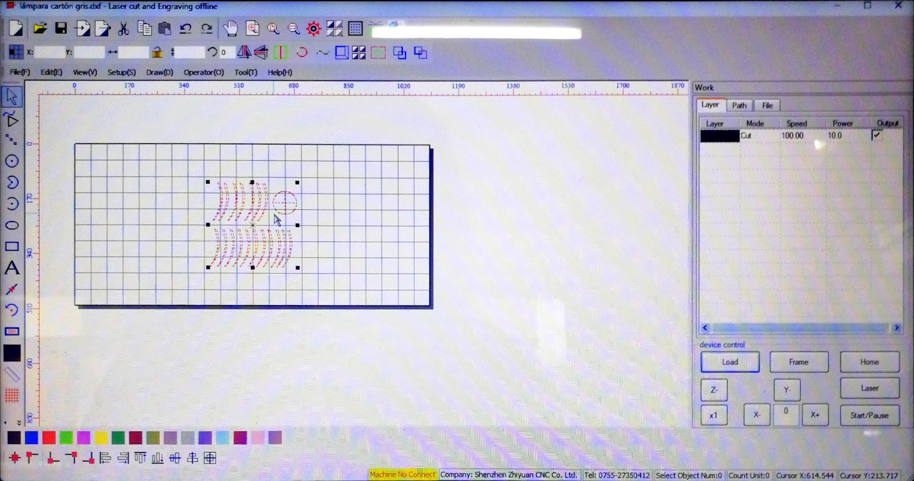<figcaption>
Posición original de los vectores.
</figcaption></figure>

 

<figure>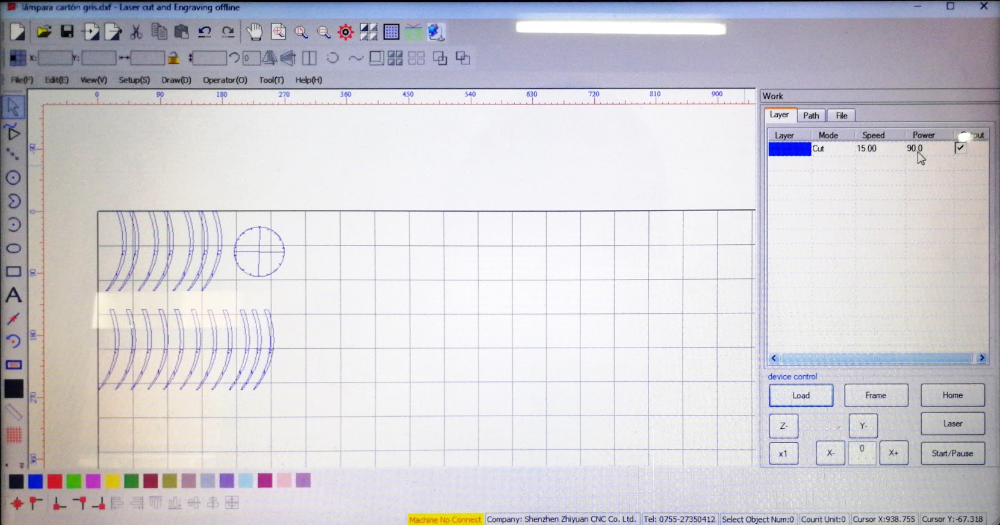<figcaption>
Conjunto ubicado en la esquina superior izquierda.
</figcaption></figure>

<figure><figcaption>
Abajo de los cuadrados de colores para asignar las capas de los vectores, encontramos los íconos para ubicar en el centro o en las esquinas, también tipos de justificación.
</figcaption></figure>

También seleccionamos los vectores a cortar y asignamos una capa con los parámetros de velocidad y potencia para cortar según nuestro material, en este caso el cartón gris.

<figure>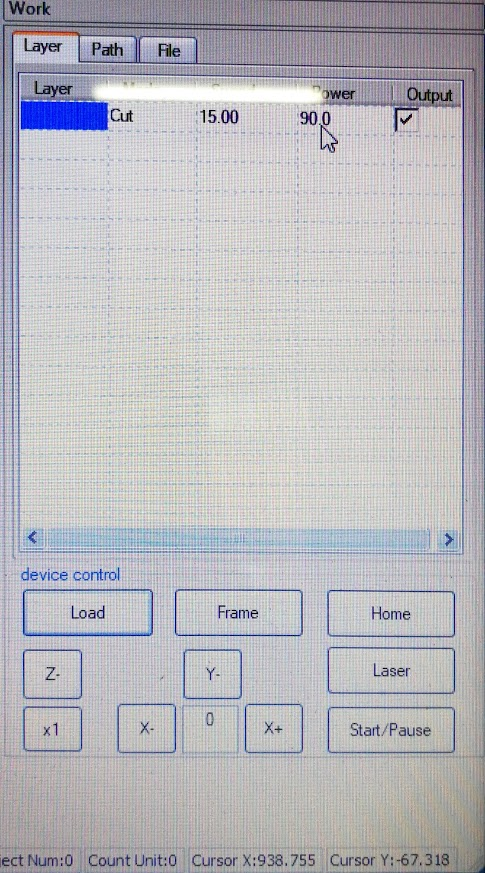<figcaption></figcaption></figure>

Seleccionamos **Load**, asignamos un nombre corto y luego procedemos con **Down File**.

<figure>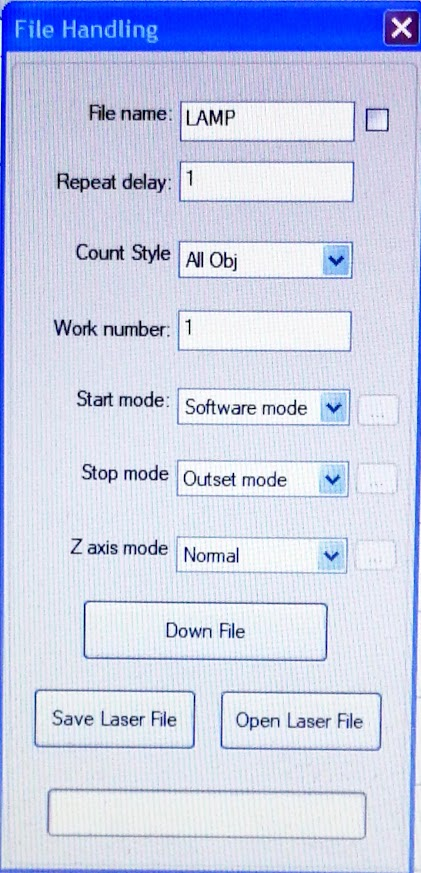<figcaption></figcaption></figure>

Una vez enviado el archivo, el dibujo nos aparece en la pantalla, debemos ubicar en el material el eje, seleccionar fixed y luego iniciar la operación de corte.

<figure>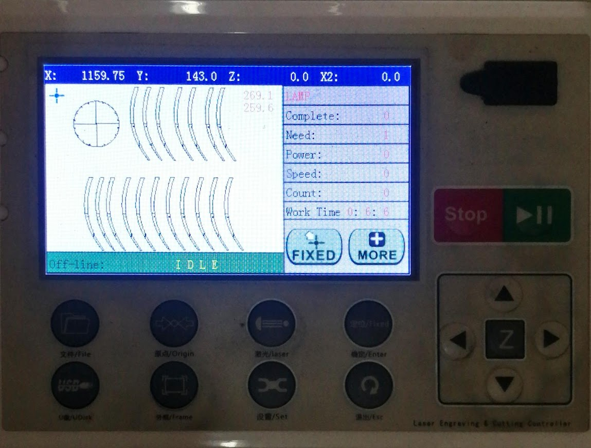<figcaption></figcaption></figure>


**¿Qué salió mal?**

Las líneas generadas en Rhino para indicar que se trata de un mesh se ha exportado como vector, no me he percatado y lo tenía que eliminar antes de exportarlo, como no lo he hecho se ha cortado esas líneas también


### <mark style="color:purple;">Rediseño y Nuevo Intento</mark>

Repetí el proceso con el archivo corregido pero, el diseño simplemente no funciona y necesita unos cambios

<figure>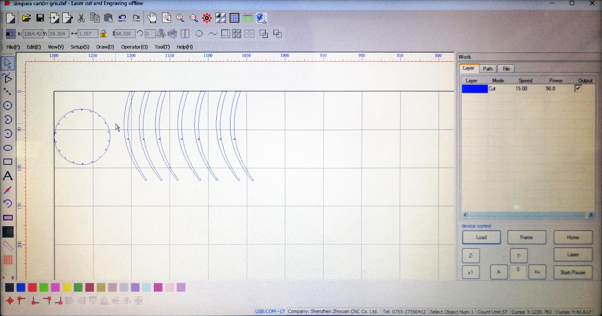<figcaption>
Vista de las piezas con las líneas inesperadas ya eliminadas.
</figcaption></figure>

 

<figure>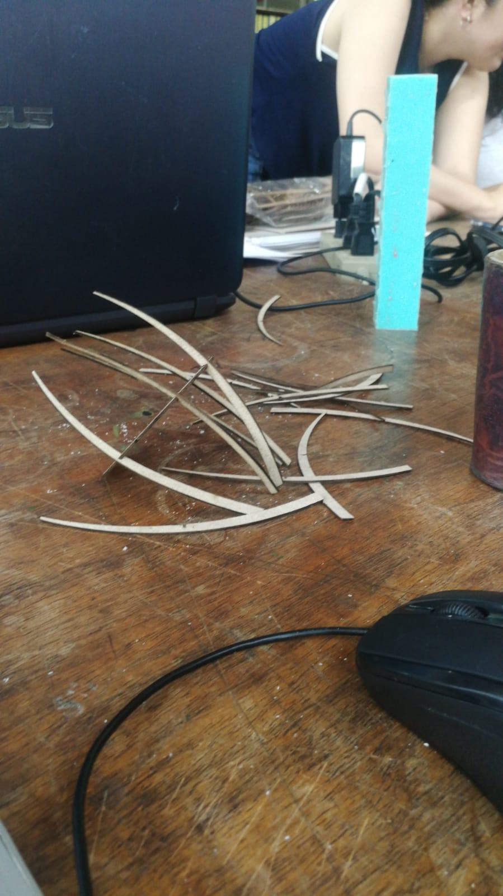<figcaption>
Resultado del mal diseño
</figcaption></figure>

Para mejorar el diseño de la lámpara, amplié las piezas para soportar su propio peso y alargué el espacio para encastrarlas. Aunque el grosor para encastrar es adecuado, la distancia de profundidad no resultó ideal.


**Nuevo descuido**

Me olvidé de duplicar las piezas.


<figure>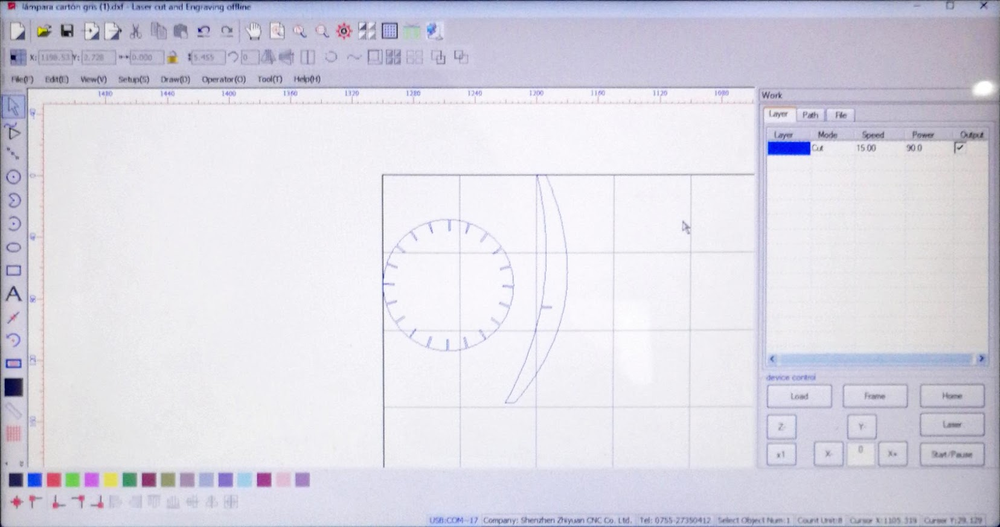<figcaption></figcaption></figure>

Como corté las primeras dos piezas, y recién ahí me di cuenta lo que faltaba, se ve otro nuevo archivo de las piezas que restaba cortar.

<figure>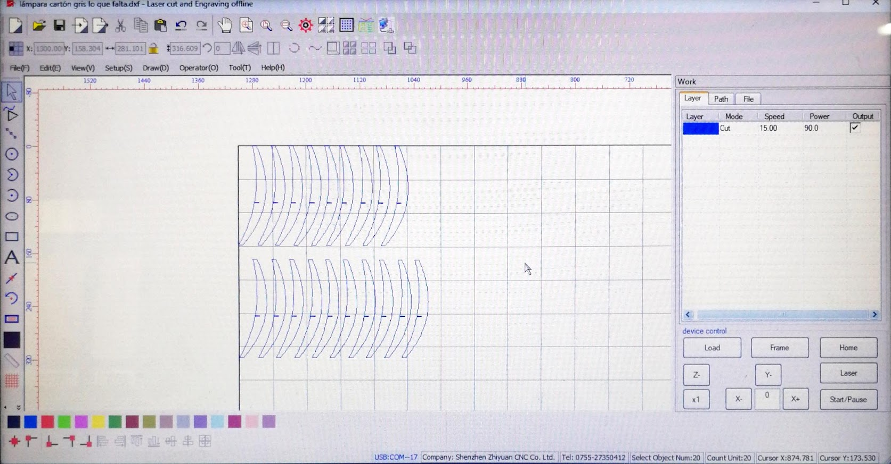<figcaption></figcaption></figure>

Una vez terminado el proceso de corte procedemos a ensamblar las piezas

<figure>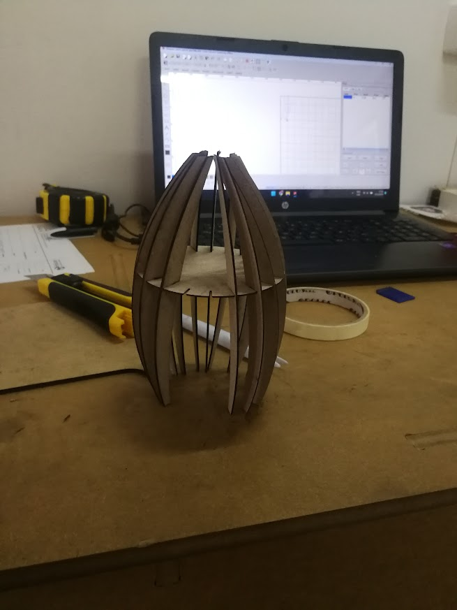<figcaption></figcaption></figure>

Diversos factores influyen en el corte correcto de nuestro material, tanto como las propias mañas de nuestra máquina, la cuál funciona correctamente en la esquina superior izquierda, pero en el centro suele presentar problemas, en este caso vemos que una pieza alejada de la zona superior izquierda no se cortó correctamente, para obtener lo que nos falta, cambiamos de ubicación del eje a la zona lateral izquierda y procesamos los pasos que ya conocemos para obtener la pieza que nos falta.

<figure>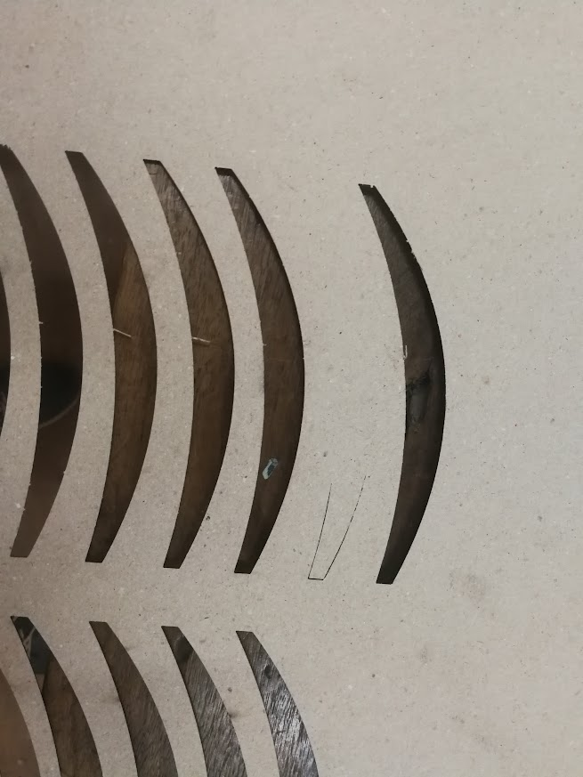<figcaption>
Pieza sin cortar.
</figcaption></figure>

 

<figure>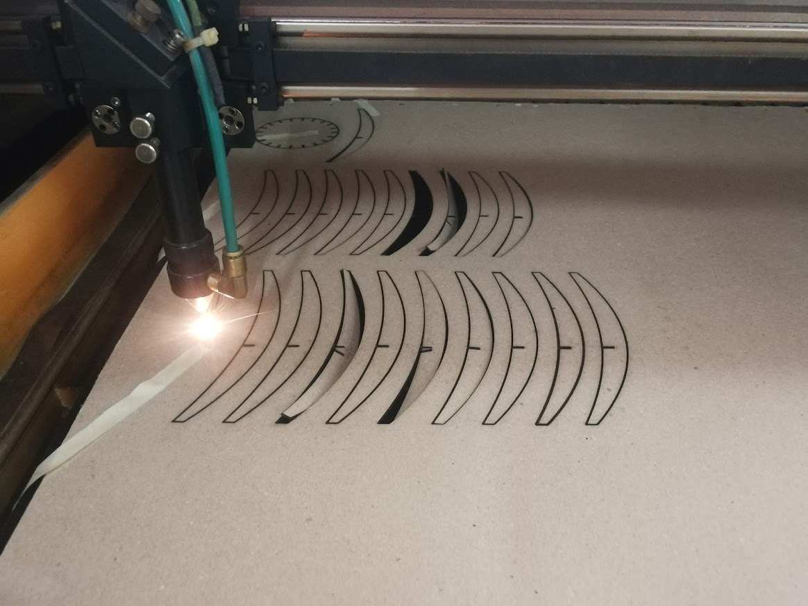<figcaption>
Ubicamos el eje en la zona lateral y cortamos esa pieza faltante.
</figcaption></figure>

Ahora que obtuvimos la pieza faltante, terminamos de ensamblar ¡y finalmente obtenemos nuestro proyecto completo!

## <mark style="color:purple;">Resultado Final</mark>

<figure><figcaption></figcaption></figure>

 

<figure>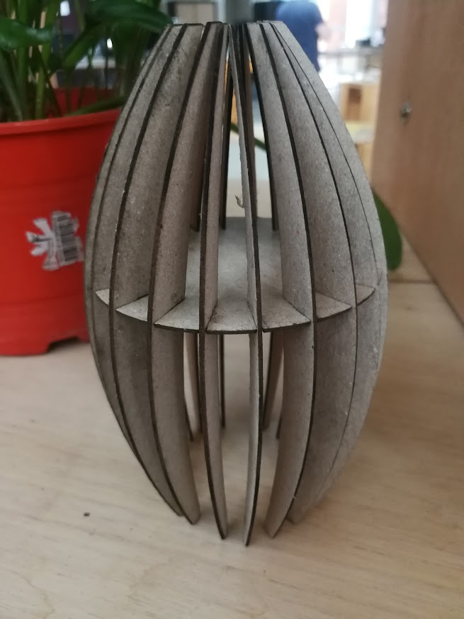<figcaption></figcaption></figure>

