# Test de encastre

<table><thead><tr><th>Parámetros </th><th width="103">Medida </th></tr></thead><tbody><tr><td>Grosor del material</td><td>1.3 mm</td></tr><tr><td>Parámetro del intérvalo (10%)</td><td>0.13 mm</td></tr></tbody></table>

Cálculos para diseñar la prueba del encastre

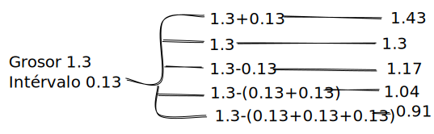

Para el diseño de nuestra pieza en Rhino, emplearé la herramienta de **Polyline** (polilínea) y **Join** (unir). Usar la barra de comandos agiliza este proceso para facilitar la selección de la herramienta.

<figure><figcaption></figcaption></figure>

Facilita el dibujo activar funciones como Osnap, End, Grid Snap, entre otros. En la imagen siguiente, se detallan los parámetros que estaban activos.

<figure><figcaption></figcaption></figure>

Una vez finalizado podemos exportar nuestros vectores al formato necesario para abrir en **PowerCut**, entonces seleccionamos **File**, luego **Exportar como**, y elegimos el formato .dxf

<figure><figcaption></figcaption></figure>

 

<figure>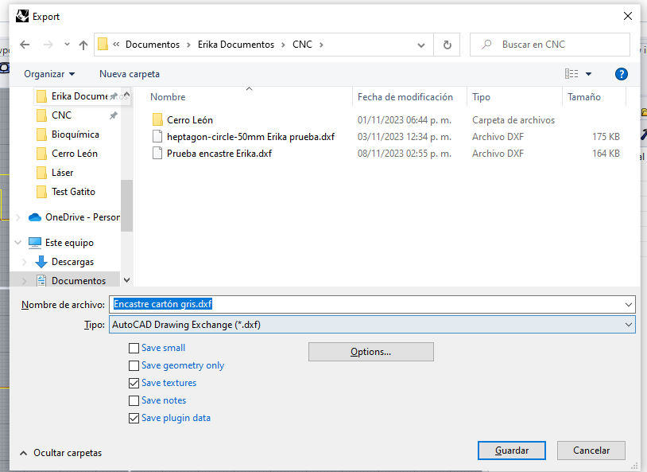<figcaption></figcaption></figure>

## <mark style="color:purple;">Proceso en la Cabina de Corte Láser</mark>

Ubicamos el cartón gris y lo fijamos, prendemos la máquina y calibramos la cabeza del láser de ser necesario.

<figure>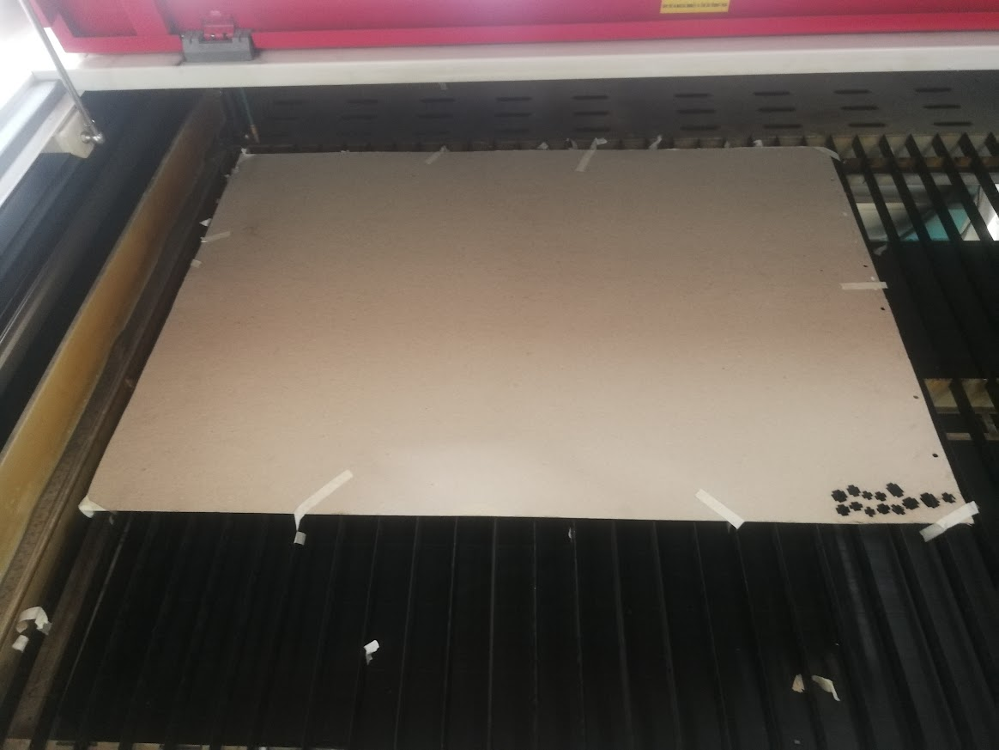<figcaption></figcaption></figure>

 

<figure>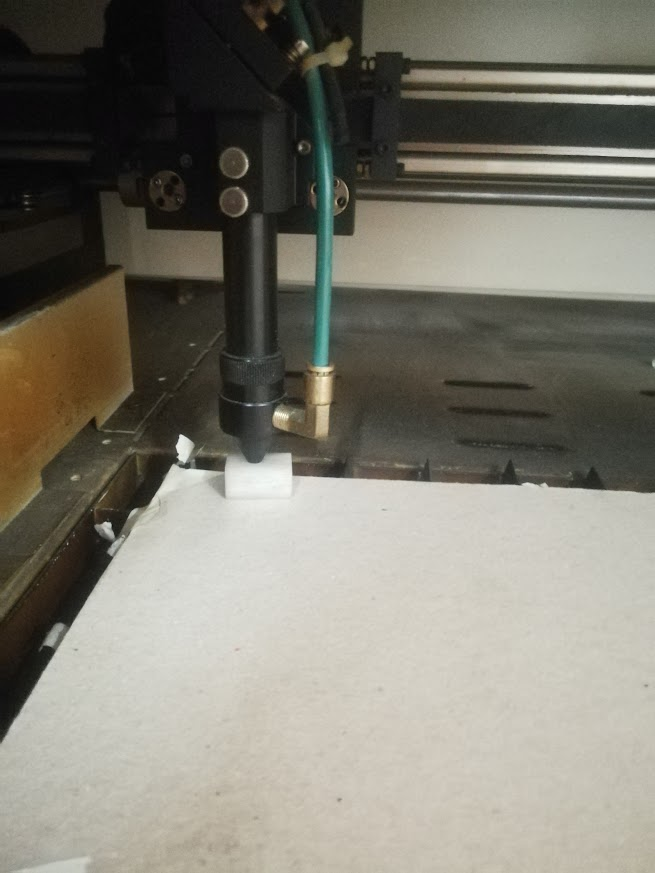<figcaption></figcaption></figure>

 

<figure>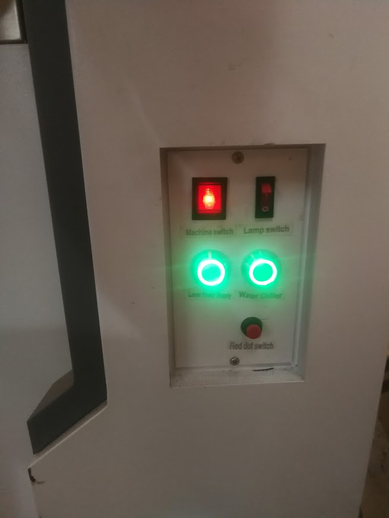<figcaption></figcaption></figure>

Abrimos el Software **PowerCut**, seleccionamos **Load** y elegimos el archivo a procesar.

<figure>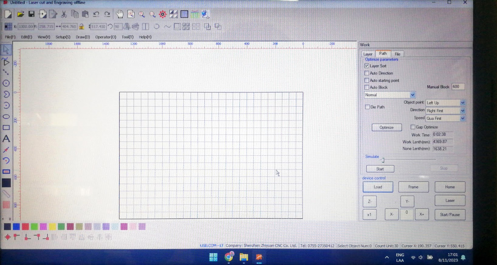<figcaption></figcaption></figure>

 

<figure>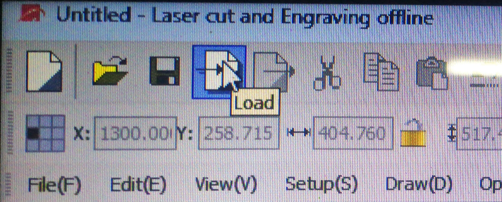<figcaption></figcaption></figure>

 

<figure>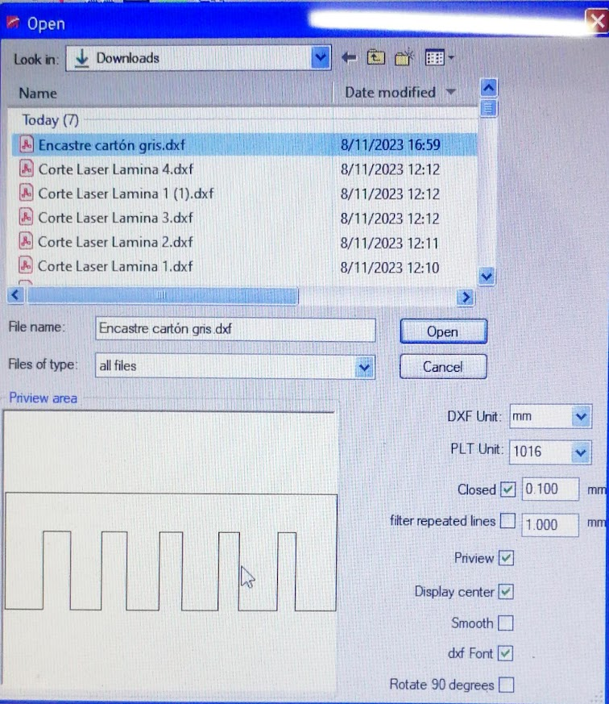<figcaption></figcaption></figure>

Una vez abierto seleccionamos el ícono para ubicar en la esquina superior izquierda.

<figure>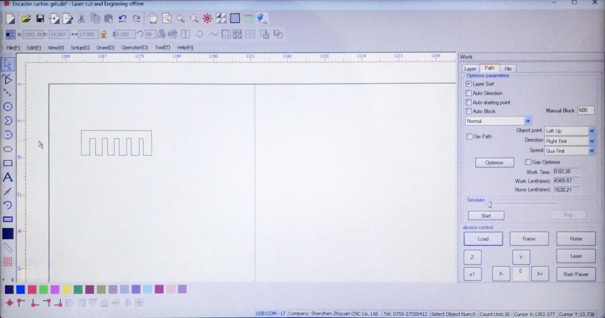<figcaption></figcaption></figure>

 

<figure>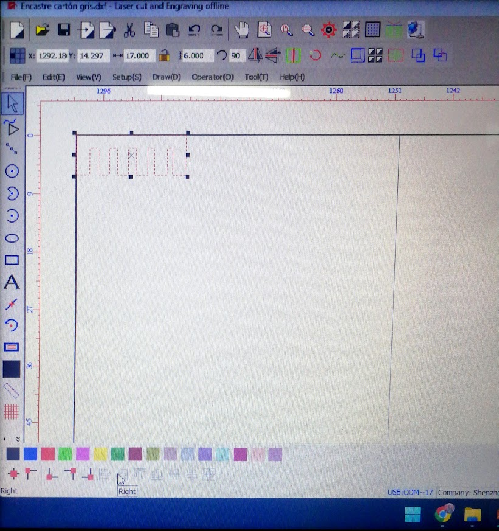<figcaption></figcaption></figure>

<figure>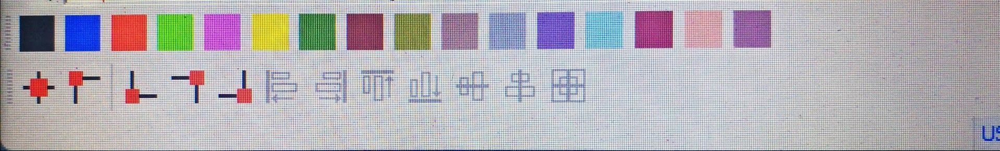<figcaption></figcaption></figure>

También seleccionamos un color de capa y establecemos los parámetros de Modo (Cut), Velocidad (Speed: 15) y Power (fuerza: 50). Luego seleccionamos **LOAD** para exportar el archivo a la cortadora láser.

<figure>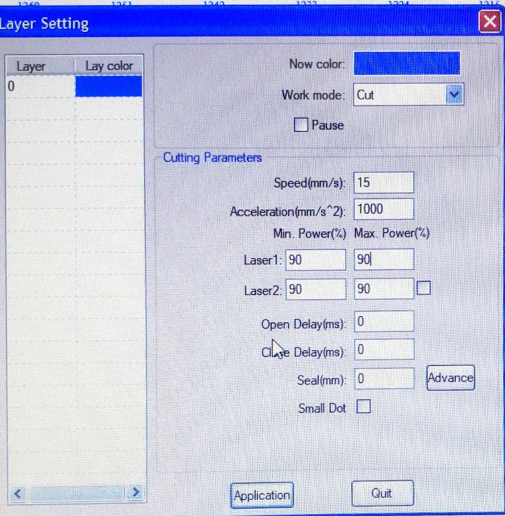<figcaption>
Ventana emergente de parámetros
</figcaption></figure>

 

<figure>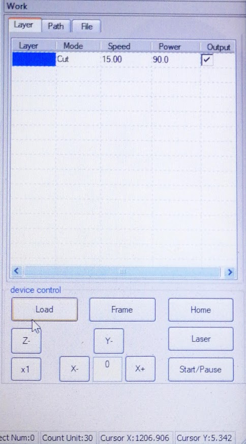<figcaption></figcaption></figure>

En la ventana emergente establecemos un nombre corto y seleccionamos **Down File**, ahora hemos exportado nuestro archivo a la máquina.

<figure><figcaption></figcaption></figure>

 

<figure>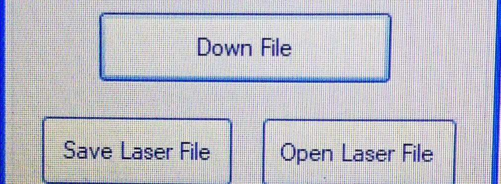<figcaption></figcaption></figure>

Una vez actualizado el archivo a cortar en la máquina, ubicamos la posición del eje con las flechas, seleccionamos **FIXED**, una vez confirmado podemos seleccionar el botón verde para comenzar la operación.

<figure>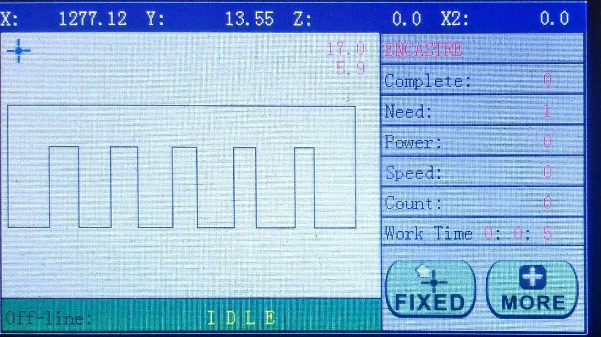<figcaption></figcaption></figure>

 

<figure>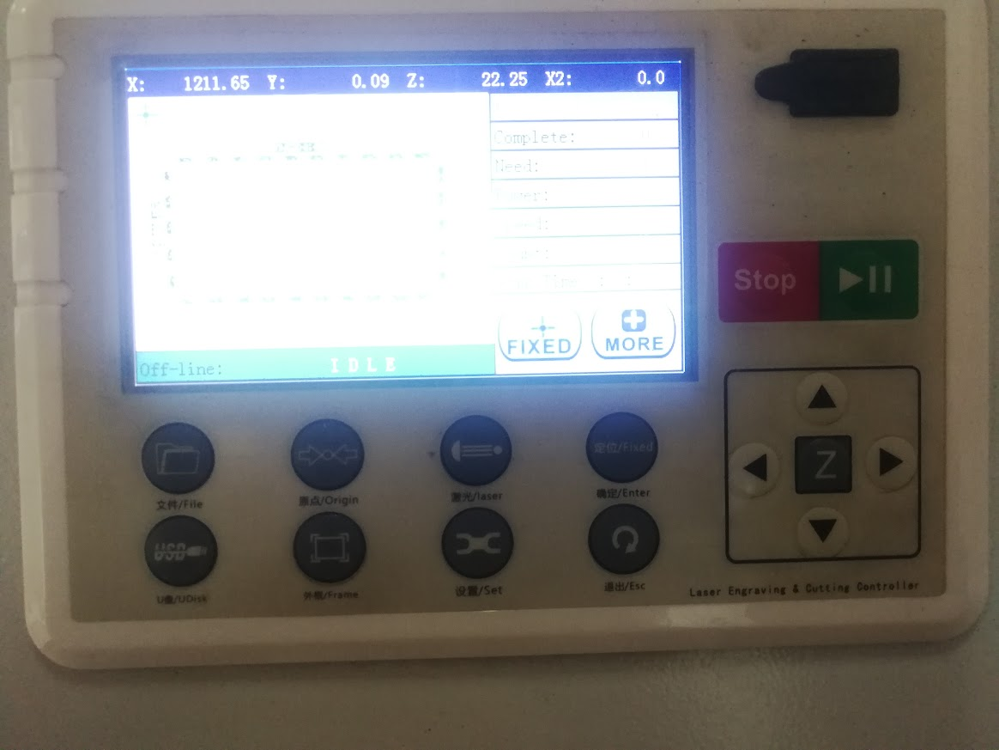<figcaption></figcaption></figure>

Una vez terminado el proceso probamos qué parámetros que calculamos es el correcto para encastrar nuestras piezas según el grosor del material que poseemos.

<figure>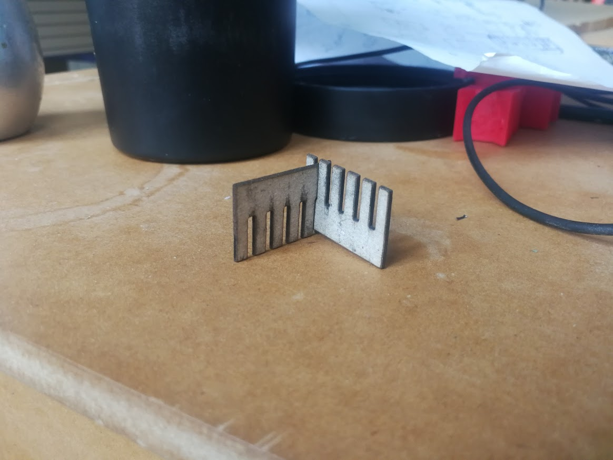<figcaption>
Prueba de encastre
</figcaption></figure>

<figure>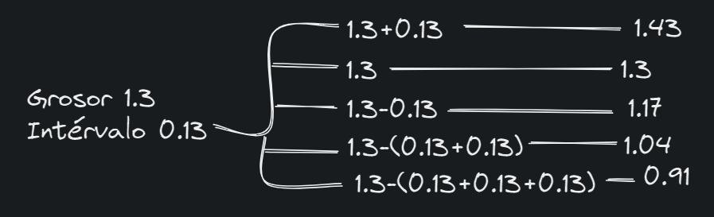<figcaption>
Nuestros cálculos iniciales
</figcaption></figure>

Concluyendo este proyecto, nuestro análisis práctico determinó que, para un material de 1.3 mm, el grosor de encastre necesario es de <mark style="color:purple;">**0.91 mm**</mark>. Esta información fundamental servirá de guía para establecer los parámetros de diseño.
