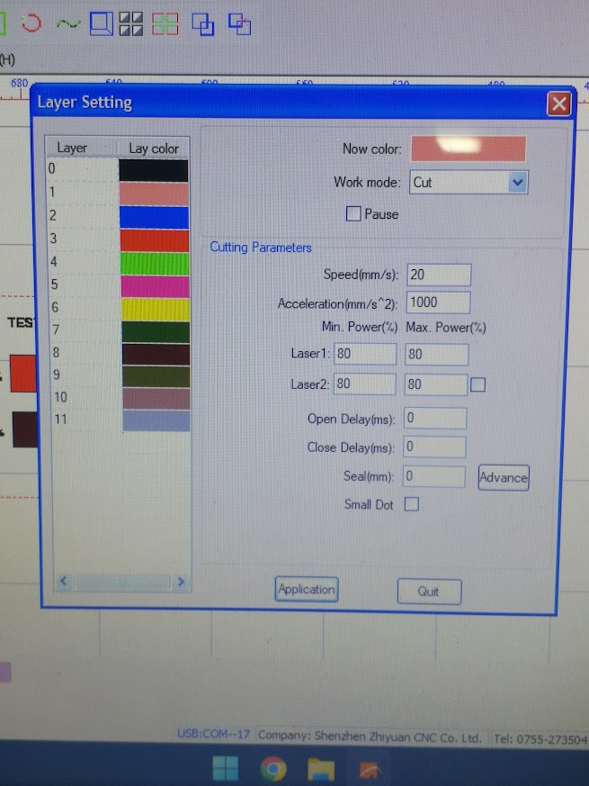
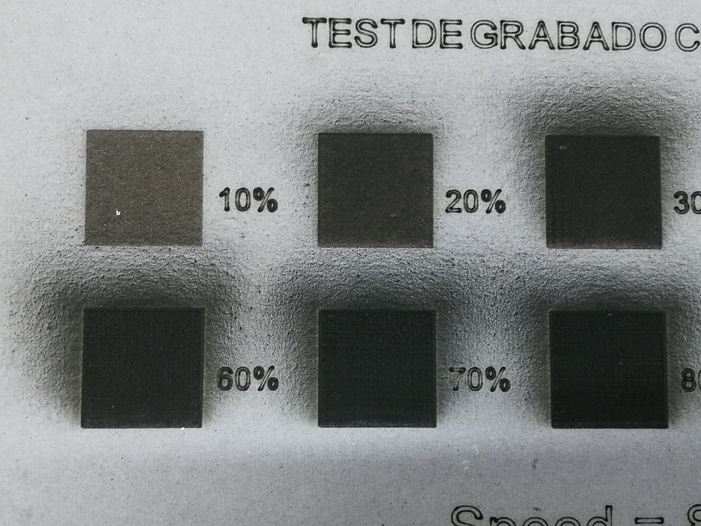

# Test de Grabado

## <mark style="color:purple;">Abrir PowerCut</mark>

<figure><figcaption></figcaption></figure>

 

<figure><figcaption></figcaption></figure>

## <mark style="color:purple;">Importar archivo</mark>

<figure><figcaption></figcaption></figure>

## <mark style="color:purple;">Establecer Capas</mark>



## <mark style="color:purple;">Parámetros del Grabado</mark>

El siguiente paso consiste en seleccionar los cuadros donde indicaremos diferentes parámetros de velocidad para cada uno.

<figure><figcaption></figcaption></figure>

 

<figure><figcaption></figcaption></figure>

 

<figure><figcaption></figcaption></figure>

 

<figure><figcaption></figcaption></figure>

<figure><figcaption></figcaption></figure>

 

<figure><figcaption></figcaption></figure>

 

<figure><figcaption></figcaption></figure>

 

<figure><figcaption></figcaption></figure>

<figure><figcaption></figcaption></figure>

 

<figure><figcaption></figcaption></figure>

 

<figure><figcaption></figcaption></figure>

 

<figure><figcaption></figcaption></figure>

## <mark style="color:purple;">Exportar a la máquina</mark>



## <mark style="color:purple;">Proceso de Grabado</mark>





## <mark style="color:purple;">Resultados</mark>

<figure><figcaption></figcaption></figure>

<figure><figcaption></figcaption></figure>

 

<figure><figcaption></figcaption></figure>

<figure><figcaption></figcaption></figure>

<figure><figcaption></figcaption></figure>

 

<figure><figcaption></figcaption></figure>

