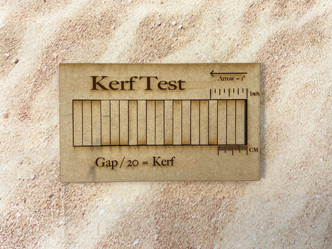
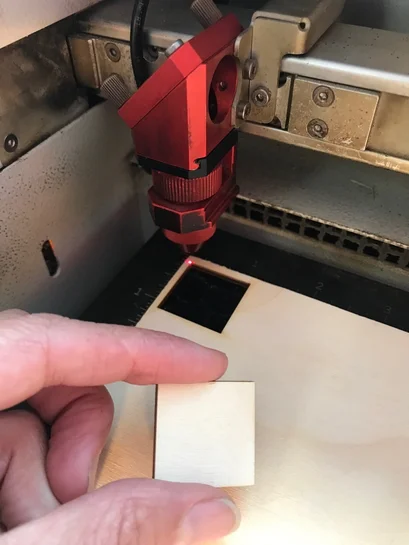
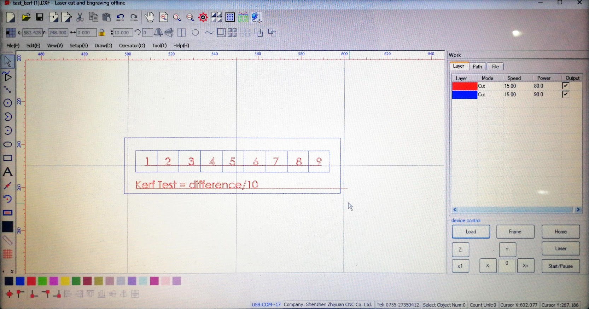
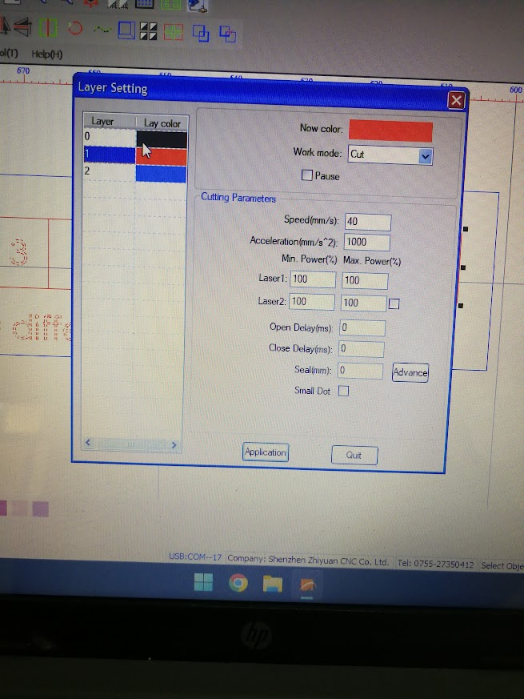
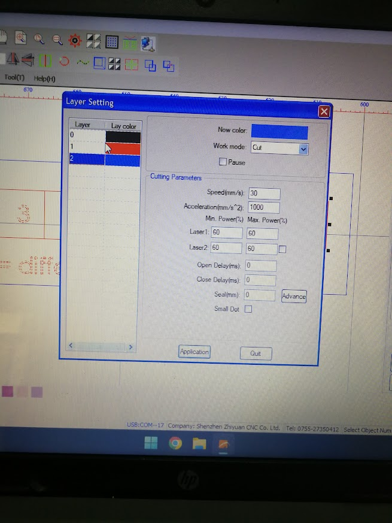
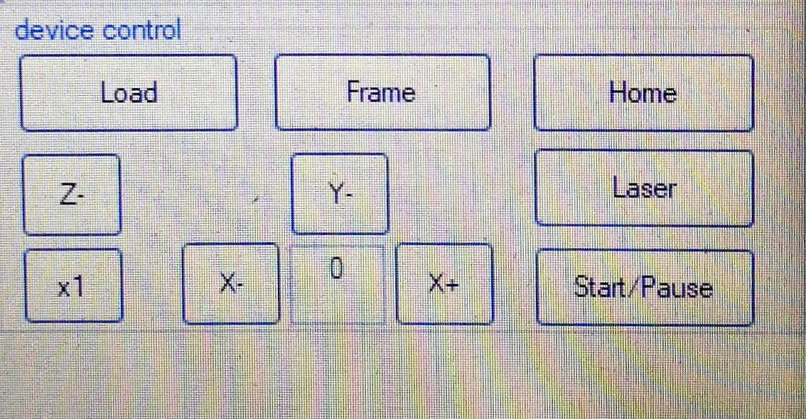
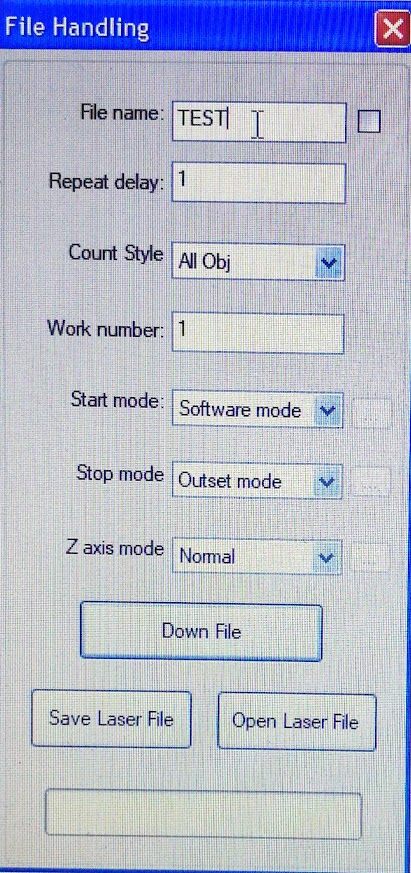
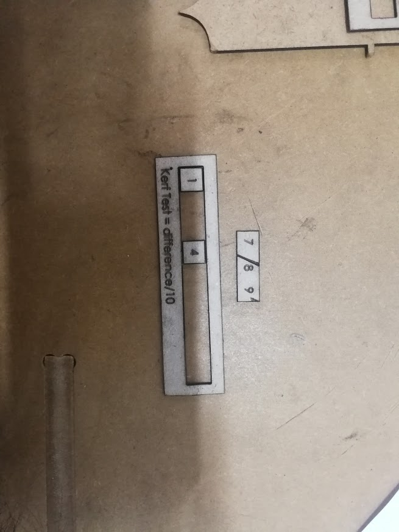
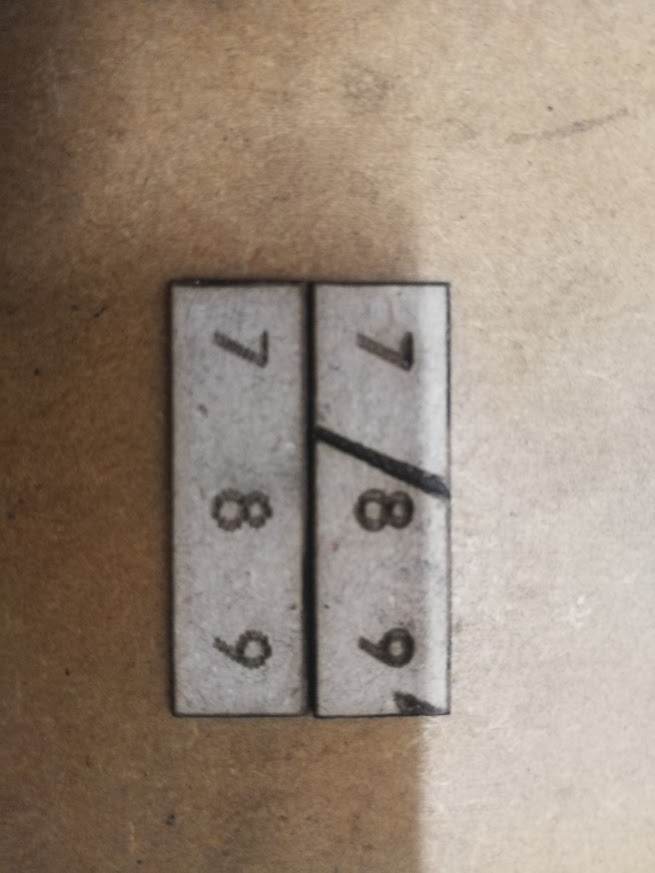
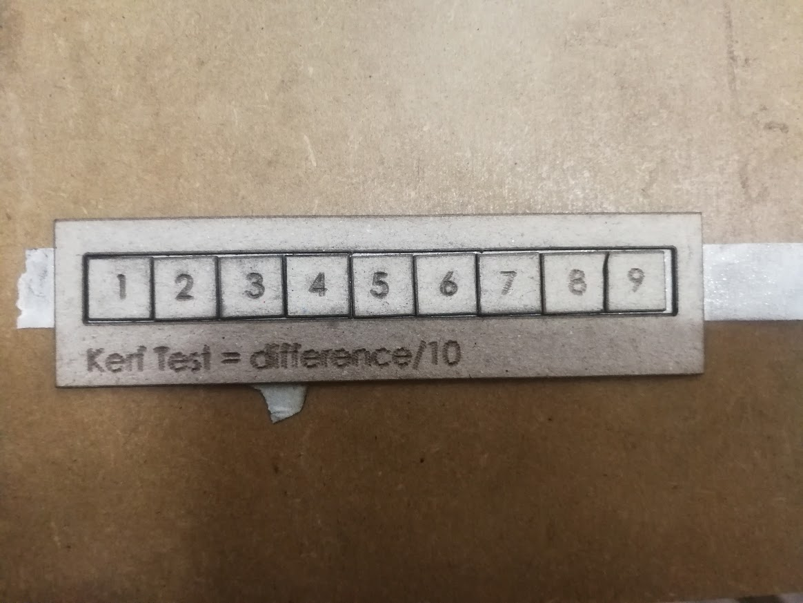

# Test de Kerf

¿Qué significa el término 'laser kerf'? El kerf es la porción de material que el láser quema al cortar.&#x20;

Es el ancho del haz del láser. Generalmente oscila entre 0.08mm y 1mm, dependiendo del tipo de material y otros factores condicionales. Algunos factores que pueden aumentar el kerf del láser son:

* Espejos o lentes sucios
* Superficie de corte irregular
* El láser no está configurado con el enfoque correcto.

También puedes hacer esto con cualquier número de rectángulos en lugar de 20, simplemente divide por la cantidad de rectángulos que uses.

¿Cómo podemos encontrar el kerf de nuestros láseres? Hay 2 formas diferentes que discutiremos aquí. El método del rectángulo y el método del cuadrado. Primero, el método del rectángulo. Para este método, comienzas cortando un rectángulo de material y luego cortas 20 rectángulos dentro de él para obtener 20 cortes. Ver imagen de ejemplo.

<figure><figcaption></figcaption></figure>

Cuando estos rectángulos se empujan juntos en un extremo del rectángulo grande, el espacio resultante en el otro extremo es la suma de los kerfs.&#x20;

Mide este espacio y luego divídelo por 20. Esto te da el kerf promedio para ese material y grosor del material. Ten en cuenta que este valor es igual al ancho completo del haz del láser, pero como el haz del láser corta desde el centro de la línea de corte, solo la mitad del haz del láser cae a cada lado del corte. Por lo tanto, deberás dividir este número por 2 para obtener el kerf que debes agregar a las líneas de corte de tu diseño.

***

### <mark style="color:purple;">Método del cuadrado</mark>

Primero, realiza un corte de prueba en tu material de proyecto. El kerf del cortador láser variará según el tipo de material, el grosor del material y la configuración del cortador láser, por lo que necesitarás hacer un corte de prueba para cada material que utilices. Si necesitas ajustar la configuración del láser para un nuevo material, hazlo primero antes de medir el kerf del cortador láser.

Para este ejemplo, nuestro corte de prueba es un cuadrado de una pulgada. Si cortas un rectángulo de tamaño diferente, asegúrate de registrar el ancho.&#x20;

<figure><figcaption></figcaption></figure>

 

<figure><figcaption></figcaption></figure>

Calcula el kerf utilizando la fórmula a continuación.

El kerf del cortador láser será la diferencia entre el tamaño conocido y el tamaño real del cuadrado de una pulgada.

kerf = ancho del cuadrado - ancho del cuadrado medido con el calibrador

kerf = 1 pulgada - 0.995 pulgadas = 0.005 pulgadas

0.005 pulgadas es el kerf del cortador láser al cortar este material.

<figure><figcaption></figcaption></figure>

Si las uniones quedan demasiado sueltas o demasiado ajustadas, ajusta el kerf y vuelve a cortar.

Demasiado ajustado --> Disminuir el kerf

Demasiado suelto --> Aumentar el kerf

***

## <mark style="color:purple;">Corte de un Test de Kerf</mark>&#x20;

Abrir el programa **PowerCut**, e importar el archivo de **Test de Kerf**

<figure><figcaption></figcaption></figure>

<figure><figcaption></figcaption></figure>

 

<figure><figcaption></figcaption></figure>

<figure><figcaption></figcaption></figure>

<figure><figcaption></figcaption></figure>



<figure><figcaption></figcaption></figure>

<figure><figcaption></figcaption></figure>

 

<figure><figcaption></figcaption></figure>

 

<figure><figcaption></figcaption></figure>

<figure><figcaption></figcaption></figure>
