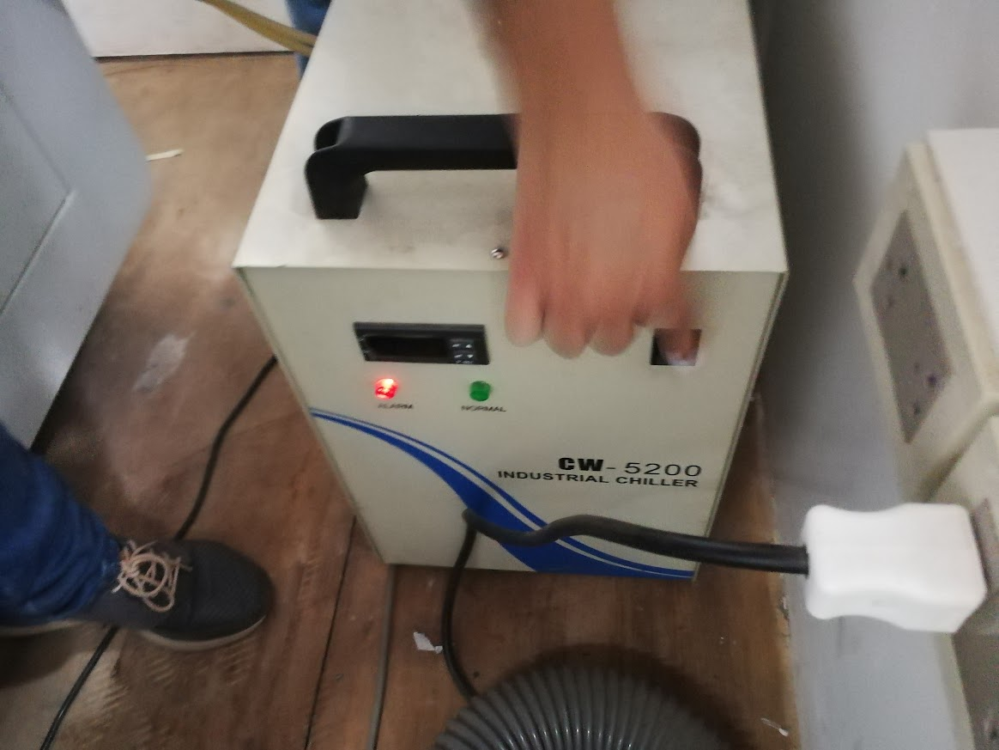
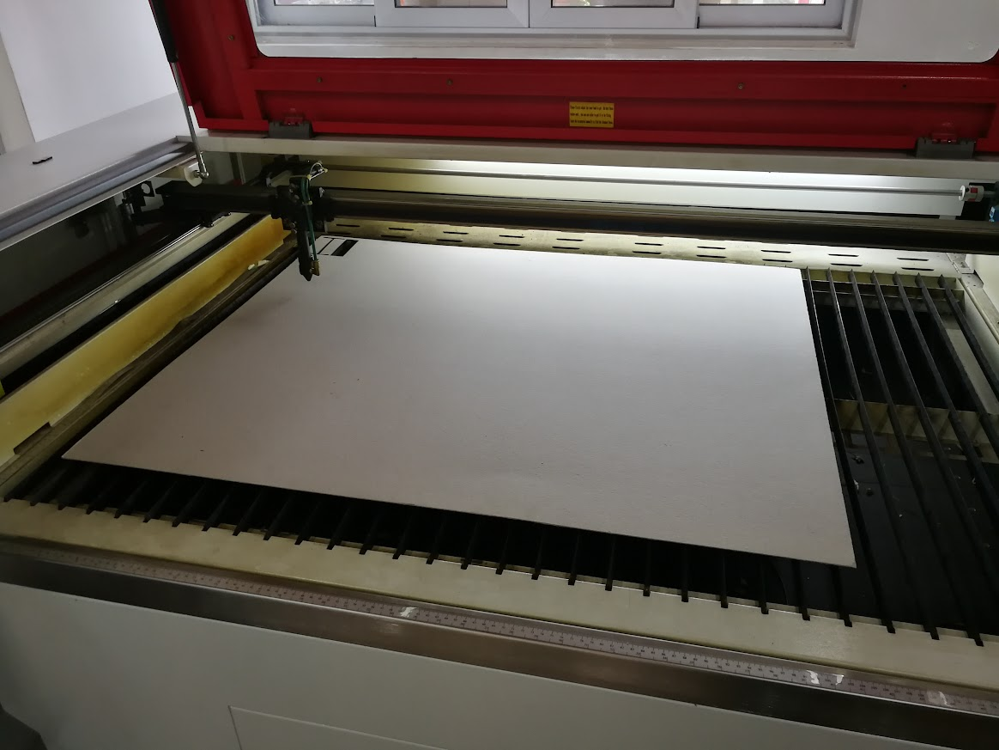
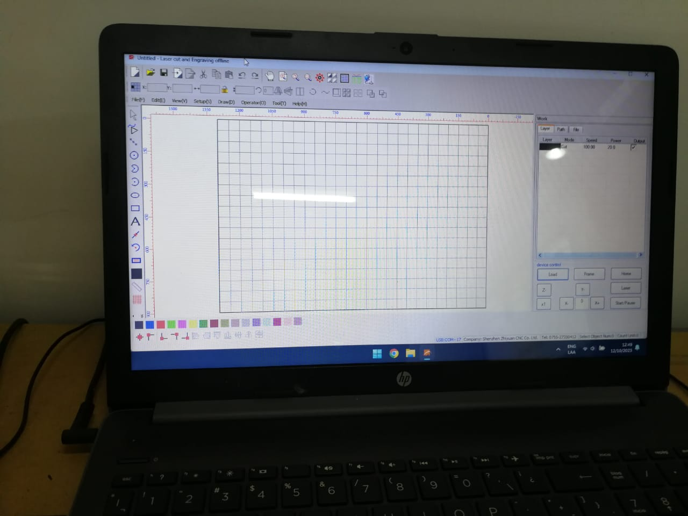
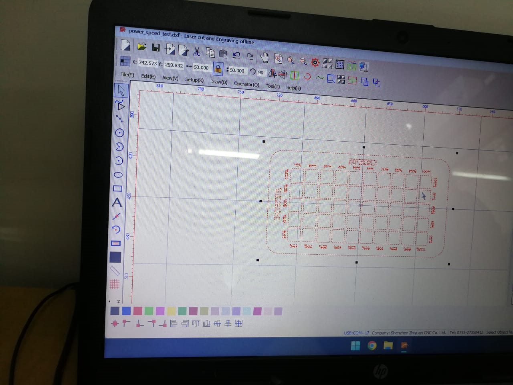
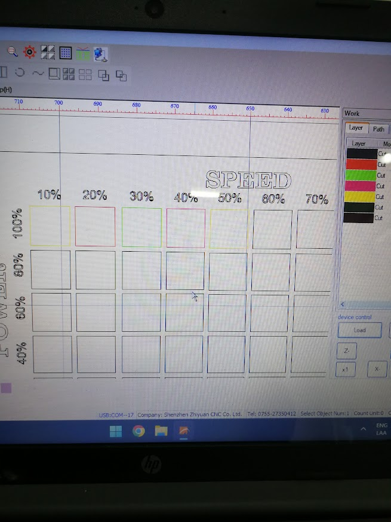
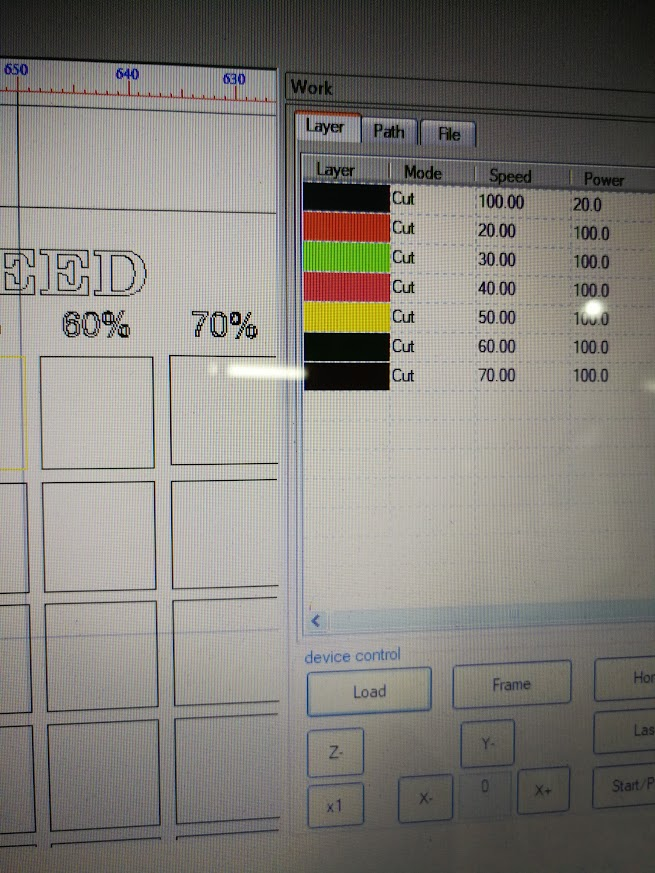
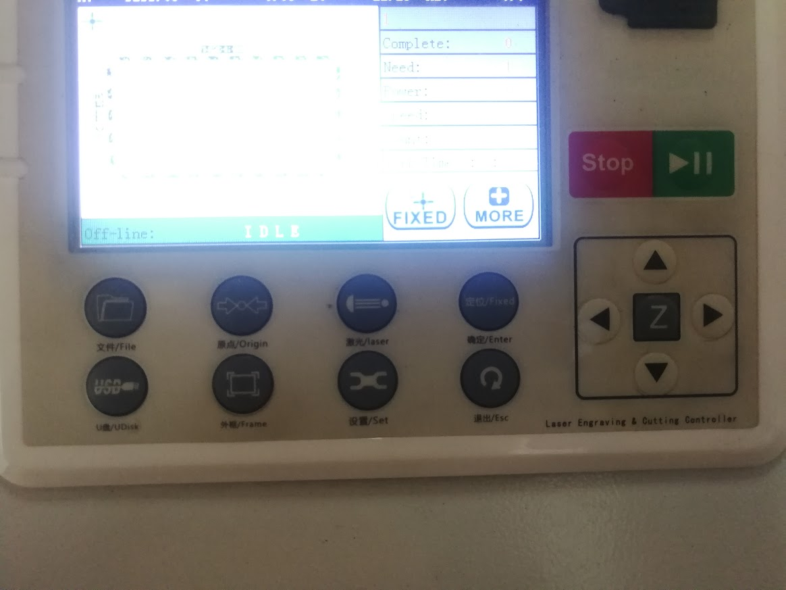
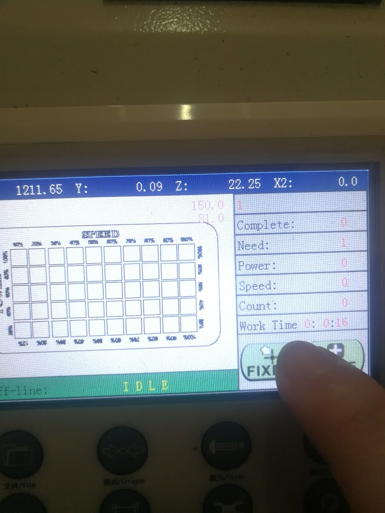
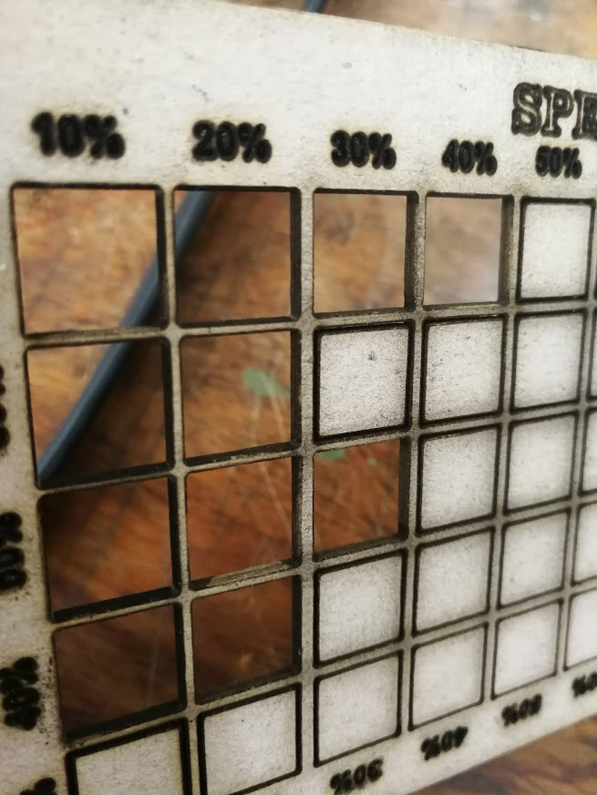

# Test de velocidad y fuerza

El primer corte a realizar será un test de velocidad y potencia para ver los resultados de cada parámetro en nuestro material seleccionado, el cartón gris, y la máquina de corte láser con la que contamos, ya que cada cortadora láser puede obtener diferentes resultados.&#x20;

Finalmente tenemos abierto el documento a cortar en la interface. Procedemos a eliminar las líneas superpuestas y a cortar o grabar por orden.

## <mark style="color:purple;">Pasos iniciales generales</mark>

Empezamos por prender la máquina, el extractor, seleccionar el material a cortar, ubicarlo en la parrilla y calibrar la cabeza del láser.

<figure><figcaption>
Enchufar el extractor
</figcaption></figure>

 

<figure><figcaption>
Prender la CPU cortadora láser
</figcaption></figure>

 

<figure><figcaption>
Encender la cortadora láser
</figcaption></figure>

<figure><figcaption>
Ubicar el material
</figcaption></figure>

 

<figure><figcaption>
Calibrar
</figcaption></figure>

## <mark style="color:purple;">**Abrir el programa de la Cortadora Láser e Importar el archivo**</mark>

Seguimos abriendo el software PowerCut e importar el archivo .dxf

<figure><figcaption></figcaption></figure>

 

<figure><figcaption></figcaption></figure>

### <mark style="color:purple;">Importar el archivo</mark>&#x20;

<figure><figcaption></figcaption></figure>

<figure><figcaption>
Debemos asegurarnos de que la unidad de medida sea en mm.
</figcaption></figure>

 

<figure><figcaption>
Archivo ya importado.
</figcaption></figure>

## <mark style="color:purple;">Proceso de edición en PowerCut</mark>

### <mark style="color:purple;">Eliminar líneas superpuestas</mark>

<figure><figcaption></figcaption></figure>

### <mark style="color:purple;">Establecer capas para cada vector según su fin</mark>

<figure><figcaption></figcaption></figure>

### <mark style="color:purple;">Establecer parámetros de fuerza y velocidad</mark>

Ya que en nuestro test nuestra hilera horizontal indica que todos los cuadros  tendrán la misma potencia, y en cada hilera vertical una velocidad. Para establecer nuestros parámetros para encajar con la grilla dibujada, seleccionamos cada capa y cambiamos de la siguiente manera.

<figure><figcaption></figcaption></figure>

 

<figure><figcaption></figcaption></figure>

### <mark style="color:purple;">Establecer jerarquía de las capas</mark>

### <mark style="color:purple;">Exportar archivo a la máquina de corte láser</mark>

<figure><figcaption></figcaption></figure>

 

<figure><figcaption></figcaption></figure>

 

<figure><figcaption></figcaption></figure>

### <mark style="color:purple;">Observar el proceso para ver si algo no esta saliendo como se espera y determinar rápidamente qué cambiar</mark>



### <mark style="color:purple;">**Resultado Final**</mark>

<figure><figcaption></figcaption></figure>

<figure><figcaption></figcaption></figure>
