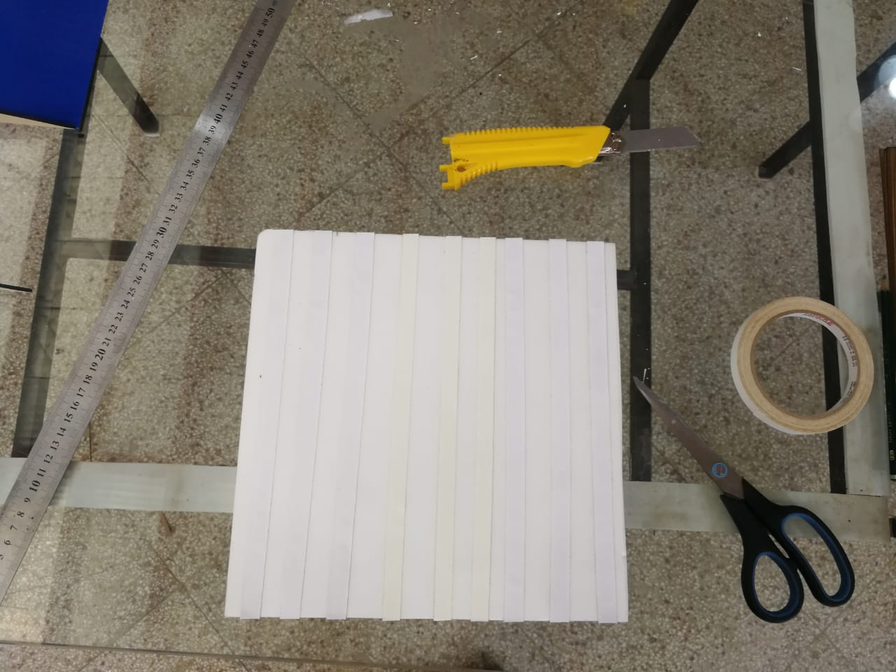

# Impresión 3D

La impresión 3D ha revolucionado la forma en que diseñamos y fabricamos objetos en la actualidad. Esta tecnología ofrece la posibilidad de dar vida a conceptos y prototipos de una manera más accesible y versátil que nunca. En esta documentación, te sumergirás en el emocionante mundo de la impresión 3D, donde exploraremos sus fundamentos, técnicas avanzadas y las mejores prácticas para sacar el máximo provecho de esta innovadora tecnología.

Ya seas un principiante curioso o un experimentado profesional en impresión 3D, esta guía te proporcionará información valiosa para que puedas realizar impresiones 3D de alta calidad, solucionar problemas comunes y, en última instancia, desatar tu creatividad.

&#x20;Desde los conceptos básicos de diseño y modelado en 3D hasta la optimización de la configuración de la impresora y la selección de materiales, esta documentación está diseñada para ser tu recurso de referencia confiable a lo largo de tu viaje en el mundo de la impresión 3D. ¡Comencemos a explorar esta emocionante tecnología juntos!

## <mark style="color:purple;">**Guía de Filamentos**</mark>

## &#x20;

<table data-view="cards"><thead><tr><th>Material de filamento</th><th>Aplicaciones</th><th>Más adecuado</th><th>Temperatura de Impresión</th><th>Temperatura Plataforma</th><th>Temperatura de distorsión por calor</th></tr></thead><tbody><tr><td><mark style="color:purple;"><strong>PLA</strong></mark></td><td>Biodegradable</td><td>Prototipos y productos</td><td>180-210 °C</td><td>20-45 °C</td><td>50-60 °C</td></tr><tr><td><mark style="color:purple;"><strong>ABS</strong></mark></td><td>Fuerte y durable</td><td>Piezas de uso final</td><td>230-250 °C</td><td>90-95 °C</td><td>90-110 °C</td></tr><tr><td><mark style="color:purple;"><strong>PETG</strong></mark></td><td>Muy duradero y flexible</td><td>piezas de alto impacto" o "piezas de alto estrés".</td><td>220-245 °C</td><td>70-80 °C</td><td>70-80 °C</td></tr></tbody></table>
