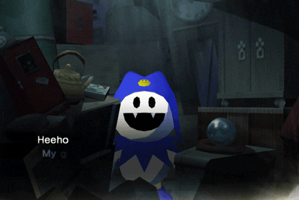
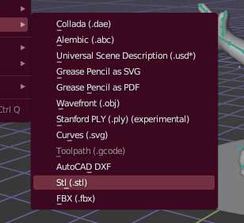

# Black Frost

<figure><figcaption>
"I've become hee ho evil! I'm Black Frost, heeeeee hoooooo!"—Black Frost, <em>Shin Megami Tensei III: Nocturne</em>
</figcaption></figure>

Black Frost es la versión malévola de Atlus del demonio Jack Frost, que es de naturaleza más amigable. La palabra "ja'aku" en su nombre japonés, cuando se escribe en kanji (邪悪), significa "malvado" o "maligno", de ahí sus características oscuras.

Historia de Black Frost

Los Black Frosts son Jack Frosts que se volvieron poderosos y malévolos debido a su anhelo de poderes oscuros y al recordar su naturaleza demoníaca. Son una variante evolucionada del hada invernal amante de la paz. Junto con un aumento en su tamaño, su piel se oscurece y su atuendo pasa de ser azul a morado.

En otra historia, originalmente fue la única criatura en su mundo y oró a su dios por un compañero, pero solo se le concedió por un día. Después de que su amigo se fue, sintió tal tristeza y enojo que se dio cuenta de que nunca debería haber pedido un amigo.

Además de conservar una alta resistencia/inmunidad a los ataques de hielo como sus congéneres de hielo, también comparten una alta resistencia/inmunidad como sus congéneres de fuego. Sin embargo, su naturaleza malévola significa que no pueden resistir ataques basados en la luz en los juegos en los que están presentes.


Una muy buena animación de Joclpacheb en ArtStation.


Contexto: ¿Quién es Jack Frost?

Jack Frost es un espíritu de origen inglés. Es un elfo de la nieve que trae el clima frío durante el invierno y se cree que es responsable de la escarcha que se forma en las ventanas de hogares y edificios.

Jack Frost aparece en muchos juegos de la franquicia Megami Tensei, comenzando con Megami Tensei II, y es uno de los demonios con más apariciones en la franquicia. Se le considera la mascota de Atlus y de la franquicia Megami Tensei en su conjunto, lo que ha dado lugar a numerosos cameos. Jack Frost también tiene una "familia" que incluye a otros Frosts, como King Frost, Black Frost y Pyro Jack. Jack Frost y su "familia" tienen la costumbre de añadir "hee," "ho" y "hee-ho" a su lenguaje.

.png>)

.png>)

.png>).png>)

Variedad de Jack Frost's

.png>).png>)



Esta figura de Black Frost lastimosamente no se encuentra disponible para descargar, pero esto no nos detendrá ya que estamos decididos a imprimirlo y obtener nuestra propia pieza en 3D.

<figure><figcaption></figcaption></figure>



## Modelo 3D disponible de Jack Frost

El único modelo aceptable gratis de Jack Frost fue este archivo, nos servirá para convertirlo en su versión marlvada.



El enlace del archivo es el siguiente:



<figure><figcaption></figcaption></figure>

<figure><figcaption></figcaption></figure>

<figure><figcaption></figcaption></figure>

<figure><figcaption></figcaption></figure>

<figure><figcaption></figcaption></figure>

 

<figure><figcaption></figcaption></figure>

<figure><figcaption></figcaption></figure>

 

<figure><figcaption></figcaption></figure>

<figure><figcaption></figcaption></figure>

<figure><figcaption></figcaption></figure>

 

<figure><figcaption></figcaption></figure>

<figure><figcaption></figcaption></figure>

El siguiente archivo .stl se trata del Jack Frost hasta los cambios actuales.


Archivo con los cambios en formato .stl


Archivo .stl del Black Frost falso

Debido a que ya me ilusioné con Black Frost, transformaré el modelo del Jack Frost modificado en un Black Frost.

<figure><figcaption></figcaption></figure>

 

<figure><figcaption></figcaption></figure>

 

<figure><figcaption></figcaption></figure>

 

<figure><figcaption></figcaption></figure>

 

<figure><figcaption></figcaption></figure>

 

<figure><figcaption></figcaption></figure>

 

<figure><figcaption></figcaption></figure>

 

<figure><figcaption></figcaption></figure>

 

<figure><figcaption></figcaption></figure>

 

<figure><figcaption></figcaption></figure>

 

<figure><figcaption></figcaption></figure>

 

<figure><figcaption></figcaption></figure>

 

<figure><figcaption></figcaption></figure>

 

<figure><figcaption></figcaption></figure>

 

<figure><figcaption></figcaption></figure>

 

<figure><figcaption></figcaption></figure>

 

<figure><figcaption></figcaption></figure>

 

<figure><figcaption></figcaption></figure>

 

<figure><figcaption></figcaption></figure>

 

<figure><figcaption></figcaption></figure>

 

<figure><figcaption></figcaption></figure>

 

<figure><figcaption></figcaption></figure>

 

<figure><figcaption></figcaption></figure>

 

<figure><figcaption></figcaption></figure>

 

<figure><figcaption></figcaption></figure>

<figure><figcaption></figcaption></figure>



### Landscape

Realistic Weathered Japan Torii Gate de [\
](https://sketchfab.com/tiborjanas.art)[tiborjanas.art](https://sketchfab.com/tiborjanas.art) en Sketchfab.



<figure><figcaption></figcaption></figure>

Una vez que el archivo es descargado podemos mezclar nuestros objetos en un solo archivo

<figure><figcaption></figcaption></figure>

