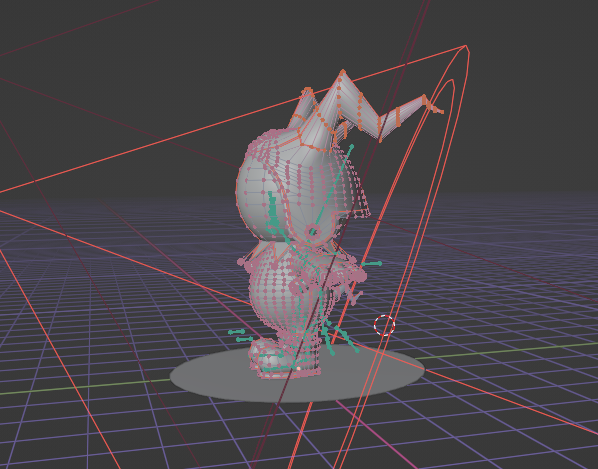
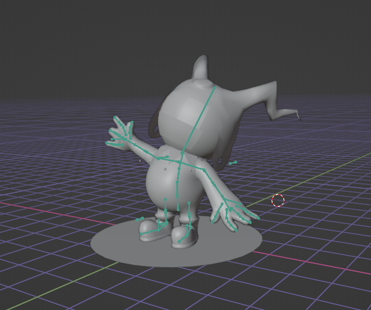
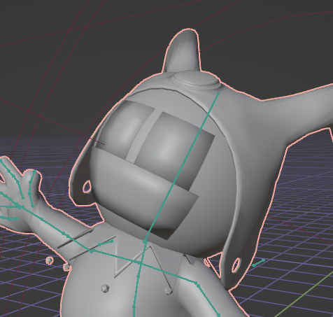
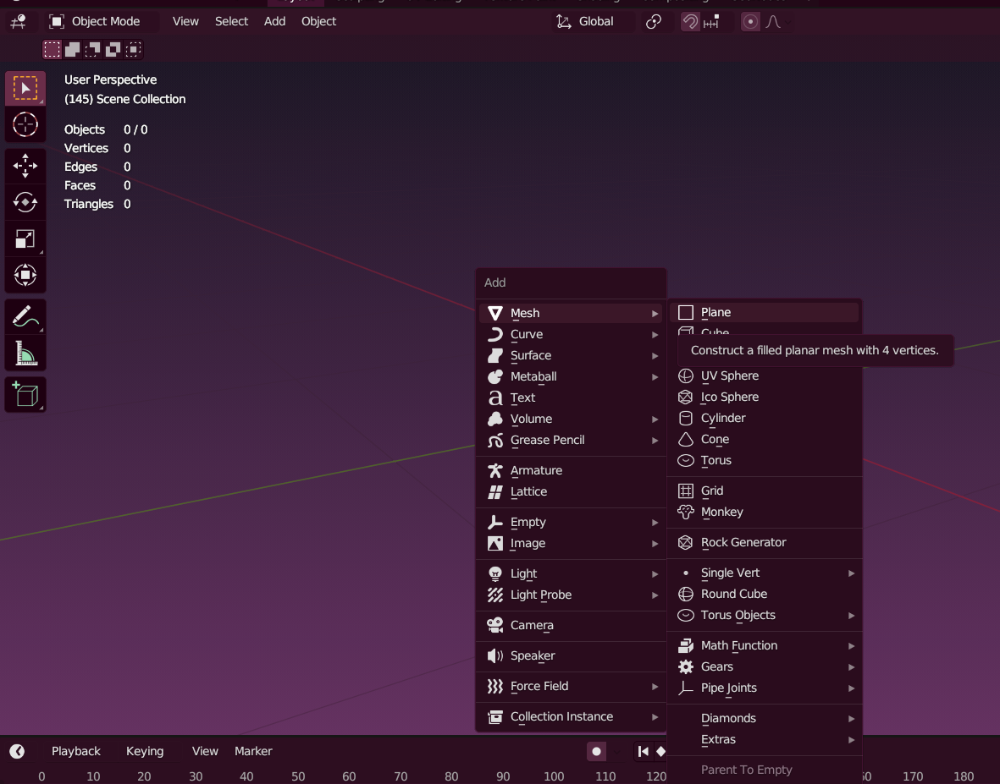
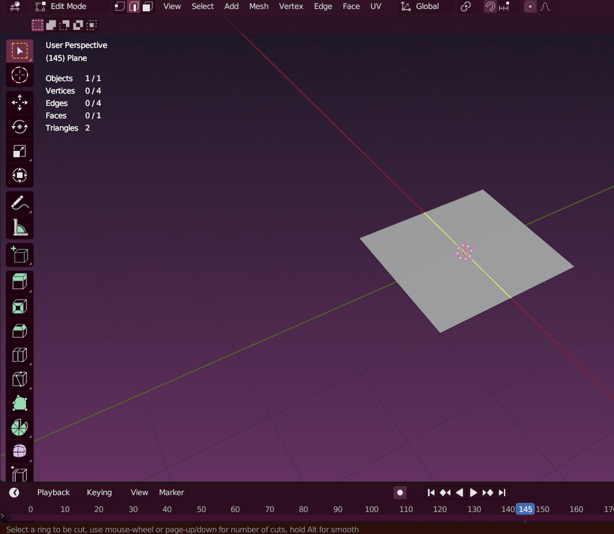
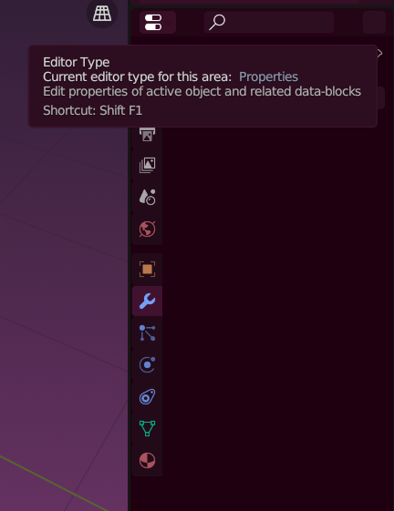
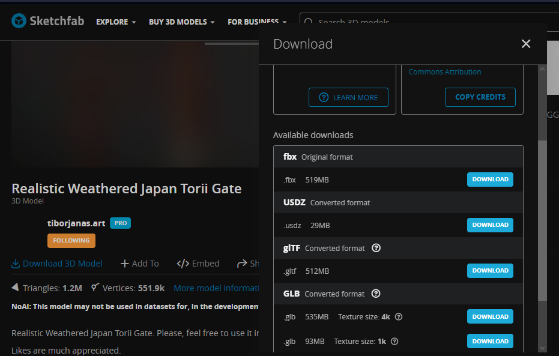

# Black Frost

<figure><figcaption>
"I've become hee ho evil! I'm Black Frost, heeeeee hoooooo!"—Black Frost, <em>Shin Megami Tensei III: Nocturne</em>
</figcaption></figure>

Black Frost es la versión malévola de Atlus del demonio Jack Frost, que es de naturaleza más amigable. La palabra "ja'aku" en su nombre japonés, cuando se escribe en kanji (邪悪), significa "malvado" o "maligno", de ahí sus características oscuras.

Historia de Black Frost

Los Black Frosts son Jack Frosts que se volvieron poderosos y malévolos debido a su anhelo de poderes oscuros y al recordar su naturaleza demoníaca. Son una variante evolucionada del hada invernal amante de la paz. Junto con un aumento en su tamaño, su piel se oscurece y su atuendo pasa de ser azul a morado.

En otra historia, originalmente fue la única criatura en su mundo y oró a su dios por un compañero, pero solo se le concedió por un día. Después de que su amigo se fue, sintió tal tristeza y enojo que se dio cuenta de que nunca debería haber pedido un amigo.

Además de conservar una alta resistencia/inmunidad a los ataques de hielo como sus congéneres de hielo, también comparten una alta resistencia/inmunidad como sus congéneres de fuego. Sin embargo, su naturaleza malévola significa que no pueden resistir ataques basados en la luz en los juegos en los que están presentes.


Una muy buena animación de Joclpacheb en ArtStation.


Contexto: ¿Quién es Jack Frost?

Jack Frost es un espíritu de origen inglés. Es un elfo de la nieve que trae el clima frío durante el invierno y se cree que es responsable de la escarcha que se forma en las ventanas de hogares y edificios.

Jack Frost aparece en muchos juegos de la franquicia Megami Tensei, comenzando con Megami Tensei II, y es uno de los demonios con más apariciones en la franquicia. Se le considera la mascota de Atlus y de la franquicia Megami Tensei en su conjunto, lo que ha dado lugar a numerosos cameos. Jack Frost también tiene una "familia" que incluye a otros Frosts, como King Frost, Black Frost y Pyro Jack. Jack Frost y su "familia" tienen la costumbre de añadir "hee," "ho" y "hee-ho" a su lenguaje.

.png>)

.png>)

.png>).png>)

Variedad de Jack Frost's

.png>).png>)



Esta figura de Black Frost lastimosamente no se encuentra disponible para descargar, pero esto no nos detendrá ya que estamos decididos a imprimirlo y obtener nuestra propia pieza en 3D.

<figure><figcaption></figcaption></figure>



## Modelo 3D disponible de Jack Frost

El único modelo **aceptable** **gratis** de Jack Frost fue este archivo, nos servirá para convertirlo en su versión malvada.



El enlace del archivo es el siguiente:


Enlace descargado de Sketchfab del enlace superior.


### Editar el archivo disponible

Al descargar el archivo lo primero que podemos observar es que el modelado es bastante parecido al original a pesar de verse muy diferente con los shaders, lo segundo sería que los cuernos del gorro son muy grandes a comparación de lo que estamos acostumbrados.


En un principio abrí Blender con el único objetivo de convertir el formato del archivo original en .stl pero terminé editando muchas cosas en este programa.


**El primer paso sería escalar la zona del cuerno**

* Nos vamos a Edit Mode para poder editar nuestro objeto.


Podemos editar los vértices, borde y caras de nuestros modelos 3D al pasar a Edit Mode, en la vista de Object Mode podemos escalar, rotar, etc **sin** cambiar los vértices, borde y caras.


* Seleccionamos los vértices, podemos seleccionar vértices, borde o cara en un menú o cambiarlo con "Tab".

<figure><figcaption>
Menú de selección de vértices, edge o face en Edit Mode
</figcaption></figure>

* seleccionamos "+" en el numpad para seleccionar por steps/pasos de manera más simple hasta dónde necesitamos.

<figure><figcaption>
Seleccionar "+"
</figcaption></figure>

 

<figure><figcaption>
Podemos ver los vértices seleccionados en naranja, y los no seleccionados en rosa.
</figcaption></figure>

* finalmente escalar, para ello podemos seleccionar desde la barra lateral o con el comando "S".

<figure><figcaption>
Scale en la barra lateral de Edit Mode.
</figcaption></figure>

<figure><figcaption>
Tamaño de los cuernos original, vista en Object Mode.
</figcaption></figure>

<figure><figcaption>
Tamaño de los cuernos reducidos, con los vértices seleccionados en Edit Mode.
</figcaption></figure>

El objeto se encuentra en una pose en Object Mode debido a que tiene un modificador de armadura, ya que Edit Mode se trata de modificar los vértices, bordes y caras del objeto en este menú se observa en pose T.

Esta pose y la armadura ha sido realizado por el creador del archivo.

<figure><figcaption>
Modificador de armadura en el menú lateral.
</figcaption></figure>

 

<figure><figcaption>
Vista de la armadura para cambiar de pose en Object Mode.
</figcaption></figure>

Como este archivo estaba planteado para un estilo Cartoon, el creador optó por utilizar imágenes en los detalles de ojos y boca, y utilizar el modificador solidify para extruirlo, como no me sirve lo eliminaré seleccionando la "x" en el menú lateral de modificadores.

<figure><figcaption>
Vista del modificador solidify seleccionando la "x"
</figcaption></figure>

 

<figure><figcaption>
Vista de la imagen extruida con el modificador sin activar los shaders.
</figcaption></figure>

Una vez eliminado podemos ver una esfera completa en el rosto, también eliminaré la base seleccionando "x".

<figure><figcaption>
Seleccionar la base en Object Mode, apretar "x" en el teclado y luego confirmar.
</figcaption></figure>

Hasta este punto ya consideraba aceptable exportar en formato .stl para imprimirlo y tal vez dibujar el rosto a mano, así que procedí a exportar el objeto.&#x20;

Como no perduró esta idea simplemente voy a dejar el archivo disponible para que alguien más realice su versión del rostro de Jack Frost.

Para exportar el archivo debemos dirigirnos al menú superior y seleccionar File, luego Export, seleccionar el formato a exportar, ahí seleccionamos .stl.

<figure><figcaption>
Menú de File desplegado, dirigirse a Export.
</figcaption></figure>

 

<figure><figcaption>
Menú de Export para seleccionar diversos formatos a exportar.
</figcaption></figure>

<figure><figcaption>
Menú emergente para guardar en el equipo.
</figcaption></figure>

**El siguiente archivo .stl se trata del Jack Frost hasta los cambios actuales.**


Archivo con los cambios en formato .stl


### Realizar el rostro de Black Frost

Archivo .stl del Black Frost falso

> Debido a que ya me ilusioné con Black Frost, transformaré el modelo del Jack Frost modificado en un Black Frost.
>
> Erika Ramírez, 3/11/23

### Los ojos

Seleccionamos <mark style="color:purple;">**Shift A**</mark> para abrir un menú emergente de <mark style="color:purple;">**Add**</mark> que también podemos ver en la barra superior, nos dirigimos a <mark style="color:purple;">**Mesh**</mark> y seleccionamos <mark style="color:purple;">**Plane**</mark>**.**&#x20;

Cambiamos de ventana de edición con <mark style="color:purple;">**Tab**</mark> para ir a <mark style="color:purple;">**Edit Mode**</mark> para modificar nuestro plano.

<figure><figcaption>
Menú emergente de Add (Shift A)
</figcaption></figure>

 

<figure><figcaption>
Plane creado.
</figcaption></figure>

Creamos unos <mark style="color:purple;">**Loop Cut**</mark>'s con <mark style="color:purple;">**Ctrl R**</mark> o seleccionando la función en el menú lateral izquierdo.

<figure><figcaption>
Vista de Loop Cute en el menú lateral.
</figcaption></figure>

<figure><figcaption>
Creamos un Loop Cut para dividir el plano ya sea para después eliminar la cara que no queremos o para crear puntos que nos ayuden a modelar, o incluso para crear polígonos de soporte si necesita la figura.
</figcaption></figure>

Eliminamos las caras que no necesitamos para crear un rectángulo de dimensiones aproximadas al ojo de Black Frost, nos sirve un Loop Cut lateral para que nos cree polígonos de soporte.

<figure><figcaption>
Rectángulo creado con ayuda de Loop Cut's.
</figcaption></figure>

Para crear vértices en forma de "chaflán" o "biselado", podemos acceder al menú superior y elegir la opción "Bevel Vertices" dentro de la pestaña "Vertex", o bien, seleccionar el vértice y utilizar la combinación de teclas "Shift + Ctrl + B".

<figure><figcaption>
Vista en el menú emergente de Vertex.
</figcaption></figure>

<figure><figcaption>
Vista del menú de vertex con la opción Bevel Vertex y la guía del comando.
</figcaption></figure>

Seleccionamos los vértices de los extremos de rectángulo y realizamos el Bevel Vertex en la zona inferior, y repetimos el proceso en un vértice superior del rectángulo.

<figure><figcaption>
Bevel Vertex en distintos vértices del rectángulo.
</figcaption></figure>

Podemos cambiar la oriendación del bevel en Shape.

Ya que nos quedó corto el plano decido estirarlo seleccionando la parte superior y moviendo en el eje Z con G (comando para mover) y luego seleccionamos X,Y, o Z según necesitamos para bloquear la operación en ese eje.

<figure><figcaption></figcaption></figure>

**Extruir el plano en dirección a la normal.**

El comando para extruir suele ser **E** de Extrude pero para extruir en dirección a la normal podemos utilizar el comando **Alt E**.

<figure><figcaption>
Extrude Along Normals en el menú de búsqueda.
</figcaption></figure>


Si sabes qué operación queres realizar pero no te acordas en qué menú se encuentra o cuál era su comando, se puede buscar en un menú emergente el cuál en mi caso (todo es personalizable) se abre con la tecla de space. Una vez seleccionado se realiza la operación.


<figure><figcaption>
Extruimos nuestro plano.
</figcaption></figure>


Podemos volver a modificar algunos parámetros en un menú emergente en la zona inferior izquierda.


El muy importante menú de modificadores. Debemos dijirnos a una ventana de Properties y seleccionar el menú de Modifiers que tiene el ícono de la llave mecánica, luego seleccionar Add Modifier y nos aparecerá una lista de todos los modificadores que podemos utilizar.

<figure><figcaption>
Lista de Modificadores.
</figcaption></figure>

 

<figure><figcaption>
Menú de Modifiers
</figcaption></figure>

 

<figure><figcaption>
Ventana de Properties.
</figcaption></figure>

Entre los modificadores que utilizaremos se encuentra el de Mirror.

<figure><figcaption></figcaption></figure>

Modificador de Subdivision Surface

Divide las caras en partes más pequeñas para darle una apariencia más suave.

<figure><figcaption></figcaption></figure>

<figure><figcaption></figcaption></figure>

Modificador de Bevel.

<figure><figcaption></figcaption></figure>

<figure><figcaption></figcaption></figure>

<figure><figcaption></figcaption></figure>

<figure><figcaption></figcaption></figure>

<figure><figcaption></figcaption></figure>

<figure><figcaption></figcaption></figure>

<figure><figcaption></figcaption></figure>

<figure><figcaption></figcaption></figure>

<figure><figcaption></figcaption></figure>

<figure><figcaption></figcaption></figure>

<figure><figcaption></figcaption></figure>

<figure><figcaption></figcaption></figure>

<figure><figcaption></figcaption></figure>

<figure><figcaption></figcaption></figure>

<figure><figcaption></figcaption></figure>



### Landscape

Realistic Weathered Japan Torii Gate de [\
](https://sketchfab.com/tiborjanas.art)[tiborjanas.art](https://sketchfab.com/tiborjanas.art) en Sketchfab.



<figure><figcaption></figcaption></figure>

Una vez que el archivo es descargado podemos mezclar nuestros objetos en un solo archivo

<figure><figcaption></figcaption></figure>

