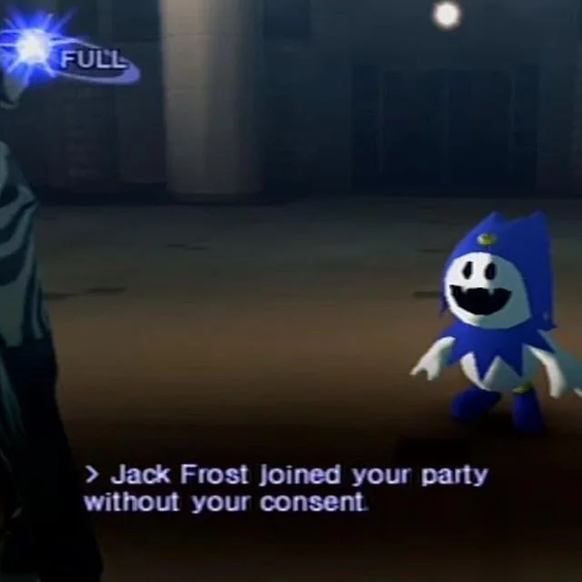

# Black Frost

<figure><figcaption>
"I've become hee ho evil! I'm Black Frost, heeeeee hoooooo!"—Black Frost, <em>Shin Megami Tensei III: Nocturne</em>
</figcaption></figure>

Black Frost es la versión malévola de Atlus del demonio Jack Frost, que es de naturaleza más amigable. La palabra "ja'aku" en su nombre japonés, cuando se escribe en kanji (邪悪), significa "malvado" o "maligno", de ahí sus características oscuras.

<mark style="color:purple;">Historia de Black Frost</mark>

Los Black Frosts son Jack Frosts que se volvieron poderosos y malévolos debido a su anhelo de poderes oscuros y al recordar su naturaleza demoníaca. Son una variante evolucionada del hada invernal amante de la paz. Junto con un aumento en su tamaño, su piel se oscurece y su atuendo pasa de ser azul a morado.

En otra historia, originalmente fue la única criatura en su mundo y oró a su dios por un compañero, pero solo se le concedió por un día. Después de que su amigo se fue, sintió tal tristeza y enojo que se dio cuenta de que nunca debería haber pedido un amigo.

Además de conservar una alta resistencia/inmunidad a los ataques de hielo como sus congéneres de hielo, también comparten una alta resistencia/inmunidad como sus congéneres de fuego. Sin embargo, su naturaleza malévola significa que no pueden resistir ataques basados en la luz en los juegos en los que están presentes.


Una muy buena animación de Joclpacheb en ArtStation.


<mark style="color:purple;">Contexto: ¿Quién es</mark> Jack Frost<mark style="color:purple;">?</mark>

Jack Frost es un espíritu de origen inglés. Es un elfo de la nieve que trae el clima frío durante el invierno y se cree que es responsable de la escarcha que se forma en las ventanas de hogares y edificios.

Jack Frost aparece en muchos juegos de la franquicia Megami Tensei, comenzando con Megami Tensei II, y es uno de los demonios con más apariciones en la franquicia. Se le considera la mascota de Atlus y de la franquicia Megami Tensei en su conjunto, lo que ha dado lugar a numerosos cameos. Jack Frost también tiene una "familia" que incluye a otros Frosts, como King Frost, Black Frost y Pyro Jack. Jack Frost y su "familia" tienen la costumbre de añadir "hee," "ho" y "hee-ho" a su lenguaje.

.png>)

.png>)

.png>).png>)

Variedad de Jack Frost's

.png>).png>)



Esta figura de Black Frost lastimosamente no se encuentra disponible para descargar, pero esto no nos detendrá ya que estamos decididos a imprimirlo y obtener nuestra propia pieza en 3D.

<figure><figcaption></figcaption></figure>



## <mark style="color:purple;">Modelo 3D disponible de Jack Frost</mark>

El único modelo **aceptable** **gratis** de Jack Frost fue este archivo, nos servirá para convertirlo en su versión malvada.



El enlace del archivo es el siguiente:


Enlace descargado de Sketchfab del enlace superior.


## <mark style="color:purple;">Editar el archivo disponible</mark>

Al descargar el archivo lo primero que podemos observar es que el modelado es bastante parecido al original a pesar de verse muy diferente con los shaders, lo segundo sería que los cuernos del gorro son muy grandes a comparación de lo que estamos acostumbrados.


En un principio abrí Blender con el único objetivo de convertir el formato del archivo original en .stl pero terminé editando muchas cosas en este programa.


**El primer paso sería escalar la zona del cuerno**

* Nos vamos a Edit Mode para poder editar nuestro objeto.


Podemos editar los vértices, borde y caras de nuestros modelos 3D al pasar a Edit Mode, en la vista de Object Mode podemos escalar, rotar, etc **sin** cambiar los vértices, borde y caras.


* Seleccionamos los vértices, podemos seleccionar vértices, borde o cara en un menú o cambiarlo con "Tab".

<figure><figcaption>
Menú de selección de vértices, edge o face en Edit Mode
</figcaption></figure>

* seleccionamos "+" en el numpad para seleccionar por steps/pasos de manera más simple hasta dónde necesitamos.

<figure><figcaption>
Seleccionar "+"
</figcaption></figure>

 

<figure><figcaption>
Podemos ver los vértices seleccionados en naranja, y los no seleccionados en rosa.
</figcaption></figure>

* finalmente escalar, para ello podemos seleccionar desde la barra lateral o con el comando "S".

<figure><figcaption>
Scale en la barra lateral de Edit Mode.
</figcaption></figure>

<figure><figcaption>
Tamaño de los cuernos original, vista en Object Mode.
</figcaption></figure>

<figure><figcaption>
Tamaño de los cuernos reducidos, con los vértices seleccionados en Edit Mode.
</figcaption></figure>

El objeto se encuentra en una pose en Object Mode debido a que tiene un modificador de armadura, ya que Edit Mode se trata de modificar los vértices, bordes y caras del objeto en este menú se observa en pose T.

Esta pose y la armadura ha sido realizado por el creador del archivo.

<figure><figcaption>
Modificador de armadura en el menú lateral.
</figcaption></figure>

 

<figure><figcaption>
Vista de la armadura para cambiar de pose en Object Mode.
</figcaption></figure>

Como este archivo estaba planteado para un estilo Cartoon, el creador optó por utilizar imágenes en los detalles de ojos y boca, y utilizar el modificador solidify para extruirlo, como no me sirve lo eliminaré seleccionando la "x" en el menú lateral de modificadores.

<figure><figcaption>
Vista del modificador solidify seleccionando la "x"
</figcaption></figure>

 

<figure><figcaption>
Vista de la imagen extruida con el modificador sin activar los shaders.
</figcaption></figure>

Una vez eliminado podemos ver una esfera completa en el rosto, también eliminaré la base seleccionando "x".

<figure><figcaption>
Seleccionar la base en Object Mode, apretar "x" en el teclado y luego confirmar.
</figcaption></figure>

Hasta este punto ya consideraba aceptable exportar en formato .stl para imprimirlo y tal vez dibujar el rosto a mano, así que procedí a exportar el objeto.&#x20;

Como no perduró esta idea simplemente voy a dejar el archivo disponible para que alguien más realice su versión del rostro de Jack Frost.

Para exportar el archivo debemos dirigirnos al menú superior y seleccionar File, luego Export, seleccionar el formato a exportar, ahí seleccionamos .stl.

<figure><figcaption>
Menú de File desplegado, dirigirse a Export.
</figcaption></figure>

 

<figure><figcaption>
Menú de Export para seleccionar diversos formatos a exportar.
</figcaption></figure>

<figure><figcaption>
Menú emergente para guardar en el equipo.
</figcaption></figure>

**El siguiente archivo .stl se trata del Jack Frost hasta los cambios actuales.**


Archivo con los cambios en formato .stl


## <mark style="color:purple;">Realizar el rostro de Black Frost</mark>

Archivo .stl del Black Frost falso

> Debido a que ya me ilusioné con Black Frost, transformaré el modelo del Jack Frost modificado en un Black Frost.
>
> Erika Ramírez, 3/11/23

### <mark style="color:purple;">Planos</mark>

Empezamos por los ojos. Seleccionamos <mark style="color:purple;">**Shift A**</mark> para abrir un menú emergente de <mark style="color:purple;">**Add**</mark> que también podemos ver en la barra superior, nos dirigimos a <mark style="color:purple;">**Mesh**</mark> y seleccionamos <mark style="color:purple;">**Plane**</mark>**.**&#x20;

Cambiamos de ventana de edición con <mark style="color:purple;">**Tab**</mark> para ir a <mark style="color:purple;">**Edit Mode**</mark> para modificar nuestro plano.

<figure><figcaption>
Menú emergente de Add (Shift A)
</figcaption></figure>

 

<figure><figcaption>
Plane creado.
</figcaption></figure>

Creamos unos <mark style="color:purple;">**Loop Cut**</mark>'s con <mark style="color:purple;">**Ctrl R**</mark> o seleccionando la función en el menú lateral izquierdo.

<figure><figcaption>
Vista de Loop Cute en el menú lateral.
</figcaption></figure>

<figure><figcaption>
Creamos un Loop Cut para dividir el plano ya sea para después eliminar la cara que no queremos o para crear puntos que nos ayuden a modelar, o incluso para crear polígonos de soporte si necesita la figura.
</figcaption></figure>

Eliminamos las caras que no necesitamos para crear un rectángulo de dimensiones aproximadas al ojo de Black Frost, nos sirve un Loop Cut lateral para que nos cree polígonos de soporte.

<figure><figcaption>
Rectángulo creado con ayuda de Loop Cut's.
</figcaption></figure>

Para crear vértices en forma de "chaflán" o "biselado", podemos acceder al menú superior y elegir la opción "Bevel Vertices" dentro de la pestaña "Vertex", o bien, seleccionar el vértice y utilizar la combinación de teclas "Shift + Ctrl + B".

<figure><figcaption>
Vista en el menú emergente de Vertex.
</figcaption></figure>

<figure><figcaption>
Vista del menú de vertex con la opción Bevel Vertex y la guía del comando.
</figcaption></figure>

Seleccionamos los vértices de los extremos de rectángulo y realizamos el Bevel Vertex en la zona inferior, y repetimos el proceso en un vértice superior del rectángulo.

<figure><figcaption>
Bevel Vertex en distintos vértices del rectángulo.
</figcaption></figure>

Podemos cambiar la oriendación del bevel en Shape.

Ya que nos quedó corto el plano decido estirarlo seleccionando la parte superior y moviendo en el eje Z con G (comando para mover) y luego seleccionamos X,Y, o Z según necesitamos para bloquear la operación en ese eje.

<figure><figcaption></figcaption></figure>

Para crear los dientes, seguiremos el mismo método. Crearemos un plano, añadiremos un "loop cut" en el centro y luego utilizaremos el comando "K" para utilizar la herramienta "Knife" y cortar siguiendo la guía de los vértices para obtener la forma de triángulo deseada.

<figure><figcaption>
Eliminar las caras restantes.
</figcaption></figure>

 

<figure><figcaption>
Knife para cortar siguiendo los vértices.
</figcaption></figure>

 

<figure><figcaption>
Loop Cut en el centro.
</figcaption></figure>

### <mark style="color:purple;">**Extruir el plano en dirección a la normal.**</mark>

El comando para extruir suele ser **E** de Extrude pero para extruir en dirección a la normal podemos utilizar el comando **Alt E**. Utilizamos este comando para extruir tanto nuestro plano del ojo como el de diente.

<figure><figcaption>
Extrude Along Normals en el menú de búsqueda.
</figcaption></figure>


Si sabes qué operación queres realizar pero no te acordas en qué menú se encuentra o cuál era su comando, se puede buscar en un menú emergente el cuál en mi caso (todo es personalizable) se abre con la tecla de space. Una vez seleccionado se realiza la operación.


<figure><figcaption>
Extruimos nuestro plano del ojo.
</figcaption></figure>

 

<figure><figcaption>
Extruimos el plano del diente.
</figcaption></figure>

### &#x20;<mark style="color:purple;">Diferencia booleana para crear la boca de Black Frost</mark>&#x20;

Vamos a crear una esfera, la cortaremos por la mitad y la posicionaremos en el lugar donde deseamos realizar una operación booleana. Para hacerlo de manera más conveniente, activaremos el complemento (**addon**) de **Bool Tools** en las **Properties** (Propiedades). Esto nos permitirá obtener una diferencia booleana que podremos ajustar en tiempo real desplazando el objeto de corte hasta que estemos satisfechos con su posición.

<figure><figcaption></figcaption></figure>

Una vez activado el addon no recordaba cómo encontrarlo así que lo busqué utilizando space.

<figure><figcaption></figcaption></figure>


Podemos volver a modificar algunos parámetros en un menú emergente en la zona inferior izquierda.


El muy importante menú de modificadores. Debemos dijirnos a una ventana de **Properties** y seleccionar el menú de Modifiers que tiene el ícono de la llave mecánica, luego seleccionar Add **Modifier** y nos aparecerá una lista de todos los modificadores que podemos utilizar.

<figure><figcaption>
Lista de Modificadores.
</figcaption></figure>

 

<figure><figcaption>
Menú de Modifiers
</figcaption></figure>

 

<figure><figcaption>
Ventana de Properties.
</figcaption></figure>

Modificador de **Subdivision Surface.**

Divide las caras en partes más pequeñas para darle una apariencia más suave.

<figure><figcaption></figcaption></figure>

En la imagen inferior podemos ver el modificador **Subdivision Surface** en aplicado.

Para eliminar vértices superpuestos, seleccionamos la tecla "**M**" y aparecerá un menú emergente de "Unir" ("**Merge**"), luego seleccionamos "Por Distancia" ("**By Distance**").

<figure><figcaption></figcaption></figure>

Los vértices que deseemos superponer con otros pueden coincidir después de habilitar la función de ajuste ("Snap") y seleccionar la opción "Snap Vertex".

<figure><figcaption>
Los vértices que queramos superponer a otros pueden ser coincidentes luego de activar Snap y seleccionar Snap Vertex.
</figcaption></figure>

<figure><figcaption></figcaption></figure>

Modificador de **Bevel**.

Vamos a emplear el modificador "Bevel" para agregar soportes cerca de los bordes. Esto ocasionará que el modificador "Subdivision Surface" se vea influenciado por los nuevos soportes, creando una geometría más similar al original.

<figure><figcaption></figcaption></figure>

Entre los modificadores que utilizaremos se encuentra el de **Mirror**.

Utilizaremos el Modificador mirror para espejar los ojos y dientes del personaje simétricamente.

Para acercar los ojos y dientes del personaje a la esfera podemos utilizar **Snap to** **Face Project**

<figure><figcaption></figcaption></figure>

<figure><figcaption>
De esta manera acercaremos los ojos y dientes a la esfera.
</figcaption></figure>

<figure><figcaption>
Mirror para espejar el ojo y el diente.
</figcaption></figure>

En general nuestro modelo nos está quedando muy similar a la referencia.

<figure><figcaption></figcaption></figure>

Para crear las orejas del icono del gorro, duplicaremos los triángulos que habíamos extruido para los dientes. Luego, con la función de ajuste a la superficie **Snap to Face**, acercaremos las orejas al icono del gorro. Además, aplicaremos el modificador **Mirror** para reflejar las orejas y completar el ícono.

<figure><figcaption></figcaption></figure>

<figure><figcaption></figcaption></figure>

Ahora que terminamos el modelo (ignorando las botas) exportaremos en formato .stl

<figure><figcaption></figcaption></figure>

Las botas siguen siendo la de Jack Frost.

<figure><figcaption></figcaption></figure>

Resultado de las modificaciones.

<figure><figcaption></figcaption></figure>


Formato .stl de Black Frost


## <mark style="color:purple;">Landscape</mark>

Realistic Weathered Japan Torii Gate de [tiborjanas.art](https://sketchfab.com/tiborjanas.art) en Sketchfab.


Enlace a la página.


Podemos descargar en los siguientes formatos, yo lo descargaré en formato .fbx para poder abrirlo en Blender.

<figure><figcaption></figcaption></figure>

Una vez que el archivo es descargado podemos mezclar nuestros objetos en un solo archivo

<figure><figcaption>
Una vez abierto nos encontramos con detalles que no nos conviene al imprimir, así que los eliminaremos.
</figcaption></figure>

<figure><figcaption></figcaption></figure>

Eliminamos los detalles muy pequeños del modelo y agrandamos a Black Frost con scale (comando S).

<figure><figcaption></figcaption></figure>

 

<figure><figcaption></figcaption></figure>

#### En el siguiente enlace encontramos el archivo descargable .blend el cual es fácilmente modificable.


Archivo modificable .blend


## <mark style="color:purple;">Jack Frost joined your party without your consent!</mark>

Cuando decidí ajustar el diseño del zapato de Black Frost para que se asemejara al original, estaba consciente de que al hacerlo, perdería el detallado modelo 3D de Jack Frost. Por esta razón modifiqué los ojos para preservar la esencia de Jack Frost y así poder abordar la creación del zapato de Black Frost sin remordimientos.

<figure><figcaption></figcaption></figure>

<figure><figcaption>
Sin los ojos son básicamente lo mismo, la diferencia entre ambos son los zapatos, los ojos y el logo del gorrito.
</figcaption></figure>

El primer paso es duplicar a Black Frost con el Empty de ejes, los ojos y los dientes (los dientes me los olvidé y tuve que clonarlos más tarde).&#x20;

<figure><figcaption></figcaption></figure>

Seleccionamos los ojos y el empty, eliminamos con el comando **x** en **Edit Mode** uno de los ojos, para editar solo uno y después espejarlo.

Para eliminar completamente elegimos vértices en Delete.

<figure><figcaption></figcaption></figure>

 

<figure><figcaption></figcaption></figure>

Utilizamos el comando K para Knife y cortamos la mitad del ojo.

<figure><figcaption></figcaption></figure>

 

<figure><figcaption></figcaption></figure>

 

<figure><figcaption></figcaption></figure>

Seleccionamos la opción de faces (podemos cambiar entre la selección de caras, bordes y vértices con 1,2 y 3) del grupo numérico de teclado.

<figure><figcaption></figcaption></figure>

 

<figure><figcaption></figcaption></figure>

A continuación, procedemos a la selección de las caras que resultan innecesarias, y utilizando el comando "X", seleccionamos la opción de vértices para no dejar bordes ni vértices restantes.

<figure><figcaption></figcaption></figure>

 

<figure><figcaption></figcaption></figure>

 

<figure><figcaption></figcaption></figure>

Ahora que disponemos de la mitad del ojo, podemos utilizar el modificador "Mirror" en los ejes X y Z. En las imágenes inferiores, se puede apreciar la aplicación del "Mirror" en el eje X.

<figure><figcaption></figcaption></figure>

 

<figure><figcaption></figcaption></figure>

 

<figure><figcaption></figcaption></figure>

<figure><figcaption>
Me causó mucha gracia Jack Frost con los ojos de esta manera.
</figcaption></figure>

<figure><figcaption>
El progreso hasta el momento.
</figcaption></figure>

Me percaté que me olvidé de los dientes así que los dupliqué (Shift D) y moví (G).

<figure><figcaption></figcaption></figure>

 

<figure><figcaption></figcaption></figure>

Ahora regresamos para completar la parte de los ojos en el eje Z. Fue necesario corregir la orientación del "Empty" para asegurarnos de que la clonación se realice de manera correcta. Además, seleccionamos las opciones "**Merge**" y "**Clipping**". En el ejemplo inferior, se destaca la casilla "**Clipping**" que, cuando está marcada, asegura que nuestra malla se fusione adecuadamente cuando las partes coinciden.

En el ejemplo inferior Clipping está desmarcada y se puede observar a la malla sin fusionar al superponerse.

<figure><figcaption></figcaption></figure>

 

<figure><figcaption></figcaption></figure>

Una vez que hemos marcado la opción "Clipping", observamos que las mallas se fusionan sin problemas.

<figure><figcaption></figcaption></figure>

 

<figure><figcaption>
También utilicé knife para corregir desperfectos de la malla y agregar soporte.
</figcaption></figure>

Entonces este sería el modelado de Jack Frost.

<figure><figcaption></figcaption></figure>


Podemos ver muchos desperfectos de geometría pero esto lo corregiremos en Meshmixer.


Para colorear los modelos, he utilizado materiales simples con el objetivo de facilitar la visualización. Para hacer esto, simplemente accedimos a una ventana de "Propiedades," luego nos dirigimos al ícono de "Materiales," seleccionamos las caras que deseábamos colorear, hacemos clic en "Seleccionar" y después asignamos el material que queríamos utilizar.

<figure><figcaption></figcaption></figure>

 

<figure><figcaption></figcaption></figure>

 

<figure><figcaption></figcaption></figure>

Noté que las esferas estaban separadas del resto del objeto, lo que parecía ser parte del estilo "cartoon" del archivo original. Sin embargo, en este momento, esta separación no es deseable. Además, observé que las mallas carecen de física de tela y colisión, lo que provoca ciertos problemas. A pesar de esto, por ahora, opté por ignorar estos inconvenientes.

<figure><figcaption></figcaption></figure>

 

<figure><figcaption></figcaption></figure>

Vamos a abordar el problema de las esferas de Jack Frost. Empezamos por acercar las esferas (o lo que simula ser) al resto de la malla, para ello los acercamos con **Snap to Vertex**.

<figure><figcaption></figcaption></figure>

 

<figure><figcaption></figcaption></figure>

También necesitamos ajustar su escala utilizando la tecla "**S**", pero con la opción de "Orígenes Individuales" **Individual Origins** activada. Esto permitirá que cada esfera se escale en su propio eje de manera independiente.

<figure><figcaption></figcaption></figure>

<figure><figcaption></figcaption></figure>

 

<figure><figcaption></figcaption></figure>

Resulta que el traje de Black Frost no incluye estas esferas, por lo tanto, procederemos a eliminarlas utilizando el comando "**X**". Para hacerlo, seleccionamos una cara de la esfera, luego utilizamos "**Ctrl +**" para seleccionar las caras adicionales hasta completar la esfera, y finalmente hacemos clic en "**X**" y seleccionamos "**Vertices**" para eliminarlas por completo.

<figure><figcaption></figcaption></figure>

Resultado hasta el momento.

<figure><figcaption></figcaption></figure>

Necesitamos clonar la plataforma y el Toori de fondo, pero también espejar a Jack Frost para que haga juego con Black Frost.

He optado por mantenerlos en plataformas separadas, ya que esto preservará la singularidad de cada figura y asegurará que ambas destaquen en la impresión.

<figure><figcaption></figcaption></figure>

<figure><figcaption>
Se ve familiar.
</figcaption></figure>

Me dolió mucho eliminar un Jack Frost.

<figure><figcaption></figcaption></figure>

## <mark style="color:purple;">¡Hasta que llegamos al resultado esperado!</mark>

<figure><figcaption></figcaption></figure>

_En cuanto a las botas_, decidí mantener las botas tal como están, ya que durante mi búsqueda de referencias, descubrí que en la representación de Black Frost en Shin Megami Tensei III Nocturne, las botas de Jack Frost se mantienen sin modificaciones, solo cambiaron el color. Por lo tanto, seguiré este enfoque en paz.

<figure><figcaption></figcaption></figure>


Black Frost en Shin Megami Tensei III Nocturne.


### <mark style="color:purple;">Archivos descargables del progreso</mark>


Archivo .blend el cuál es fácilmente modificable.



Archivo .stl

