# Black Frost y Jack Frost en FlashPrint

Para empezar debemos importar el modelo ya editado en Meshmixer abriendo en **Archivo**, luego **importar**, y seleccionar el modelo en nuestra galería.

Podemos proceder a añadir soportes dirigiéndonos al menú lateral derecho, seleccionar el ícono de soportes.

En las opciones de soporte seleccionaos el diámetro del soporte que creamos conveniente y luego **Autosoporte**. También podemos seleccionar manualmente

<figure><figcaption></figcaption></figure>

Una vez obtenidos los soportes seleccionamos atrás y volvemos al menú inicial.&#x20;

&#x20;Nos dirigimos a calcular el corte con ahora los autosoportes incluidos


Para el primer intento conservé los parámetros ya establecidos para las pruebas del Test de BatCaliCat-man.


<figure><figcaption></figcaption></figure>

Una vez ejecutado Corte, podemos descargar nuestro archivo en formato .gx para luego procesarlo en la impresora 3D.

***

***

Una vez vista los problemas del intento 1 de Jack Frost en cuanto a la plataforma, se decidió aumentar la cantidad de capas de relleno.

<figure>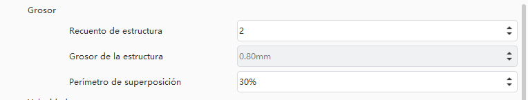<figcaption>
Parámetros originales
</figcaption></figure>

<figure>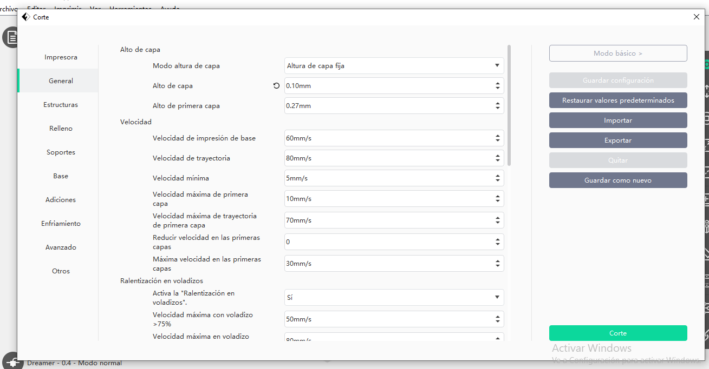<figcaption></figcaption></figure>

<figure>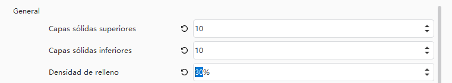<figcaption>
Nuevos parámetros establecidos.
</figcaption></figure>

<figure>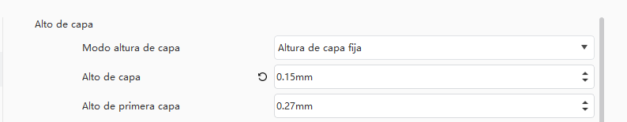<figcaption>
Alto de capa original
</figcaption></figure>

<figure><figcaption></figcaption></figure>

<figure>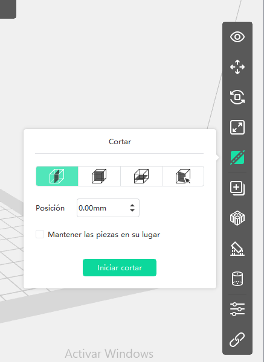<figcaption></figcaption></figure>

 

<figure>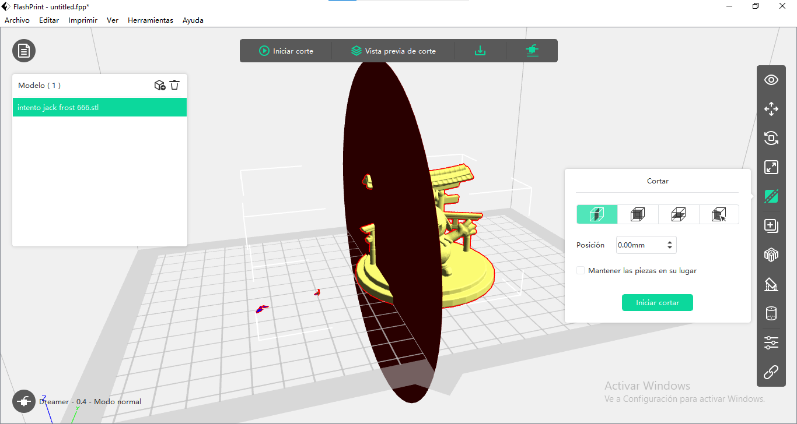<figcaption></figcaption></figure>

 

<figure>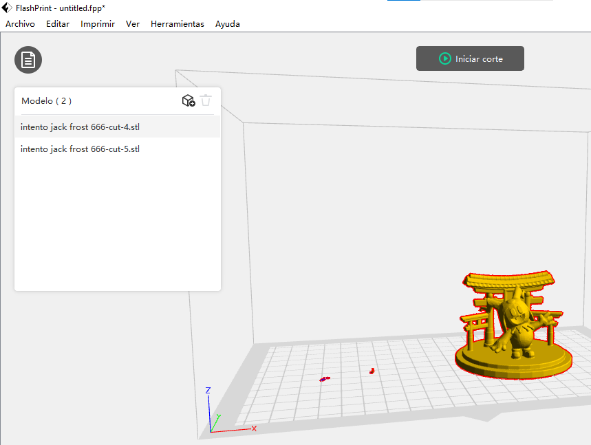<figcaption></figcaption></figure>

<figure>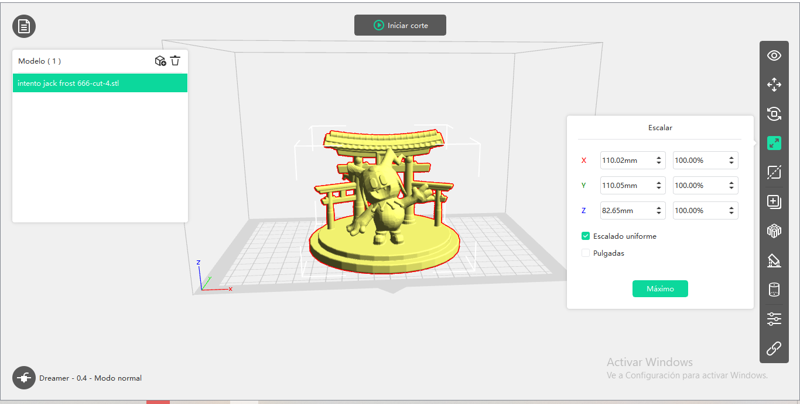<figcaption></figcaption></figure>

<figure>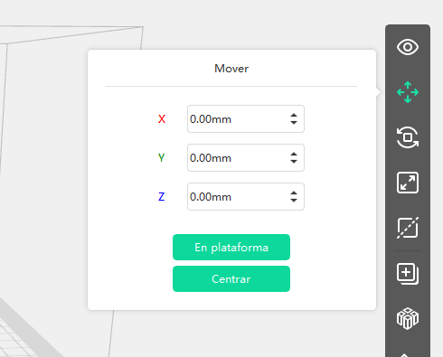<figcaption></figcaption></figure>

<figure>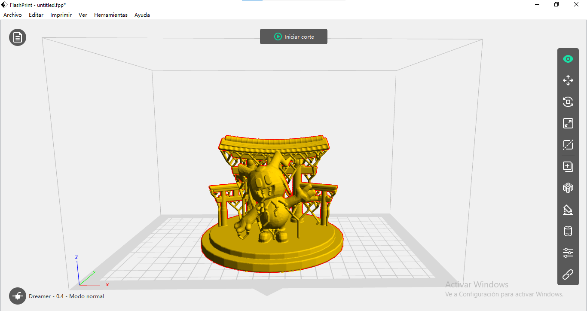<figcaption></figcaption></figure>

<figure>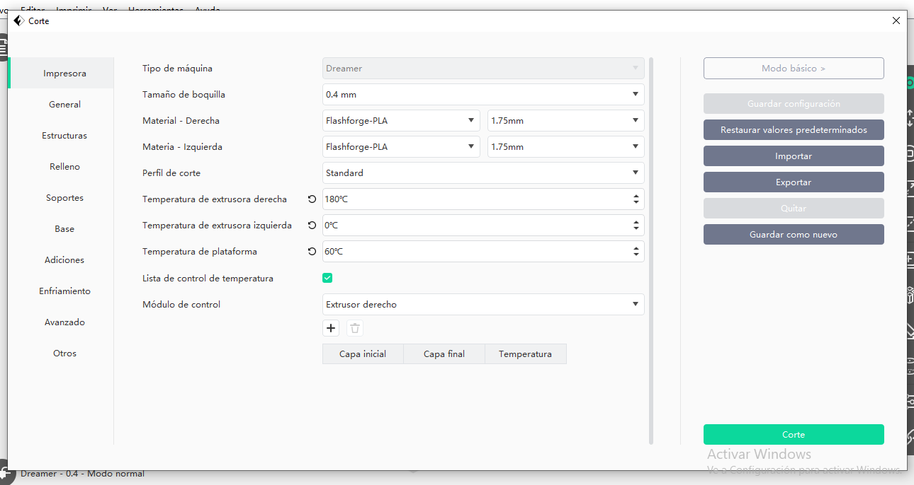<figcaption></figcaption></figure>

<figure>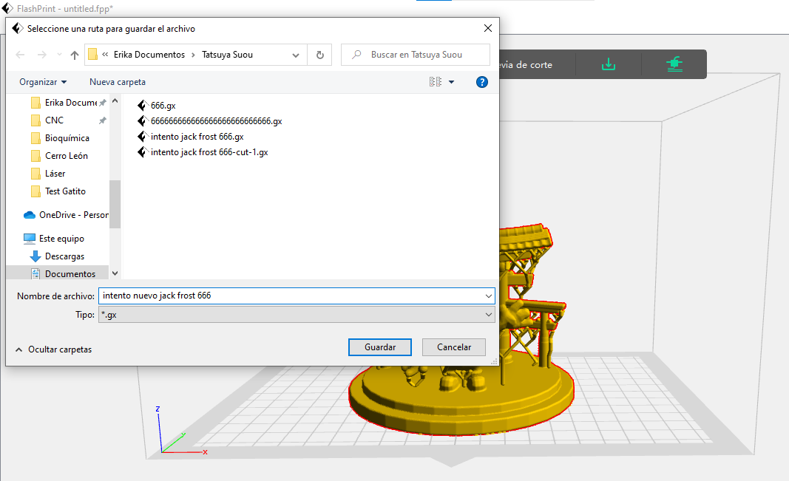<figcaption></figcaption></figure>
