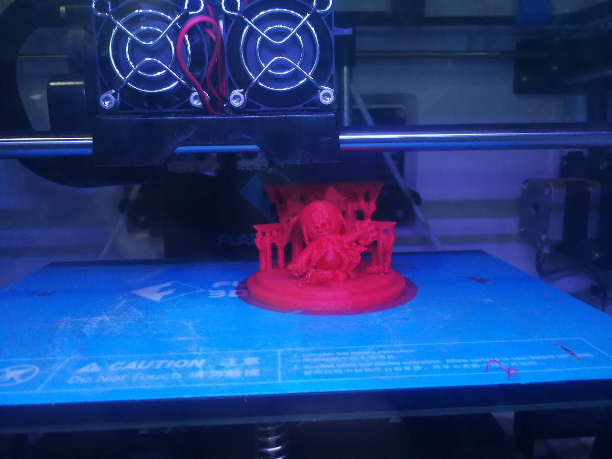

# Resultado de la impresión

En la primera prueba obtuve una pieza que presentaba defectos en la base, una de las manos y unas pequeñas imperfecciones en un lado del Toori.

<figure><figcaption></figcaption></figure>

 

<figure><figcaption></figcaption></figure>

En la segunda prueba obtuve este resultado en el cual base salió bien, pero la mano sigue sin mejorar.

<figure><figcaption></figcaption></figure>
