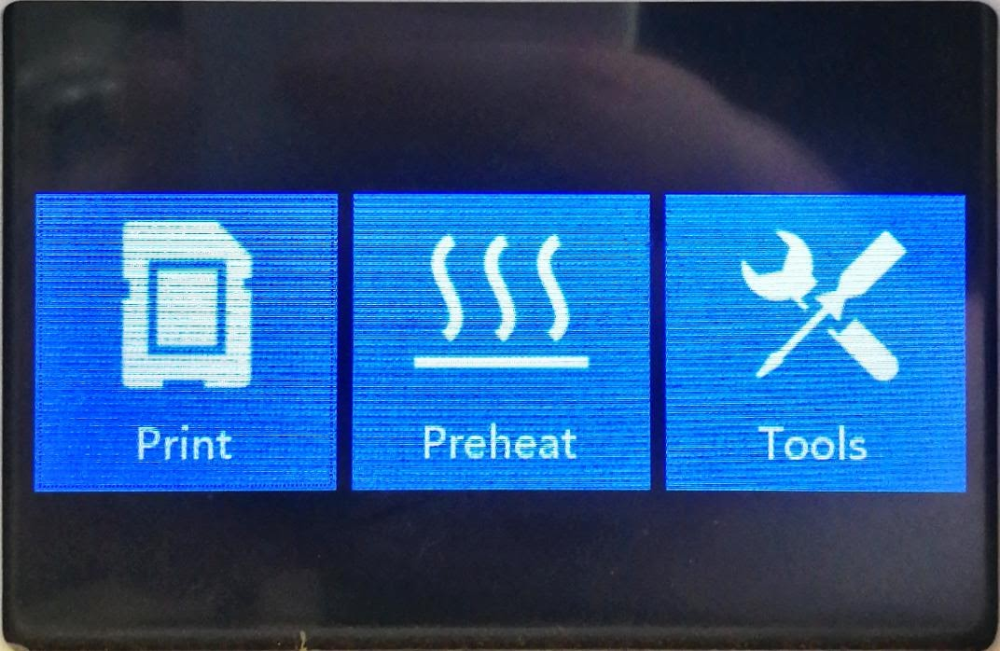
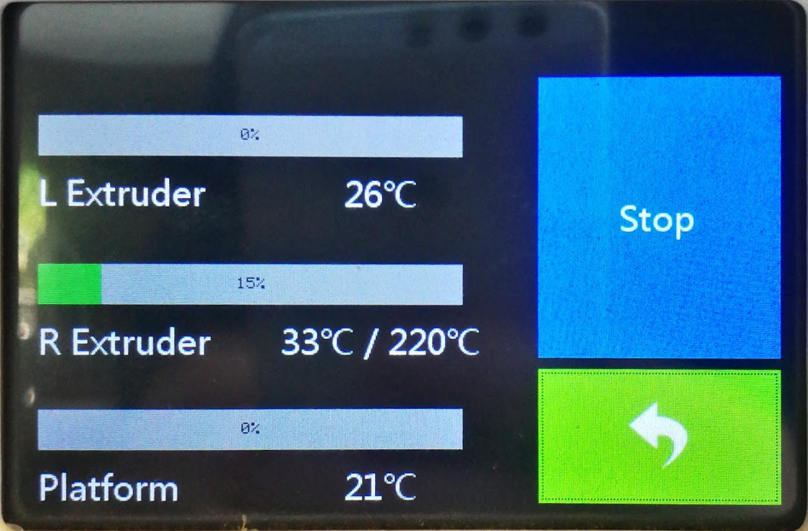
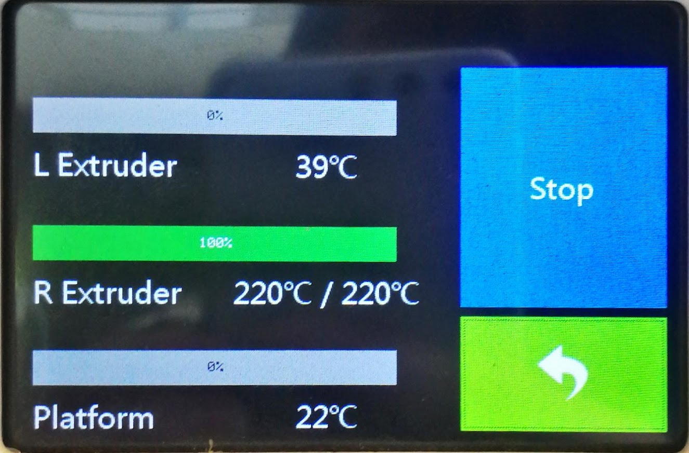
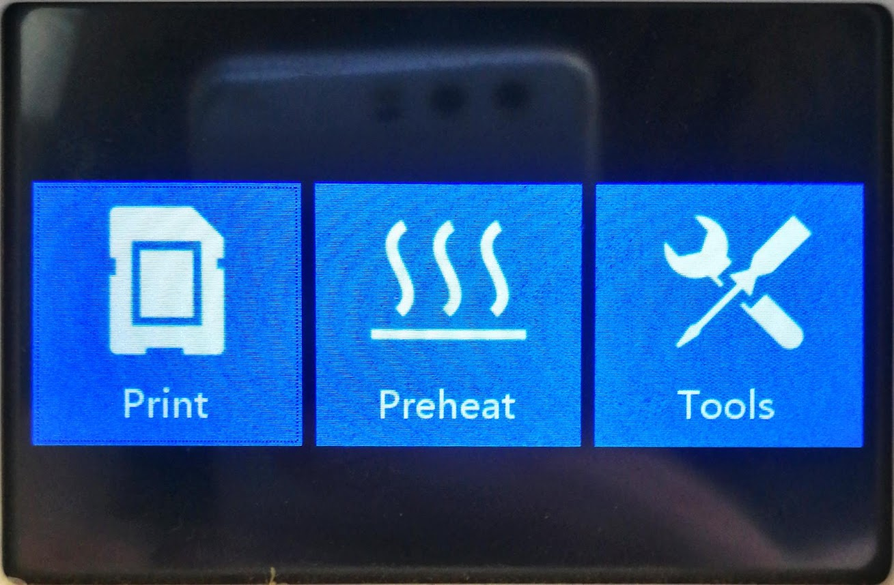
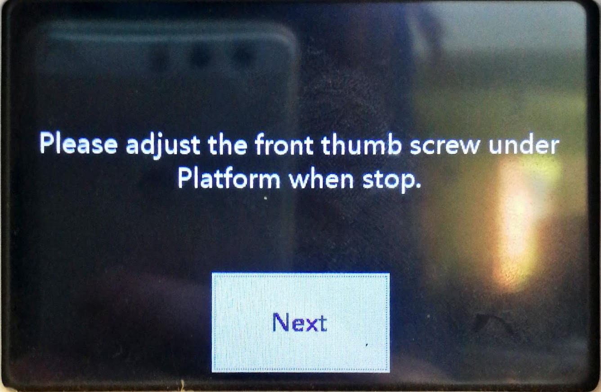
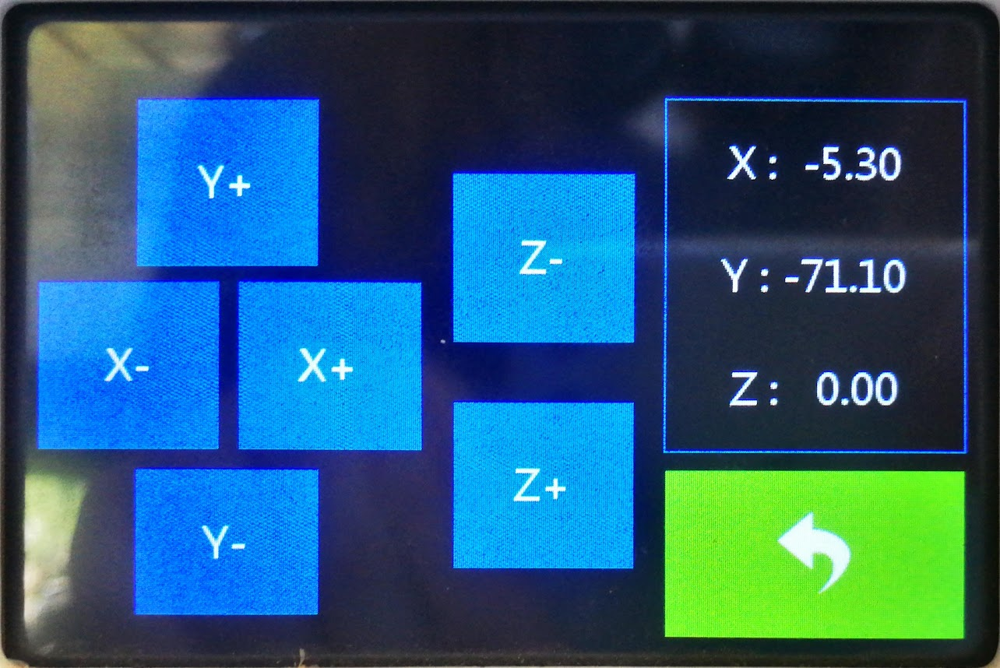
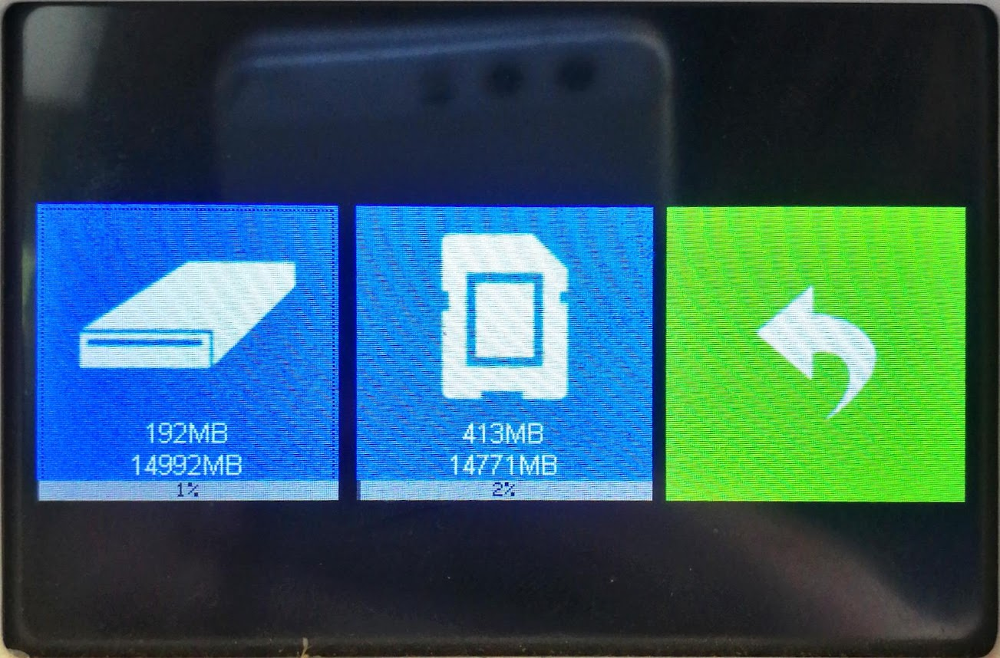
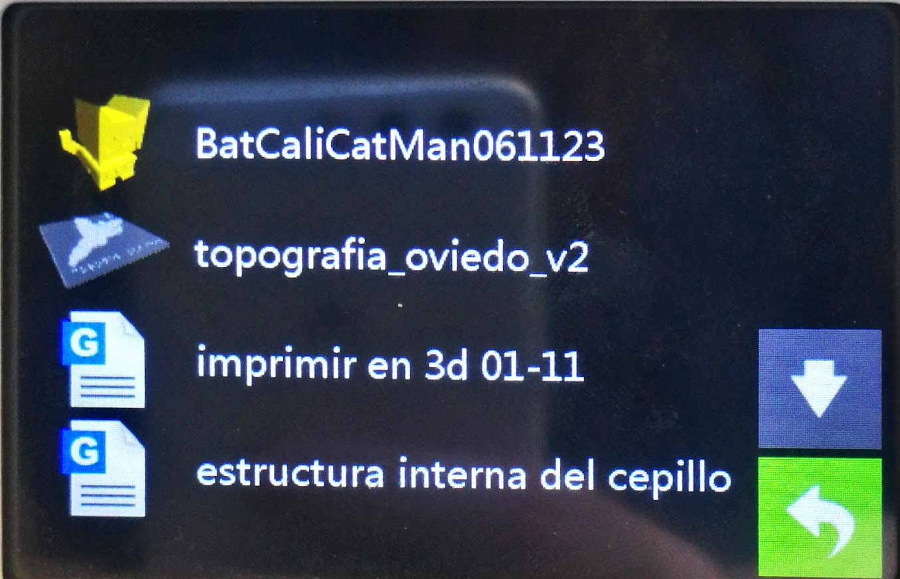
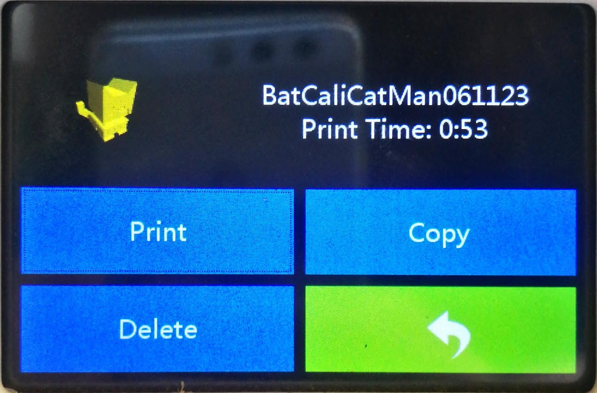
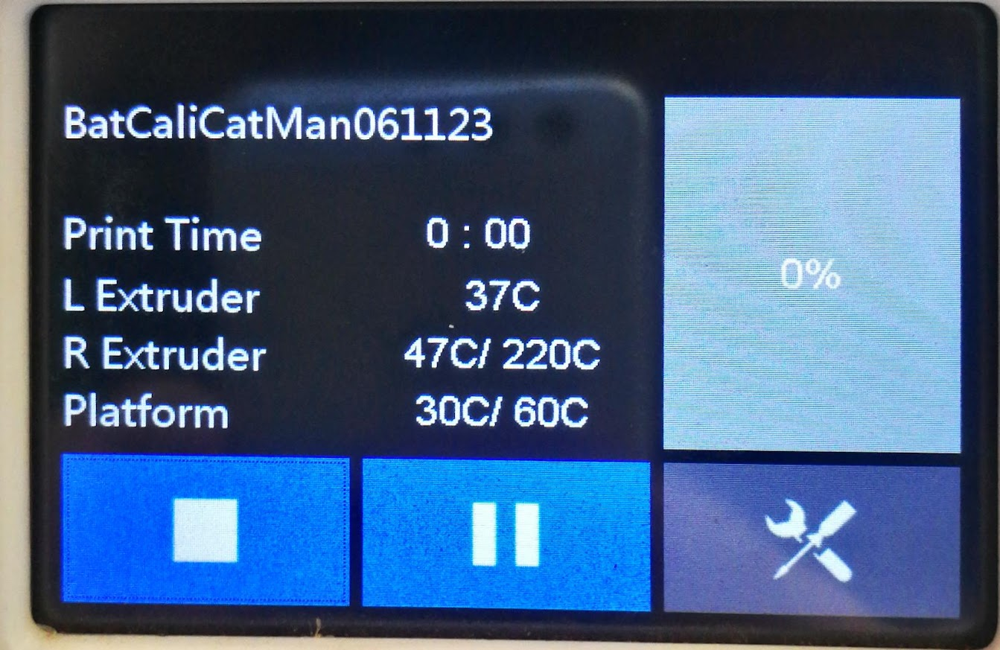

# Descarga e Impresión de un test de impresión.


Link del modelo que utilizaremos.


Descargaremos el test de impresión en este caso de Printables, en este caso seleccioné el test BatCaliCat-Man realizado por Alex Ronda.

Es una versión de CaliCat muy llamativo y ciertamente tierno.

<figure><figcaption>
Vista de la interface del enlace.
</figcaption></figure>

El modelo consta de múltiples piezas.

* El modelo del gato
* Una capa
* Un casco
* El símbolo de Batman&#x20;

<figure><figcaption>
Vista de los modelos por separado.
</figcaption></figure>

<figure><figcaption>
Lista de modelos descargables en el enlace.
</figcaption></figure>

El modelo ya está preparado para imprimirlo, no le realizaremos cambios, ni aumentaremos los polígonos.

A continuación exportaremos el archivo de BatCaliCat-man que descargamos, para ellos entramos en **Archivo**, **Cargar Archivo** y seleccionamos.

<figure><figcaption>
Vista de la interface de Flashprint.
</figcaption></figure>

<figure><figcaption>
Archivo ya exportado en Flashprint.
</figcaption></figure>

Seleccionamos **Iniciar corte** y nos abrirá un menú emergente.&#x20;

<figure><figcaption>
Seleccionar <strong>Iniciar Corte</strong>.
</figcaption></figure>

Al abrir por primera vez el menú nos aparecerá las opciones simplificadas, debemos seleccionar el **Modo Experto** para continuar.

<figure><figcaption>
Vista del menú emergente.
</figcaption></figure>

<figure><figcaption>
Menú emergente <strong>Modo Experto.</strong>
</figcaption></figure>

Prestaremos especial atención a la temperatura de la extrusora que utilizaremos (en este caso la derecha) y la temperatura de la plataforma, estos parámetros se tienen en cuenta según la etiqueta del filamento que poseemos.

<figure><figcaption>
 Vista de Filamentos varios.
</figcaption></figure>



<figure><figcaption>
Filamento Blanco PLA.
</figcaption></figure>

Extrusor: 183-238.

Plataforma:28-68.



<figure><figcaption>
Vista del filamento azul.
</figcaption></figure>

Extrusor: 190-230.

Plataforma: 50.



<figure><figcaption>
Filamento ABS.
</figcaption></figure>

Extrusor: 220.







Configuraremos la temperatura con los siguientes parámetros.

<figure><figcaption>
Parámetros de temperatura utilizados en el tutorial.
</figcaption></figure>

Nos dirigiremos al menú lateral izquierdo y nos vamos a la pestaña de **Estructuras**.&#x20;

<figure><figcaption>
Vista del menú lateral.
</figcaption></figure>

La razón es para poder empezar la impresión de **Interior a Exterior** en **Orden de impresión de la carcasa**, de esta manera si el filamento sale de manera indeseada al principio, no perjudicará el resultado final, por que la temperatura se estabilizará al imprimir el exterior.

También cambiaremos el **Modo** a usar **puntos de inicio aleatorios**, de esta manera evitamos que nuestro modelo tenga un aspecto de zipper o de cierre visible en el punto de inicio.

<figure><figcaption>
Vista de parámetros cambiados en la pestaña de <strong>Estructuras</strong>.
</figcaption></figure>

En el menú lateral derecho nos encontramos con diversas opciones, seleccioné **Guardar Configuración** para imprimir con los parámetros establecidos próximos objetos, teniendo en cuenta si utilizaremos el mismo filamento.

Finalmente seleccionamos **Corte**.

<figure><figcaption>
Vista del menú lateral derecho.
</figcaption></figure>

<figure><figcaption>
Se procesará hasta obtener un resultado exportable.
</figcaption></figure>

Al seleccionar Vista previa de corte podremos ver el objeto laminado, los tipos de rellenos categorizados por colores automáticamente, la duración de tiempo que tomará la impresión.

<figure><figcaption>
Vista del menú superior después del corte.
</figcaption></figure>

<figure><figcaption>
Vista de la interface luego de seleccionar <strong>Vista previa de corte.</strong>
</figcaption></figure>

<figure><figcaption>
Podemos ver dónde se utilizará cada tipo de relleno señalizado según colores automáticamente.
</figcaption></figure>

<figure><figcaption>
Es un dato importante la estimación de impresión que tomará el modelo en la máquina.
</figcaption></figure>

A continuación seleccionamos **Guardar en local** para descargar el archivo en un formato aceptable por la impresora 3D, el formato \*.gx, y con los parámetros que establecimos.

<figure><figcaption>
Debemos seleccionar el ícono de <strong>Guardar en local.</strong>
</figcaption></figure>

<figure><figcaption>
Se guardará en formato *.gx
</figcaption></figure>

Ahora debemos exportar el documento .gx a la memoria SD de la impresora.

<figure><figcaption>
Entrada MicroSD en una notebook.
</figcaption></figure>



Hay que tener en cuenta que las notebooks más actuales no suelen contar con esta entrada, en caso de necesitarlo existen adaptadores en el mercado.


Prender la máquina e ingresar de nuevo la tarjeta SD.

<figure><figcaption>
Entrada de la tarjeta MicroSD en la impresora 3D.
</figcaption></figure>

 

<figure><figcaption>
Tarjeta MicroSD.
</figcaption></figure>

Como está conectado el plástico azul, y quiero reemplazar el filamento a otro color debemos calentar primero el extrusor derecho para poder extraer el anterior.

Los pasos a realizar son:

<figure><figcaption>
Este es el menú principal al que accederemos constantemente. Seleccionamos Preheat.
</figcaption></figure>

<figure><figcaption>
Desactivamos (off) lo que no queremos que se caliente, y activamos (on) lo que sí queremos calentar, en este caso el Extrusor derecho/ R Extruder.
</figcaption></figure>

<figure><figcaption>
Debemos calentar el extrusor derecho, los parámetros serán los establecidos en Flashprint.
</figcaption></figure>

 

<figure><figcaption></figcaption></figure>

Una vez que se termina de calentar el extrusor. Apretamos la palanca que se encuentra al lateral del extrusor, y a la par empujamos el filamento. Una vez expulsado los restos del filamento anterior, podemos abrir la rejilla y quitar los restos.

<figure><figcaption>
Vista del filamento ingresado en el extrusor derecho, y a su costado la palanca mencionada.
</figcaption></figure>

<figure><figcaption>
Zoom a la palanca a apretar con fuerza mientras empujamos el filamento.
</figcaption></figure>

<figure><figcaption>
Podemos utilizar herramientas para cortar el resto de filamento o extraerlo de la plataforma en caso de quedarse pegado.
</figcaption></figure>

Una vez que se haya terminado el proceso anterior y haber cambiado el filamento de haber sido necesario, podemos continuar.

**Mover la plataforma para acercarlo al extrusor.**

Para mover la plataforma debemos seleccionar tools en el menú principal, luego move, y mover la plataforma en el eje Z para acercalo al extrusor.

<figure><figcaption>
Seleccionar Tools en el menú principal.
</figcaption></figure>

<figure><figcaption>
Menú Tools.
</figcaption></figure>


Podemos seleccionar **Level** para nivelar la plataforma en relación al extrusor y luego mover la plataforma para **alejarlo** del extrusor.



Seleccionar Manual para mover la plataforma, movemos en el eje z para alejar o acercar al extrusor. Establecemos una distancia aceptable entre ambos y luego retrocedemos.

<figure><figcaption>
Vista del menú de <strong>Manual</strong>.
</figcaption></figure>

Cuando queremos empezar la impresión volvemos en el menú principal y seleccionamos Print.

<figure><figcaption>
Seleccionar <strong>Print</strong>.
</figcaption></figure>

<figure><figcaption>
Seleccionar el ícono de la tarjeta Micro SD.
</figcaption></figure>

<figure><figcaption>
Seleccionar el modelo que queremos imprimir.
</figcaption></figure>

 

<figure><figcaption></figcaption></figure>

 

<figure><figcaption></figcaption></figure>

Una vez seleccionado nos aparece una última confirmación, aceptamos y la máquina comienza su proceso.

<figure><figcaption>
Proceso del BatCaliCat-man.
</figcaption></figure>

<figure><figcaption>
BatCaliCat-man terminado.
</figcaption></figure>

Una vez terminado podemos extraer el objeto, limpiar los excesos de filamento incrustados en la plataforma y analizar el resultado.

<figure><figcaption>
Limpieza del exceso de filamento con ayuda de la herramienta.
</figcaption></figure>

<figure><figcaption>
Podemos abrir la rejilla para acceder a la plataforma con facilidad.
</figcaption></figure>

**Resultado Final**

<figure><figcaption></figcaption></figure>

<figure><figcaption>
Desperfectos en el lateral.
</figcaption></figure>

A pesar de utilizar los parámetros de temperatura especificados en la etiqueta del producto, no salió como se esperaba.

Se debe realizar nuevas pruebas con otros parámetros de temperatura.

| Nuevos Intentos |   |
| --------------- | - |
|                 |   |
|                 |   |
|                 |   |

¡Gracias por seguir este tutorial!

¡Espero que este tutorial te haya sido de utilidad! Si tienes alguna pregunta o necesitas más ayuda, no dudes en contactarnos. ¡Gracias por leer y buena suerte en tus proyectos futuros!
