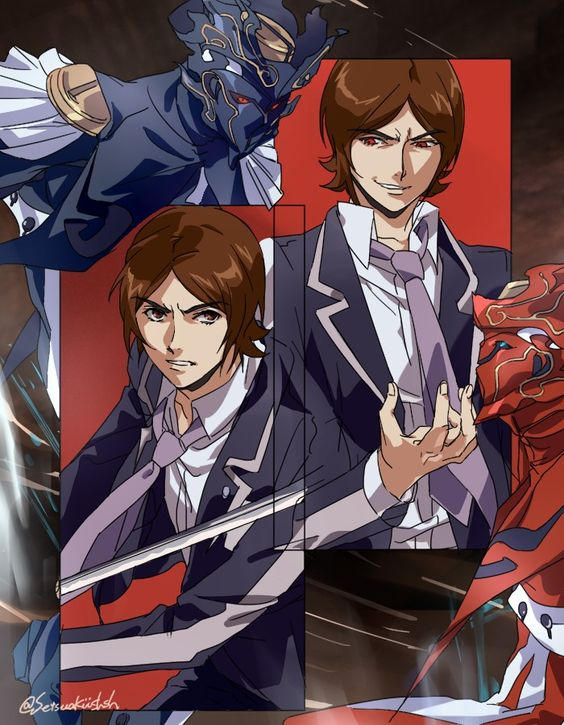
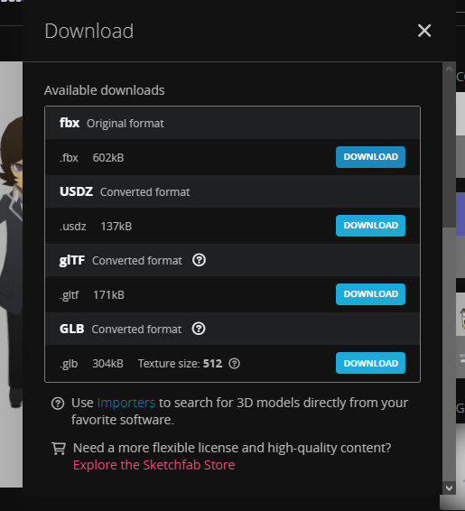
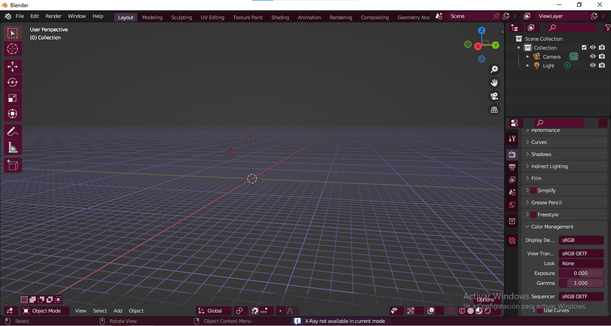

# Diseño 3D editando con Meshmixer.

## <mark style="color:red;">**Inspiración**</mark>

El protagonista de Persona 2  Tatsuya Suou, a quien le gusta las motocicletas y se lo ve con la suya en varias escenas de los juegos de Persona 2.

&#x20;En el segundo juego se lo puede ver con una vestimenta de motociclista directamente.

<figure><figcaption>
Tatsuya Suou en Persona 2 Innocent Sin.
</figcaption></figure>

<figure><figcaption>
Tatsuya Suou en Persona 2 Eternal Punishment.
</figcaption></figure>

<figure><figcaption></figcaption></figure>

 

<figure><figcaption></figcaption></figure>

<figure><figcaption></figcaption></figure>

 

<figure><figcaption></figcaption></figure>


Tatsuya imitando el motor de una motocicleta en Innocent Sin.


## Selección de Modelos 3D online

#### Modelo de Tatsuya disponible.

Personalmente me hubiera gusta la versión de Eternal Punishment pero en su lugar sí encontré la versión de Innocent Sin.


Modelo 3D de Tatsuya en Innocent Sin versión Persona Q.


<figure><figcaption>
Opciones de descarga del archivo
</figcaption></figure>

<figure><figcaption>
Opciones de formato de descarga del Modelo 3D.
</figcaption></figure>


Modelo en 3D en formato .fbx


### **Conversión de archivos .fbx a .stl**

Meshmixer reconoce archivos en .stl así que para convertir el .fbx al formato requerido abriré Blender para importar .fbx y exportar .stl

<figure><figcaption></figcaption></figure>

<figure><figcaption></figcaption></figure>

<figure><figcaption></figcaption></figure>

<figure><figcaption></figcaption></figure>

<figure><figcaption></figcaption></figure>

<figure><figcaption></figcaption></figure>

<figure><figcaption></figcaption></figure>

#### Modelos 3D

**Motocicleta Low Poly**



<figure><figcaption></figcaption></figure>

<figure><figcaption></figcaption></figure>



<figure><figcaption></figcaption></figure>



Modelo 3D en formato .stl de la motocicleta



Modelo en formato .stl de Tatsuya Suou



**Modelo 3D online de un casco.**

<figure><figcaption>
Vista del casco 3D del enlace.
</figcaption></figure>

### Cascadeur



<figure><figcaption></figcaption></figure>

<figure><figcaption></figcaption></figure>
