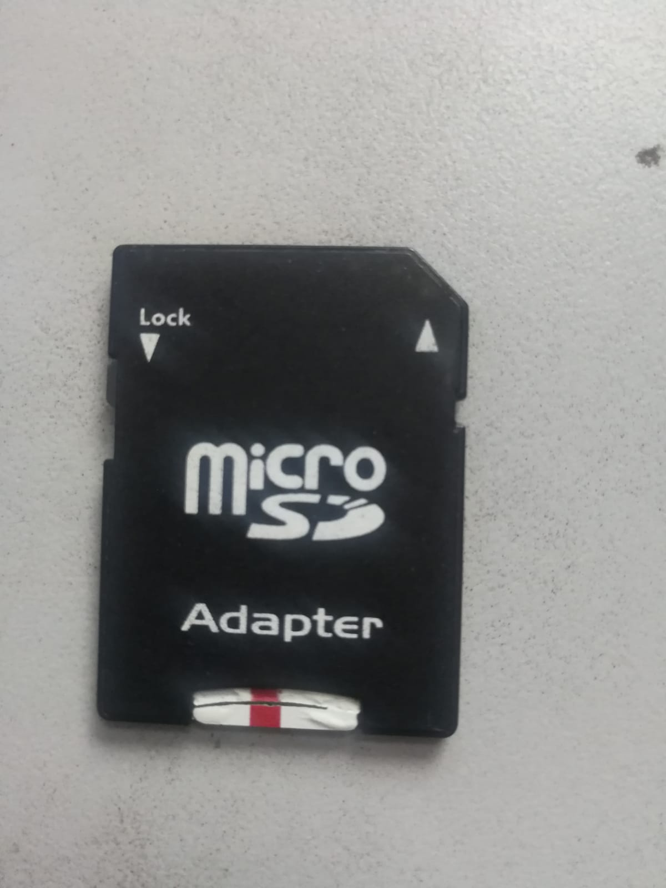
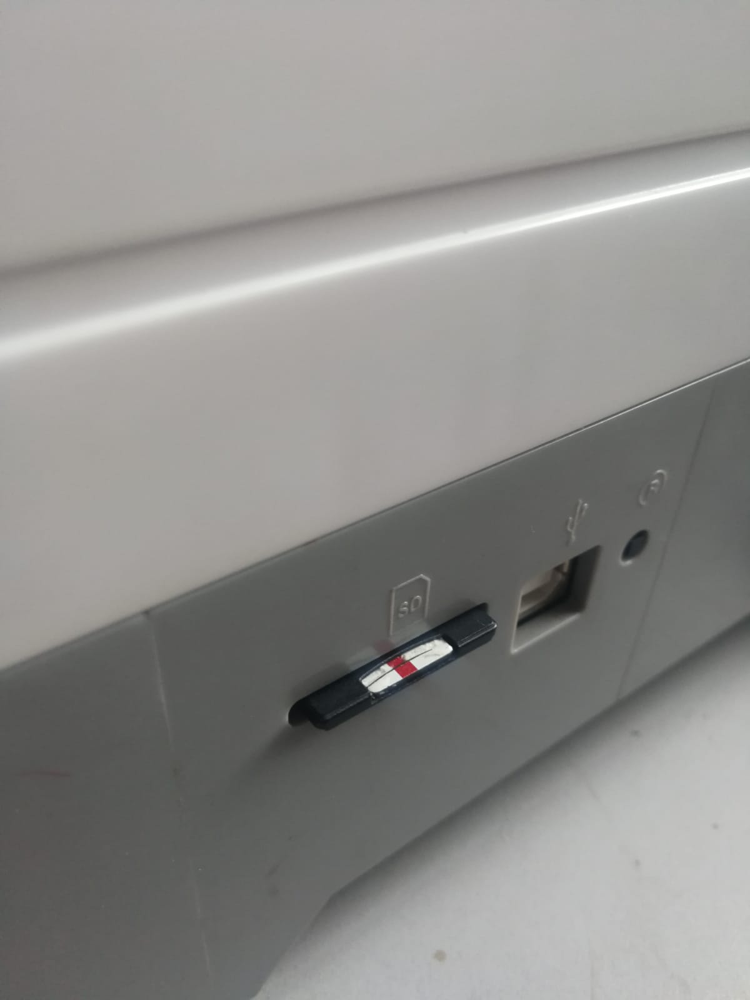

# Diseño 3D e Impresión de una vasija.


Link para descargar el modelo a imprimir.


Una vez que descargamos el archivo procedemos a abrir Rhino, luego Grasshopper para abrir el documento.

&#x20;A continuación modificar los parámetros.

<figure><figcaption>
Vista de los nodos en Grasshopper.
</figcaption></figure>

<figure><figcaption>
Vista del modelo de los scripts realizados en Grasshopper vistos del viewport.
</figcaption></figure>

El autor del trabajo especifica los pasos a seguir.

<figure><figcaption>
Pasos a seguir señalizados.
</figcaption></figure>

En la zona inferior encontramos los nodos de parámetros modificables.

La unidad utilizada es centímetros.

Los parámetros son:

* Altura
* Cantidad de segmentos.
* Lados.
* Giro.
* Radio de la tapa inferior.
* Radio de la tapa superior.
* Subdivisiones de paneles.
* Grosor.

<figure><figcaption>
Vista de los parámetros modificables.
</figcaption></figure>

Procedemos a configurar los parámetros predeterminados por el autor a nuestro parecer.&#x20;

<figure><figcaption></figcaption></figure>

Para crear el modelo debemos realizar bake en el nodo final de nuestro script.


El término ¨Bake¨ (hornear objetos) en Grasshopper y Rhino se refiere al proceso de transferir o convertir la geometría digital que creas en Grasshopper en objetos o superficies físicas en el entorno de modelado de Rhino.


<figure><figcaption>
Nodo el cual debemos realizar bake.
</figcaption></figure>

Procedemos a hacer click derecho en el nodo, y seleccionamos Bake.

<figure><figcaption></figcaption></figure>

Al seleccionar nos aparece una pestaña emergente, en la que añadiremos el nombre, y seleccionaremos la casilla de Agrupar. Luego seleccionamos ok.

<figure><figcaption>
Vista de la pestaña emergente.
</figcaption></figure>

Una vez terminado el proceso anterior, obtendremos el modelo en el viewport.

<figure><figcaption>
Meshes alejados de la vista previa del script de Grasshopper (lila)
</figcaption></figure>

Una vez realizado podemos eliminar la pestaña de Grasshopper.

Ya que mi intensión es que el modelo sirva de maceta. Crearemos un círculo en la tapa inferior y lo extruiremos, y después realizaremos una diferencia boleana.

<figure><figcaption>
Podemos observar una curva de círculo en el centro.
</figcaption></figure>

Extruimos el círculo, y después tapamos con ¨cap¨, de esta manera creamos un mesh con el que podemos proceder a crear una diferencia boleana.

<figure><figcaption>
Vista del cilindro en el viewport.
</figcaption></figure>

En teoría ahora podríamos realizar una diferencia boleana, sin embargo tuve problemas con el objeto creado con Grasshopper.

<figure><figcaption>
ícono de Boolean Difference.
</figcaption></figure>

La solución consistió en exportar ya el objeto y el cilindro a Meshmixer.


Para exportar los archivos de Rhino a Meshmixer es necesario exportar como .stl


<figure><figcaption>
Exportar como .stl
</figcaption></figure>

<figure><figcaption></figcaption></figure>

<figure><figcaption>
El modelo se ve deformado con menos polígonos en el viewport de Meshmixer.
</figcaption></figure>

La diferencia boleana se pudo realizar en Meshmixer y una vez terminado, exportamos el modelo a Flashprint, con la intención de imprimir.

También podemos aumentar la cantidad de polígonos en Meshmixer para lograr mayor exactitud en la impresión.

**Exportar a Flashprint**

Si el modelo es demasiado grande se debe escalar para que entre en el cubo que se observa en el viewport.

<figure><figcaption>
Modelo 3D dentro del cubo en el viewport.
</figcaption></figure>

<figure><figcaption>
Modelo 3D que sobrepasa el tamaño del cubo, por ende es necesario escalar.
</figcaption></figure>

Debemos aumentar aumentar la calidad de polígonos del mesh para mayor precisión en nuestra impresión.

<figure><figcaption>
Modelo 3D con mayor cantidad de polígonos.
</figcaption></figure>


A tener en cuenta la reducción de polígonos luego de haber aumentado, hasta encontrar el equilibrio entre una gran cantidad de polígonos y la capacidad a procesar por la notebook y la propia impresora 3D.


Antes de enviar el objeto a la máquina debemos configurar algunos parámetros. Por ejemplo la temperatura de la extrusora, en este caso sólo usaremos la derecha por lo que sólo especificaremos la temperatura derecha a 220 grados.

También determinaremos la temperatura a calentar la plataforma, en este caso 60 grados.


La temperatura de la extrusora se determina de acuerdo al material que utilizaremos.


El tamaño de la boquilla que tenemos es de 0.4 mm.

<figure><figcaption>
Configuraciones listas para exportar a la máquina.
</figcaption></figure>

En esta impresora debemos exportar los archivos y configuraciones por medio de una tarjeta MicroSD.

<figure><figcaption>
Vista de la tarjeta MicroSD.
</figcaption></figure>

<figure><figcaption>
Vista de la tarjeta MicroSD ingresada en la máquina.
</figcaption></figure>

<figure><figcaption>
Vista de la máquina 3D que utilizaremos.
</figcaption></figure>

En la imagen superior observamos la plataforma, para empezar debemos subir esta plataforma más próximo a la extrusora.

<figure><figcaption>
En esta imagen podemos ver la plataforma acercada a la extrusora.
</figcaption></figure>

<figure><figcaption>
Seleccionar Tools.
</figcaption></figure>

<figure><figcaption>
Seleccionar Manual.
</figcaption></figure>

<figure><figcaption>
Mover la plataforma en el eje z y después retroceder.
</figcaption></figure>

Por supuesto debemos limpiar la plataforma de ser necesario, podemos utilizar alguna herramienta para raspar algún pedazo de plástico.

<figure><figcaption>
Limpieza de la plataforma.
</figcaption></figure>

Si no vamos a reemplazar el color del filamento podemos proceder directamente a Print.

<figure><figcaption>
Seleccionar Print.
</figcaption></figure>

 

<figure><figcaption>
Seleccionar el ícono de Tarjeta MicroSD.
</figcaption></figure>

<figure><figcaption>
Seleccionar el objeto a imprimir.
</figcaption></figure>

 

<figure><figcaption>
Confirmar la impresión con Print.
</figcaption></figure>

La máquina comenzará su proceso y esperaremos hasta obtener el objeto impreso.

Las vistas del objeto final son las siguientes.

<figure><figcaption>
Resultado satisfactorio en relación a la apariencia del filamento.
</figcaption></figure>

<figure><figcaption>
El agujero inferior se encuentra obstruido y debemos perforarlo para terminar el proyecto como fue planteado.
</figcaption></figure>

¡Gracias por seguir este tutorial!

¡Espero que este tutorial te haya sido de utilidad! Si tienes alguna pregunta o necesitas más ayuda, no dudes en contactarnos. ¡Gracias por leer y buena suerte en tus proyectos futuros!
