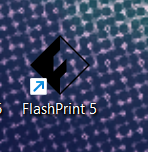

# Instalar FlashPrint.

FlashPrint permite a los usuarios cargar modelos 3D, ajustar la configuración de impresión y controlar el proceso de impresión.

Proporciona una interfaz de usuario fácil de usar que permite a los usuarios cargar modelos 3D, ajustar la configuración de impresión y controlar el proceso de impresión. FlashPrint es conocido por ser compatible con una variedad de formatos de archivo, lo que facilita la importación de diseños 3D, y ofrece herramientas para optimizar la impresión y la calidad del objeto final.

Es una herramienta esencial para aquellos que utilizan impresoras 3D FlashForge y desean imprimir modelos de manera eficiente y precisa.


Enlace a la página para descargar el software.


Seleccionar la version y el Sistema Operativo a instalar el programa.

<figure><figcaption></figcaption></figure>

El archivo del instalador se descargará automáticamente una vez seleccionado.

<figure><figcaption></figcaption></figure>

Ahora, hacemos clic en "Buscar en Carpeta" para navegar hacia la ubicación del archivo en nuestro equipo. Una vez en esa ubicación, abrimos el archivo zip con WinRAR y procedemos a su extracción.

<figure><figcaption>
Seleccionar Abrir.
</figcaption></figure>

Para abrir el archivo seleccionado en las capturas de pantalla, sigue los pasos hasta llegar al archivo del instalador.

<figure><figcaption></figcaption></figure>

 

<figure><figcaption></figcaption></figure>

Una vez abierto seleccionamos el idioma a utilizar en el interface, luego siguiente.

<figure><figcaption></figcaption></figure>

 

<figure><figcaption></figcaption></figure>

Aceptar los términos de condiciones y seleccionar siguiente.

<figure><figcaption></figcaption></figure>

Seleccionar la ubicación del archivo del programa en el equipo, seleccionar siguiente y esperar que se complete la instalación.

<figure><figcaption></figcaption></figure>

 

<figure><figcaption></figcaption></figure>

 

<figure><figcaption></figcaption></figure>

Finalmente se ha finalizado la instalación.

<figure><figcaption></figcaption></figure>

Ahora, disponemos de un acceso directo en la pantalla de inicio de nuestra computadora o notebook que nos permite abrir el programa de forma rápida y sencilla.

<figure><figcaption></figcaption></figure>

Cuando ejecutamos el programa por primera vez, se nos solicita que elijamos el tipo de máquina que estamos utilizando. En nuestro caso, seleccionamos la opción "Dreamer" y confirmamos la selección.

<figure><figcaption>
Interface del programa una vez instalado.
</figcaption></figure>

Finalmente, podemos empezar a utilizar FlashPrint. ¡A disfrutar de todas sus funciones y características!

<figure><figcaption>
Interface de FlashPrint.
</figcaption></figure>

