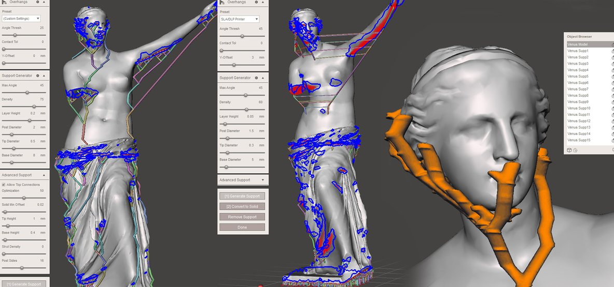
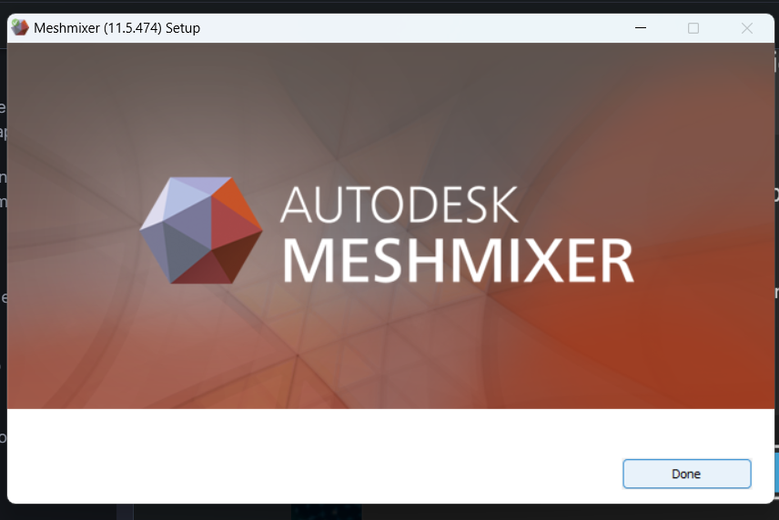
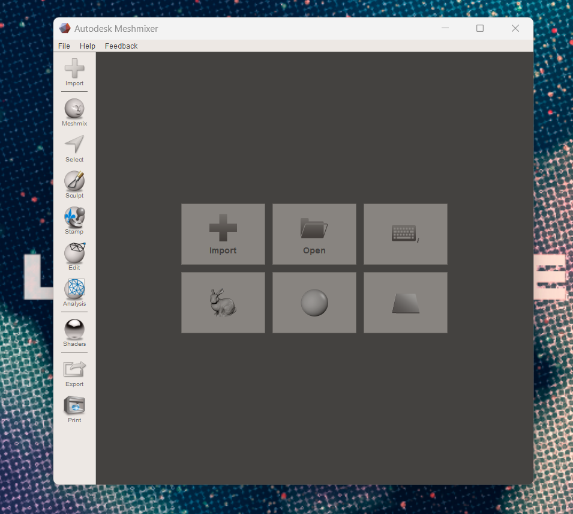

# Instalar Meshmixer.

Algunas de las características clave de Meshmixer incluyen:

<mark style="color:purple;">**Edición de mallas**</mark>

Permite a los usuarios editar y manipular las mallas de los modelos 3D, como suavizar superficies, cortar, dividir, fusionar y reorganizar partes.

<figure><figcaption></figcaption></figure>

<mark style="color:purple;">**Reparación de mallas**</mark>

Puede corregir mallas defectuosas o con agujeros, lo que es esencial para garantizar una impresión 3D exitosa.

<figure><figcaption></figcaption></figure>

<mark style="color:purple;">**Mezcla de modelos**</mark>

Permite combinar múltiples modelos 3D en uno solo, lo que es útil para la creación de diseños complejos o la personalización de objetos.

<figure><figcaption></figcaption></figure>

<mark style="color:purple;">**Generación de soportes**</mark>

Meshmixer puede generar automáticamente estructuras de soporte para modelos 3D que se imprimirán en 3D, lo que ayuda a mejorar la calidad de la impresión.

<figure><figcaption></figcaption></figure>

 

<figure><figcaption></figcaption></figure>

<mark style="color:purple;">**Escultura digital**</mark>

Ofrece herramientas de escultura para esculpir y modificar modelos de forma intuitiva.

<figure><figcaption></figcaption></figure>


Enlace a la página oficial.


Ingresamos al enlace y al final de la página nos brindará un enlace que nos redirigirá a la siguiente página.

<figure><figcaption>
Opciones de idiomas a descargar.
</figcaption></figure>

Seleccionamos el idioma a instalar y guardamos en el equipo.

<figure><figcaption>
Guardar el instalador en el equipo.
</figcaption></figure>

Una vez seleccionado en luagr a guardar el archivo se descargará automáticamente en el navegador.

<figure><figcaption>
Descarga completada en el instalador.
</figcaption></figure>

Abrimos el archivo del instalador en carpeta del equipo y nos saldrá una ventana en la cuál debemos confirmar la instalación.

<figure><figcaption></figcaption></figure>

Ahora debemos aceptar los términos y condiciones de privacidad seleccionando **Accept & Install**, esperamos que termine la descarga rápidamente y cerramos la ventana una vez terminada.

<figure><figcaption></figcaption></figure>

 

<figure><figcaption></figcaption></figure>

 

<figure><figcaption></figcaption></figure>

Ahora ya tenemos instalado el programa y podemos seleccionar el ícono en la pantalla inicial y abrimos el programa por primera vez.

<figure><figcaption></figcaption></figure>

Es medio particular la recolección de datos de Meshmixer pero nos pregunta para aceptar una última vez la recolección de datos. Seleccionamos **Accept** y en la siguiente ventana **ok.**

<figure><figcaption></figcaption></figure>

 

<figure><figcaption></figcaption></figure>

Ahora ya podemos utilizar el programa y nos encontramos con la interface de Meshmixer.

<figure><figcaption>
Interface de Meshmixer.
</figcaption></figure>

Ahora ya podemos utilizar el programa, para entenderlo mejor, en el enlace de abajo se encuentra el manual de ayuda.


Enlace de manual de ayuda de Meshmixer.


¡Felicidades por la exitosa instalación de Meshmixer! Ahora, tienes en tus manos una herramienta poderosa y versátil para dar vida a tus ideas y proyectos de diseño en 3D.

Desde la creación de modelos complejos hasta la personalización de objetos, Meshmixer te ofrece un mundo de posibilidades creativas. ¡Explora, experimenta y da rienda suelta a tu imaginación! Estamos seguros de que Meshmixer se convertirá en una pieza clave en tu caja de herramientas de diseño. ¡Disfrútalo al máximo y crea obras asombrosas!
