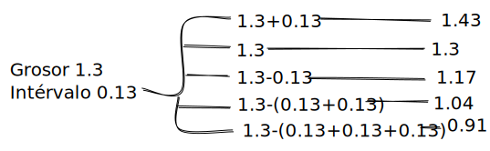

# Kerf encastre

<table><thead><tr><th>Parámetros </th><th width="103">Medida </th></tr></thead><tbody><tr><td>Grosor del material</td><td>1.3 mm</td></tr><tr><td>Parámetro del intérvalo (10%)</td><td>0.13 mm</td></tr></tbody></table>

Cálculos para diseñar la prueba del encastre

<figure><figcaption></figcaption></figure>

<figure><figcaption></figcaption></figure>

<figure><figcaption></figcaption></figure>

 

<figure><figcaption></figcaption></figure>

<figure><figcaption></figcaption></figure>
