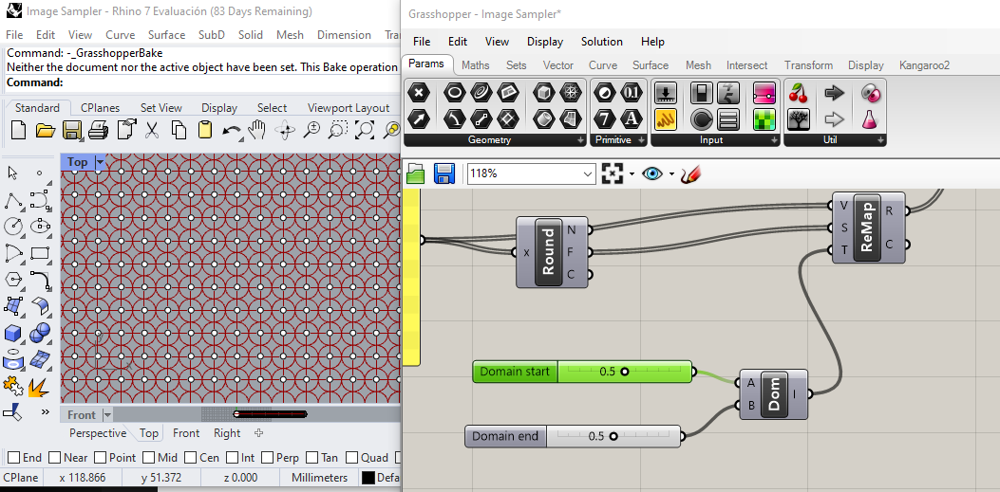
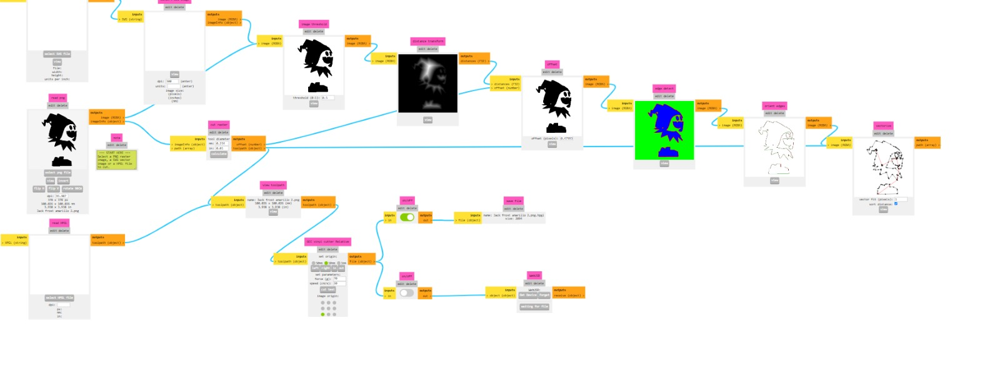
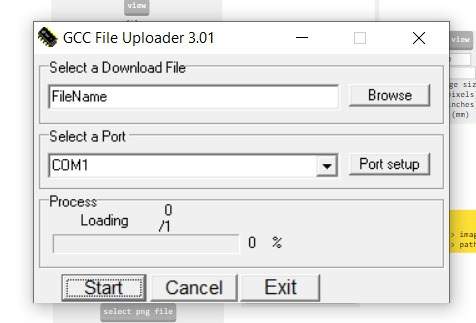

# Plotter de Vinilo

Vamos a utilizar varios programas y herramientas esenciales en nuestro proyecto. Estos recursos son fundamentales para llevar a cabo tareas como el diseño, la creación de patrones, la generación de código, y la producción de objetos físicos. A continuación, presentaré una breve descripción de cada uno de ellos:

* <mark style="color:purple;">**Rhino con el Plug-in Grasshopper:**</mark> Utilizaremos Rhino, un software de modelado 3D de gran versatilidad, junto con Grasshopper, un plug-in que permite la creación de algoritmos visuales. Esto nos permitirá diseñar y parametrizar objetos tridimensionales de manera eficiente y flexible.

<figure><figcaption>
Vista del Viewport de Rhino con el Plugging Grasshopper.
</figcaption></figure>

* <mark style="color:purple;">**Inkscape**</mark>**:** Inkscape es una herramienta de diseño gráfico vectorial que desempeñará un papel importante en la preparación de archivos para nuestra plotteadora. Con Inkscape, podremos crear, editar y optimizar gráficos vectoriales que se utilizarán en nuestros proyectos.

<figure><figcaption>
Vista de la interface de Inkscape.
</figcaption></figure>

* <mark style="color:purple;">**Modsproject:**</mark> La página web Modsproject desempeñará un papel fundamental al permitirnos transformar un archivo en formato .png a un formato procesable que podremos utilizar con la plotteadora a nuestra disposición.

<figure><figcaption>
Vista de la interface de Modsproject.
</figcaption></figure>

* <mark style="color:purple;">**Programa Uploader**</mark>**:** El programa Uploader es esencial para cargar nuestros diseños y patrones en la plotteadora. Nos permitirá gestionar la comunicación entre nuestra computadora y la plotteadora, asegurando una producción precisa y eficiente.

<figure><figcaption>
Vista de Uploader.
</figcaption></figure>

Además, destacando el uso de la plotteadora, esta herramienta no solo se utilizará para cortar materiales, sino también para llevar a cabo dibujos y trazados precisos en base a nuestros diseños. La plotteadora será un elemento clave en la materialización de nuestras creaciones, y su versatilidad será fundamental para dar vida a nuestros proyectos de manera única.

Con la combinación de estos programas y herramientas, estamos preparados para abordar con éxito nuestro proyecto, desde la concepción y el diseño hasta la producción y la materialización de nuestras ideas. Cada recurso desempeñará un papel importante en nuestro proceso creativo y productivo. ¡Avancemos hacia la próxima fase de nuestro proyecto!

##
