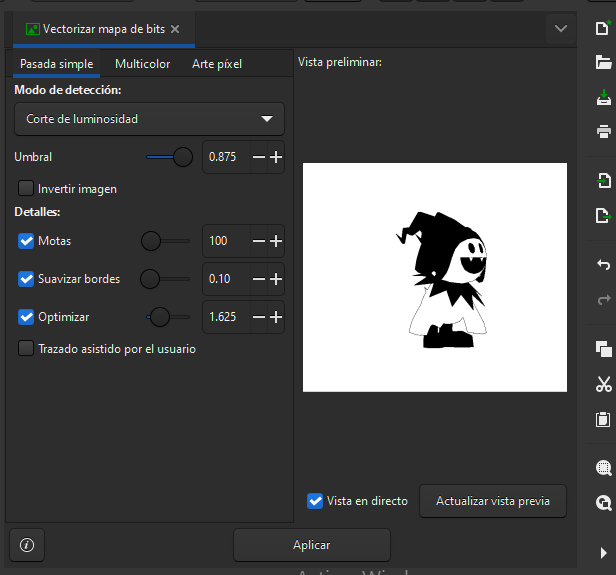

# Crear un diseño 2D multicapa

Con el objetivo de realizar un sticker con la plotter de corte de vinilo, realizaremos los siguientes pasos detallados a continuación. Primero seleccionaremos nuestra imagen.

<figure><figcaption>
Imagen .PNG seleccionada del personaje Jack Frost.
</figcaption></figure>

Esta imagen .PNG deberá ser convertida a .SVG para poder procesar por el plotter, y también debe ser separado los colores a utilizar por capas. Para poder realizar el siguiente proceso utilizaremos el programa que descargamos en los pasos anteriores de esta documentación Inkscape, se trata de una alternativa a los programas de Adobe sin costo.


Podemos utilizar Inkscape tanto con .JPG como con .PNG.


<figure><figcaption>
Abrir nuevo documento de Inkscape.
</figcaption></figure>

Para evitar equivocarnos con el tamaño del sticker que realizaremos, cambiaré el tamaño de la mesa de trabajo en la que trabajaremos. Para esto dirigimos el mouse hacia el menú superior sobre Archivo, y seleccionaremos propiedades del documento o podemos utilizar el comando Mayús+Ctrl+D.

<figure><figcaption>
Menú de Archivo.
</figcaption></figure>

Estimaré las dimensiones de la mesa de trabajo a 100 x 100mm.

<figure><figcaption>
Dimensiones Default de la mesa de trabajo.
</figcaption></figure>

 

<figure><figcaption>
Formato personalizado de 100 x 100mm.
</figcaption></figure>

<figure><figcaption>
Nueva dimensión de la mesa de trabajo completada.
</figcaption></figure>

Podemos copiar y pegar la imagen directamente al programa, esto es útil cuando el personaje a color se encuentra sobre un fondo blanco en caso de .JPG, en este ejempo se trata ya directamente de un .PNG sin fondo. Procederemos a copiar desde la web y pegar directamente sobre la mesa de trabajo en Inkscape.

<figure><figcaption>
Click derecho y copiamos desde la documentación.
</figcaption></figure>

<figure><figcaption>
Click derecho y pegamos en la pesa de trabajo.
</figcaption></figure>

Ahora volvemos al menú superior y nos ubicaremos sobre ¨Trazo¨ y seleccionamos ¨Vectorizar mapa de bits¨ Mayús+Alt+B.

<figure><figcaption>
Menú de trazo completo.
</figcaption></figure>

 

<figure><figcaption>
Seleccionar Vectorizar mapa de bits.
</figcaption></figure>

<figure><figcaption>
Ventana lateral de Vectorizar Mapa de Bits.
</figcaption></figure>

Si uno encuentra satisfactorio el resultado por default al ejecutar el vectorizado de bits se puede dejar de esta manera y aplicar para continuar.

<figure><figcaption>
Ventana de configuración de mapa de bits de nuestra imagen editada en pasada simple.
</figcaption></figure>

 

<figure><figcaption>
Zoom en pasada simple.
</figcaption></figure>

<figure><figcaption>
Ahora contamos con nuestra primera capa SVG.
</figcaption></figure>

Ahora contamos con nuestra primera capa de bits y procederemos a realizar las capas de colores, entonces repetiremos los primeros pasos de seleccionar la imagen principal, trazo y vectorizar la capa de bits. Ahora con la diferencia de que en lugar de ubicarnos en la ventana de Pasada Simple.

<figure><figcaption>
Ventana de imagen en multicolor.
</figcaption></figure>

 

<figure><figcaption>
Zoom a la ventana de Multicolor.
</figcaption></figure>

Ahora cambiaremos el Modo de detección de Grises a Colores.

<figure><figcaption></figcaption></figure>

 

<figure><figcaption></figcaption></figure>

 

<figure><figcaption></figcaption></figure>

Y debemos seleccionar la cantidad de capas de colores que generaremos, para ello cambiaremos los números de ¨pasadas¨ hasta encontrar una cantidad que creamos satisfactoria.

<figure><figcaption>
Ejemplo de 10 pasadas.
</figcaption></figure>

 

<figure><figcaption>
Ejemplo de 9 pasadas en vista completa.
</figcaption></figure>

 

<figure><figcaption>
Resultado de colores con 9 pasadas.
</figcaption></figure>

Eliminaremos los colores no necesarios generados por el software y nos quedaremos con la capa azul, amarillo, blanco y negro.

<figure><figcaption>
Segundo intento de generar capas de la imagen .SVG, podemos ver que estas capas de ven más optimizadas en cuando al consumo del material.
</figcaption></figure>

Seleccionaremos cada capa por turno, por ejemplo seleccionamos la capa azul, lo ubicaremos en la mesa de trabajo, que delimita lo que se verá en la impresión.

<figure><figcaption></figcaption></figure>

<figure><figcaption>
Menú de Archivo.
</figcaption></figure>

* Nos dirigiremos al menú superior en Archivo.
* Seleccionar Exportar o el comando Mayús+Ctrl+E.
* Se abrirá una nueva pestaña lateral en el menú.

<figure><figcaption>
Pestaña lateral.
</figcaption></figure>

* Antes de seleccionar Exportar debemos convertir el .SVG que se genera por default a .PGN, para ello abriremos el ícono de la carpeta.
* Ahora se abre la pestaña emergente debemos cambiar igualmente el nombre del archivo para diferenciarlos a la hora de exportar al plotter. Por ejemplo ¨Jack Frost capa azul¨.

<figure><figcaption>
El ícono de la carpeta.
</figcaption></figure>

<figure><figcaption>
Pantalla emergente del nombre de archivo para exportar.
</figcaption></figure>

<figure><figcaption>
Tipo de .svg de Inkscape.
</figcaption></figure>

<figure><figcaption>
Buscamos .png y lo seleccionamos.
</figcaption></figure>

<figure><figcaption>
Una vez que cambiamos el formato y seleccionamos Guardar.
</figcaption></figure>

<figure><figcaption>
Una vez que terminamos el proceso anterior, ya se genera el documento .png. 
</figcaption></figure>

<figure><figcaption>
Una vez obtenido la cantidad de capas de todos los colores pasamos al Plotter.
</figcaption></figure>

<figure><figcaption>
Cambio de color visto en la ventana en Inkscape.
</figcaption></figure>


En el caso de imprimir en el vinilo destinado a la impresión sobre tela se debe invertir la imagen de la dirección deseada con mirror para poder imprimir correctamente con el vinilo debimos al proceso posterior para impregnar el vinilo a la tela.&#x20;


<figure><figcaption>
Herramienta mirror en Inkscape. 
</figcaption></figure>

 

<figure><figcaption>
Imagen reflejada luego de utilizar Mirror.
</figcaption></figure>

Ahora podemos utilizar este archivo en el Plotter.
