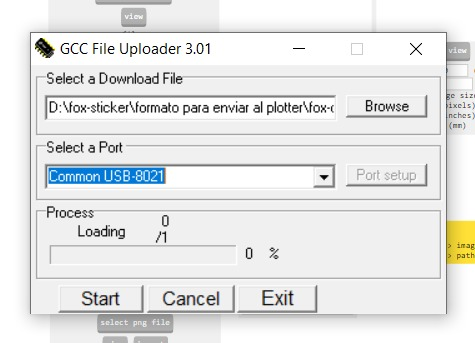
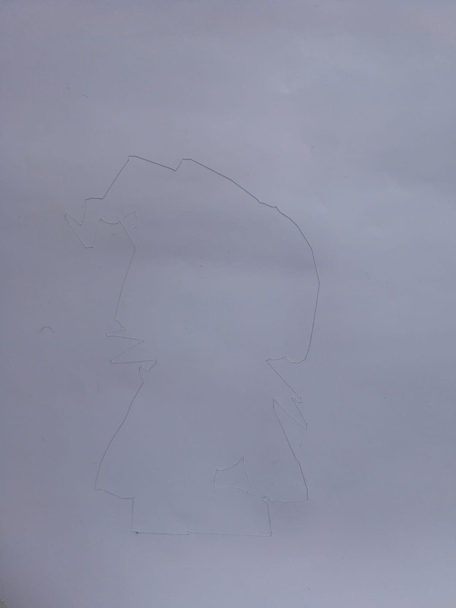

# Corte de vinilo con Plotter

Utilizaremos el siguiente plotter de la marca GCC modelo Puma IVLX .

<figure><figcaption>
Imagen de la máquina que utilizaremos.
</figcaption></figure>

Primero debemos encender la máquina con el interruptor.

<figure><figcaption>
El interruptor está señalado con la flecha amarilla.
</figcaption></figure>


Link URL a Modsproject.


<figure><figcaption>
Vista del inicio de Modsproject.
</figcaption></figure>

<figure><figcaption>
Zoom a las indicaciones.
</figcaption></figure>

Como indica la página hacer click derecho en cualquier lugar de la pantalla para abrir un menú.&#x20;

<figure><figcaption>
Menú después del click derecho.
</figcaption></figure>

En este menú seleccionar **programs**. Luego se espandirá otro menú y debemos buscar el título **GCC** (marca del plotter que utilizamos en la documentación)  y seleccionar **gcc vinyl cut.**

<figure><figcaption>
Seleccionamos <strong>gcc vinyl cut</strong>.
</figcaption></figure>

Ahora tenemos un sistema de nodos programado para utilizar en con una máquina GCC.

<figure><figcaption>
Pantalla de nodos para utilizar con máquinas GCC.
</figcaption></figure>

Ahora nos dirigiremos a los nodos que controlan los outputs. Apagaremos el slice de edit **delete (inferior)**, y prenderemos **edit delete (superior).** Digamos que debemos invertir el orden inicial.

<figure><figcaption>
Edit delete inferior on, debemos cambiarlo a off.
</figcaption></figure>

<figure><figcaption>
<strong>Edit delete superior</strong> on.
</figcaption></figure>

Ahora cambiamos la velocidad y fuerza de corte. Los valores por efault son force (fuerza) 50 y speed (velocidad) 2. Después de unas pruebas determinamos que los ajutes que sí nos funciona con el material vinilo que tenemos es force 70 y speed 20.

<figure><figcaption>
Valores de velocidad y fuerza por default.
</figcaption></figure>

<figure><figcaption>
Valores que funcionan con nuestro material.
</figcaption></figure>

Ahora buscamos la nota de **Start Here** y debemos **select png file** para ingresar los .png que realizamos en Inkscape.

<figure><figcaption>
Captura de pantalla del nodo para ingresar el .png
</figcaption></figure>

<figure><figcaption>
Menú emergente para seleccionar el .png a cortar en el plotter.
</figcaption></figure>

<figure><figcaption>
Vista luego de seleccionar. 
</figcaption></figure>

<figure><figcaption>
Vista del sistema de nodos una vez ingresado el .png 
</figcaption></figure>

Ahora debemos dirigirnos a **Cut Raster** y seleccionar **Calculate.**

<figure><figcaption>
Nodo de Cut Raster.
</figcaption></figure>

Ahora automáticamente se nos abrirá una ventana donde nos mostrará la trayectoria del corte, y también se nos descargará el archivo compatible para enviar al plotter.

<figure><figcaption>
Trayectoria del corte de nuestra figura.
</figcaption></figure>

<figure><figcaption>
Se descargará el archivo automáticamente.
</figcaption></figure>

Después de calcular podemos ver los cálculos que nos faltaban.

<figure><figcaption>
Vista de los nodos después de calcular.
</figcaption></figure>

<figure><figcaption>
Zoom a los cálculos de Offset, Edge Detect, Orient Edges, Vectorize.
</figcaption></figure>

## Ahora debemos abrir el driver de la máquina Uploader.exe

<figure><figcaption>
Vista de la búsqueda de Uploader 
</figcaption></figure>

Una vez que abrimos la aplicación debemos ingresar nuestras configuraciones correspondientes, es decir seleccionar el archivo que creamos en modsproject y seleccionar el port correspondiente.

<figure><figcaption>
Las configuraciones por default del programa.
</figcaption></figure>

<figure><figcaption>
Seleccionamos el archivo .hpgl que cortaremos.
</figcaption></figure>

<figure><figcaption>
Cambiamos el Port a Common USB-8021.
</figcaption></figure>

<figure><figcaption>
Configuración preparada para cortar nuestra figura.
</figcaption></figure>

## Corte con el Plotter de Vinilo

Partes de la máquina a tener en cuenta

La cortadora que en este caso posee hoja filosa, aunque también se lo puede intercambiar por un lápiz, marcador o semejante para dibujar con el plotter.

Las rueditas que sujetarán el material, además serán útil para la medición automática de la máquina.

Son dos como se puede observar en la siguiente imagen.

En la imagen anterior también podemos observar la regla. En la siguiente imagen podemos ver una imagen un poco mas expandida.

La palanca para sujetar el material ingresado.

Y por supuesto la botonera.

A continuación se describen los pasos necesarios para utilizar la plotter de corte de vinilo, desde la preparación del material hasta la configuración de la máquina y el proceso de corte.

<figure><figcaption>
Baúl con vinilos a seleccionar.
</figcaption></figure>

Podemos ingresar tal cual el pedazo de material si se encuentra en buen estado. Si se encuentra arrugado podemos pegarlo con cinta de papel a un objeto que nos sirva de tapete.

<figure><figcaption>
Ejemplo de vinilo ubicado sobre un tapete improvisado (tapa de carpeta cortada) sujetado con cinta de papel.
</figcaption></figure>

<figure><figcaption>
Palanca a levantar para ingresar el vinilo.
</figcaption></figure>

Una vez ingresado el material debemos bajar la palanca nuevamente para sujetarlo.

Por supuesto al ubicar nuestro material debemos tener en cuenta el eje de origen para ubicar la hoja.

<figure><figcaption>
Material ya ubicado en la máquina.
</figcaption></figure>

Ahora debemos medir automáticamente el material, para ello debemos seleccionar el botón&#x20;

<figure><figcaption>
Recién ingresado el material nos salen estas tres opciones en la pantalla.
</figcaption></figure>

Nuestro objetivo es que la máquina mida el material ingresado de manera automática así que seleccionaremos la flecha que indica la derecha, ya que la opción para la medición automática es la opción **Single** que se observa en pantalla.&#x20;

A continuación nuestra máquina medirá la hoja de largo y ancho.

Una vez medido nuestro objetivo es ubicar el origen del eje en nuestro papel, para moverlo utilizamos las flechas y una vez que terminamos pulsamos enter.

<figure><figcaption>
La pantalla indica un nuevo origen en las coordenadas indicadas.
</figcaption></figure>

Ahora que terminamos de ubicar las coordenadas del origen para comenzar a cortar debemos dar la orden el el driver desde nuestra laptop o PC.

<figure><figcaption>
Vista del driver en la pantalla.
</figcaption></figure>

Para ejecutar la orden seleccionamos Start y el proceso comenzará.

<figure><figcaption>
Seleccionar Start en el driver.
</figcaption></figure>

De esta manera es el proceso para utilizar el plotter de corte.

<figure><figcaption>
Vinilo Cortado con la forma que creamos.
</figcaption></figure>

## Juntar los cortes en una sola figura

Primero debemos tener todas nuestras piezas cortadas.

<figure><figcaption>
Capa negra.
</figcaption></figure>

 

<figure><figcaption>
Capa blanca.
</figcaption></figure>

<figure><figcaption>
Pieza amarilla.
</figcaption></figure>

 

<figure><figcaption>
Vista de las piezas juntas.
</figcaption></figure>

Ahora procedemos a ubicar las capas en orden para obtener la figura final.

<figure><figcaption>
Capa amarilla sobre la capa anterior.
</figcaption></figure>

 

<figure><figcaption>
Primera capa color blanco.
</figcaption></figure>

Siguiendo el proceso obtenemos un sticker de vinilo.

Nuestro primer intento quedó de la siguiente manera.

<figure><figcaption>
Resultado del proceso.
</figcaption></figure>

 

<figure><figcaption></figcaption></figure>

Creo que puede mejorar y me gustaría realizar otro intento.
