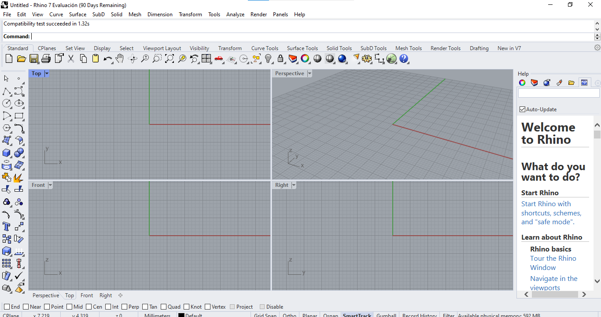
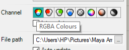
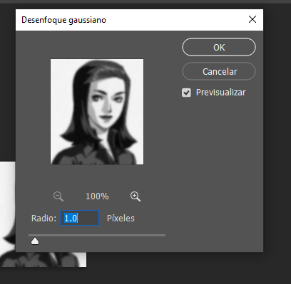
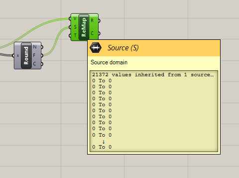

# Crear un diseño con Grasshopper

Grasshopper es un plugin de Rhino, como descargamos la versión completa no será necesario descargar el plugin aparte, en caso de serlo se debe dirigir al siguiente enlace:


Enlace a Food4Rhino.



En Food4Rhino puede encontrar plugins y materiales para Rhino.


Una vez descargado de ser necesario podemos comenzar con el tema que nos compete, primero abrimos el programa Rhino 7, y seleccionamos ¨Tools¨ en el cual encontraremos en las opciones ¨Grasshopper¨.

<figure><figcaption>
Inicio de la interfaz de Rhino 7.
</figcaption></figure>

En el menú seleccionamos Grasshopper, a continuación se ejecutará el plugin en otra pestaña a la par de la interfaz de Rhino.

<figure><figcaption>
Pestaña de Tools
</figcaption></figure>

<figure><figcaption>
Inicio de Grasshopper.
</figcaption></figure>

<figure><figcaption>
La primera vez que se inicie Grasshopper se nos proporcionará indicaciones iniciales y tutoriales.
</figcaption></figure>

Crear un nuevo documento en Grasshopper para iniciar.

<figure><figcaption>
Interfaz inicial de Grasshopper.
</figcaption></figure>

Para crear nuestra imagen paramétrica nuestro nodo clave será el **Image Sampler**.

Podemos encontrarlo en el menú de **Paramans** y luego en **Util**.

Cómo ingresar un nodo en la mesa de trabajo en Grasshopper.

Contamos con dos opciones, la primera es seleccionar desde el menú.&#x20;

Y la segunda es hacer doble click izquierdo para abrir un buscador directamente.

<figure><figcaption>
Ubicación de Image Sampler en el menú.
</figcaption></figure>

Necesitaremos cargar una imagen al nodo.

<figure><figcaption>
Nodo sin archivo de Imagen.
</figcaption></figure>

Al hacer doble click en Image Sampler se observa esta pestaña emergente.

En los parametrosde X e Y domain ingresamos las dimensiones de nuestra imagen, de 0 a 230px por ejemplo.

En channel podemos seleccionar de que información extraeremos de la imagen para utilizar, con solo el rojo, verde, azul, alpha, hue, blanco y negro.Para seleccionar una imagen debemos abrir File path y así seleccionamos desde nuestra galería. Podemos tachar Auto Update y Save in file.

<figure><figcaption>
Pantalla emergente.
</figcaption></figure>

<figure><figcaption>
Seleccionar imagen a utilizar en File path.
</figcaption></figure>

<figure><figcaption>
Seleccionar una imagen desde la galería y abrir.
</figcaption></figure>

Supongo que no es la imagen ideal pero vamos a probar mientras tanto con la siguiente imagen .JPG.

<figure><figcaption>
Image Sampler con la imagen ya seleccionada.
</figcaption></figure>

La configuración a utilizar serán las siguientes.

<figure><figcaption>
Menú de completo Image Sampler.
</figcaption></figure>

<figure><figcaption>
Channel de RBGA Colours.
</figcaption></figure>

<figure><figcaption>
Dimensiones de X e Y Domain.
</figcaption></figure>

Ingresaremos un nodo de Square, se trata de ingresar un cuadro 2D con celdas.

<figure><figcaption></figcaption></figure>

También un Number Slider para ingresar un valor numérico conectándolo a otro nodo.

<figure><figcaption>
Vista de un Number Slider con un valor 0.250, el cual es el valor por default.
</figcaption></figure>


Podemos hacer doble click para abrir el buscador y simplemente escribir el valor numérico a utilizar para crear un Number Slider con el valor que queremos más rápido.



Conectaremos los valores numéricos de los Number Slider a Ex (extender en el eje x) y a Ey (extender en el eje y).

Conectamos estos valores numéricos al Cuadro 2D para determinar las dimensiones de la grilla 2D.

<figure><figcaption>
Nodos de valores numéricos conectados al nodo de la grilla 2D.
</figcaption></figure>


Si el nodo se ve en rojo y con una advertencia en la zona superior será necesario cambiar algún valor que sea incompatible para poder procesar nuestro trabajo luego.


<figure><figcaption>
Nuevos valores en cada Number Slider.
</figcaption></figure>

<figure><figcaption>
Relación de los números en Image Sampler con los nuevos Number Slider.
</figcaption></figure>

Nos dirigimos al nodo de la grilla 2D y en la salida ¨P¨ de points, hacemos click derecho y seleccionamos Flatten.

<figure><figcaption>
Ícono de Flatten en el menú.
</figcaption></figure>

Nuestra Grilla 2D se ve de la siguiente manera mientras tanto.

<figure><figcaption>
Grilla 2D en el viewport de Rhino.
</figcaption></figure>

Teniendo en cuenta que el resultado saldrá mejor si la imagen es blanco y negro, decidí editar la imagen en Photoshop.

<figure><figcaption>
Edición en Photoshop.
</figcaption></figure>

También decidí desenfocar levemente la imagen. Seleccioné Desenfoque Gaussiano.

<figure><figcaption>
Filtros de desenfoque en Photoshop.
</figcaption></figure>

<figure><figcaption>
Desenfoque Gaussiano de 1.0 píxeles.
</figcaption></figure>

Al momento de exportar la imagen para guardarlo, cambié las dimensiones em X e Y, y lo guardé como .png

<figure><figcaption>
Vista de <strong>Exportar como.</strong>
</figcaption></figure>

La imagen final a utilizar será la siguiente.

<figure><figcaption>
Imagen editada.
</figcaption></figure>

Reemplacé la imagen y los valores en X e Y.

<figure><figcaption>
Imagen reemplazada en Image Sampler.
</figcaption></figure>

<figure><figcaption>
Nuevos valores para extender en X e Y en la grilla cuadrada 2D.
</figcaption></figure>

Los puntos de la grilla 2D a un nodo de círculo y a nodo de Image Sampler.

<figure><figcaption>
Nodos de círculo y la Image Sampler.
</figcaption></figure>

Al conectar los puntos de la grilla al nodo de círculo y el Image Sampler se ve de la siguiente manera en el viewport.

<figure><figcaption>
Vista en el viewport.
</figcaption></figure>

Conectamos un panel al image sampler y se nos presentaran los puntos y sus coordenadas.

<figure><figcaption>
Nodo de panel.
</figcaption></figure>

Insertamos un nodo de ReMap Numbers al grupo para cambiar los valores de los dominios de la dimensión.

<figure><figcaption>
Descripción de ReMap Numbers.
</figcaption></figure>

También un no matemático "Round" para redondear el valor.

<figure><figcaption>
Nodo matemático para redondear.
</figcaption></figure>

Conectamos los nodos de Round y ReMap al panel, que a su vez el panel al Image Sampler.

<figure><figcaption>
Conectar los nodos de Round y ReMap. 
</figcaption></figure>

Los nodos de entrada y salida son los siguientes:

La salida F de Floor en el Round es conectado al Source de ReMap.

<figure><figcaption>
Salida de Floor en Round.
</figcaption></figure>

<figure><figcaption>
Entrada Source en ReMap.
</figcaption></figure>

Value en ReMap se conecta al panel.

<figure><figcaption>
Salida de value conectado en el panel.
</figcaption></figure>

Añadimos un nodo de Construct Mesh para crear malla de superficie a partir de vértices.

<figure><figcaption>
Nodo de Construct Mesh.
</figcaption></figure>

Debemos añadir un nodo Domain/Dominio y dos slider number\`s.

<figure><figcaption>
Nodo Domain.
</figcaption></figure>

<figure><figcaption>
Number sliders para A y B en el nodo de dominio.
</figcaption></figure>

<figure><figcaption>
Number sliders.
</figcaption></figure>

Conectamos el nodo de Dominio entre los valores A y B al nodo ReMap en la entrada de Target.

<figure><figcaption>
Target Domain de 1 valor heredado entre de los valores de 0.2 y 0.5.
</figcaption></figure>

Ahora volvemos a utilizar el nodo de círculo a ReMap, debemos conectar la salida de Remapped number de ReMap a la entrada de Radio al nodo de círculo.

<figure><figcaption>
Vista general de nuestros nodos hasta este paso, acercamos el nodo de círculo a nuestro nodo de ReMap.
</figcaption></figure>

<figure><figcaption>
Salida ¨R¨ Remapped number.
</figcaption></figure>

<figure><figcaption>
Salida ¨R¨ de radius (radio) del nodo círculo.
</figcaption></figure>

Vista en el viewport de los círculos en la grilla después del ReMap.

<figure><figcaption>
Vista de los círculos de forma que los bordes coincidan controlando los valores A y B en el Number Slider.
</figcaption></figure>

<figure><figcaption>
Al sustituir los valores A y B, se modifica el tamaño de los círculos en la grilla.  
</figcaption></figure>


Me di cuenta de un error en el uso de los nodos más tarde, por lo que tuve que cambiar el nodo 'round' por el nodo 'bound'.


<figure><figcaption>
Reemplazar Round por Bound.
</figcaption></figure>

El nodo Bound crea un dominio numérico que abarque una lista de números.

<figure><figcaption>
Vista de la descripción del nodo Bound.
</figcaption></figure>

La salida I del nodo bounds se conectará a la entrada source de ReMap. La salida **I** indica un dominio numérico entre el número más bajo y el número más alto en **N.**

<figure><figcaption>
Vista de la descripción de la salida I del nodo Bound.
</figcaption></figure>

Añadimos un nodo de panel. Debido a este nodo se evidencia el error del nodo Round y Bound.

<figure><figcaption>
Nodo de panel.
</figcaption></figure>

<figure><figcaption>
ReMap con error.
</figcaption></figure>

<figure><figcaption>
El error se ve en el panel con el valor nulo.
</figcaption></figure>

Una vez reemplazado el nodo Round por el de Bound el panel ya no presenta error.

Duplicaremos el grupo que se encuentra resaltado en verde.

<figure><figcaption>
Grupo de nodos duplicados.
</figcaption></figure>

Añadimos un nodo de división y un solo number slider.

<figure><figcaption>
Nodo de división matemática con dos entradas A y B y una salida para el resultado.
</figcaption></figure>

<figure><figcaption>
Number Slider con el valor de 1.
</figcaption></figure>

El valor 1 se ingresará en la entrada de división A y la salida Remapped Number del nodo de ReMap se ingresará en la entrada B del nodo de división.

<figure><figcaption>
División entre 1 y el Remapped Number.
</figcaption></figure>

El Remapped number 1 será conectado igualmente en el nodo Bound del nuevo grupo que se había duplicado.

<figure><figcaption>
Salida Remapped Number del nodo ReMap en la entrada de número más alto del nodo Bound.
</figcaption></figure>

La División resultante se ingresará en la entrada Value en la entrada de ReMap del nuevo grupo duplicado.

<figure><figcaption>
Nodos mencionados conectados al segundo ReMap.
</figcaption></figure>

El número resultante de ReMap lo conectamos el radio del nodo de círculo duplicado y también conectamos un panel.

<figure><figcaption>
El número resultante de ReMap lo conectamos el radio del nodo de círculo duplicado.
</figcaption></figure>

La entrada de plane se conecta en la salida de point de la grilla 2D.

<figure><figcaption>
La entrada plane de círculo se conecta a la salida point de la grilla 2D.
</figcaption></figure>

Conectamos el panel entre la salida de Remapped Number y el Radio del círculo.&#x20;

<figure><figcaption>
Colocar el panel entre la conexión ya existente entre Remapped Number y Radio del Círculo.
</figcaption></figure>

Vista de lo realizado hasta este nodo desde el viewport.

<figure><figcaption>
Vista desde el viewport.
</figcaption></figure>

<figure><figcaption>
Vista más cercana al rostro.
</figcaption></figure>

<figure><figcaption>
Zoom a los círculos de la grilla.
</figcaption></figure>

<figure><figcaption>
Segunda vista del zoom del viewport.
</figcaption></figure>

<figure><figcaption>
Vista del zoom cercano y lejano.
</figcaption></figure>

La función principal de este tutorial es generar una extrusión a partir de la imagen creada a partir de los círculos, para generar una imagen tridimensional.

Para generar la extrusión buscamos e insertamos el nodo de Extrude.

<figure><figcaption>
Nodo de extrude.
</figcaption></figure>

Para extruir en dirección vertical necesitamos indicar el eje Z, para ello buscamos el nodo Unit Z.

<figure><figcaption>
Vista del nodo Unit Z.
</figcaption></figure>

Conectar de la siguiente manera.

El resultado de círculo se conecta con la entrada Base del nodo Extrude.

La salida Unit Vector de Unit Z se conecta a la entrada Direction del nodo Extrude.

<figure><figcaption>
Conexiones de los nodos Unit Z y Circle al nodo Extrude.
</figcaption></figure>

Resultado de la extrusión.

<figure><figcaption>
Vista de cerca de la imagen con dimensiones en 3D del dibujo.
</figcaption></figure>

Para aumentar el tamaño de los cilindros seguimos los siguientes pasos.

Agregar un nodo de multiplicación.&#x20;

<figure><figcaption>
Nodo matemático de multiplicación.
</figcaption></figure>

Conectamos la salida del panel que contiene la información del nodo Remapped Number en A, y un Number Slider en B. A su vez el resultado de la multiplicación se conectará a la entrada de factor del nodo de Unit Z, y la salida de Unit Z a su vez a Dirección del nodo Extrude.

<figure><figcaption>
Vista de los nodos descritos y el number slider con un valor que modifica la altura de los cilindros.
</figcaption></figure>

<figure><figcaption>
Vista de la conexión del resultado de la multiplicación al eje Z y éste a la dirección a extruir.
</figcaption></figure>

<figure><figcaption>
Vista lejana con las nuevas modificaciones.
</figcaption></figure>

<figure><figcaption>
Zoom a los cilindros extruidos.
</figcaption></figure>

Para tapar los cilindros añadimos el nodo Cap.

<figure><figcaption>
Nodo Cap Holes.
</figcaption></figure>

<figure><figcaption>
Vista de los cilindros tapados.\
</figcaption></figure>

Para finalizar el modelo y luego procesarlo debemos hacer click derecho y seleccionar Bake.

<figure><figcaption>
Seleccionar Bake.
</figcaption></figure>

Configurar el nombre, seleccionar para renderizar en un solo grupo.

<figure><figcaption>
Configuraciones de Bake.
</figcaption></figure>

<figure><figcaption>
Nombre Seleccionado.
</figcaption></figure>

Ahora debemos esperar a que finalice el bake.

<figure><figcaption>
Vista de creación de mallas.
</figcaption></figure>

Debido al error de cálculos en el nodo la creación de mallas no se pudo realizar.


Posible solución convertir el Circle Curve a Polilíneas.


<figure><figcaption>
Error de creación de malla.
</figcaption></figure>

<figure><figcaption>
Vista del relieve.
</figcaption></figure>

<figure><figcaption>
Vista del relieve.
</figcaption></figure>

<figure><figcaption>
Vista del relieve.
</figcaption></figure>

<figure><figcaption>
Vista dek Relieve.
</figcaption></figure>
