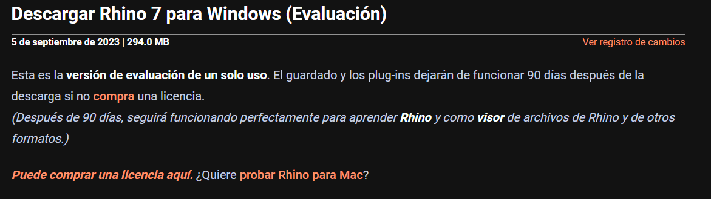

# Instalar Rhinoceros 3D de prueba

&#x20;Para empezar debemos ir a la página oficial de Rhinoceros para descargar el programa en su última versión disponible.

<figure><figcaption>
Búsqueda en Google de Rhinoceros.
</figcaption></figure>

 

<figure><figcaption>
Seleccionar la página oficial del software.
</figcaption></figure>


Enlace a la página oficial de Rhinoceros.


Una vez que nos encontramos en el inicio de la página oficial de Rhinoceros nos dirigimos a la pestaña de descargar.

<figure><figcaption>
inicio de la página oficial.
</figcaption></figure>

<figure><figcaption>
Pestaña en el menú para descargar.
</figcaption></figure>

La pestaña los dirigirá a la siguiente selección para descargar según el sistema operativo, es decir Windows o Mac OS.&#x20;

Nos fijaremos en los enlaces para Windows.

<figure><figcaption>
Opciones de descarga.
</figcaption></figure>

Para continuar la descarga es necesario crear una cuenta de Rhino o iniciar sesión.

<figure><figcaption>
 Pestaña para ventana emergente de inicio de sesión o crear usuario.
</figcaption></figure>

<figure><figcaption>
Pestaña emergente.
</figcaption></figure>

<figure><figcaption>
Seleccionar ¨Crear una nueva cuenta¨
</figcaption></figure>

<figure><figcaption>
Se puede crear una cuenta ingresando los datos manualmente o continuar con la cuenta de Google que se encuentra abierta.
</figcaption></figure>

En mi caso descargaré la primera opción ¨Rhino 7 para Windows (Evaluación de un solo uso)¨ para poder acceder a la versión de prueba de 90 días.

Si desea comprar la licencia directamente puede descargar la  segunda opción ¨Rhino 7 para Windows¨


La empresa se llama ¨**Rhinoceros**¨, el nombre del software es ¨**Rhino**¨.


<figure><figcaption>
Zoom para la primera opción de los enlaces.
</figcaption></figure>

<figure><figcaption>
Al ingresar al enlace nos explica un poco más sobre la versión de prueba.
</figcaption></figure>


Requisitos del Sistema de compatibilidad de Rhino 7

#### Hardware

* Procesador AMD o Intel de 64 bits (no en ARM)
* Se recomienda 8 GB de memoria (RAM) o más.
* 600 MB de espacio en disco duro.
* Se recomiendan las tarjetas de vídeo compatibles con OpenGL 4.1.
* Se recomienda 4 GB o más de RAM de vídeo.
* Se recomiendan ratones con varios botones y una rueda de desplazamiento.
* [SpaceNavigator](http://www.3dconnexion.com/) es opcional
* Equipos de Apple Intel con Boot Camp. _(Boot Camp no es compatible en Macs M1 con Apple Silicon.)_

#### Sistemas operativos con Windows

* Windows 11, 10 u 8.1.
* Windows VDI (Virtual Desktop Infrastructure)

#### Conexión a Internet para

* Descargas.
* Validación de licencia.
* Cuenta de Rhino para:
  * Soporte técnico en [el foro](https://discourse.mcneel.com/c/rhino/rhino-for-windows/1).
  * Administración de licencias con Cloud Zoo.



Rhino 7 no es compatible con:

* Windows 8 y versiones anteriores
* Inicio de sesión directo en Windows Server
* Boot Camp en Macs M1 con Apple Silicon
* Sistemas de virtualización como VMWare, Remote Desktop y Parallels
* Linux
* Procesadores ARM, incluido Microsoft SQ® 1 y 2
* Chromebooks


En la parte inferior del enlace nos encontramos con otro enlace de los requisitos de compatibilidad e incompatibilidad que se encuentra en esta documentación igualmente.&#x20;

Una vez determinado que el programa es compatible con nuestra notebook o PC aceptamos la política de privacidad marcando la casilla.

<figure><figcaption>
Zona inferior de la página.
</figcaption></figure>

<figure><figcaption>
Seleccionar la casilla para aceptar la Política de privacidad.
</figcaption></figure>

Al aceptar la política de privacidad automáticamente se genera un código de licencia de Rhino 7 de duración de 90 días, el cual debes copiar para pegarlo más tarde una vez instalado el programa, puedes utilizar Notas para pegarlo hasta entonces.

<figure><figcaption>
Al aceptar la política de privacidad automáticamente se genera un código para la licencia para la prueba de 90 días.
</figcaption></figure>

El programa puede ser descargado en Español o se puede cambiar por las siguientes opciones disponibles en ¨Seleccione otro idioma¨.

<figure><figcaption>
Opciones de idiomas disponibles.
</figcaption></figure>

Una vez seleccionado el idioma de nuestra preferencia podemos seleccionar la casilla roja para finalmente descargar el programa.

<figure><figcaption>
Seleccionar la pestaña roja para descargar el instalador.
</figcaption></figure>

Seleccionar dónde queremos descargar el instalador de Rhino 7 en el equipo y **Guardar**.

<figure><figcaption>
Seleccionar la ubicación del archivo y guardar.
</figcaption></figure>

Luego de **guardar** se iniciará la descarga.

<figure><figcaption></figcaption></figure>

Una vez finalizada la descarga encontraremos el enlace directo en el inicio de pantalla al programa.

<figure><figcaption>
Enlace en pantalla al programa.
</figcaption></figure>

<figure><figcaption>
Debido al error de coincidencia de los datos proporcionados Rhino no pudo conectar.
</figcaption></figure>

 

<figure><figcaption>
Indicación de que necesitaba terminar mi configuración de la creación de la cuenta en el navegador, la pestaña se encontraba abierta para ingresar a la cuenta de Rhino.
</figcaption></figure>

<figure><figcaption>
Vinculación del código de la licencia a la cuenta de Rhino creada.
</figcaption></figure>

<figure><figcaption>
Confirmación de la cuenta en Gmail.
</figcaption></figure>

<figure><figcaption>
Confirmación de la cuenta en Gmail.
</figcaption></figure>

<figure><figcaption>
Una vez seleccionado el enlace enviado en Gmail y de haberse solucionado correctamente,  podemos cerrar las pestañas y volver al acceso directo en el inicio de la pantalla.
</figcaption></figure>

***

Ahora que pudimos ingresar el código de licencia y la cuenta vinculada a éste, contamos con las opciones de poder utilizar la licencia en más de una computadora o anclar la licencia a un solo dispositivo.

<figure><figcaption>
Ventana de opciones de utilización de la licencia en una o más computadoras.
</figcaption></figure>

<mark style="color:purple;">**¡Finalmente podemos abrir el programa!**</mark>

La verificación de la licencia fue un proceso largo debido a la adversidad presentada pero se ha logrado el objetivo.

<figure><figcaption>
Interfaz de Rhino 7.
</figcaption></figure>
