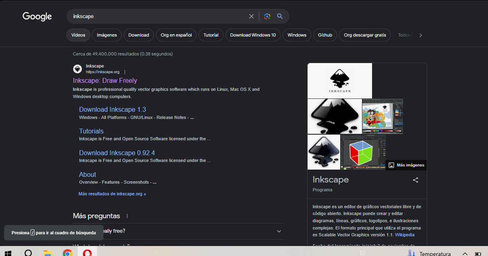
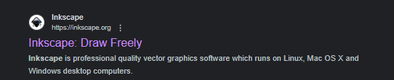
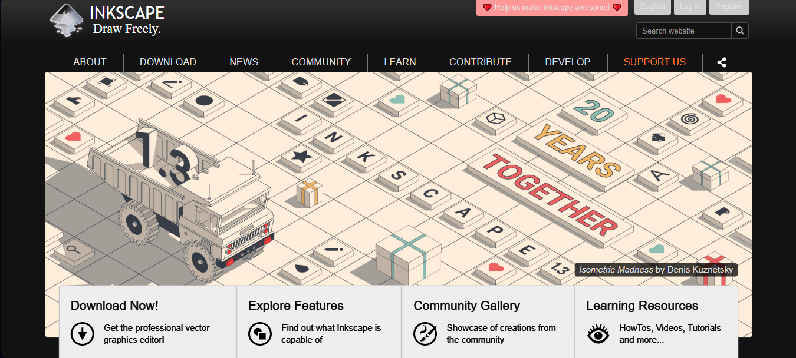
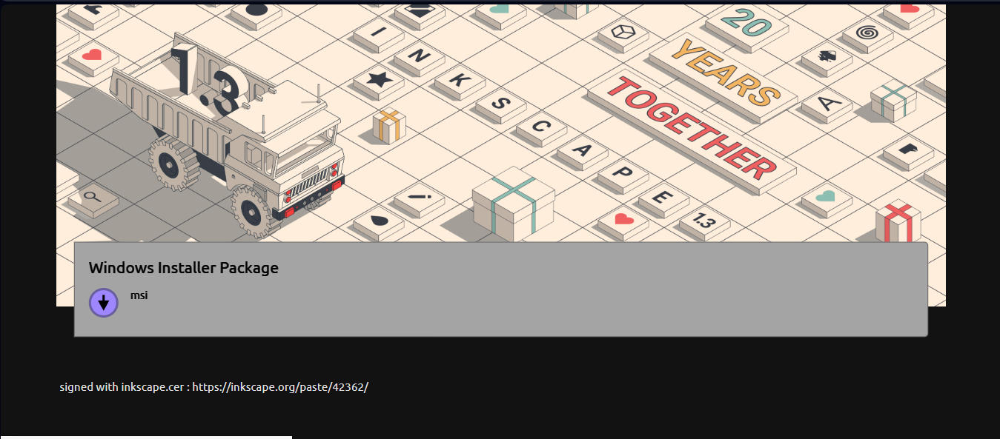
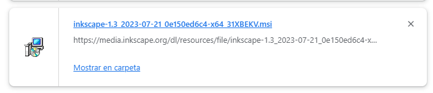
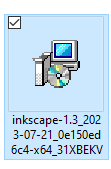
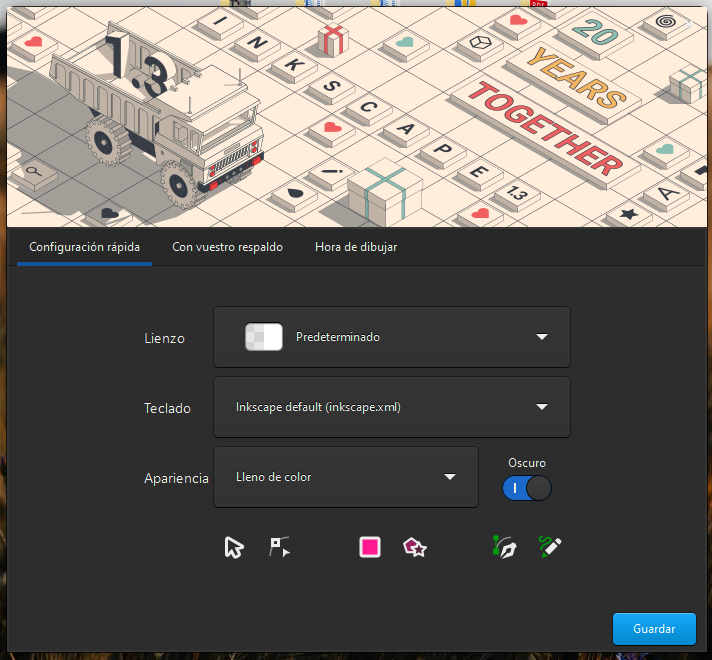
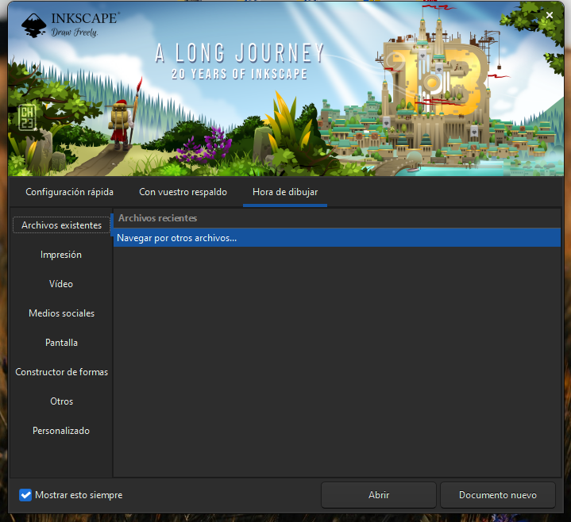
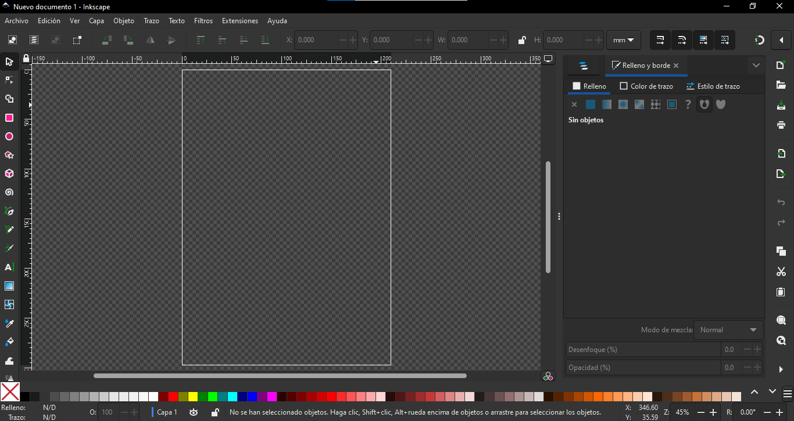

# Instalar software de vectorizado (Inkscape)


Al ser un programa sin costo y por ende sin necesidad de licencia, el proceso de instalación es por mucho más simple a comparación de Rhino.


<figure><figcaption></figcaption></figure>


Enlace a la página oficial de Inkscape.


<figure><figcaption>
Búsqueda de Inkscape en Google.
</figcaption></figure>

 

<figure><figcaption>
Enlace a la página oficial en el buscador.
</figcaption></figure>

En la página oficial de Inkscape podemos acceder al enlace de descarga del instalador del programa.

<figure><figcaption>
Inicio de la página oficial de Inkscape.
</figcaption></figure>

<figure><figcaption>
Seleccionar el enlace para descargar el programa.
</figcaption></figure>

Una vez descargado el programa abrimos Mostar en carpeta que nos llevará al archivo en el equipo, seleccionamos y lo abrimos para que inicie la instalación.

<figure><figcaption>
Vista de la descarga finalizada en el navegador.
</figcaption></figure>

 

<figure><figcaption>
Vista del instalador del programa en el equipo.
</figcaption></figure>

Al finalizar la instalación podemos abrir el programa. Al iniciar por primera vez podemos configurar algunas opciones estéticas de la interfaz.

<figure><figcaption>
Configuración inicial de las preferencias en el interfaz.
</figcaption></figure>

 

<figure><figcaption>
Slash screen de Inkscape.
</figcaption></figure>

Ahora terminamos la instalación y configuración de Inkscape y podemos utilizar el programa.

<figure><figcaption>
Vista de la interface de Inkscape.
</figcaption></figure>

&#x20;Ahora estamos listos para avanzar a la siguiente sección.
