# Prueba de Soportes




[black-frost](../impresion-3d/black-frost/)


<figure>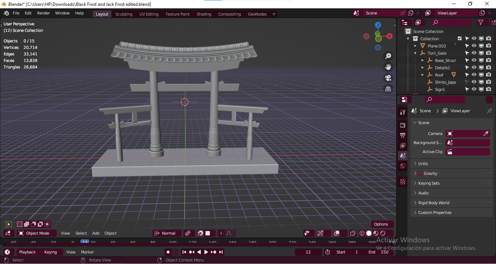<figcaption></figcaption></figure>

<figure><figcaption></figcaption></figure>

<figure><figcaption></figcaption></figure>

 

<figure><figcaption></figcaption></figure>

<figure>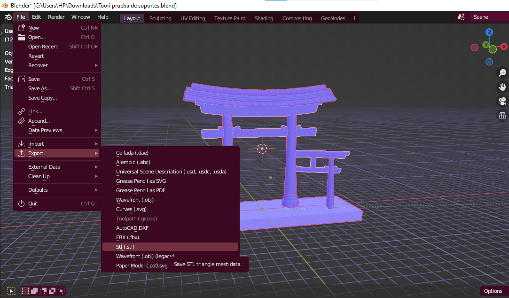<figcaption></figcaption></figure>





## Meshmixer

<figure><figcaption></figcaption></figure>

<figure>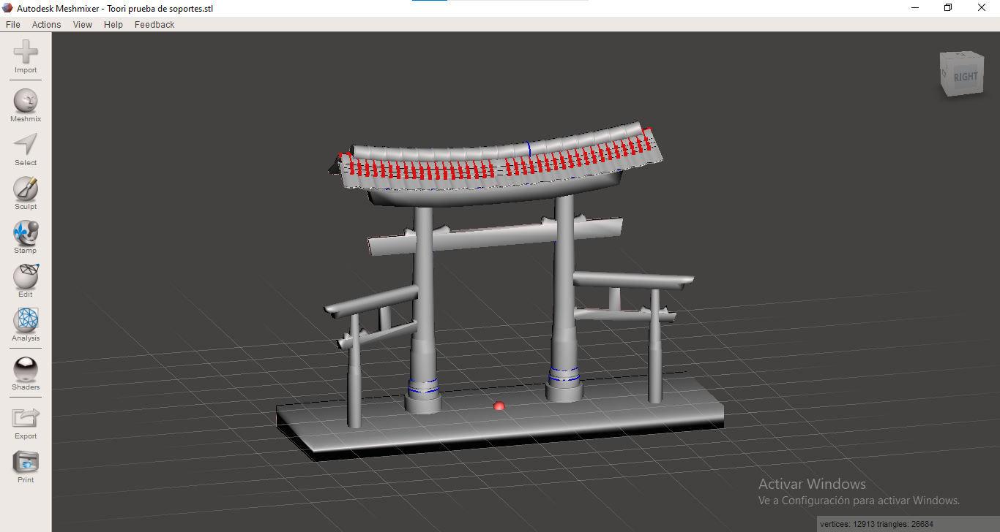<figcaption></figcaption></figure>

<figure>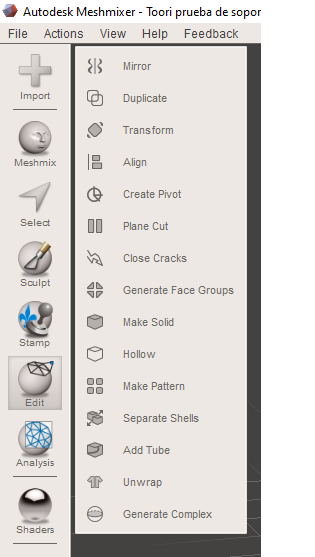<figcaption></figcaption></figure>

<figure>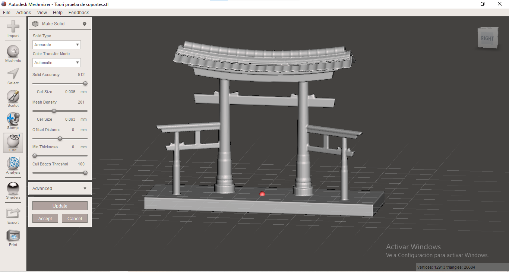<figcaption></figcaption></figure>

<figure><figcaption></figcaption></figure>

<figure>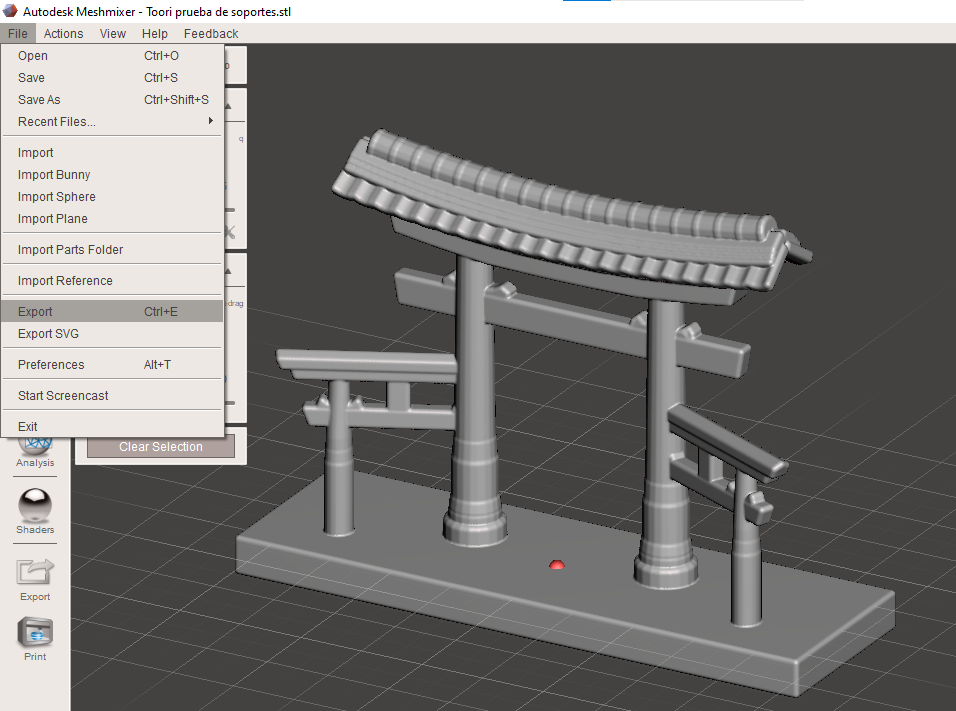<figcaption></figcaption></figure>

 

<figure><figcaption></figcaption></figure>



## FlashPrint

<figure><figcaption></figcaption></figure>

<figure><figcaption></figcaption></figure>

<figure><figcaption></figcaption></figure>

<figure>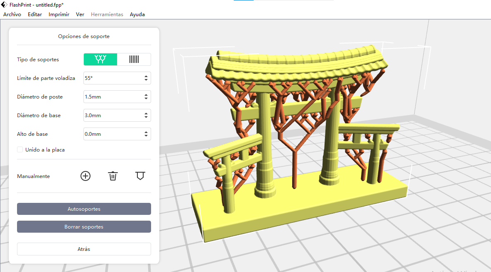<figcaption></figcaption></figure>

<figure><figcaption></figcaption></figure>

<figure>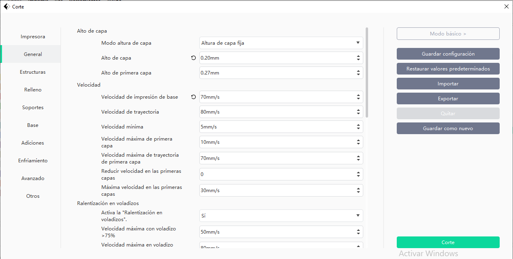<figcaption></figcaption></figure>

<figure>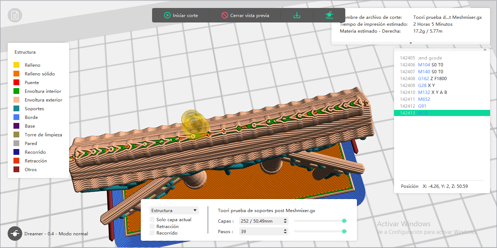<figcaption>
alto de última capa 0.30mm.
</figcaption></figure>

<figure>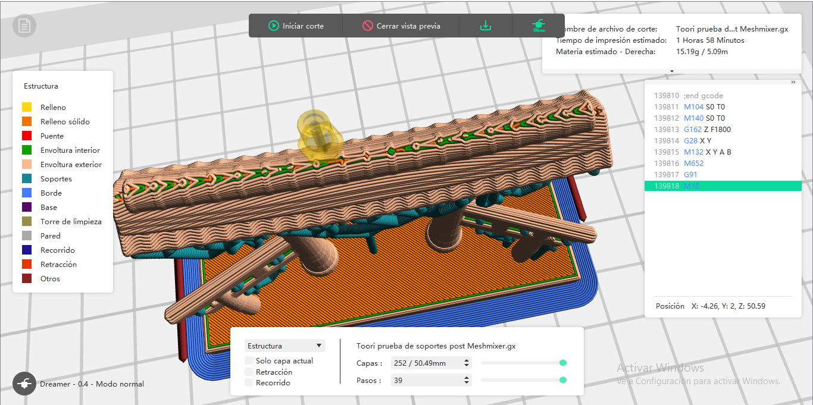<figcaption>
alto de última capa 0.10mm.
</figcaption></figure>

<figure><figcaption>
altura de capa 0.10mm.
</figcaption></figure>

<figure><figcaption></figcaption></figure>

<figure><figcaption></figcaption></figure>



<figure><figcaption></figcaption></figure>

<figure>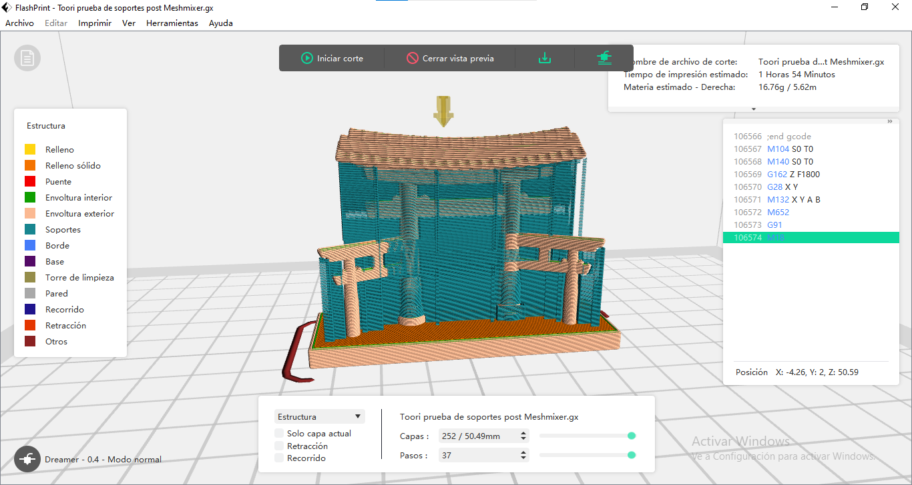<figcaption></figcaption></figure>



