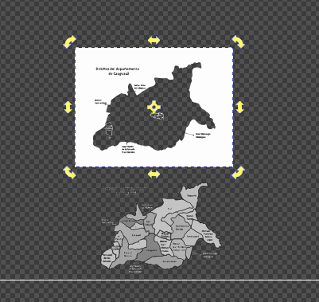
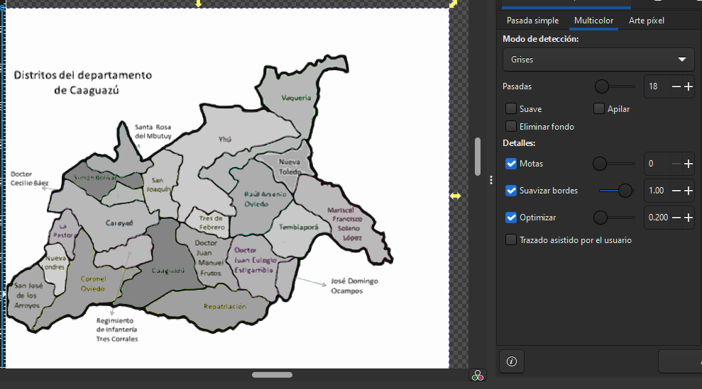
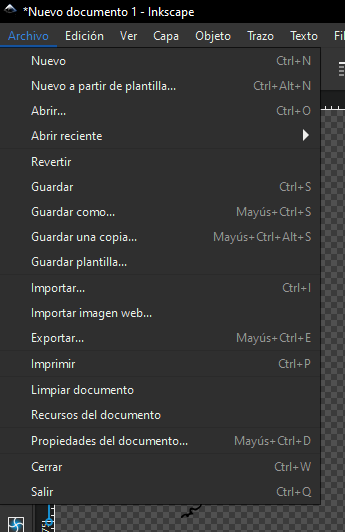
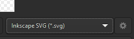
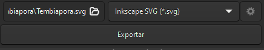

# Mapas en referencia de Tembiaporã.

<figure><figcaption></figcaption></figure>

 

<figure><figcaption></figcaption></figure>

## <mark style="color:purple;">Inkscape</mark>

A3 horizontal

<figure><figcaption></figcaption></figure>

<figure><figcaption></figcaption></figure>

<figure><figcaption></figcaption></figure>

<figure><figcaption></figcaption></figure>

<figure><figcaption></figcaption></figure>

Repetir con el mapa de Caaguazú

<figure><figcaption></figcaption></figure>

<figure><figcaption></figcaption></figure>

<figure><figcaption></figcaption></figure>

<figure><figcaption></figcaption></figure>

<figure><figcaption></figcaption></figure>

<figure><figcaption></figcaption></figure>

<figure><figcaption></figcaption></figure>

<figure><figcaption>
La idea es que coincida de esta manera 
</figcaption></figure>

<figure><figcaption></figcaption></figure>

<figure><figcaption></figcaption></figure>

<figure><figcaption></figcaption></figure>

<figure><figcaption></figcaption></figure>

<figure><figcaption></figcaption></figure>

<figure><figcaption></figcaption></figure>

<figure><figcaption></figcaption></figure>





<figure><figcaption></figcaption></figure>

<figure><figcaption></figcaption></figure>



