# Procesado del terreno de vista satelital de Tembiaporã.

Para llevar a cabo el fresado en nuestro proyecto, utilizaremos la herramienta Terrain2stl. Esta página desempeñará un papel fundamental al convertir datos de terreno desde imágenes de vista satelital en archivos STL, permitiéndonos así crear representaciones tridimensionales precisas del relieve.


Página de Terrain2STL,


Esta herramienta ya fue utilizada en proyectos anteriores, en la siguiente documentación de este Gitbook se describe su uso y los resultados.


[obtencion-de-modelo-3d-topografico](../cnc/obtencion-de-modelo-3d-topografico/)


<figure><figcaption>
Vista del terreno en la interface de Terrain2STL.
</figcaption></figure>


Archico descargable del modelo generado por Terrain2STL.


Había supuesto un buen resultado del modelo 3D generado por Terrain2STL de ser impreso en 3D por lo que lo llevé a Meshmixer para prepararlo para la impresión.

### <mark style="color:purple;">Meshmixer</mark>

<figure><figcaption>
Vista del modelo de Terrain2STL en Meshmixer.
</figcaption></figure>

<figure>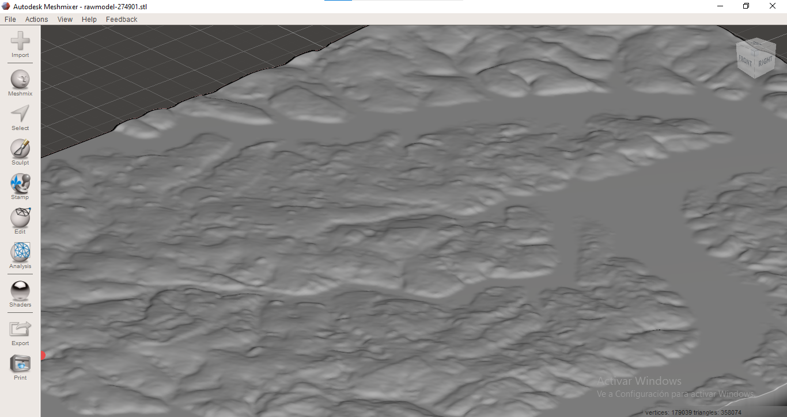<figcaption>
Zoom de las relieves generadas por Terrain2STL.
</figcaption></figure>

Como es mi proceso general en Meshmixer, empleo la herramienta Make Solid que se encuentra en la ventana de Edit.

<figure><figcaption>
Vista de Make Solid en la interface.
</figcaption></figure>

Para obtener resultados óptimos en Meshmixer, se recomienda configurar los parámetros de '**Solid Type**' en '**Accurate**' y '**Solid Accuracy**' al **máximo**. Esta configuración es suficiente para asegurar una preparación adecuada del modelo.

<figure>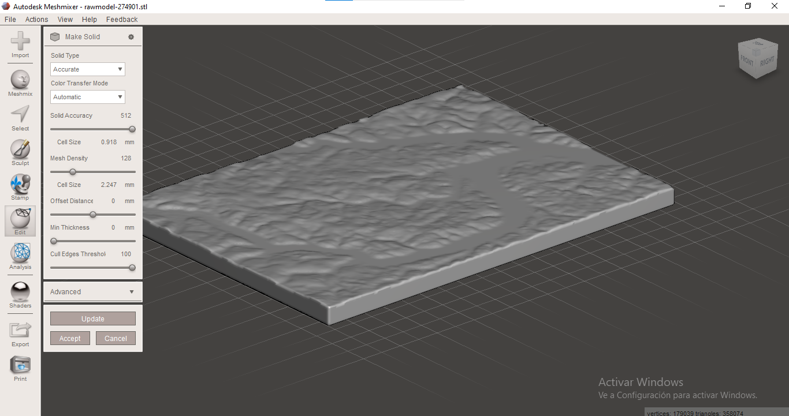<figcaption></figcaption></figure>

 

<figure>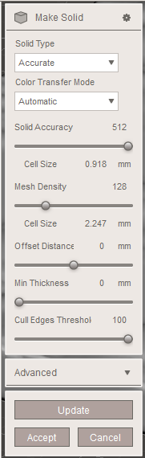<figcaption>
Parámetros utilizados.
</figcaption></figure>

Seleccionar Accept al encontrarse conforme con el resultado y obtener el modelo modificado con Make Solid.

<figure>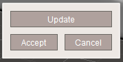<figcaption></figcaption></figure>

Una vez obtenido el modelo eliminamos el archivo original y sólo mantenemos el modificado.

<figure>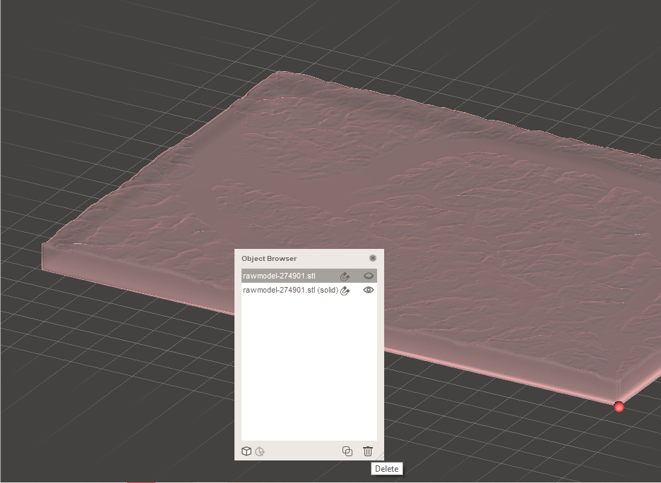<figcaption></figcaption></figure>

 

<figure>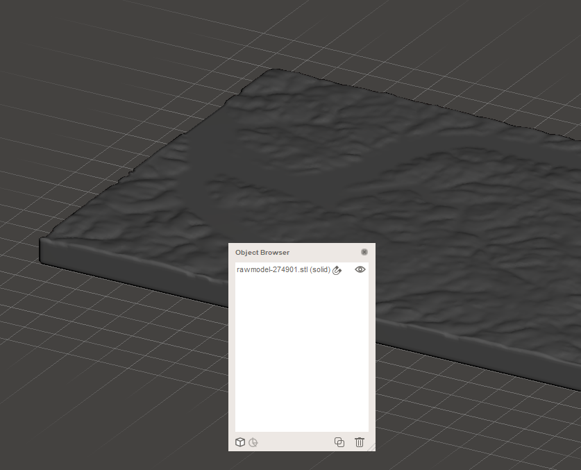<figcaption></figcaption></figure>

Una vez completamente editado exportamos en formato .stl para posteriormente procesarlo en Flashprint y Finalmente imprimirlo.

<figure>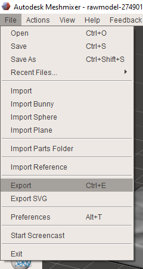<figcaption></figcaption></figure>

 

<figure><figcaption></figcaption></figure>


Archivo descargable del proceso en Meshmixer.


### <mark style="color:purple;">Flashprint</mark>&#x20;

A continuación se detallará el proceso realizado en Flashprint

Importa el archivo en Flashprint y procede a ajustar la escala según sea necesario. En este caso, no es preciso utilizar soportes, ya que se trata de una placa plana prismática.

<figure>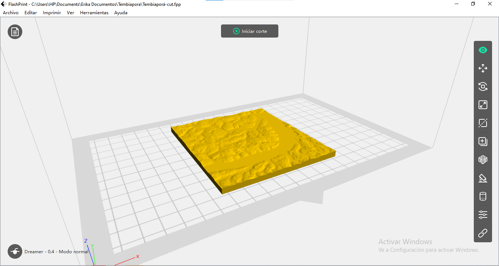<figcaption>
Archivo abierto en la interface de Flashprint.
</figcaption></figure>

<figure>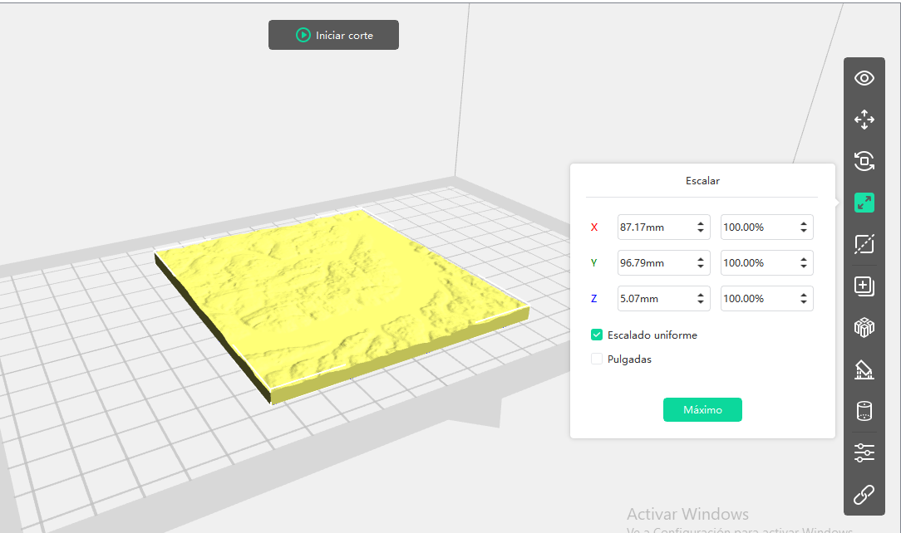<figcaption>
Dimensiones impresas.
</figcaption></figure>

Para ajustar los parámetros de impresión, seleccionamos 'Iniciar Corte', ubicado en el centro de la parte superior.

<figure><figcaption>
ícono de iniciar corte.
</figcaption></figure>

A continuación se observa los parámetros de Temperatura de la extrusora derecha y la plataforma en la ventana de **Impresora**.

<figure><figcaption>
Vista de los parámetros configurados en Impresora.
</figcaption></figure>

En la ventana de **General** se presentan las siguientes configuraciones en la que es relevante el alto de capa, en este caso es de 0.18mm.

<figure>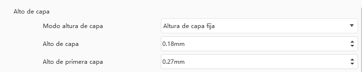<figcaption>
Configuraciones de Alto de capa.
</figcaption></figure>

En la ventana de Relleno se destaca la configuración de porcentaje de relleno y tipo de relleno.

<figure>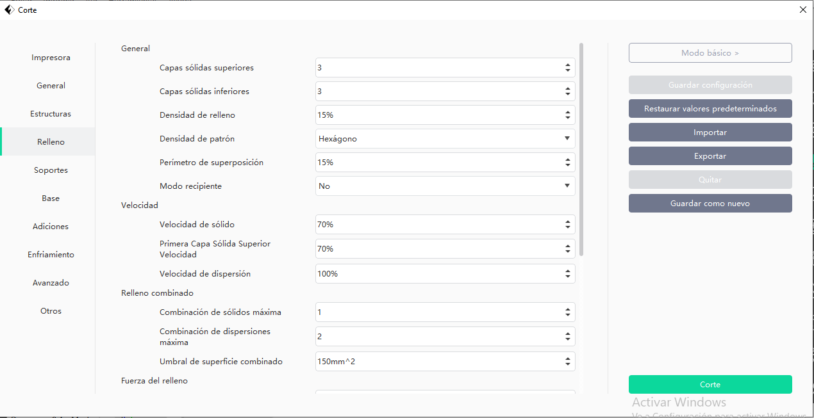<figcaption></figcaption></figure>

 

<figure>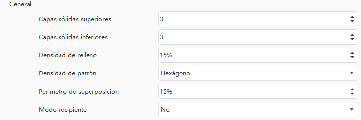<figcaption>
Parámetros configurados en Relleno.
</figcaption></figure>

Una vez terminada las configuraciones se puede procesar los parámetros configurados en su totalidad, para ello seleccionamos Corte ubicado en el menú lateral derecho.

<figure><figcaption>
ícono de Corte.
</figcaption></figure>

Una vez procesado el Corte podemos **ver las capas** y **descargar el archivo** en el formato procesable por nuestra impresora FlashForge Dreamer. También podemos seleccionar Iniciar Corte para configurar de nuevo nuestro parámetros.

<figure><figcaption>
Opciones a utilizar.
</figcaption></figure>

<figure>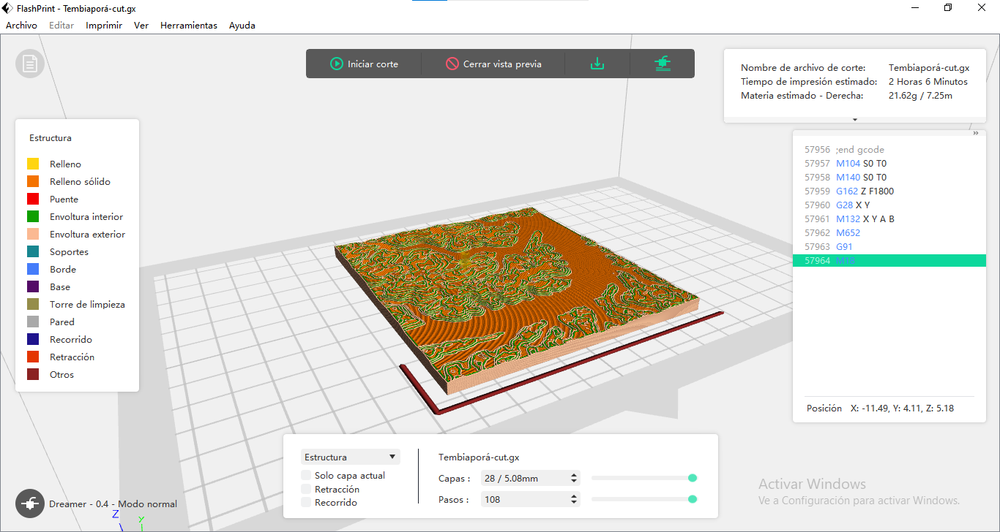<figcaption>
Vistas de las capas a imprimir.
</figcaption></figure>

Se observan a las capas muy alejadas entre sí, por ende se debe volver a configurar los parámetros modificando el alto de capa.

<figure>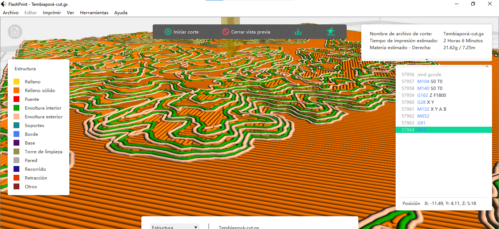<figcaption>
Zoom a las capas configuradas.
</figcaption></figure>

Una vez configurado los parámetros para conseguir una mayor definición de las elevaciones obtenemos el siguiente corte.

<figure>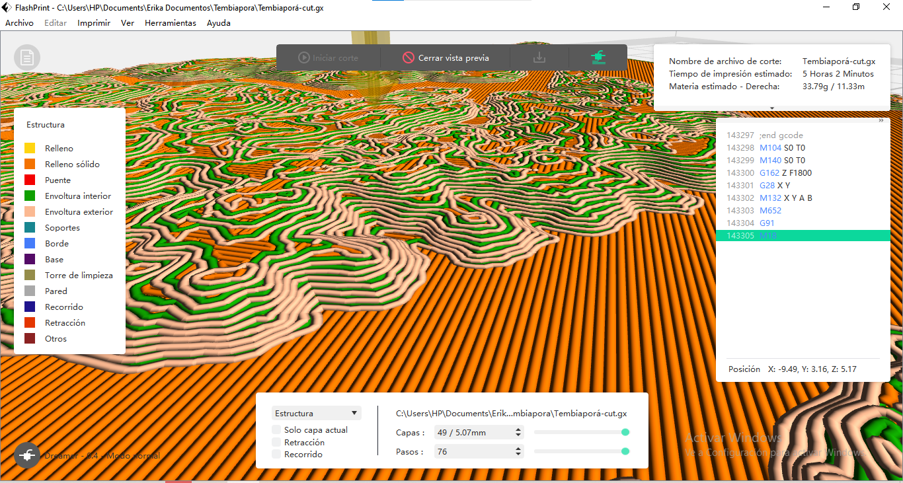<figcaption></figcaption></figure>

A día de hoy puedo observar que el tiempo de impresión es excesivo para el tamaño de la pieza.

<figure>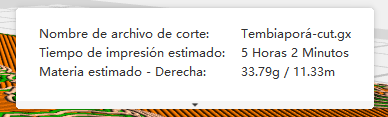<figcaption></figcaption></figure>


Archivo descargable del archivo de Flashprint.



Archivo procesado en la impresora 3D.


Luego procedemos a imprimir en la impresora 3D siguiendo los pasos detallado en la siguiente documentación.


[impresion-3d](../impresion-3d/)


Siguiendo los pasos generales para procesar en 3D esperamos a obtener la pieza final.


El el proceso se ha identificado que no se debe utilizar acentos en el archivo procesable por la impresora, por lo que debí modificar el nombre para poder imprimir la pieza.


### <mark style="color:purple;">Resultado del terreno obtenido con Terrain2stl impreso en 3D</mark>

&#x20;

***

Una variable a Terrain2STL es la página Map2STL.



Aunque Map2STL destaca por su funcionalidad de previsualización del modelo, brindándonos la capacidad de anticipar el resultado final, debemos considerar que este enfoque tiende a generar modelos con una resolución más baja, lo que se conoce como estilo LowPoly.

Por otro lado, Terrain2STL sobresale al proporcionar una definición superior en los resultados, capturando con mayor detalle las complejidades del relieve. Esta calidad mejorada puede ser crucial en proyectos que requieren una representación más precisa del terreno.

<figure><figcaption></figcaption></figure>

<figure><figcaption>
Vista del resultado de Map2STL.
</figcaption></figure>

Para mejorar la definición de los modelos generados por **Map2STL**, se ha aplicado el modificador **Subdivision Surface** en Blender. Esta técnica ha demostrado ser eficaz al suavizar y detallar el modelo resultante.

<figure>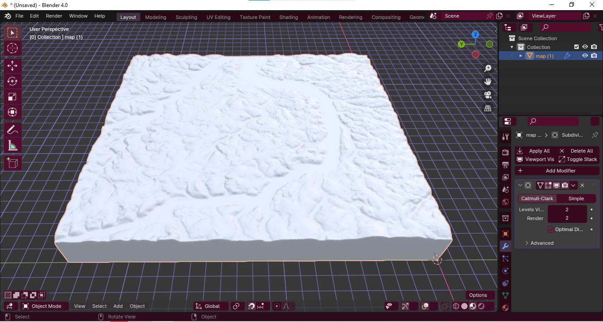<figcaption>
Para compensar la definición de Map2STL apliqué el modificador Subdivision Surface de Blender.
</figcaption></figure>

Sin embargo, tras la aplicación de este modificador, nos enfrentamos a un inconveniente: el archivo resultante se ha vuelto considerablemente pesado. Este desafío plantea la necesidad de explorar estrategias adicionales para optimizar el tamaño del archivo sin comprometer la calidad visual.

### <mark style="color:purple;">Proceso en Meshmixer</mark>

Ante el desafío del archivo pesado resultante de la aplicación del modificador Subdivision Surface, consideramos la posibilidad de mejorar tanto el peso como la definición utilizando Meshmixer.

Exploraremos cómo las herramientas disponibles en Meshmixer pueden ayudarnos a optimizar el modelo, reduciendo su tamaño sin sacrificar la calidad visual.

<figure>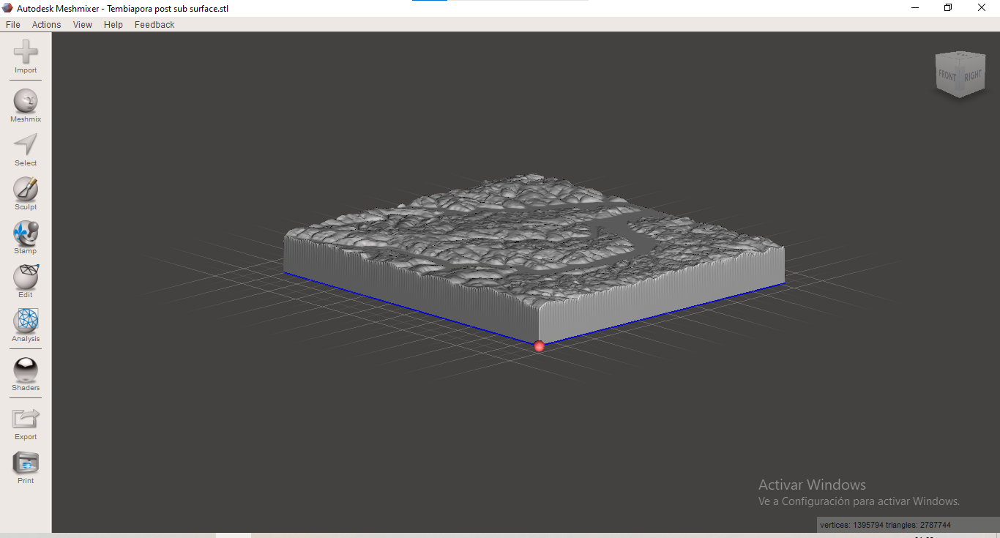<figcaption></figcaption></figure>

Una vez más aplicamos la herramienta "Make Solid" para optimizar el modelo. Recomendamos configurar los parámetros de 'Solid Type' en 'Accurate' y 'Solid Accuracy' al máximo para garantizar una preparación adecuada del modelo. Una vez satisfechos con los resultados, eliminamos el archivo original y conservamos solo la versión modificada.

<figure>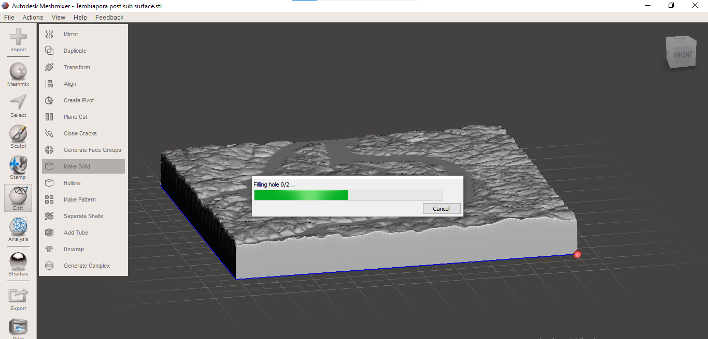<figcaption>
Seleccionar Make Solid ubicado en la ventana de Edit en el menú lateral.
</figcaption></figure>

<figure>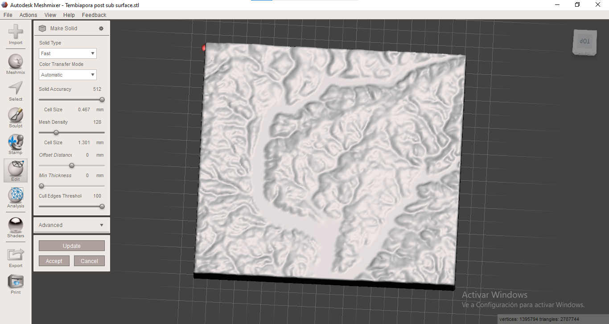<figcaption>
Parámetros establecidos para obtener nuestra pieza.
</figcaption></figure>

Una vez que obtenemos un modelo que satisfaga nuestras expectativas seleccionar Accept.&#x20;

<figure><figcaption></figcaption></figure>

Al generar el Make Solid obtenemos dos objetos, por ello a continuación eliminamos el archivo original y conservamos solo la versión modificada.

<figure>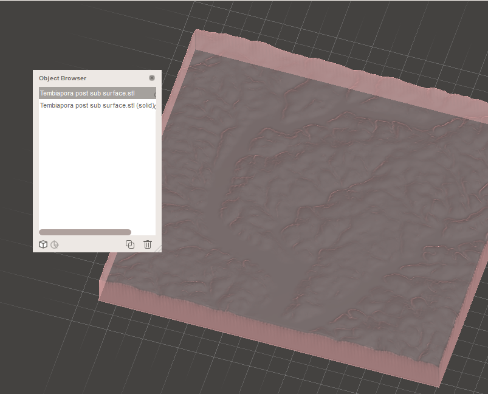<figcaption></figcaption></figure>

 

<figure>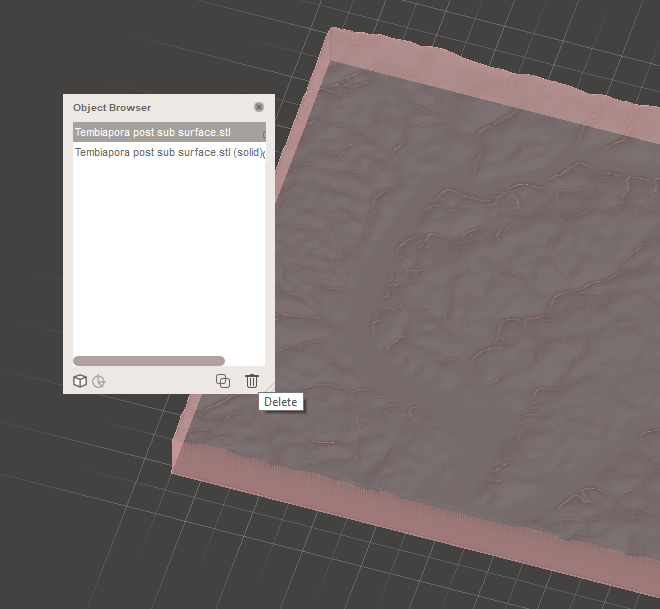<figcaption></figcaption></figure>

A continuación debemos exportar el archivo en formato .stl para procesarlo en un formato adecuado para el fresado CNC.


Archivo de Meshmixer descargable.



Archivo descargable en formato .stl.


***

### <mark style="color:purple;">VCarve Pro</mark>

**VCarve Pro y Fresado CNC:**

**Preparación del Modelo:**

* Asegúrate de tener el modelo optimizado en formato STL listo para el fresado CNC.

**Importación del Modelo:**

* Abre VCarve Pro y selecciona la opción para importar tu modelo STL. Asegúrate de que las unidades y dimensiones coincidan con las del modelo original.

**Configuración del Proyecto:**

* Define el material que utilizarás para el fresado y establece las dimensiones de tu pieza. Es crucial para obtener un fresado preciso.

**Herramientas de Fresado:**

* Selecciona las herramientas de corte adecuadas en VCarve Pro. Ajusta parámetros como velocidad de corte, profundidad de paso y otros según el material y el tipo de fresa que estés utilizando.

**Estrategia de Fresado:**

* Planifica la estrategia de fresado. Decide entre el fresado en pasadas escalonadas, fresado en espiral u otras estrategias dependiendo de la complejidad de tu modelo y la herramienta seleccionada.

**Trayectorias de Herramientas:**

* Genera las trayectorias de herramientas. VCarve Pro te permitirá previsualizar cómo se llevará a cabo el fresado. Ajusta según sea necesario para optimizar la eficiencia y la calidad.

**Configuración de Profundidad:**

* Asegúrate de configurar correctamente las profundidades de corte para cada operación. Esto es crucial para obtener el relieve y detalles deseados en tu modelo.

**Simulación:**

* Utiliza la función de simulación en VCarve Pro para revisar cómo se ejecutará el fresado. Esto te ayudará a identificar posibles problemas antes de enviar el trabajo a la fresadora CNC.

**Postprocesamiento:**

* Después de revisar y simular, genera el código G (Código de Control Numérico) necesario para la fresadora CNC. Asegúrate de seleccionar el postprocesador correcto para tu máquina.

<mark style="color:purple;">Código G o GCode</mark>

Un código G, abreviatura de "código geométrico" o "código de control numérico", es un conjunto de comandos alfanuméricos utilizados en programación CNC (Control Numérico por Computadora).&#x20;

Estos códigos indican a la máquina herramienta, como un fresadora o un torno CNC, las instrucciones específicas para llevar a cabo una tarea determinada, como movimientos, velocidades, y operaciones de herramientas.&#x20;

Los códigos G son esenciales para traducir el diseño digital en movimientos físicos y acciones de la máquina durante el proceso de fabricación.&#x20;

Cada código G tiene una función específica, como desplazamientos, cambios de herramientas, o control de velocidad, contribuyendo a la precisión y automatización en la producción.

## <mark style="color:purple;">Proceso en la fresadora CNC Roland</mark>

En el desarrollo de la tarea en la fresadora CNC Roland, se siguieron cuidadosamente los siguientes pasos:

<mark style="color:purple;">**1. Encendido y Posicionamiento Inicial:**</mark>

* Inicialmente, se encendió la fresadora y se realizó el posicionamiento inicial.&#x20;
* El material de trabajo, previamente cortado y adherido con cinta doble faz, fue centrado en la plataforma.
* &#x20;Dos piezas superpuestas se utilizaron para obtener un bloque de trabajo de 500 mm de altura, como se había configurado en VCarve Pro.
* Se debe marcar el centro del material con diagonales tal cómo habíamos establecido en VCarve Pro el eje del centro como punto inicial.

<mark style="color:purple;">**2. Centrado de Ejes X e Y:**</mark>

* Se establecieron el punto 0 de los ejes X e Y utilizando el mando de la fresadora para garantizar una alineación precisa del material con respecto a las coordenadas del programa.

<mark style="color:purple;">**3. Centrado del Eje Z:**</mark>

* Para el eje Z, se utilizó el imán de la máquina para asegurar una referencia precisa. Este paso es crucial para la profundidad correcta de fresado y la calidad del resultado final.

<mark style="color:purple;">**4. Importación Secuencial de Códigos G:**</mark>

* Se importaron por turno los códigos G generados en VCarve Pro. Primero, se procesó el código de fresado para esculpir las montañas, seguido por el código de perfil para eliminar excedentes en los laterales y obtener la forma final deseada.

<mark style="color:purple;">**5. Proceso de Fresado de Montañas:**</mark>

* Se ejecutó el código G correspondiente al fresado de las montañas. La fresadora siguió las instrucciones para esculpir las elevaciones y detalles precisos del terreno.

<mark style="color:purple;">**6. Cambio y Proceso de Fresado de Perfil:**</mark>

* Después de completar el fresado de las montañas, se cambió a la herramienta necesaria y se procesó el código de perfil. Esto eliminó los excedentes laterales, proporcionando la forma final de la pieza.

<mark style="color:purple;">**7. Evaluación Continua:**</mark>

* Durante todo el proceso, se llevó a cabo una evaluación continua para asegurar que la fresadora estuviera siguiendo las trayectorias correctas y que el material se estuviera trabajando según lo planificado.

<mark style="color:purple;">**8. Finalización y Extracción:**</mark>

* Una vez que ambos códigos G se completaron con éxito, se detuvo la fresadora. La pieza final fresada fue cuidadosamente retirada de la mesa.

### <mark style="color:purple;">Resultado del terreno de Tembiaporã fresado</mark>

<table><thead><tr><th width="196.33333333333331">Aspecto</th><th>Terrain2STL (Impresión 3D)</th><th>Maps2STL (Fresado CNC)</th></tr></thead><tbody><tr><td><strong>Resolución y Detalle</strong></td><td>Alta resolución y detalle.</td><td>Resolución más baja (LowPoly)</td></tr><tr><td><strong>Tamaño del Modelo</strong></td><td>Puede ser muy pequeño. En casos grandes, pérdida innecesaria de filamento y tiempo.</td><td>Tarda, pero el resultado cumple expectativas.</td></tr><tr><td><strong>Experiencia de Usuario</strong></td><td>Para comprobar las configuraciones se debe descargar el archivo innecesariamente.</td><td>Permite la previsualización del archivo online. Interfaz agradable y fácil de usar. </td></tr><tr><td><strong>Mejoras Necesarias</strong></td><td>Utilizar Meshmixer para optimizar el modelo para la impresión.</td><td>Se debe suavizar el mesh del objeto sin falta o de lo contrario el resultado no será satisfactorio.</td></tr><tr><td><strong>Conclusión</strong></td><td>Ideal para modelos pequeños.</td><td>Eficiente para proyectos a mayor escala.</td></tr><tr><td><strong>Observaciones</strong></td><td>Modelos grandes pueden ser una pérdida innecesaria de recursos.</td><td>Requiere mejoras previas, pero ofrece flexibilidad y eficiencia.</td></tr></tbody></table>

## <mark style="color:purple;">Comparaciones entre los modelos obtenidos</mark>

