# Procesado del terreno de vista satelital de Tembiaporã.

Para llevar a cabo el fresado en nuestro proyecto, utilizaremos la herramienta Terrain2stl. Esta página desempeñará un papel fundamental al convertir datos de terreno desde imágenes de vista satelital en archivos STL, permitiéndonos así crear representaciones tridimensionales precisas del relieve.


Página de Terrain2STL,


Esta herramienta ya fue utilizada en proyectos anteriores, en la siguiente documentación de este Gitbook se describe su uso y los resultados.


[obtencion-de-modelo-3d-topografico](../cnc/obtencion-de-modelo-3d-topografico/)


<figure><figcaption>
Vista del terreno en la interface de Terrain2STL.
</figcaption></figure>


Archico descargable del modelo generado por Terrain2STL.


Había supuesto un buen resultado del modelo 3D generado por Terrain2STL de ser impreso en 3D por lo que lo llevé a Meshmixer para prepararlo para la impresión.

### <mark style="color:purple;">Meshmixer</mark>

<figure><figcaption>
Vista del modelo de Terrain2STL en Meshmixer.
</figcaption></figure>

<figure><figcaption>
Zoom de las relieves generadas por Terrain2STL.
</figcaption></figure>

Como es mi proceso general en Meshmixer, empleo la herramienta Make Solid que se encuentra en la ventana de Edit.

<figure><figcaption>
Vista de Make Solid en la interface.
</figcaption></figure>

Para obtener resultados óptimos en Meshmixer, se recomienda configurar los parámetros de '**Solid Type**' en '**Accurate**' y '**Solid Accuracy**' al **máximo**. Esta configuración es suficiente para asegurar una preparación adecuada del modelo.

<figure><figcaption></figcaption></figure>

 

<figure><figcaption>
Parámetros utilizados.
</figcaption></figure>

Seleccionar Accept al encontrarse conforme con el resultado y obtener el modelo modificado con Make Solid.

<figure><figcaption></figcaption></figure>

Una vez obtenido el modelo eliminamos el archivo original y sólo mantenemos el modificado.

<figure><figcaption></figcaption></figure>

 

<figure><figcaption></figcaption></figure>

Una vez completamente editado exportamos en formato .stl para posteriormente procesarlo en Flashprint y Finalmente imprimirlo.

<figure><figcaption></figcaption></figure>

 

<figure><figcaption></figcaption></figure>


Archivo descargable del proceso en Meshmixer.


### <mark style="color:purple;">Flashprint</mark>&#x20;

A continuación se detallará el proceso realizado en Flashprint

Importa el archivo en Flashprint y procede a ajustar la escala según sea necesario. En este caso, no es preciso utilizar soportes, ya que se trata de una placa plana prismática.

<figure><figcaption>
Archivo abierto en la interface de Flashprint.
</figcaption></figure>

<figure><figcaption>
Dimensiones impresas.
</figcaption></figure>

Para ajustar los parámetros de impresión, seleccionamos 'Iniciar Corte', ubicado en el centro de la parte superior.

<figure><figcaption>
ícono de iniciar corte.
</figcaption></figure>

A continuación se observa los parámetros de Temperatura de la extrusora derecha y la plataforma en la ventana de **Impresora**.

<figure><figcaption>
Vista de los parámetros configurados en Impresora.
</figcaption></figure>

En la ventana de **General** se presentan las siguientes configuraciones en la que es relevante el alto de capa, en este caso es de 0.18mm.

<figure><figcaption>
Configuraciones de Alto de capa.
</figcaption></figure>

En la ventana de Relleno se destaca la configuración de porcentaje de relleno y tipo de relleno.

<figure><figcaption></figcaption></figure>

 

<figure><figcaption>
Parámetros configurados en Relleno.
</figcaption></figure>

Una vez terminada las configuraciones se puede procesar los parámetros configurados en su totalidad, para ello seleccionamos Corte ubicado en el menú lateral derecho.

<figure><figcaption>
ícono de Corte.
</figcaption></figure>

Una vez procesado el Corte podemos **ver las capas** y **descargar el archivo** en el formato procesable por nuestra impresora FlashForge Dreamer. También podemos seleccionar Iniciar Corte para configurar de nuevo nuestro parámetros.

<figure><figcaption>
Opciones a utilizar.
</figcaption></figure>

<figure><figcaption>
Vistas de las capas a imprimir.
</figcaption></figure>

Se observan a las capas muy alejadas entre sí, por ende se debe volver a configurar los parámetros modificando el alto de capa.

<figure><figcaption>
Zoom a las capas configuradas.
</figcaption></figure>

Una vez configurado los parámetros para conseguir una mayor definición de las elevaciones obtenemos el siguiente corte.

<figure><figcaption></figcaption></figure>

A día de hoy puedo observar que el tiempo de impresión es excesivo para el tamaño de la pieza.

<figure><figcaption></figcaption></figure>


Archivo descargable del archivo de Flashprint.



Archivo procesado en la impresora 3D.


Luego procedemos a imprimir en la impresora 3D siguiendo los pasos detallado en la siguiente documentación.


[impresion-3d](../impresion-3d/)


Siguiendo los pasos generales para procesar en 3D esperamos a obtener la pieza final.


El el proceso se ha identificado que no se debe utilizar acentos en el archivo procesable por la impresora, por lo que debí modificar el nombre para poder imprimir la pieza.


### <mark style="color:purple;">Resultado del terreno obtenido con Terrain2stl impreso en 3D</mark>

&#x20;El resultado es una pieza pequeña el cual no se entiende que es una relevación topográfica, el gasto de material no rinde las expectativas y por ende no se recomienda este método.

<figure><figcaption>
Vista superior del resultado de la impresión 3D.
</figcaption></figure>

<figure><figcaption>
Perspectiva frontal del resultado de la impresión 3D.
</figcaption></figure>

Normalmente una persona ajena a la fabricación digital se impresiona con los proyectos, sin embargo en este caso no se ha entendido su función y se comprobó que no es conveniente representar la relevación topográfica tan chica y muy plato (debí haber editado un poco).&#x20;

<figure><figcaption>
Uso de la relevación topográfica.
</figcaption></figure>

En este caso incluso se dió vuelta a la cara de la representación topográfica.

***

Una variable a Terrain2STL es la página Map2STL.



Aunque Map2STL destaca por su funcionalidad de previsualización del modelo, brindándonos la capacidad de anticipar el resultado final, debemos considerar que este enfoque tiende a generar modelos con una resolución más baja, lo que se conoce como estilo LowPoly.

Por otro lado, Terrain2STL sobresale al proporcionar una definición superior en los resultados, capturando con mayor detalle las complejidades del relieve. Esta calidad mejorada puede ser crucial en proyectos que requieren una representación más precisa del terreno.

<figure><figcaption>
Vista de la página de Maps2STL.
</figcaption></figure>

<figure><figcaption>
Vista del resultado de Map2STL.
</figcaption></figure>

Para mejorar la definición de los modelos generados por **Map2STL**, se ha aplicado el modificador **Subdivision Surface** en Blender. Esta técnica ha demostrado ser eficaz al suavizar y detallar el modelo resultante.

<figure><figcaption>
Para compensar la definición de Map2STL apliqué el modificador Subdivision Surface de Blender.
</figcaption></figure>

Sin embargo, tras la aplicación de este modificador, nos enfrentamos a un inconveniente: el archivo resultante se ha vuelto considerablemente pesado. Este desafío plantea la necesidad de explorar estrategias adicionales para optimizar el tamaño del archivo sin comprometer la calidad visual.

### <mark style="color:purple;">Proceso en Meshmixer</mark>

Ante el desafío del archivo pesado resultante de la aplicación del modificador Subdivision Surface, consideramos la posibilidad de mejorar tanto el peso como la definición utilizando Meshmixer.

Exploraremos cómo las herramientas disponibles en Meshmixer pueden ayudarnos a optimizar el modelo, reduciendo su tamaño sin sacrificar la calidad visual.

<figure><figcaption></figcaption></figure>

Una vez más aplicamos la herramienta "Make Solid" para optimizar el modelo. Recomendamos configurar los parámetros de 'Solid Type' en 'Accurate' y 'Solid Accuracy' al máximo para garantizar una preparación adecuada del modelo. Una vez satisfechos con los resultados, eliminamos el archivo original y conservamos solo la versión modificada.

<figure><figcaption>
Seleccionar Make Solid ubicado en la ventana de Edit en el menú lateral.
</figcaption></figure>

<figure><figcaption>
Parámetros establecidos para obtener nuestra pieza.
</figcaption></figure>

Una vez que obtenemos un modelo que satisfaga nuestras expectativas seleccionar Accept.&#x20;

<figure><figcaption></figcaption></figure>

Al generar el Make Solid obtenemos dos objetos, por ello a continuación eliminamos el archivo original y conservamos solo la versión modificada.

<figure><figcaption></figcaption></figure>

 

<figure><figcaption></figcaption></figure>

A continuación debemos exportar el archivo en formato .stl para procesarlo en un formato adecuado para el fresado CNC.


Archivo de Meshmixer descargable.



Archivo descargable en formato .stl.


***

## <mark style="color:purple;">**VCarve Pro y Fresado CNC:**</mark>

<mark style="color:purple;">**Preparación del Modelo:**</mark>

* Asegúrate de tener el modelo optimizado en formato STL listo para el fresado CNC.


Archivo descargable en formato .stl.


<mark style="color:purple;">**Importación del Modelo:**</mark>

* Abre VCarve Pro y selecciona la opción para importar tu modelo STL. Asegúrate de que las unidades y dimensiones coincidan con las del modelo original.

<figure><figcaption>
Crear un nuevo documento al abrir el programa.
</figcaption></figure>

Determinar las dimensiones del área de trabajo en coincidencia a las dimensiones de nuestro material a trabajar.

<figure><figcaption></figcaption></figure>

Al llegar a esta fase me olvidé de anotar mis dimensiones a configurar, así que establecí un aproximado que más tarde se puede volver a configurar.

<figure><figcaption>
Dimensiones establecidas para el área de trabajo.
</figcaption></figure>

 

<figure><figcaption>
Dimensiones de mi archivo .stl
</figcaption></figure>

Aceptar las configuraciones.

<figure><figcaption>
Seleccionar OK para continuar.
</figcaption></figure>

Es habitual que utilicemos la ventana de <mark style="color:purple;">**Drawing**</mark> pero para este fresado en el que tallaremos con la CNC nos ubicaremos en la ventana de <mark style="color:purple;">**Modeling**</mark>.

<figure><figcaption>
Ventana de Modeling sin haber cargado un archivo.
</figcaption></figure>

Seleccionamos el ícono de la carpeta para abrir el archivo, en la ventana emergente seleccionamos el stl a fresar.

<figure><figcaption>
Se resalta el ícono de la carpeta.
</figcaption></figure>

Nos dirigimos a la configuración de la edición de la dimensión del modelo. Se ha establecido que la altura a fresar será de 45mm. La razón para modificar este parámetro es que queremos intensificar las curvas del modelo para que el fresado no quede muy plato.

Nuestro material de polifoam es de 250mm de altura, se pegarán dos pedazos de las mismas dimensiones para alcanzar una altura de 500mm en total y que resalte más el modelo.

<figure><figcaption>
Determinación de la altura a fresar.
</figcaption></figure>

En la vista de previsualización podemos ver cómo está quedando el modelo y una vez satisfechos con el modelo seleccionamos <mark style="color:purple;">**Position and Import**</mark> para continuar.

<figure><figcaption>
Previsualización del modelo.
</figcaption></figure>

Por último se establece la distancia que será fresada, y lo que queda fuera a operar.

<figure><figcaption></figcaption></figure>

Como no entendía bien las funciones de esta configuración he aquí la descripción de las funciones de <mark style="color:purple;">“</mark><mark style="color:purple;">**Importar modelo 3D > Posición**</mark><mark style="color:purple;">”</mark>.&#x20;

<table><thead><tr><th width="193.5">Función</th><th>Descripción</th></tr></thead><tbody><tr><td><mark style="color:purple;"><strong>Posición relativa al plano de modelado</strong></mark></td><td>Esta sección te permite ajustar la posición del modelo 3D en relación con el centro de rotación. Por defecto, VCarve Pro posiciona el modelo en el centro del bloque de material, para aprovechar mejor el material. Cuando se selecciona la opción Desactivado, el movimiento del modelo 3D se hace de la manera habitual.</td></tr><tr><td><mark style="color:purple;"><strong>Profundidad bajo la parte superior</strong></mark></td><td>Esta sección te permite ajustar la profundidad del modelo 3D por debajo de la parte superior del bloque de material. Puedes introducir un valor numérico o usar los botones de flecha para cambiar la profundidad. También puedes usar el control deslizante para ver cómo cambia la profundidad en la vista 3D.</td></tr><tr><td><mark style="color:purple;"><strong>Descartar datos por debajo del plano cero</strong></mark></td><td>Esta sección te permite eliminar los datos del modelo 3D que están por debajo del plano cero, es decir, la parte inferior del bloque de material. Puedes activar o desactivar esta opción con la casilla de verificación. Esta opción puede ser útil para reducir el tamaño del archivo y el tiempo de mecanizado.</td></tr><tr><td><mark style="color:purple;"><strong>Resaltar rebajes</strong></mark></td><td>Esta sección te permite resaltar las partes del modelo 3D que tienen rebajes, es decir, partes que no se pueden mecanizar con una herramienta cilíndrica. Puedes activar o desactivar esta opción con la casilla de verificación. Esta opción puede ser útil para identificar las zonas problemáticas del modelo 3D.</td></tr><tr><td><mark style="color:purple;"><strong>Actualizar rebajes</strong></mark></td><td>Esta sección te permite actualizar los rebajes del modelo 3D después de cambiar la posición o la profundidad del modelo. Puedes hacer clic en el botón de Actualizar rebajes para ver los cambios en la vista 3D.</td></tr><tr><td><mark style="color:purple;"><strong>Aplicar</strong></mark></td><td>Este botón te permite confirmar los cambios que has hecho en el modelo 3D y cerrar el cuadro de diálogo.</td></tr><tr><td><mark style="color:purple;"><strong>Cancelar</strong></mark></td><td>Este botón te permite descartar los cambios que has hecho en el modelo 3D y cerrar el cuadro de diálogo.</td></tr><tr><td><mark style="color:purple;"><strong>Posición e importar ></strong></mark></td><td>Este botón te permite avanzar al siguiente paso del proceso de importación y mecanizado del modelo 3D.</td></tr></tbody></table>

Como había sido establecido una dimensión aproximada del material, ahora procedemos a cambiar las dimensiones, primero dirigirse a la ventana de <mark style="color:purple;">Drawing</mark>, luego seleccionar <mark style="color:purple;">**Job Setup**</mark> y encontraremos un menú idéntico al que utilizamos al iniciar cada nuevo proyecto.&#x20;

<figure><figcaption>
Cambio de dimensión del material en Job Setup.
</figcaption></figure>

Ahora debemos seleccionar en el menú de <mark style="color:purple;">**Modeling ¨Crear contorno vectorial alrededor de los componentes seleccionados¨**</mark>

<figure><figcaption>
El ícono a utilizar se encuentra en Modeling, en la misma ubicación en donde importamos nuestro archivo .stl.
</figcaption></figure>

Esta función _crea un límite vectorial alrededor de los componentes que hayas seleccionado en tu espacio de trabajo._&#x20;

Esto puede ser útil para definir un área específica para aplicar cambios o realizar operaciones en esos componentes seleccionados.&#x20;

Por ejemplo, puedes querer aplicar un efecto o transformación específica solo a ciertos componentes de tu modelo 3D, y esta función te permitiría seleccionar exactamente qué partes del modelo se verán afectadas.&#x20;

Es una herramienta útil para tener un control más preciso sobre tus ediciones y transformaciones en el software de modelado 3D.

<figure><figcaption>
<strong>Crear contorno vectorial alrededor de los componentes seleccionados.</strong>
</figcaption></figure>

<mark style="color:purple;">**Configuración en Toolpath:**</mark>

Selecciona <mark style="color:purple;">**Toolpath**</mark> para configurar las herramientas de corte adecuadas en VCarve Pro. Ajusta parámetros como velocidad de corte, profundidad de paso y otros según el material y el tipo de fresa que estés utilizando.

No debemos olvidar seleccionar en el área de trabajo el objeto para editar en <mark style="color:purple;">**Toolpath.**</mark>

Para el mecanizado seleccionaremos el ícono de <mark style="color:purple;">**3D Roughing Toolpath**</mark><mark style="color:purple;">.</mark>

<figure><figcaption>
Seleccionar 3D Roughing Toolpath en la selección de Operaciones.
</figcaption></figure>

Una vez seleccionada la operación nos aparecerá el menú de parámetros a configurar de esa operación.

<figure><figcaption>
Parámetros a editar en Toolpath de Rough Machinig Toolpath.
</figcaption></figure>

A continuación una explicación general sobre qué trata cada configuración a realizar.

<table><thead><tr><th width="183.5">Función</th><th>Descripción</th></tr></thead><tbody><tr><td><mark style="color:purple;"><strong>Selección de herramienta</strong></mark></td><td>Esta función te permite seleccionar la herramienta/broca que se utilizará para el mecanizado.</td></tr><tr><td><mark style="color:purple;"><strong>Límite</strong></mark></td><td>

Esta función te habilita para establecer el límite del mecanizado.
<ul><li><mark style="color:purple;"><strong>Model Boundary</strong>:</mark> Esta función emplea los límites combinados de todos los componentes en el trabajo. Representa el área del modelo compuesto que contiene componentes.</li><li><mark style="color:purple;"><strong>Material Boundary</strong>:</mark> Utiliza el límite del bloque de material completo.</li><li><mark style="color:purple;"><strong>Selected Vector(s)</strong>:</mark> Utiliza los vectores seleccionados como límite de mecanizado. Estos vectores seleccionados pueden emplearse para crear un perfil de herramienta.</li><li><mark style="color:purple;"><strong>Selected Level</strong>:</mark> Utiliza los límites combinados de todos los componentes en el nivel especificado. Similar a <strong>Model Boundary</strong>, pero específico para el nivel nombrado.</li><li><mark style="color:purple;"><strong>Level:</strong></mark> No se encontró información específica sobre esta función en el software de control de máquinas CNC.</li><li><mark style="color:purple;"><strong>Boundary Offset:</strong></mark> Cuando estás mecanizando un objeto elevado, la herramienta a menudo no mecanizará completamente el borde. Este campo se utiliza para especificar un desplazamiento al límite de mecanizado seleccionado, aumentando su tamaño para permitir que la herramienta sobrepase el borde real si es necesario.</li></ul></td></tr><tr><td><mark style="color:purple;"><strong>Margen de Mecanizado</strong></mark></td><td>El tamaño del <mark style="color:purple;"><strong>margen de mecanizado</strong></mark> tiene un impacto crítico en la calidad y eficiencia del proceso. Un margen excesivo aumenta la carga de trabajo, reduce la productividad y eleva los costos de materiales, herramientas y electricidad, mientras que un margen muy pequeño puede no corregir defectos previos ni compensar errores de sujeción, conduciendo a productos defectuosos. El principio clave en la elección del margen es minimizarlo, siempre y cuando se asegure la calidad del producto.</td></tr><tr><td><mark style="color:purple;"><strong>Estrategia de desbaste</strong></mark></td><td>
Esta función te permite elegir la estrategia de desbaste y perfil para el mecanizado.

<mark style="color:purple;"><strong>Estrategia de Desbaste</strong></mark><strong>:</strong> El desbaste es crucial en las etapas iniciales del mecanizado, dando forma al material cerca de la geometría deseada. Dos opciones están disponibles:
<ul><li><mark style="color:purple;"><strong>Z Level</strong></mark><strong>:</strong> Utiliza trayectorias de bolsillo 2D para eliminar material alrededor del modelo 3D, respetando el límite especificado.</li><li><mark style="color:purple;"><strong>3D Raster</strong></mark><strong>:</strong> Calcula un patrón de trama en la superficie 3D y mecaniza dentro del vector seleccionado(s), permitiendo control sobre el ángulo de la trama.</li></ul>
<mark style="color:purple;"><strong>Perfil</strong></mark><strong>:</strong> Selecciona el perfil para el mecanizado, con opciones para perfiles externos, internos o en vectores seleccionados. Ajusta automáticamente el diámetro y ángulo de la herramienta para la profundidad de corte deseada. Dos opciones disponibles:
<ul><li><mark style="color:purple;"><strong>Last</strong></mark><strong>:</strong> Realiza el corte de perfil después de la trama en cada nivel.</li><li><mark style="color:purple;"><strong>Level by level</strong></mark><strong>:</strong> Realiza el corte de perfil antes de la trama en cada nivel.</li></ul>
<mark style="color:purple;"><strong>Orden</strong></mark><strong>:</strong> Elige el orden de mecanizado, aunque las opciones no están claras en la captura de pantalla.

<mark style="color:purple;"><strong>Ángulo de Trama:</strong></mark> Introduce el ángulo de trama para el mecanizado, determinando el patrón de corte en la superficie 3D. Un ángulo de 0° genera un patrón principalmente paralelo al eje X, mientras que 90° es principalmente paralelo al eje Y.
</td></tr><tr><td><mark style="color:purple;"><strong>Ramp Plunge Moves</strong></mark></td><td>Esta función reduce la presión sobre la broca y la máquina, mejorando la calidad del corte en el punto de entrada al cortar en ángulo. Al seleccionar esta función y establecer una distancia de rampa, la herramienta cortará en un ángulo específico. Por ejemplo, si se corta un agujero circular de 2" de diámetro a través de un material de 1/2" de espesor con una distancia de rampa de 0.375, el corte inicial comenzará 0.375" dentro del vector y finalizará en el punto de 2" del agujero. Este enfoque tiene como objetivo reducir la carga del husillo y disminuir la acumulación de calor.</td></tr><tr><td><mark style="color:purple;"><strong>Z seguro</strong></mark></td><td>

<mark style="color:purple;"><strong>Safe Z</strong>:</mark> Esta función se relaciona con la altura segura en el eje Z, la cual es la distancia que la herramienta se eleva por encima de la pieza de trabajo durante movimientos no relacionados con el corte para evitar colisiones con la pieza o los sujetadores. En este caso, el valor es de 3.0 mm.

<mark style="color:purple;"><strong>Home-Position</strong>:</mark> Esta función se refiere a la posición de inicio o "home" de la máquina. Es la posición a la cual la máquina retorna después de completar una tarea. En sistemas CNC, la posición de inicio suele ser el punto más alejado en todos los ejes, es decir, el punto (0,0,0). En este caso, la posición de inicio es X: 0.00, Y: 0.00, Z: 12.00.
</td></tr><tr><td><mark style="color:purple;"><strong>Calcular trayectoria de herramienta</strong></mark></td><td>Esta función te permite calcular la trayectoria de la herramienta para el mecanizado.</td></tr><tr><td><mark style="color:purple;"><strong>Cerrar</strong></mark></td><td>Esta función te permite cerrar la ventana.</td></tr></tbody></table>

#### <mark style="color:purple;">Editar Tool en Toolpath</mark>

En tools se estable el tipo de broca a utilizar que sería de punta redonda de diámetro de 1/4, y la velocidad a 12000 rpm, también el <mark style="color:purple;">**Feed Units**</mark> a mm/sec.

<figure><figcaption>
Edición en Tools.
</figcaption></figure>

<table><thead><tr><th width="208.5">Tipo de Herramienta</th><th>Esta función permite seleccionar el tipo de herramienta que se va a utilizar. Los tipos de herramientas pueden variar dependiendo del software, pero generalmente incluyen opciones como fresas de extremo plano, fresas de nariz de bola, taladros, etc.</th></tr></thead><tbody><tr><td><mark style="color:purple;"><strong>Unidades</strong></mark></td><td>Esta función permite seleccionar las unidades de medida que se utilizarán para los parámetros de la herramienta. Las opciones suelen ser milímetros (mm) o pulgadas (in).</td></tr><tr><td><mark style="color:purple;"><strong>Diámetro</strong></mark></td><td>Esta función permite ingresar el diámetro de la herramienta. El diámetro se refiere al ancho de la herramienta.</td></tr><tr><td><mark style="color:purple;"><strong>Parámetros de Corte</strong></mark></td><td>Estos son los parámetros que controlan cómo se realiza el corte. Pueden incluir cosas como la profundidad de corte, la velocidad de avance, la velocidad de giro, etc.</td></tr><tr><td><mark style="color:purple;"><strong>Velocidades de Avance</strong></mark></td><td>Estas son las velocidades a las que se mueve la herramienta durante el corte. Pueden incluir la velocidad de avance en el eje X, Y y Z.</td></tr><tr><td><mark style="color:purple;"><strong>Modelo 3D de la Herramienta</strong></mark></td><td>Esta es una representación visual de la herramienta basada en los parámetros ingresados.</td></tr></tbody></table>

#### <mark style="color:purple;">Edit Passes</mark>

<figure><figcaption>
Vista de la configuración de Edit Passes.
</figcaption></figure>

| Función                                                                                | Descripción                                                                                                                                                                                                                                                                                                                                                                                                                                                                                                                                                                                                               |
| -------------------------------------------------------------------------------------- | ------------------------------------------------------------------------------------------------------------------------------------------------------------------------------------------------------------------------------------------------------------------------------------------------------------------------------------------------------------------------------------------------------------------------------------------------------------------------------------------------------------------------------------------------------------------------------------------------------------------------- |
| <mark style="color:purple;">**Profundidad total de corte**</mark>                      | Permite especificar la profundidad total de corte para la herramienta. En este caso, el valor es de 47.077 mm1.                                                                                                                                                                                                                                                                                                                                                                                                                                                                                                           |
| <mark style="color:purple;">**Profundidades de paso**</mark>                           | Permite especificar las profundidades de cada paso de corte. En este caso, los valores son 7.842, 8.929, 9.523, 11.361, 15.262, 19.2581. Estas funciones controlan cómo se realiza el corte.                                                                                                                                                                                                                                                                                                                                                                                                                              |
| <mark style="color:purple;">**Pass Depth List Utilities**</mark>                       | 

<ul><li><mark style="color:purple;"><strong>Campo de texto para la profundidad de paso de la herramienta:</strong></mark> Aquí puedes ingresar la profundidad de paso de la herramienta en milímetros.</li><li><mark style="color:purple;"><strong>Botón “Set Passes”</strong>:</mark> Este botón se utiliza para establecer el número de pasos.</li><li><mark style="color:purple;"><strong>Casilla de verificación “Maintain exact tool depth”</strong>:</mark> Si esta casilla está marcada, la herramienta mantendrá la profundidad exacta.</li></ul>                                                          |
| <mark style="color:purple;">**Populate pass depth list using number of passes**</mark> | 

<ul><li><mark style="color:purple;"><strong>Campo de texto para la profundidad de paso</strong>:</mark> Aquí puedes ingresar la profundidad de paso en milímetros. En este caso, se muestran “13 pasos a 3.923 mm/paso”.</li><li><mark style="color:purple;"><strong>Menú desplegable “Number of Passes”</strong>:</mark> Este menú desplegable te permite seleccionar el número de pasos. En este caso, se seleccionaron “13 pasos”.</li><li><mark style="color:purple;"><strong>Botón “Set Passes”</strong>:</mark> Este botón se utiliza para establecer la profundidad de paso y el número de pasos.</li></ul> |

Estas serán los cambios a realizar, a continuación debemos guardar las configuraciones en un formato procesable para la Fresadora CNC Roland (postprocesador).

<mark style="color:purple;">**Simulación:**</mark>

* Utiliza la función de simulación en VCarve Pro para revisar cómo se ejecutará el fresado. Esto te ayudará a identificar posibles problemas antes de enviar el trabajo a la fresadora CNC.

### <mark style="color:purple;">Repetir el proceso habitual en  Toolpath Profile</mark>


[pasos-de-uso-de-la-cnc.md](../cnc/pasos-de-uso-de-la-cnc.md)



[test-de-cnc.md](../cnc/test-de-cnc.md)


En estas documentaciones contienen los pasos habituales en los que se configura el <mark style="color:purple;">**Toolpath Profile.**</mark>

<mark style="color:purple;">**Postprocesamiento:**</mark>

* Después de revisar y simular, genera el código G (Código de Control Numérico) necesario para la fresadora CNC. Asegúrate de seleccionar el postprocesador correcto para tu máquina.

<figure><figcaption>
Vista de las configuraciones a guardar.
</figcaption></figure>

<table><thead><tr><th width="320">Opción</th><th>Descripción</th></tr></thead><tbody><tr><td><mark style="color:purple;"><strong>Selected toolpaths to one file</strong></mark></td><td>Esta opción te permite seleccionar varias trayectorias de herramientas y guardarlas en un solo archivo.</td></tr><tr><td><mark style="color:purple;"><strong>Visible toolpaths to one file</strong></mark></td><td>Esta opción te permite guardar todas las trayectorias de herramientas visibles en un solo archivo. </td></tr><tr><td><mark style="color:purple;"><strong>Output toolpaths to multiple files</strong></mark></td><td>Esta opción te permite guardar cada trayectoria de herramienta en un archivo separado.</td></tr><tr><td><mark style="color:purple;"><strong>Group toolpaths by name</strong></mark></td><td>Esta opción te permite agrupar las trayectorias de herramientas por nombre.</td></tr><tr><td><mark style="color:purple;"><strong>3D Toolpaths to be saved (1/4)</strong></mark></td><td>Esta sección muestra las trayectorias de herramientas 3D que se guardarán.</td></tr><tr><td><mark style="color:purple;"><strong>Machine MDX-540 - Default</strong></mark></td><td>Esta sección te permite seleccionar la máquina para la que se generarán las trayectorias de herramientas.</td></tr><tr><td><mark style="color:purple;"><strong>Post Processor Roland MDX-540</strong></mark></td><td>Esta sección te permite seleccionar el procesador posterior que se utilizará para generar las trayectorias de herramientas.</td></tr><tr><td><mark style="color:purple;"><strong>Driver: Direct to machine</strong></mark></td><td>Esta sección te permite seleccionar el controlador que se utilizará para enviar las trayectorias de herramientas a la máquina.</td></tr><tr><td><mark style="color:purple;"><strong>Close button</strong></mark></td><td>Este botón te permite cerrar la interfaz.</td></tr></tbody></table>

Los archivos resultantes en formato postprocesado para la Roland son los siguientes:


GCode del fresado del relieve.



GCode de realización del perfil.


<mark style="color:purple;">Código G o GCode</mark>

Un código G, abreviatura de "código geométrico" o "código de control numérico", es un conjunto de comandos alfanuméricos utilizados en programación CNC (Control Numérico por Computadora).&#x20;

Estos códigos indican a la máquina herramienta, como un fresadora o un torno CNC, las instrucciones específicas para llevar a cabo una tarea determinada, como movimientos, velocidades, y operaciones de herramientas.&#x20;

Los códigos G son esenciales para traducir el diseño digital en movimientos físicos y acciones de la máquina durante el proceso de fabricación.&#x20;

Cada código G tiene una función específica, como desplazamientos, cambios de herramientas, o control de velocidad, contribuyendo a la precisión y automatización en la producción.

***

## <mark style="color:purple;">Proceso en la fresadora CNC Roland</mark>

En el desarrollo de la tarea en la fresadora CNC Roland, se siguieron cuidadosamente los siguientes pasos:

<mark style="color:purple;">**1. Encendido y Posicionamiento Inicial:**</mark>

* Inicialmente, se encendió la fresadora y se realizó el posicionamiento inicial.&#x20;

<figure>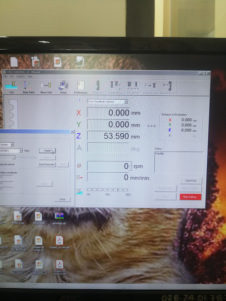<figcaption></figcaption></figure>


[hacer-un-fresado-del-cerro-leon.md](../cnc/obtencion-de-modelo-3d-topografico/hacer-un-fresado-del-cerro-leon.md)


En la documentación _<mark style="color:purple;">**Hacer un fresado**</mark>_ _<mark style="color:purple;">**del Cerro León**</mark>_ se describe varios pasos del uso de la fresadora  Roland.

* El material de trabajo, previamente cortado y adherido con cinta doble faz, fue centrado en la plataforma.

El material fue cortado en dimensiones de 250x250 mm y luego superpuesto para lograr una altura total de 500 mm como se había configurado en VCarve Pro. Ambas piezas se aseguraron mediante cinta de doble faz debido a la limitación de tiempo disponible.

Para marcar el centro de la pieza con diagonales, se puede utilizar una regla como herramienta de referencia. Es fundamental seguir el mismo procedimiento que establecimos previamente en VCarve Pro, donde se definió el eje central como punto de origen.

Posteriormente, el bloque de 500 mm se fijó de manera similar a la plataforma de la rotadora.

<figure><figcaption>
Pieza cortada con la cinta doble faz.
</figcaption></figure>

 

<figure>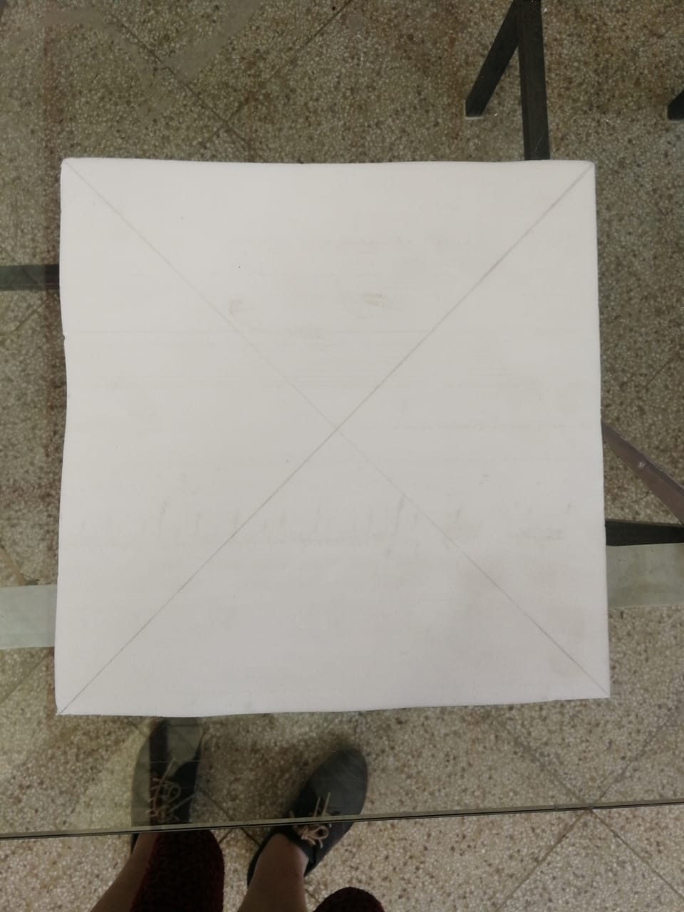<figcaption>
Vista de las diagonales para encontrar el centro.
</figcaption></figure>

<mark style="color:purple;">**2. Centrado de Ejes X e Y:**</mark>

Abrir el V panel para controlar la CNC, conectar a nuestra CNC y continuar.

<figure><figcaption>
selección del ícono de VPanel.
</figcaption></figure>

 

<figure>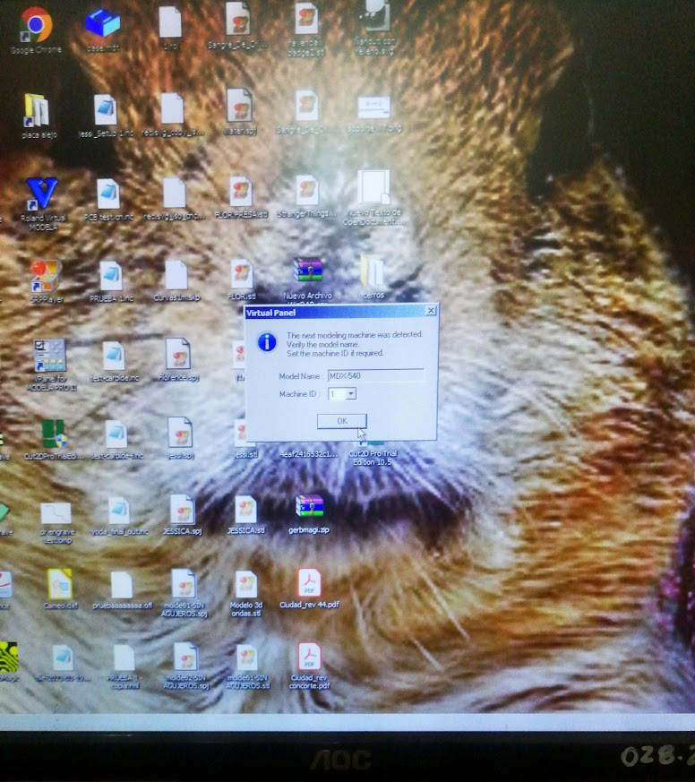<figcaption>
Seleccionar el modelo.
</figcaption></figure>

 

<figure>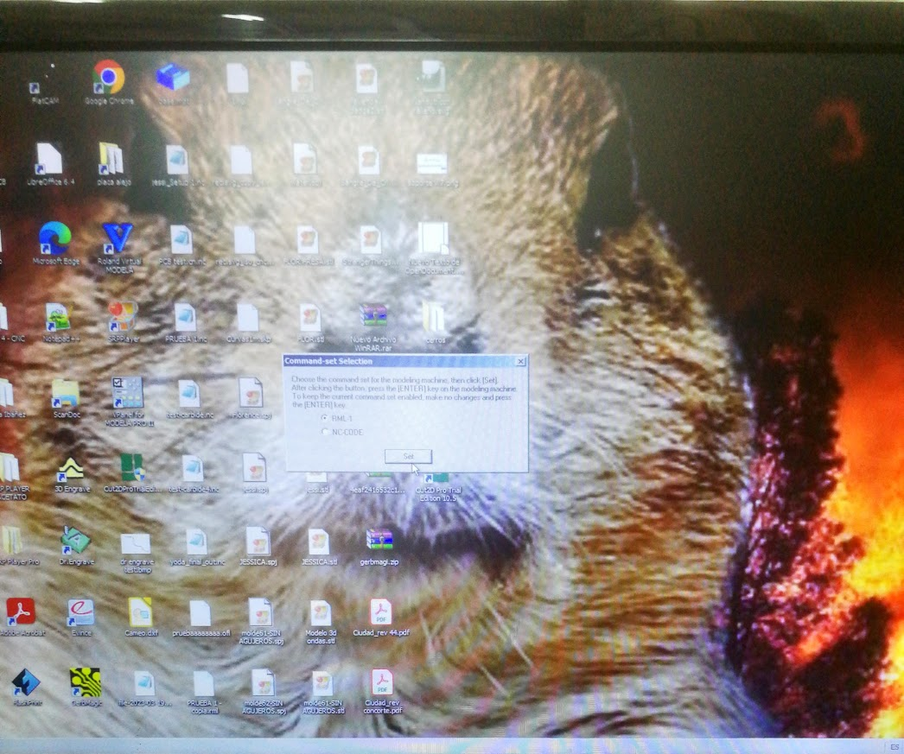<figcaption></figcaption></figure>

<figure>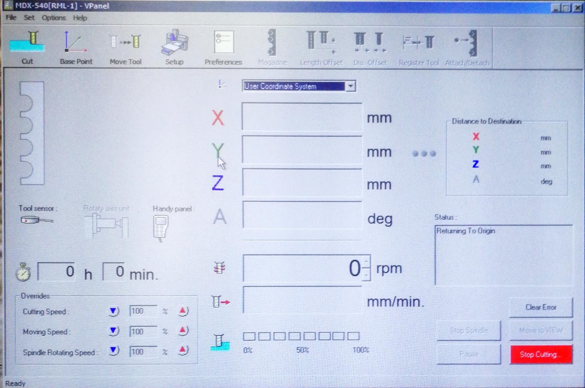<figcaption>
Interfaz abierta del VPanel.
</figcaption></figure>

* Se establecieron el punto 0 de los ejes X e Y utilizando el mando de la fresadora para garantizar una alineación precisa del material con respecto a las coordenadas del programa.

<figure>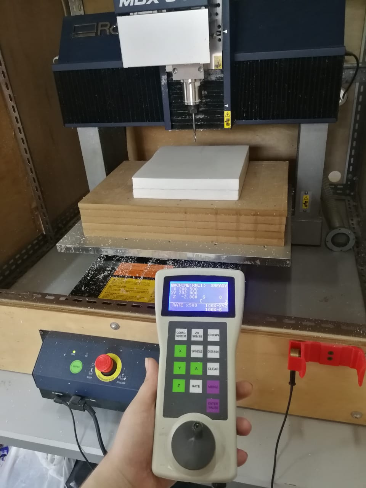<figcaption>
Ubicar el eje X e Y con el mando.
</figcaption></figure>

<mark style="color:purple;">Utilización del mando</mark>

Se debe seleccionar el eje a mover (X, Y o Z) y a continuación trasladar con el joystick.

Vista del VPanel con los ejes trasladados sin haber fijado el punto 0.

<figure>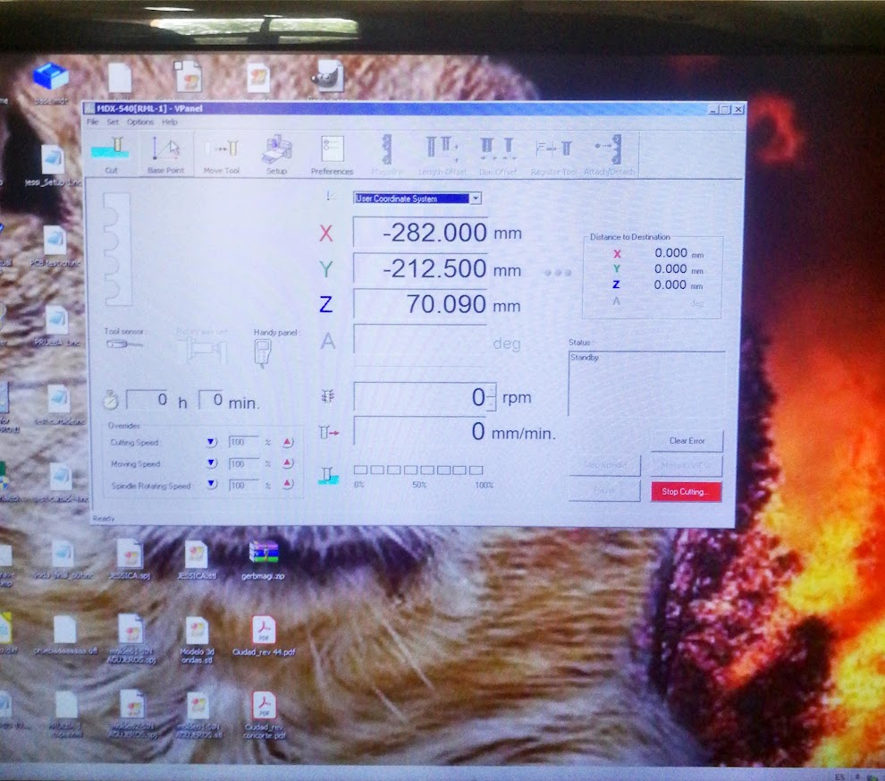<figcaption></figcaption></figure>

Dirigirse en el menú superior, donde encontramos la herramienta <mark style="color:purple;">**Base Point**</mark>.

<figure>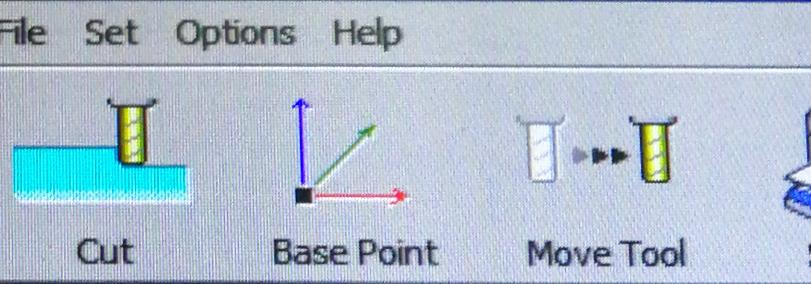<figcaption>
Seleccionar Base Point.
</figcaption></figure>

Base Point nos abrirá la siguiente emergente. Seleccionar Set XY HOME here Apply.

<figure>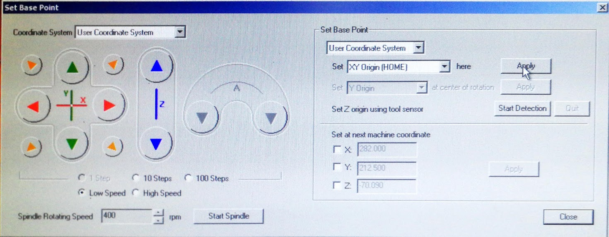<figcaption>
Menú emergente de Base Point.
</figcaption></figure>

<figure>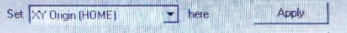<figcaption>
Seleccionar Set XY HOME here Apply.
</figcaption></figure>

De esta manera el eje XX e Y queda en 0 en la CNC, lo que se comprueba en VPanel.

<figure><figcaption></figcaption></figure>

<mark style="color:purple;">**3. Centrado del Eje Z:**</mark>

* Para el eje Z, se utilizó el imán de la máquina para asegurar una referencia precisa. Este paso es crucial para la profundidad correcta de fresado y la calidad del resultado final.

El sensor del eje Z es la herramienta cilíndrica que se encuentra guardado cerca del mando, el cual debemos ubicar debajo de la broca, sobre el centro marcado por las diagonales.

<figure><figcaption></figcaption></figure>

En el mismo menú emergente de Base Point seleccionamos Start Detection del Set Z origin using tool sensor.

<figure><figcaption>
Menú de Base Point.
</figcaption></figure>

<figure><figcaption>
Seleccionar Start Detection.
</figcaption></figure>

El Start Detection moverá automáticamente la broca hasta la herramienta cilíndrica dos veces para fijar el punto 0 en el eje Z.



Luego de la detección del Z ya no tenemos ninguna operación que realizar en este menú y podemos seleccionar Close para cerrar eñ menú de Base Point.

<figure><figcaption></figcaption></figure>

<mark style="color:purple;">**4. Importación Secuencial de Códigos G:**</mark>

* Se importaron por turno los códigos G generados en VCarve Pro. Primero, se procesó el código de fresado para esculpir las montañas, seguido por el código de perfil para eliminar excedentes en los laterales y obtener la forma final deseada.

Ahora debemos seleccionar <mark style="color:purple;">**Cut**</mark>, que se encuentra a lado del menú de <mark style="color:purple;">**Base Point**</mark> que acabamos de utilizar.

<figure><figcaption></figcaption></figure>

Cut abrirá la ventana emergente donde podemos importar el <mark style="color:purple;">**GCode**</mark> que creamos en <mark style="color:purple;">**VCarve Pro**</mark>.&#x20;

<figure>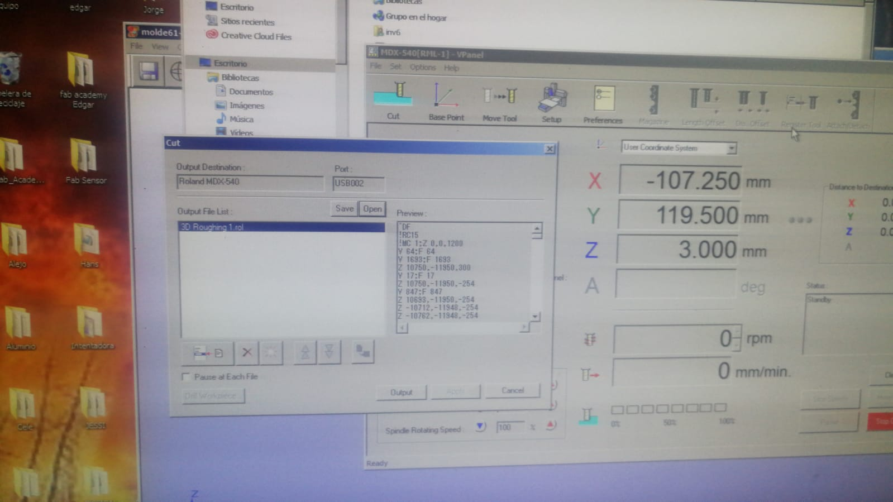<figcaption></figcaption></figure>

Seleccionamos el ícono de <mark style="color:purple;">**Load**</mark> ubicado en las operaciones de la zona inferior izquierda.

<figure><figcaption>
Seleccionar el ícono de Load.
</figcaption></figure>

Se abrirá la ventana para buscar nuestros GCode en el equipo.&#x20;

<figure>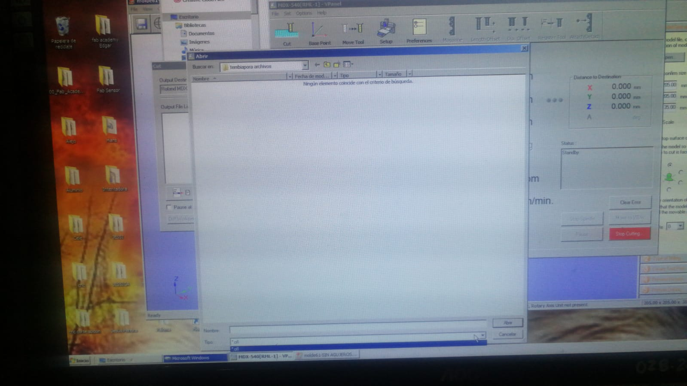<figcaption></figcaption></figure>

 

<figure>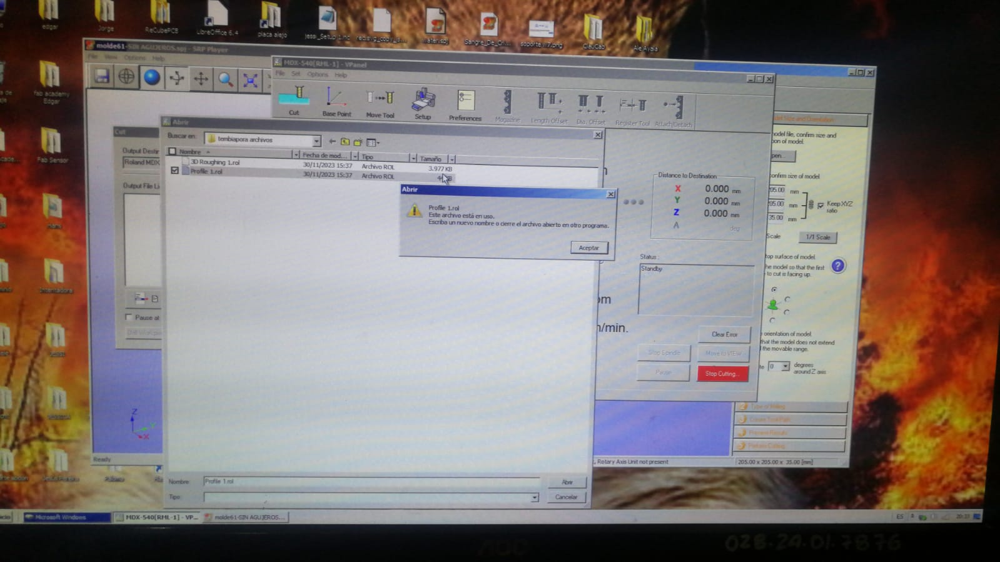<figcaption></figcaption></figure>

<mark style="color:purple;">**5. Proceso de Fresado de Montañas:**</mark>

* Se ejecutó el código G correspondiente al fresado de las montañas. La fresadora siguió las instrucciones para esculpir las elevaciones y detalles precisos del terreno.

<figure><figcaption>
Selección del GCode de 3D Roughthing 1.rol
</figcaption></figure>

Para ejecutar el GCode debemos seleccionar Output.

<figure><figcaption></figcaption></figure>


Proceso de fresado de 3D Roughing.


<mark style="color:purple;">**6. Cambio y Proceso de Fresado de Perfil:**</mark>

* Después de completar el fresado de las montañas, se cambió a la herramienta necesaria y se procesó el código de perfil. Esto eliminó los excedentes laterales, proporcionando la forma final de la pieza.

<figure><figcaption>
Selección del GCode de Profile 1.rol
</figcaption></figure>

<figure>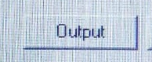<figcaption>
Seleccionar output para ejecutar el GCode.
</figcaption></figure>


Proceso de fresado de Profile.


<mark style="color:purple;">**7. Evaluación Continua:**</mark>

* Durante todo el proceso, se llevó a cabo una evaluación continua para asegurar que la fresadora estuviera siguiendo las trayectorias correctas y que el material se estuviera trabajando según lo planificado.

<mark style="color:purple;">**8. Finalización y Extracción:**</mark>

* Una vez que ambos códigos G se completaron con éxito, se detuvo la fresadora. La pieza final fresada fue cuidadosamente retirada de la mesa.

### <mark style="color:purple;">Resultado del terreno de Tembiaporã fresado</mark>

<figure><figcaption></figcaption></figure>

## <mark style="color:purple;">Comparaciones entre los modelos obtenidos</mark>

<figure>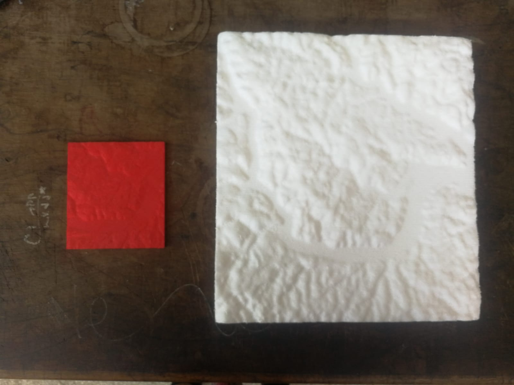<figcaption></figcaption></figure>

<table><thead><tr><th width="196.33333333333331">Aspecto</th><th>Terrain2STL (Impresión 3D)</th><th>Maps2STL (Fresado CNC)</th></tr></thead><tbody><tr><td><mark style="color:purple;"><strong>Resolución y Detalle</strong></mark></td><td>Alta resolución y detalle.</td><td>Resolución más baja (LowPoly)</td></tr><tr><td><mark style="color:purple;"><strong>Tamaño del Modelo</strong></mark></td><td>Puede ser muy pequeño. En casos grandes, pérdida innecesaria de filamento y tiempo.</td><td>Tarda, pero el resultado cumple expectativas.</td></tr><tr><td><mark style="color:purple;"><strong>Experiencia de Usuario</strong></mark></td><td>Para comprobar las configuraciones se debe descargar el archivo innecesariamente.</td><td>Permite la previsualización del archivo online. Interfaz agradable y fácil de usar. </td></tr><tr><td><mark style="color:purple;"><strong>Mejoras Necesarias</strong></mark></td><td>Utilizar Meshmixer para optimizar el modelo para la impresión.</td><td>Se debe suavizar el mesh del objeto sin falta o de lo contrario el resultado no será satisfactorio.</td></tr><tr><td><mark style="color:purple;"><strong>Conclusión</strong></mark></td><td>Ideal para modelos pequeños.</td><td>Eficiente para proyectos a mayor escala.</td></tr><tr><td><mark style="color:purple;"><strong>Observaciones</strong></mark></td><td>Modelos grandes pueden ser una pérdida innecesaria de recursos.</td><td>Requiere mejoras previas, pero ofrece flexibilidad y eficiencia.</td></tr></tbody></table>

