# Proceso de Creación de Referencias Auxiliares para la Ubicación de Tembiaporã

Como respaldo para determinar con mayor precisión la ubicación, decidí emplear los mapas políticos de Caaguazú y Paraguay para proporcionar referencias del terreno de Tembiaporã, el cual ya había sido reproducido mediante impresión 3D y fresado CNC, y se encuentra disponible en la página:&#x20;


[procesado-del-terreno-de-vista-satelital-de-tembiapora..md](procesado-del-terreno-de-vista-satelital-de-tembiapora..md)


En la web, no se encuentran mapas específicos del distrito de Tembiaporã, el cual fue colonizado recientemente.


Pruebas de su reciente colonización.


&#x20;La única representación disponible son los mapas satelitales que ya han sido materializados tanto en impresión 3D como en fresado CNC. Sin embargo, se encuentran varios  mapas de Caaguazú, el cual es esencial para ubicar Tembiaporã (distrito de Caaguazú), aunque no está claramente definido su ilustración. También contamos con un mapa general de Paraguay.

<figure><figcaption>
Mapa de Tembiaporã encontrado en internet.
</figcaption></figure>

<figure>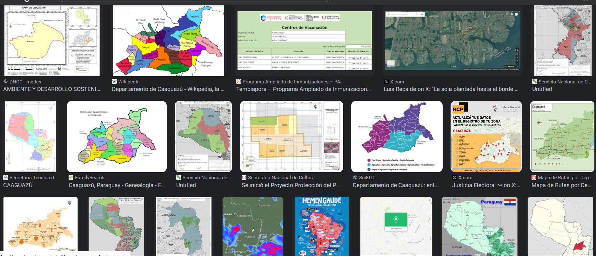<figcaption>
Resultados de la búsqueda.
</figcaption></figure>

<figure><figcaption>
Se observan pocos resultados de en la búsqueda del mapa de Tembiaporã y la mayoría es del mapa de Caaguazú.
</figcaption></figure>

<figure><figcaption>
Mapa político de Caaguazú.
</figcaption></figure>

<figure>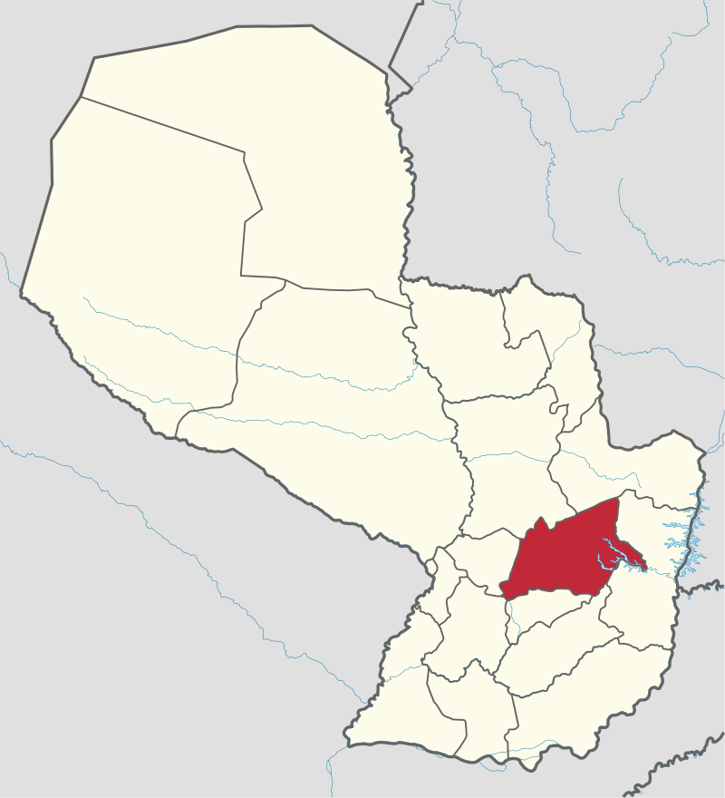<figcaption>
Mapa político del Paraguay donde podemos ubicar el departamento de Caaguazú.
</figcaption></figure>

Utilizando los mapas políticos de Caaguazú y Paraguay como referencia auxiliar, procederemos a importar ambos a Inkscape para iniciar nuestro trabajo.

## <mark style="color:purple;">Inkscape</mark>

Para empezar cree una mesa de trabajo de dimensiones de A3 en posición horizontal.

Luego importé los archivos con las siguientes configuraciones.

El siguiente proceso será similar al utilizado en el proyecto de la creación del sticker con el Plotter de Vinilo.


[crear-un-diseno-2d-multicapa](../plotter-de-vinilo/crear-un-diseno-2d-multicapa/)


En términos generales, el procedimiento implicará la importación y vectorización de los archivos de mapa de bits.

* Dirígete al menú superior, selecciona 'Archivo' e elige la opción 'Importar'.

<figure>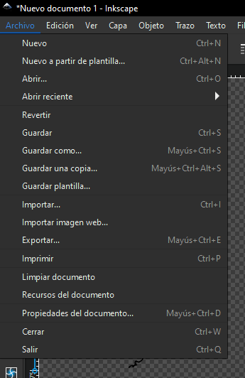<figcaption>
Seleccionar Importar en el menú de Archivo.
</figcaption></figure>

* Opciones de configuraciones al importar una imagen en Inkscape.

<figure><figcaption>
Ambos mapas fueron redactados con estos parámetros.
</figcaption></figure>

<table><thead><tr><th width="147">Opción</th><th>Descripción</th><th></th></tr></thead><tbody><tr><td><mark style="color:purple;"><strong>Tipo de imagen importada</strong></mark></td><td>Puedes elegir entre <mark style="color:purple;"><strong>Incrustar</strong></mark> o <mark style="color:purple;"><strong>Enlazar</strong></mark> la imagen de mapa de bits.  </td><td>Si eliges <mark style="color:purple;"><strong>Incrustar</strong></mark>, la imagen se almacenará dentro del archivo SVG de Inkscape, haciendo que el archivo sea más grande pero también más portátil.</td></tr><tr><td></td><td></td><td>Si eliges <mark style="color:purple;"><strong>Enlazar</strong></mark>, la imagen se referenciará desde su ubicación original, resultando en un archivo más pequeño pero dependiente de la disponibilidad de la imagen.</td></tr><tr><td><mark style="color:purple;"><strong>PPP de la imagen</strong></mark></td><td>Puedes elegir entre <mark style="color:purple;"><strong>Desde archivo</strong></mark> o <mark style="color:purple;"><strong>Predeterminar</strong></mark> los píxeles por pulgada (PPP) de la imagen. </td><td>Con <mark style="color:purple;"><strong>Desde archivo</strong></mark>, Inkscape intentará leer la resolución de la imagen del archivo de origen. </td></tr><tr><td></td><td></td><td>Con <mark style="color:purple;"><strong>Predeterminar</strong></mark>, Inkscape utilizará la resolución predeterminada que hayas establecido en las preferencias del programa.</td></tr><tr><td><mark style="color:purple;"><strong>Modo de renderizado de la imagen</strong></mark></td><td>Puedes seleccionar entre <mark style="color:purple;"><strong>Ninguno (auto)</strong></mark>, <mark style="color:purple;"><strong>Suave (optimizeQuality)</strong></mark> o <mark style="color:purple;"><strong>Bloques (optimizeSpeed)</strong></mark> para el modo de renderizado de la imagen. Este ajuste afecta la forma en que Inkscape muestra la imagen en pantalla, aunque no impacta la calidad real de la imagen. </td><td>Con <mark style="color:purple;"><strong>Ninguno (auto)</strong></mark>, Inkscape decidirá el mejor modo de renderizado según el tamaño y el zoom de la imagen.</td></tr><tr><td></td><td></td><td>Con <mark style="color:purple;"><strong>Suave (optimizeQuality)</strong></mark>, se usará un algoritmo de interpolación para suavizar los bordes, lo cual puede afectar el rendimiento. </td></tr><tr><td></td><td></td><td> Con <mark style="color:purple;"><strong>Bloques (optimizeSpeed)</strong></mark>, se empleará un algoritmo de muestreo que muestra la imagen en bloques, acelerando el rendimiento.</td></tr><tr><td><mark style="color:purple;"><strong>No volver a preguntar</strong></mark></td><td>Marca esta casilla si deseas que Inkscape recuerde tus opciones de importación y no te vuelva a mostrar esta caja de diálogo.</td><td></td></tr></tbody></table>

A continuación podemos editarlo en <mark style="color:purple;">**Vectorizar mapa de Bits.**</mark>

<table><thead><tr><th width="171.5">Modo</th><th>Descripción</th></tr></thead><tbody><tr><td><mark style="color:purple;"><strong>Umbral</strong></mark></td><td>Divide la imagen en blanco y negro según un nivel de brillo ajustable. Útil para imágenes en blanco y negro o con alto contraste. Puede perder detalles o generar ruido en imágenes con muchos tonos o colores.</td></tr><tr><td><mark style="color:purple;"><strong>Detección de bordes</strong></mark></td><td>Busca los bordes donde cambia el brillo o el color de la imagen y los convierte en curvas. Útil para imágenes con formas definidas y bordes claros, pero puede generar curvas complejas en imágenes con bordes difusos.</td></tr><tr><td><mark style="color:purple;"><strong>Cuantización de color</strong></mark></td><td>Reduce el número de colores de la imagen y vectoriza cada color por separado, apilándolos en capas. Útil para imágenes con muchos colores o gradientes, pero puede generar muchas capas o perder transparencias.</td></tr><tr><td><mark style="color:purple;"><strong>Brillo/Contraste</strong></mark></td><td>Ajusta el brillo y el contraste de la imagen antes de vectorizarla con el modo <mark style="color:purple;"><strong>Umbral</strong></mark>. Útil para mejorar la calidad de la vectorización de imágenes con poco contraste o brillo, pero puede alterar los colores originales.</td></tr><tr><td><mark style="color:purple;"><strong>Múltiple escaneo</strong></mark></td><td>Combina los modos <mark style="color:purple;"><strong>Umbral</strong></mark> y <mark style="color:purple;"><strong>Cuantización de color</strong>.</mark> Reduce el número de colores, vectoriza cada color por separado con el modo <strong>Umbral</strong> y apila las capas según el orden ajustable. Útil para imágenes con muchos colores y detalles, pero puede generar muchas capas y curvas.</td></tr></tbody></table>

<table><thead><tr><th width="210.5">Parámetro</th><th>Descripción</th></tr></thead><tbody><tr><td><mark style="color:purple;"><strong>Umbral</strong></mark></td><td>Ajusta el nivel de brillo que divide la imagen en blanco y negro. Valores más altos consideran más píxeles como blancos, haciendo la imagen intermedia más oscura. Valores más bajos consideran más píxeles como negros, haciendo la imagen intermedia más clara.</td></tr><tr><td><mark style="color:purple;"><strong>Desenfoque</strong></mark></td><td>Aplica un efecto de desenfoque a la imagen antes de vectorizarla. Valores más altos suavizan más los bordes y detalles, reduciendo detalles y ruido. Valores más bajos conservan más detalles y nitidez en la imagen.</td></tr><tr><td><mark style="color:purple;"><strong>Manchas</strong></mark></td><td>Elimina manchas o píxeles aislados que pueden generar ruido en la vectorización. Valores más altos eliminan más píxeles, simplificando la imagen. Valores más bajos conservan más píxeles, complicando la imagen.</td></tr><tr><td><mark style="color:purple;"><strong>Número de colores</strong></mark></td><td>Determina el número de colores que se usan para vectorizar la imagen. Valores más altos conservan más colores, generando más detalle. Valores más bajos reducen colores, generando menos detalle.</td></tr><tr><td><mark style="color:purple;"><strong>Apilamiento</strong></mark></td><td>Determina el orden en que se apilan las capas de cada color en la vectorización. Puede ser <mark style="color:purple;"><strong>Más oscuro arriba</strong></mark> (genera sombras) o <mark style="color:purple;"><strong>Más claro arriba</strong></mark> (genera brillos o transparencias).</td></tr></tbody></table>

<table><thead><tr><th width="162.5">Opción</th><th>Descripción</th></tr></thead><tbody><tr><td><mark style="color:purple;"><strong>Vista en directo</strong></mark></td><td>Permite ver una vista previa de la vectorización antes de aceptarla. Se activa/desactiva con la casilla <mark style="color:purple;"><strong>Vista en directo</strong></mark>. Si está activa, se muestra una vista previa en el lienzo. Si está desactivada, se muestra la imagen original en el lienzo.</td></tr><tr><td><mark style="color:purple;"><strong>Eliminar fondo</strong></mark></td><td>Permite eliminar el color de fondo de la imagen antes de vectorizarla. Se activa/desactiva con la casilla <mark style="color:purple;"><strong>Eliminar fondo</strong></mark>. Si está activa, se detecta y elimina el color de fondo. Si está desactivada, se conserva el color de fondo.</td></tr><tr><td><mark style="color:purple;"><strong>Invertir imagen</strong></mark></td><td>Permite invertir los colores de la imagen antes de vectorizarla. Se activa/desactiva con la casilla <mark style="color:purple;"><strong>Invertir imagen</strong></mark>. Si está activa, se cambian los colores de la imagen por sus opuestos. Si está desactivada, se mantienen los colores originales.</td></tr><tr><td><mark style="color:purple;"><strong>Suavizar</strong></mark></td><td>Permite suavizar las curvas de la vectorización. Se activa/desactiva con la casilla <mark style="color:purple;"><strong>Suavizar</strong></mark>. Si está activa, se aplican algoritmos de suavizado a las curvas. Si está desactivada, se conservan las curvas originales sin modificar.</td></tr><tr><td><mark style="color:purple;"><strong>Optimizar rutas</strong></mark></td><td>Permite optimizar las rutas de la vectorización. Se activa/desactiva con la casilla <mark style="color:purple;"><strong>Optimizar rutas</strong></mark>. Si está activa, se eliminan nodos innecesarios de las rutas. Si está desactivada, se conservan todos los nodos de las rutas sin modificar.</td></tr></tbody></table>

Ahora que contamos con la información sobre qué hace cada parámetro procedemos a editar para obtener los vectores de la imagen.

<figure><figcaption></figcaption></figure>

<figure>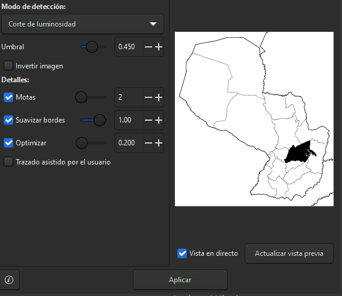<figcaption></figcaption></figure>

<table><thead><tr><th width="172">Parámetro</th><th>Función</th><th>Imagen</th></tr></thead><tbody><tr><td>Modo de detección</td><td>Permite elegir el tipo de detección de bordes que se aplica a la imagen antes de vectorizarla.</td><td></td></tr><tr><td>Corte de luminosidad</td><td>Permite ajustar el nivel de luminosidad que se usa para definir los bordes de la imagen.</td><td></td></tr><tr><td>Detalles</td><td>Permite ajustar el nivel de detalle que se conserva en la vectorización.</td><td></td></tr><tr><td>Invertir imagen</td><td>Permite invertir los colores de la imagen antes de vectorizarla.</td><td></td></tr><tr><td>Suavizar bordes</td><td>Permite suavizar los bordes de la vectorización para reducir el ruido y las irregularidades.</td><td></td></tr><tr><td>Optimizar</td><td>Permite optimizar las rutas de la vectorización para reducir el tamaño y la complejidad del archivo.</td><td></td></tr><tr><td>Trazado asistido por el usuario</td><td>Permite dibujar manualmente el trazado de la vectorización sobre la imagen.</td><td></td></tr></tbody></table>

<figure><figcaption></figcaption></figure>

 

<figure>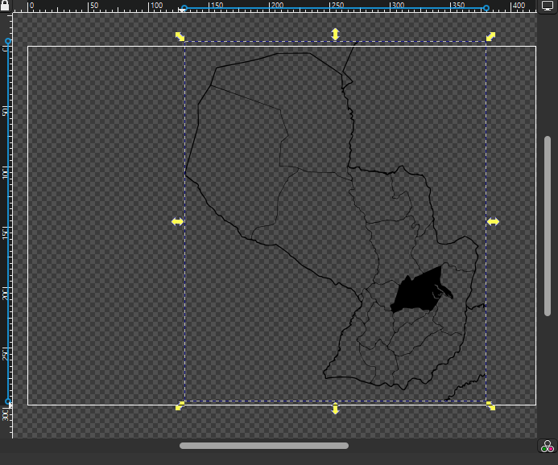<figcaption></figcaption></figure>

&#x20;Se generarán las pasadas necesarias para segmentar tanto el departamento de Caaguazú como el distrito de Tembiaporã de cada mapa.&#x20;

<figure>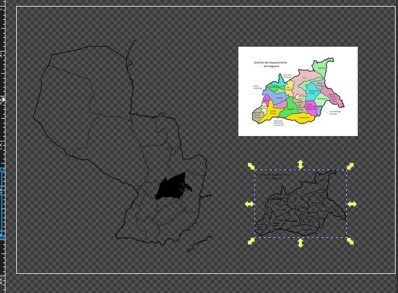<figcaption></figcaption></figure>

<figure><figcaption></figcaption></figure>

<figure>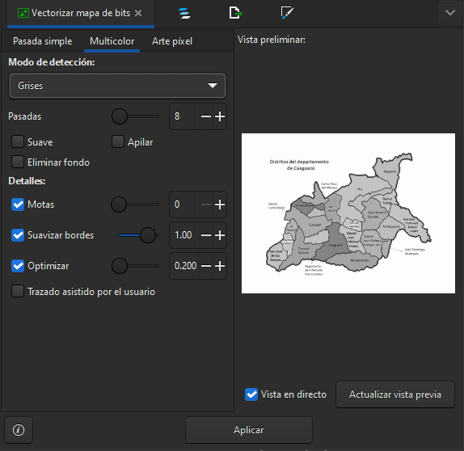<figcaption></figcaption></figure>

<figure>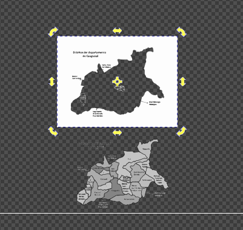<figcaption></figcaption></figure>

<figure>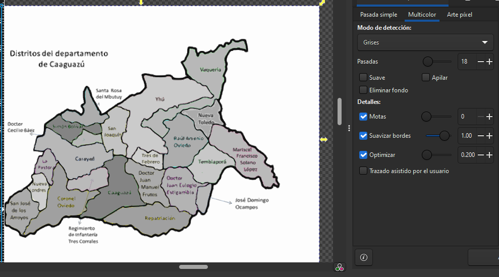<figcaption></figcaption></figure>

<figure>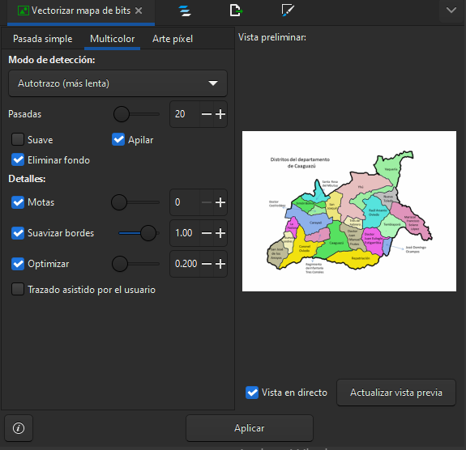<figcaption></figcaption></figure>

<figure><figcaption>
La idea es que coincida de esta manera 
</figcaption></figure>

Posteriormente, se exportarán estas figuras específicas con el propósito de crear stickers de vinilo mediante la plotteadora.&#x20;

<figure>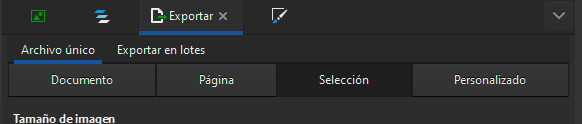<figcaption></figcaption></figure>

<figure>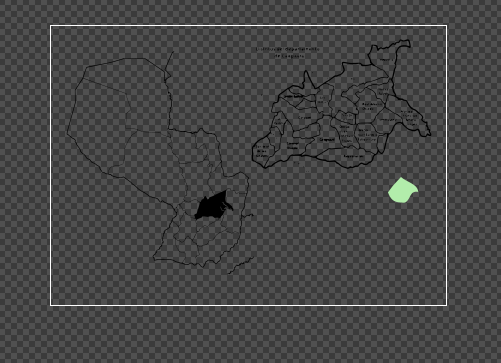<figcaption></figcaption></figure>

<figure>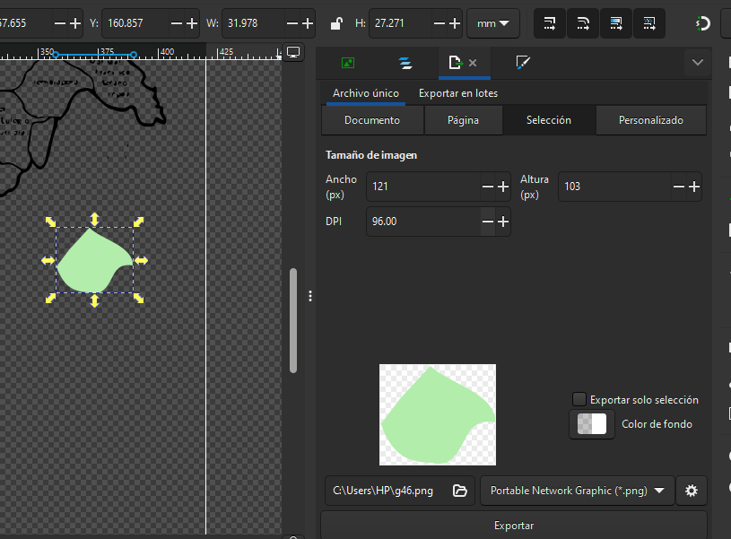<figcaption></figcaption></figure>

<figure>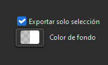<figcaption></figcaption></figure>

<figure>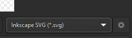<figcaption></figcaption></figure>

<figure>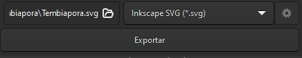<figcaption></figcaption></figure>





Además, utilizando los vectores del contorno de los mapas, se realizará una exportación en formato .dxf para su procesamiento en la cortadora láser."

<figure>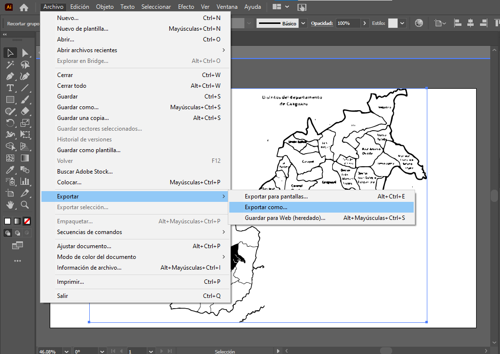<figcaption>
Seleccionar Exportar como.
</figcaption></figure>

<figure>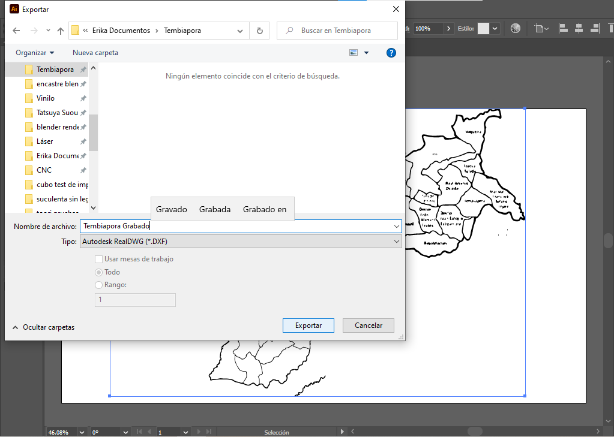<figcaption>
Escribir el nombre del archivo y elegir el formato .dxf
</figcaption></figure>


Archivo descargable dxf.


## <mark style="color:purple;">Corte Láser</mark>

Importaremos el archivo .dxf en Power Cut con <mark style="color:purple;">**Load**</mark> lo cual se registra en la siguiente documentación:


[corte-laser.md](../corte-laser.md)


En la documentación se encuentra registrado pasos generales de corte láser.

Se decide borrar la tipografía en PowerCut y reemplazar con la herramienta Texto de PowerCut.


La herramienta texto no reconoce palabras con acento, y menos con acento nasal, simplemente no escribe las letras acentuadas. Este problema podía haber sido resuelto escribiendo el texto en Rhino.


Con las palabras sin ningún acento se procede a ¨cortar¨ el archivo con una Potencia de 100 y velocidad de 10.


Debido a que actualmente la página no se encuentra funcionando bien debemos usar Cut en lugar de grabado, ya que no corta en una sola pasada.

Para cortar el borde repasaremos la operación varias veces.


Para cortar el borde cambiaremos el borde a otra capa y configuraremos con los mismos parámetros, para lograr cortar el borde repasaremos las pasadas.

***

Para la figura a cortar en vinilo repetiremos las operacionesn hechas en Inkscape para extraer la figura del departamento y el distrito de Tembiaporã.&#x20;

Exportaremos en formato <mark style="color:purple;">**.svg**</mark>

En el programa <mark style="color:purple;">**RDWorks**</mark> importaremos el archivo <mark style="color:purple;">**.svg**</mark> y lo exportaremos como .pl.

Los pasos a seguir en <mark style="color:purple;">**RDWorks**</mark> serán los genéricos en cualquier programa para exportar vectores en otro formato. Se seleccionará exportar como, escribir un nombre al archivo y cambiar el formato a exportar a <mark style="color:purple;">**.pl**</mark>.

Luego se abrira <mark style="color:purple;">**GCC Uploader**</mark> para exportar el archivo a la plotteadora de vinilo, para utilizar la plotteadora de vinilo se deben seguir los pasos de la siguiente documentación.


[corte-de-vinilo-con-plotter.md](../plotter-de-vinilo/crear-un-diseno-2d-multicapa/corte-de-vinilo-con-plotter.md)


### <mark style="color:purple;">Resultado Final</mark>

