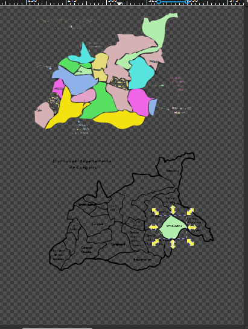

# Proceso de Creación de Referencias Auxiliares para la Ubicación de Tembiaporã

Como respaldo para determinar con mayor precisión la ubicación, decidí emplear los mapas políticos de Caaguazú y Paraguay para proporcionar referencias del terreno de Tembiaporã, el cual ya había sido reproducido mediante impresión 3D y fresado CNC, y se encuentra disponible en la página:&#x20;


[procesado-del-terreno-de-vista-satelital-de-tembiapora..md](procesado-del-terreno-de-vista-satelital-de-tembiapora..md)


En la web, no se encuentran mapas específicos del distrito de Tembiaporã, el cual fue colonizado recientemente.


Pruebas de su reciente colonización.


&#x20;La única representación disponible son los mapas satelitales que ya han sido materializados tanto en impresión 3D como en fresado CNC. Sin embargo, se encuentran varios  mapas de Caaguazú, el cual es esencial para ubicar Tembiaporã (distrito de Caaguazú), aunque no está claramente definido su ilustración. También contamos con un mapa general de Paraguay.

<figure><figcaption>
Mapa de Tembiaporã encontrado en internet.
</figcaption></figure>

<figure><figcaption>
Resultados de la búsqueda.
</figcaption></figure>

<figure><figcaption>
Se observan pocos resultados de en la búsqueda del mapa de Tembiaporã y la mayoría es del mapa de Caaguazú.
</figcaption></figure>

<figure><figcaption>
Mapa político de Caaguazú.
</figcaption></figure>

<figure><figcaption>
Mapa político del Paraguay donde podemos ubicar el departamento de Caaguazú.
</figcaption></figure>

Utilizando los mapas políticos de Caaguazú y Paraguay como referencia auxiliar, procederemos a importar ambos a Inkscape para iniciar nuestro trabajo.

## <mark style="color:purple;">Inkscape</mark>

Para empezar cree una mesa de trabajo de dimensiones de A3 en posición horizontal.

Luego importé los archivos con las siguientes configuraciones.

El siguiente proceso será similar al utilizado en el proyecto de la creación del sticker con el Plotter de Vinilo.


[crear-un-diseno-2d-multicapa](../plotter-de-vinilo/crear-un-diseno-2d-multicapa/)


En términos generales, el procedimiento implicará la importación y vectorización de los archivos de mapa de bits.

<figure><figcaption></figcaption></figure>

<figure><figcaption>
Ambos mapas fueron redactados con estos parámetros.
</figcaption></figure>

<figure><figcaption></figcaption></figure>

<figure><figcaption></figcaption></figure>

<figure><figcaption></figcaption></figure>

<figure><figcaption></figcaption></figure>

&#x20;Se generarán las pasadas necesarias para segmentar tanto el departamento de Caaguazú como el distrito de Tembiaporã de cada mapa.&#x20;

<figure><figcaption></figcaption></figure>

<figure><figcaption></figcaption></figure>

<figure><figcaption></figcaption></figure>

<figure><figcaption></figcaption></figure>

<figure><figcaption></figcaption></figure>

<figure><figcaption></figcaption></figure>

<figure><figcaption>
La idea es que coincida de esta manera 
</figcaption></figure>

Posteriormente, se exportarán estas figuras específicas con el propósito de crear stickers de vinilo mediante la plotteadora.&#x20;

<figure><figcaption></figcaption></figure>

<figure><figcaption></figcaption></figure>

<figure><figcaption></figcaption></figure>

<figure><figcaption></figcaption></figure>

<figure><figcaption></figcaption></figure>

<figure><figcaption></figcaption></figure>





Además, utilizando los vectores del contorno de los mapas, se realizará una exportación en formato .dxf para su procesamiento en la cortadora láser."

<figure><figcaption></figcaption></figure>

<figure><figcaption></figcaption></figure>



