# Cubos

Para empezar simplemente utilizamos un default cube de algún programa 3D y lo exportamos como .stl a FlashPrint.

<div>

<figure>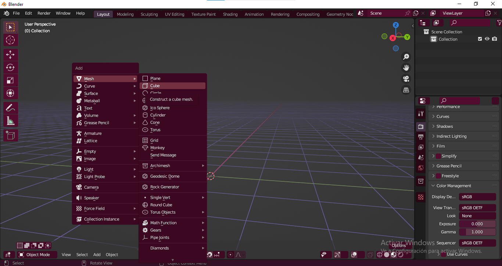<figcaption><p>Agregar un Cubo.</p></figcaption></figure>

 

<figure>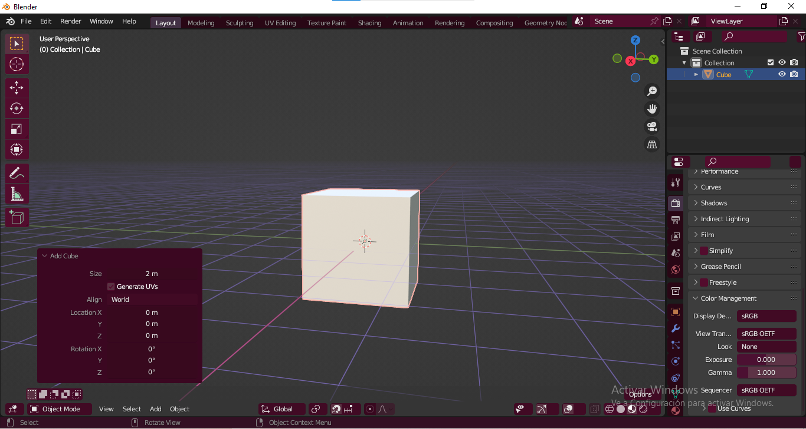<figcaption><p>Vista del cubo y dimesiones en pantalla.</p></figcaption></figure>

</div>

<figure>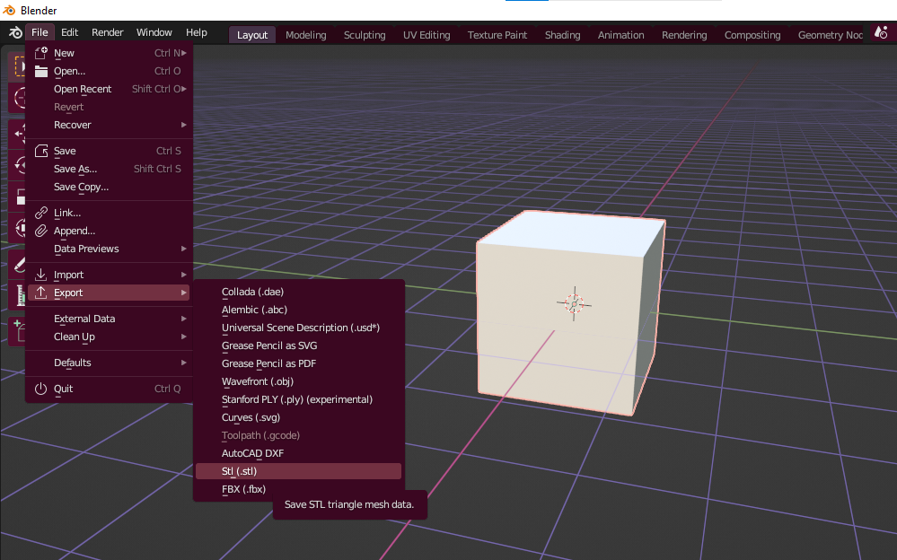<figcaption><p>Exportar en formato .stl</p></figcaption></figure>

## FlashPrint

En FlashPrint importamos el archivo .stl del cubo.

<figure>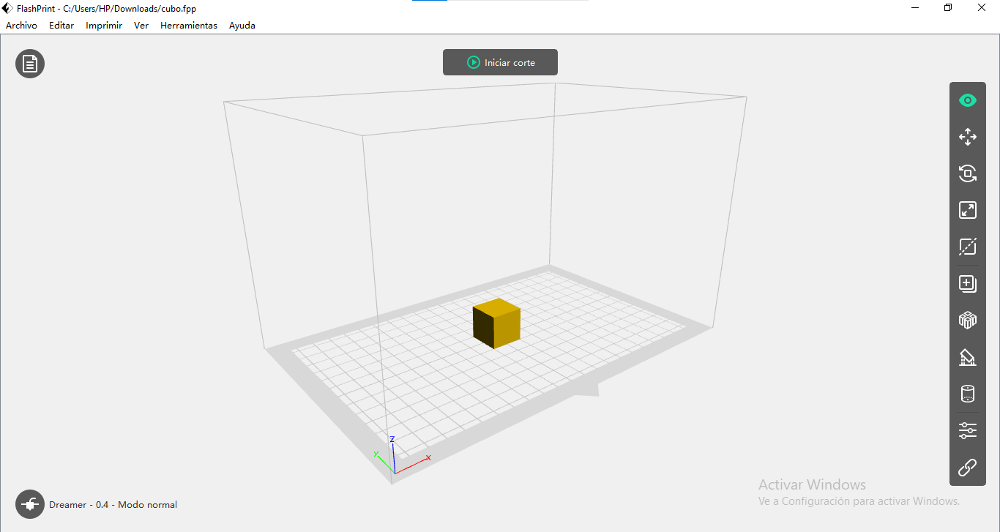<figcaption><p>Archivo importado en FlashPrint.</p></figcaption></figure>

Podemos modificarlo en cuanto a la escala, este modelo no necesita soportes.

Es conveniente mantener un tamaño pequeño para agilizar el tiempo de impresión.

<figure><figcaption><p>Vista de las dimensiones escaladas del cubo para la impresión.</p></figcaption></figure>

## <mark style="color:purple;">Propiedades Generales de Temperatura</mark>

En general todos los test serán impresos con filamento PLA con los siguientes parámetros de temperatura para el extrusor y la plataforma.

Para ingresar a editar estos parámetros seleccionamos **iniciar corte** para acceder a esta ventana emergente.

<figure><figcaption><p>Vista de la configuración de temperatura en FlashPrint.</p></figcaption></figure>

## <mark style="color:purple;">Test de Alto de Capa</mark>

<details>

<summary><mark style="color:purple;"><strong>¿En qué influye la altura de capa?</strong></mark></summary>

La altura de capa en una impresión 3D es uno de los parámetros clave que influyen en la calidad, velocidad y apariencia del objeto impreso.

1. <mark style="color:purple;">**Resolución y Detalles:**</mark>
   * **Baja Altura de Capa (por ejemplo, 0.10 mm):** Permite una mayor resolución y detalles finos en la impresión. Es ideal para modelos con superficies curvas y detalles pequeños.
   * **Alta Altura de Capa (por ejemplo, 0.30 mm):** Reduce la resolución y los detalles. Es útil para impresiones rápidas de objetos grandes donde la precisión fina no es crítica.
2. <mark style="color:purple;">**Tiempo de Impresión:**</mark>
   * **Baja Altura de Capa:** Aumenta el tiempo de impresión debido a la mayor cantidad de capas necesarias para construir el objeto.
   * **Alta Altura de Capa:** Reduce el tiempo de impresión, ya que se requieren menos capas para construir el objeto.
3. <mark style="color:purple;">**Superficie de Acabado:**</mark>
   * **Baja Altura de Capa:** Ofrece una superficie más suave y detallada, pero puede aumentar la probabilidad de errores si la impresora no está bien calibrada.
   * **Alta Altura de Capa:** Puede resultar en una superficie más rugosa y menos detallada, pero con menos probabilidad de errores, especialmente en impresoras menos precisas.
4. <mark style="color:purple;">**Adherencia entre Capas:**</mark>
   * **Baja Altura de Capa:** Mejora la adherencia entre capas, ya que hay más puntos de contacto y fusión entre las capas.
   * **Alta Altura de Capa:** Puede haber menos adherencia entre capas, lo que podría afectar la resistencia estructural del objeto impreso.
5. <mark style="color:purple;">**Uso de Material:**</mark>
   * **Baja Altura de Capa:** Requiere más material, ya que hay más capas en total para construir el objeto.
   * **Alta Altura de Capa:** Usa menos material, lo que puede ser beneficioso para impresiones rápidas y económicas.
6. <mark style="color:purple;">**Calibración de la Impresora:**</mark>
   * **Baja Altura de Capa:** Pone más énfasis en la necesidad de una impresora bien calibrada para evitar problemas como capas desalineadas o bandas de impresión.
   * **Alta Altura de Capa:** Puede ser más tolerante a pequeños errores de calibración, pero también puede ocultar problemas potenciales.

Al ajustar la altura de capa, es esencial encontrar un equilibrio según tus necesidades específicas, considerando la velocidad de impresión, la calidad del acabado y la resistencia del objeto. Experimentar con diferentes alturas de capa te permitirá optimizar la configuración para cada impresión.

</details>

### <mark style="color:purple;">Alto de Capa 0.10</mark>

Utilizar una altura de capa de 0.10 mm en una impresión 3D es una elección que se enfoca en obtener una alta resolución y detalles finos en el objeto impreso. Aquí hay algunas características y consideraciones específicas asociadas con una altura de capa de 0.10 mm:

<mark style="color:purple;">**Resolución y Detalles:**</mark>

La impresión con una altura de capa de 0.10 mm proporciona una alta resolución, permitiendo la captura de detalles muy finos en el modelo.

<mark style="color:purple;">**Tiempo de Impresión:**</mark>

La impresión con una altura de capa de 0.10 mm será más lenta en comparación con configuraciones de altura de capa más alta. Cada capa más delgada aumenta el número total de capas y, por lo tanto, el tiempo total de impresión.

<mark style="color:purple;">**Superficie de Acabado:**</mark>

La superficie de acabado será más suave y detallada con una altura de capa de 0.10 mm. Esto es beneficioso para modelos que requieren una apariencia más refinada.

<mark style="color:purple;">**Adherencia entre Capas:**</mark>

La adherencia entre capas será fuerte, ya que hay más puntos de contacto entre capas más finas. Esto resulta en un objeto impreso más robusto y resistente.

<mark style="color:purple;">**Uso de Material:**</mark>

El uso de material será mayor en comparación con alturas de capa más altas. Al tener capas más delgadas, se utiliza más filamento para construir el objeto.

<mark style="color:purple;">**Calibración de la Impresora:**</mark>

Utilizar una altura de capa de 0.10 mm es más exigente en términos de calibración. La impresora debe estar muy bien ajustada para garantizar una precisión adecuada en cada capa.

<mark style="color:purple;">**Detalles Pequeños:**</mark>

Esta configuración es especialmente útil cuando se imprimen modelos que contienen detalles pequeños o superficies curvas que requieren una alta precisión.

<mark style="color:purple;">**Calidad de Superficies Curvas:**</mark>

Una altura de capa más baja mejora la calidad de las superficies curvas y ayuda a evitar escalones o capas visibles en modelos redondeados.

<figure><figcaption><p>Vista de la configuración de alto de capa a 0.10 mm en FlashPrint.</p></figcaption></figure>

### <mark style="color:purple;">Alto de Capa 0.20</mark>

<mark style="color:purple;">**Resolución y Detalles:**</mark>

Una altura de capa de 0.20 mm proporciona un equilibrio entre resolución y velocidad de impresión. Ofrece detalles razonablemente finos sin comprometer demasiado el tiempo total de impresión.

<mark style="color:purple;">**Tiempo de Impresión:**</mark>

La impresión con una altura de capa de 0.20 mm será más rápida que una configuración de alta resolución (por ejemplo, 0.10 mm) pero más lenta que configuraciones de baja resolución (por ejemplo, 0.30 mm).

<mark style="color:purple;">**Superficie de Acabado:**</mark>

La superficie de acabado con una altura de capa de 0.20 mm será más suave en comparación con alturas de capa más altas, pero no alcanzará la misma suavidad que una configuración de 0.10 mm.

<mark style="color:purple;">**Adherencia entre Capas:**</mark>

La adherencia entre capas debería ser adecuada. La fusión de capas será más efectiva que con alturas de capa más altas, proporcionando un objeto impreso más sólido y resistente.

<mark style="color:purple;">**Uso de Material:**</mark>

El uso de material estará en un punto intermedio. Requerirá más material que configuraciones de alta resolución, pero menos que configuraciones de baja resolución.

<mark style="color:purple;">**Calibración de la Impresora:**</mark>

Aunque una altura de capa de 0.20 mm es menos exigente en términos de calibración que configuraciones más bajas, aún es importante mantener una impresora bien calibrada para obtener mejores resultados.

<mark style="color:purple;">**Versatilidad:**</mark>

La altura de capa de 0.20 mm es versátil y es una buena opción para impresiones generales cuando se busca un equilibrio entre velocidad y calidad de impresión.

<figure><figcaption><p>Vista de la configuración de la <strong>Altura de Capa</strong> a 0.20mm en la Ventana de <strong>General</strong> en FlashPrint.</p></figcaption></figure>

### <mark style="color:purple;">Alto de Capa 0.30</mark>

Utilizar una altura de capa de 0.30 mm en una impresión 3D tiene varias implicaciones que pueden ser adecuadas según las necesidades específicas de tu proyecto. Aquí hay algunas características y consideraciones asociadas con una altura de capa de 0.30 mm:

<mark style="color:purple;">**Velocidad de Impresión:**</mark>

La impresión con una altura de capa de 0.30 mm será más rápida en comparación con configuraciones de altura de capa más fina, ya que hay menos capas en total para construir el objeto.

<mark style="color:purple;">**Uso de Material:**</mark>

Utilizará menos material en comparación con alturas de capa más finas, ya que hay menos capas y, por lo tanto, menos filamento utilizado para construir el objeto.

<mark style="color:purple;">**Resolución y Detalles:**</mark>

La resolución será menor, y los detalles finos en el modelo pueden no ser tan precisos o visibles como en configuraciones de altura de capa más fina.

<mark style="color:purple;">**Superficie de Acabado:**</mark>

La superficie de acabado puede ser menos suave y detallada en comparación con alturas de capa más bajas. Pueden aparecer capas más notorias.

<mark style="color:purple;">**Adherencia entre Capas:**</mark>

La adherencia entre capas puede ser menor en comparación con alturas de capa más fina, lo que podría afectar la resistencia estructural del objeto impreso.

<mark style="color:purple;">**Versatilidad y Robustez:**</mark>

Esta configuración es adecuada para impresiones rápidas y robustas donde la alta resolución no es crítica. Es especialmente útil para prototipos rápidos o impresiones donde la apariencia fina no es esencial.

<mark style="color:purple;">**Calibración de la Impresora:**</mark>

Aunque es menos exigente en términos de calibración que configuraciones de altura de capa más fina, aún es importante mantener una impresora bien calibrada para obtener resultados óptimos.

<mark style="color:purple;">**Pruebas de Concepto Rápidas:**</mark>

Una altura de capa de 0.30 mm es útil para pruebas rápidas de concepto donde la velocidad de impresión es crucial y la precisión fina no es esencial.

## <mark style="color:purple;">Test de relleno</mark>

Para los siguientes Test se utilizará **Capa de Sólida Superior** en 0 para poder ver los patrones en el interior del cubo.

<figure>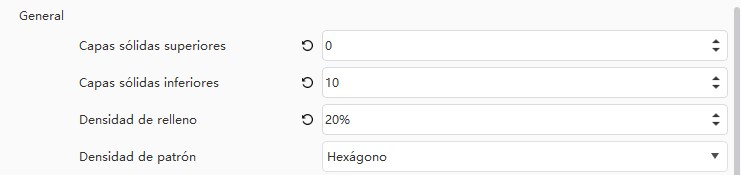<figcaption></figcaption></figure>

El tipo de relleno en una impresión 3D tiene un impacto significativo en la resistencia, peso, tiempo de impresión y consumo de material. Aquí están las formas en que diferentes tipos de relleno pueden influir en una impresión:

<mark style="color:purple;">**Sin Relleno (0%):**</mark>

* _Características:_ La impresión carecerá de estructura interna, lo que la hará ligera pero menos resistente.
* _Uso:_ Adecuado para modelos decorativos o prototipos donde la resistencia no es crítica.

<mark style="color:purple;">**Relleno Ligero (10-20%):**</mark>

* _Características:_ Añade una estructura interna de patrón simple, lo que mejora la resistencia y reduce el peso en comparación con una impresión completamente maciza.
* _Uso:_ Adecuado para objetos que necesitan ser ligeros pero aún requieren cierta resistencia.

<mark style="color:purple;">**Relleno Estándar (20-50%):**</mark>

* _Características:_ Proporciona una estructura interna más densa y mejora la resistencia. El peso aumenta en comparación con el relleno ligero.
* _Uso:_ Apropiado para la mayoría de las aplicaciones generales, equilibrando resistencia y eficiencia de material.

<mark style="color:purple;">**Relleno Denso (50-100%):**</mark>

* _Características:_ Ofrece una estructura interna casi sólida, lo que maximiza la resistencia. Sin embargo, aumenta significativamente el peso y el tiempo de impresión.
* _Uso:_ Útil para piezas que requieren máxima resistencia estructural, como partes funcionales o herramientas.

<mark style="color:purple;">**Relleno Personalizado:**</mark>

* _Características:_ Algunos programas de impresión 3D permiten patrones de relleno personalizados, como estructuras de panal o patrones específicos de acuerdo con las necesidades del modelo.
* _Uso:_ Adecuado para casos específicos donde se requiere una estructura de relleno única para cumplir con requisitos particulares.

#### <mark style="color:purple;">Influencias Adicionales:</mark>

* **Consumo de Material:**
  * A medida que aumenta la densidad del relleno, se utiliza más material, lo que afecta el costo y el tiempo de impresión.
* **Tiempo de Impresión:**
  * Rellenos más densos y complejos aumentan el tiempo de impresión, mientras que rellenos más ligeros reducen el tiempo.
* **Refrigeración y Deformación:**
  * Rellenos más densos pueden retener más calor durante la impresión, lo que puede influir en la calidad superficial y la posible deformación.
* **Compatibilidad con Soportes:**
  * Algunos rellenos pueden ser más propensos a la necesidad de soportes, dependiendo de la geometría del modelo.

La elección del tipo de relleno depende de la aplicación específica y los requisitos de resistencia del objeto impreso. Experimentar con diferentes configuraciones te permitirá encontrar el equilibrio adecuado entre resistencia, peso y eficiencia de material para tu proyecto.

### <mark style="color:purple;">Relleno 0%</mark>

Un relleno del 0%, también conocido como "sin relleno" o "100% hueco", implica imprimir un objeto completamente hueco sin estructura interna. Aquí están algunas características y consideraciones asociadas con un relleno del 0%:

<mark style="color:purple;">**Características:**</mark>

El objeto impreso será completamente hueco, sin estructuras internas ni patrones de relleno.

Este tipo de impresión es la más ligera posible, ya que no hay material dentro del objeto, lo que puede ser beneficioso para reducir el peso total.

<mark style="color:purple;">**Resistencia y Estructura:**</mark>

La falta de relleno interno puede hacer que el objeto sea menos resistente en comparación con impresiones con algún nivel de relleno. La estructura depende completamente de las paredes exteriores.

<mark style="color:purple;">**Uso:**</mark>

Adecuado para modelos decorativos o situaciones en las que el peso es una consideración crítica.

No es apropiado para objetos que requieran resistencia estructural o funcionalidad, ya que la falta de relleno puede hacer que el objeto sea frágil.

<mark style="color:purple;">**Tiempo de Impresión:**</mark>

La impresión sin relleno es más rápida en comparación con impresiones con algún tipo de relleno, ya que se requiere menos material y menos tiempo para imprimir el objeto.

<mark style="color:purple;">**Consumo de Material:**</mark>

El consumo de material es mínimo, ya que el objeto se imprime solo con paredes exteriores.

<mark style="color:purple;">**Transparente o Transparente:**</mark>

En función del grosor de las paredes y el material utilizado, un objeto con relleno del 0% puede tener un aspecto más transparente o translúcido, lo que puede ser deseable para ciertos efectos visuales.

Es importante tener en cuenta que la elección de un relleno del 0% dependerá de los requisitos específicos de tu proyecto. Si buscas ligereza y una apariencia más transparente, esta opción puede ser adecuada. Sin embargo, para objetos que requieren resistencia estructural o funcionalidad, es posible que debas considerar configuraciones de relleno más altas.

<figure><figcaption><p>Vista de la configuración de Densidad de Relleno a 0% en FlashPrint.</p></figcaption></figure>

<figure>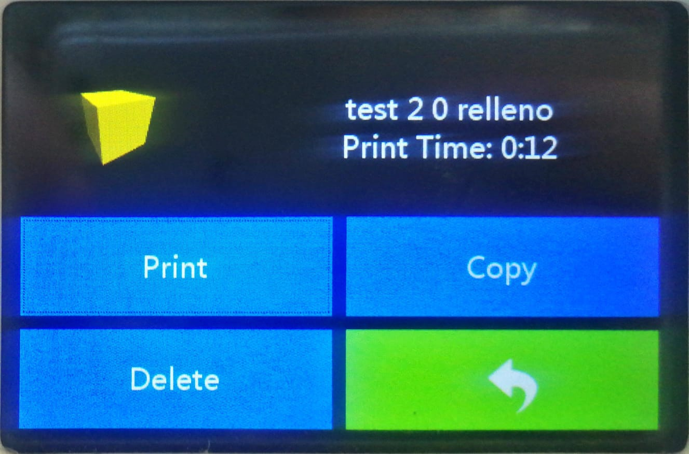<figcaption><p>Tiempo de Impresión 12 minutos.</p></figcaption></figure>

<div>

<figure>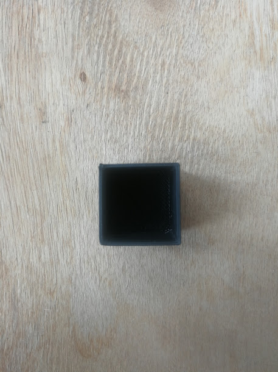<figcaption><p>Vista del resultado.</p></figcaption></figure>

 

<figure><figcaption><p>Zoom al interior.</p></figcaption></figure>

</div>

### <mark style="color:purple;">Relleno 25%</mark>

Un relleno del 25% implica imprimir un objeto con un 25% de su interior lleno, mientras que el 75% sigue siendo hueco. Aquí hay algunas características y consideraciones asociadas con un relleno del 25%:

<mark style="color:purple;">**Características:**</mark>

El objeto impreso tendrá una estructura interna con patrones de relleno, ocupando aproximadamente el 25% del volumen total del objeto.

Este nivel de relleno proporciona un equilibrio entre ligereza y resistencia, ya que introduce cierta cantidad de material en el interior del objeto.

<mark style="color:purple;">**Resistencia y Estructura:**</mark>

La presencia de un relleno del 25% mejora la resistencia del objeto en comparación con un objeto completamente hueco. Proporciona mayor rigidez y soporte interno.

<mark style="color:purple;">**Uso:**</mark>

Adecuado para objetos que requieren una resistencia mejorada sin comprometer demasiado el peso.

Una opción versátil que puede ser utilizada en una variedad de aplicaciones, desde prototipos funcionales hasta piezas decorativas.

<mark style="color:purple;">**Tiempo de Impresión:**</mark>

El tiempo de impresión será mayor en comparación con un relleno del 0%, ya que se requiere más tiempo para imprimir las capas adicionales de relleno.

<mark style="color:purple;">**Consumo de Material:**</mark>

El consumo de material es mayor en comparación con un relleno del 0%, ya que se utiliza más filamento para imprimir la estructura interna.

<mark style="color:purple;">**Versatilidad:**</mark>

Este nivel de relleno es versátil y se puede utilizar en una variedad de situaciones donde se requiere un equilibrio entre resistencia y eficiencia de material.

<mark style="color:purple;">**Calidad Superficial:**</mark>

La calidad superficial del objeto impreso puede ser mejor que en configuraciones de relleno más altas, ya que hay menos material para imprimir y menos capas que podrían ser visibles en la superficie exterior.

Este tipo de relleno es una elección común para impresiones que requieren un buen equilibrio entre peso y resistencia. Puede ser ajustado según las necesidades específicas de tu proyecto, y es especialmente útil para piezas que necesitan una resistencia adicional sin sacrificar demasiado la eficiencia de material.

<figure><figcaption><p>Vista de la configuración de relleno a 25% en FlashPrint.</p></figcaption></figure>

<figure>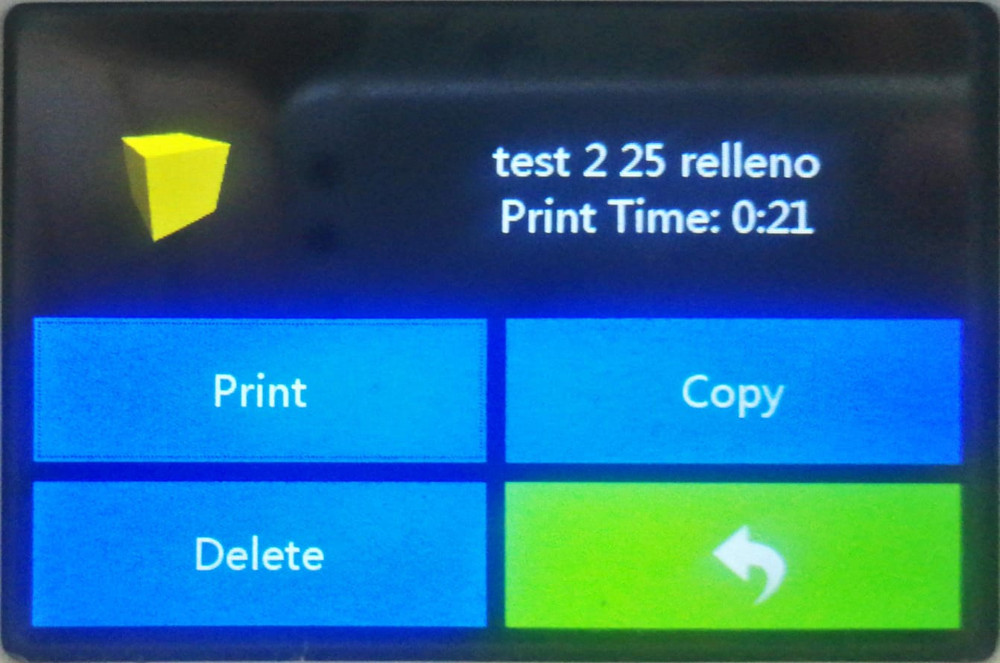<figcaption></figcaption></figure>

### <mark style="color:purple;">Relleno 50%</mark>

Un relleno del 50% implica imprimir un objeto con la mitad de su interior lleno y la otra mitad hueca. A continuación, te proporciono información sobre las características y consideraciones asociadas con un relleno del 50%:


```markdown
| Relleno 50%                   | Características                                                    | Uso                                                                   |
|-------------------------------|--------------------------------------------------------------------|-----------------------------------------------------------------------|
| **Características**           | Proporciona una estructura interna sólida, llenando el 50% del objeto. | Mejora significativamente la resistencia sin llegar a ser completamente macizo. |
| **Uso**                       | Adecuado para objetos que requieren resistencia adicional sin sacrificar demasiado la eficiencia de material. | Útil en aplicaciones donde la fuerza y la rigidez son críticas.       |
```


<figure><figcaption><p>Vista de la configuración de relleno a 50% en FlashPrint.</p></figcaption></figure>

### <mark style="color:purple;">Relleno 75%</mark>

<figure><figcaption><p>Vista de la configuración de relleno a 75% en FlashPrint.</p></figcaption></figure>

### <mark style="color:purple;">Relleno 100%</mark>

<figure><figcaption><p>Vista de la configuración de relleno a 100% en FlashPrint.</p></figcaption></figure>

## <mark style="color:purple;">Test de Patrones</mark>

### <mark style="color:purple;">Patrón de Líneas</mark>

<figure><figcaption></figcaption></figure>


### <mark style="color:purple;">Patrón de Hexágonos</mark>&#x20;

<figure>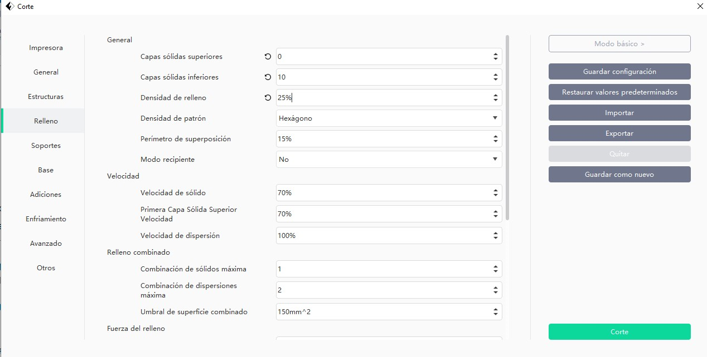<figcaption></figcaption></figure>

<figure>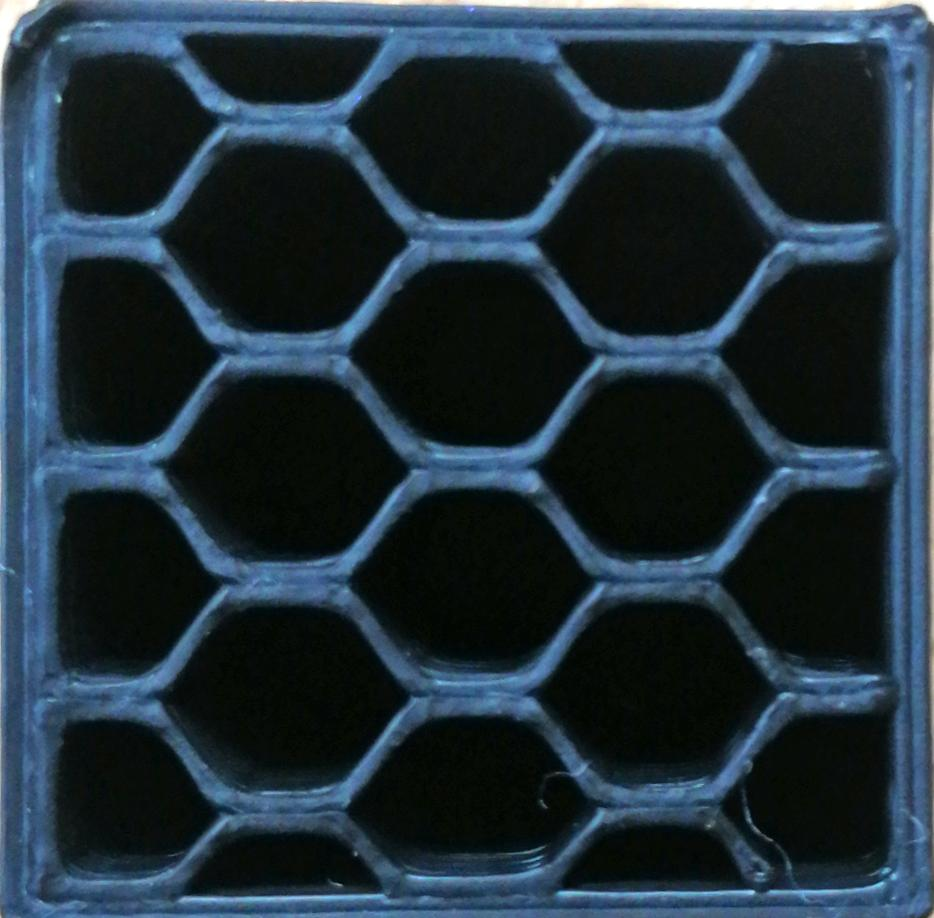<figcaption></figcaption></figure>

### <mark style="color:purple;">Patrón de Cuadrados</mark>

<figure>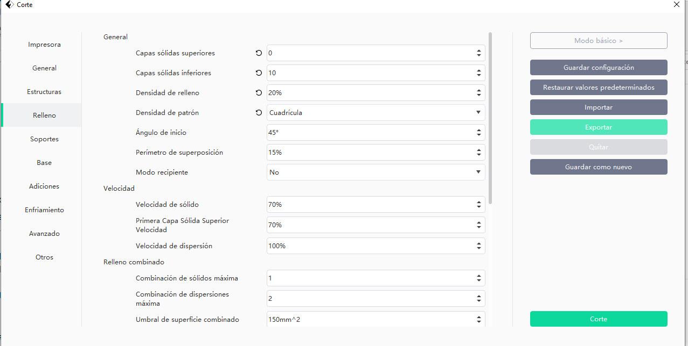<figcaption></figcaption></figure>

<figure>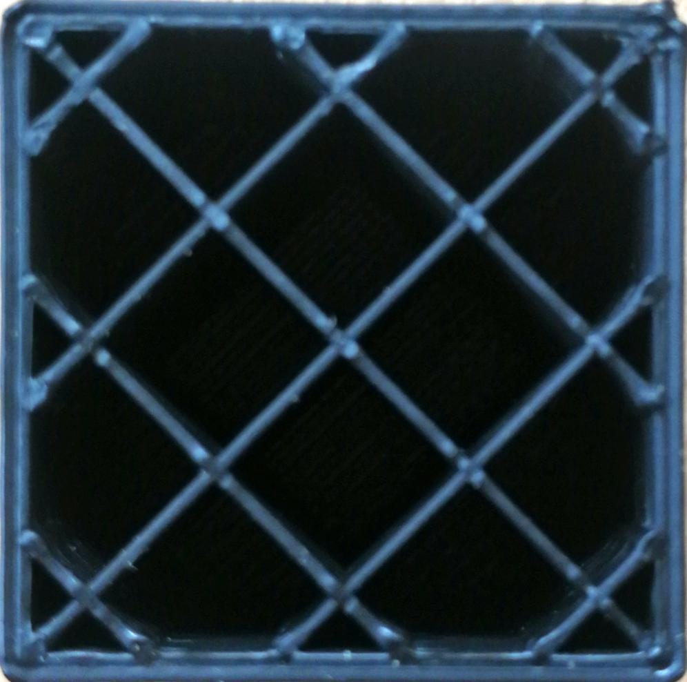<figcaption></figcaption></figure>

### <mark style="color:purple;">Patrón 3D</mark>&#x20;

<figure><figcaption></figcaption></figure>

<figure>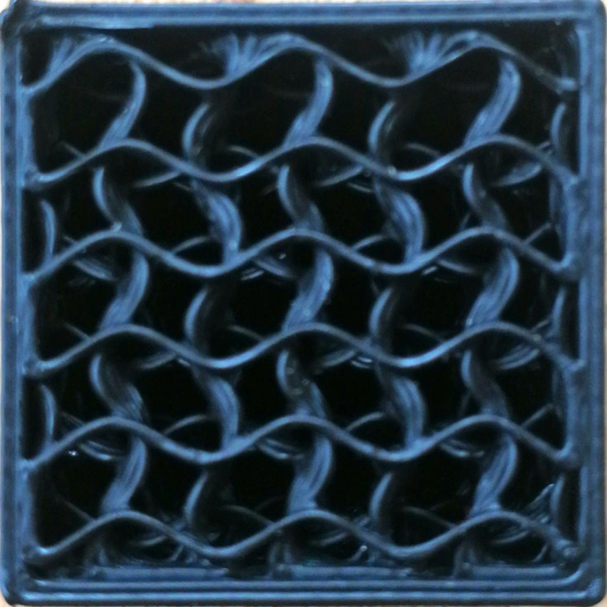<figcaption></figcaption></figure>

### <mark style="color:purple;">Patrón de Triángulos</mark>

<figure>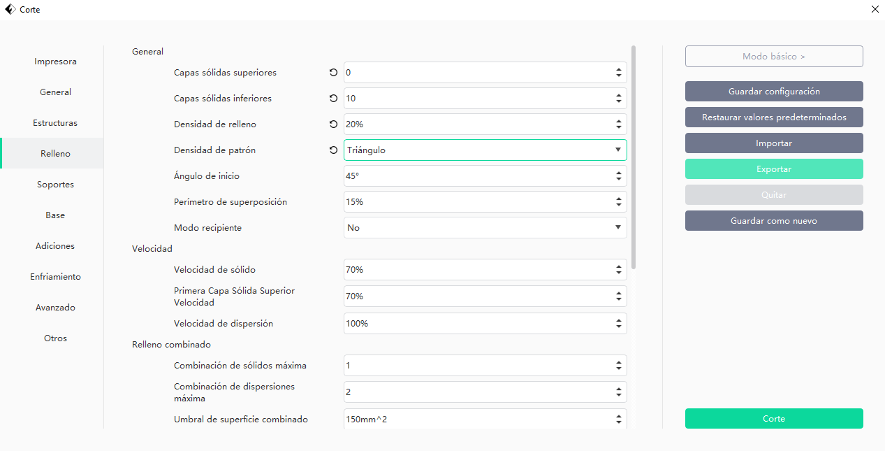<figcaption></figcaption></figure>

<figure><figcaption></figcaption></figure>


Para que la máquina pueda procesar los archivos debemos obviar los acentos.


<figure><figcaption></figcaption></figure>
