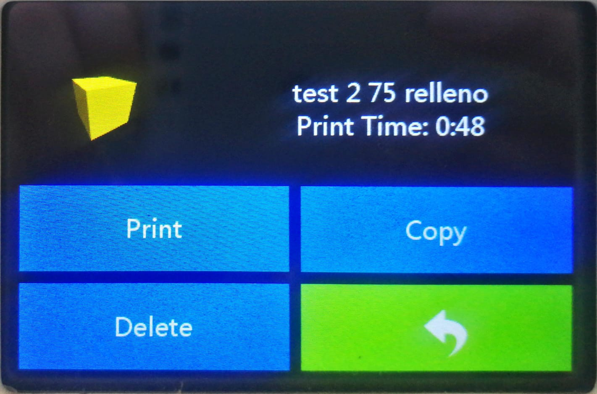
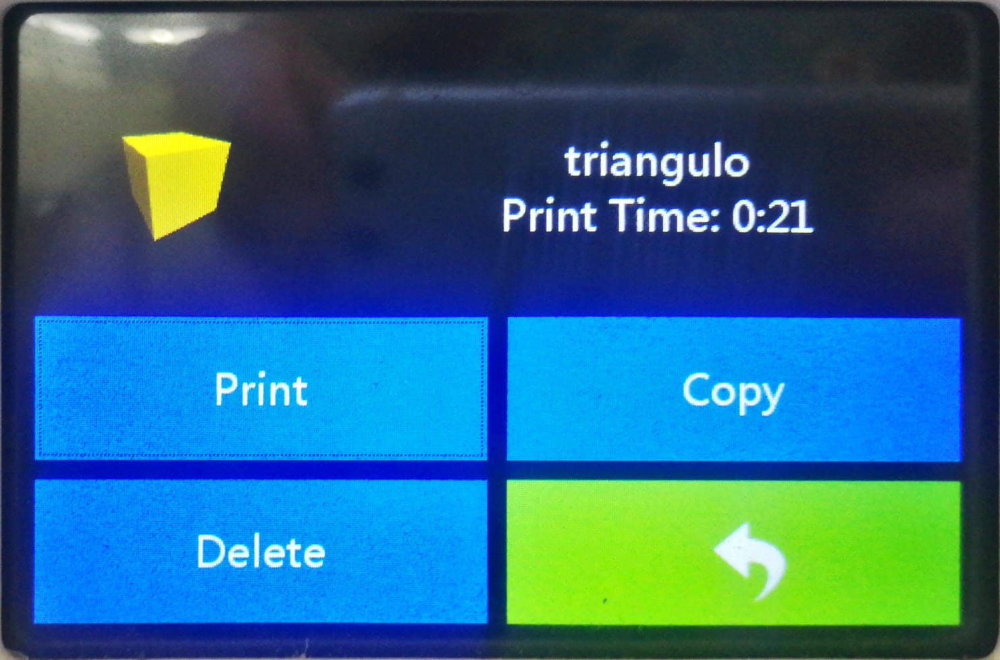

# Pruebas de Impresión 3D y Configuración en FlashPrint

Bienvenido a esta guía sobre pruebas de impresión 3D y configuración utilizando FlashPrint. En este documento, exploraremos diversos aspectos relacionados con la impresión 3D, centrándonos en el uso de un programa común, FlashPrint, y en la configuración de parámetros clave para obtener resultados óptimos.

A lo largo de la guía, realizaremos pruebas de impresión con diferentes alturas de capa, niveles de relleno y patrones, analizando cómo estos ajustes afectan la calidad y las características de las impresiones.

Esperamos que esta guía te brinde una comprensión más profunda de la configuración de impresión 3D y te ayude a tomar decisiones informadas al imprimir tus propios modelos. ¡Comencemos!

***

Comenzaremos con la creación de un simple cubo predeterminado en un programa 3D de su preferencia, luego procedemos a exportarlo como archivo .stl y luego importándolo en FlashPrint.&#x20;

<figure><figcaption>
Agregar un Cubo.
</figcaption></figure>

 

<figure><figcaption>
Vista del cubo y dimesiones en pantalla.
</figcaption></figure>

<figure><figcaption>
Exportar en formato .stl
</figcaption></figure>

## <mark style="color:purple;">FlashPrint</mark>

En FlashPrint importamos el archivo .stl del cubo.

<figure><figcaption>
Archivo importado en FlashPrint.
</figcaption></figure>

Podemos modificarlo en cuanto a la escala, este modelo no necesita soportes.

Es conveniente mantener un tamaño pequeño para agilizar el tiempo de impresión.

<figure><figcaption>
Vista de las dimensiones escaladas del cubo para la impresión.
</figcaption></figure>

## <mark style="color:purple;">Propiedades Generales de Temperatura</mark>

En general todos los test serán impresos con filamento PLA con los siguientes parámetros de temperatura para el extrusor y la plataforma.

Para ingresar a editar estos parámetros seleccionamos I**niciar corte** para acceder a esta ventana emergente.

<figure><figcaption>
Vista de la configuración de temperatura en FlashPrint.
</figcaption></figure>

***

## <mark style="color:purple;">Test de Alto de Capa</mark>

<mark style="color:purple;"><strong>¿En qué influye la altura de capa?</strong></mark>

La altura de capa en una impresión 3D es uno de los parámetros clave que influyen en la calidad, velocidad y apariencia del objeto impreso.

1. <mark style="color:purple;">**Resolución y Detalles:**</mark>
   * **Baja Altura de Capa (por ejemplo, 0.10 mm):** Permite una mayor resolución y detalles finos en la impresión. Es ideal para modelos con superficies curvas y detalles pequeños.
   * **Alta Altura de Capa (por ejemplo, 0.30 mm):** Reduce la resolución y los detalles. Es útil para impresiones rápidas de objetos grandes donde la precisión fina no es crítica.
2. <mark style="color:purple;">**Tiempo de Impresión:**</mark>
   * **Baja Altura de Capa:** Aumenta el tiempo de impresión debido a la mayor cantidad de capas necesarias para construir el objeto.
   * **Alta Altura de Capa:** Reduce el tiempo de impresión, ya que se requieren menos capas para construir el objeto.
3. <mark style="color:purple;">**Superficie de Acabado:**</mark>
   * **Baja Altura de Capa:** Ofrece una superficie más suave y detallada, pero puede aumentar la probabilidad de errores si la impresora no está bien calibrada.
   * **Alta Altura de Capa:** Puede resultar en una superficie más rugosa y menos detallada, pero con menos probabilidad de errores, especialmente en impresoras menos precisas.
4. <mark style="color:purple;">**Adherencia entre Capas:**</mark>
   * **Baja Altura de Capa:** Mejora la adherencia entre capas, ya que hay más puntos de contacto y fusión entre las capas.
   * **Alta Altura de Capa:** Puede haber menos adherencia entre capas, lo que podría afectar la resistencia estructural del objeto impreso.
5. <mark style="color:purple;">**Uso de Material:**</mark>
   * **Baja Altura de Capa:** Requiere más material, ya que hay más capas en total para construir el objeto.
   * **Alta Altura de Capa:** Usa menos material, lo que puede ser beneficioso para impresiones rápidas y económicas.
6. <mark style="color:purple;">**Calibración de la Impresora:**</mark>
   * **Baja Altura de Capa:** Pone más énfasis en la necesidad de una impresora bien calibrada para evitar problemas como capas desalineadas o bandas de impresión.
   * **Alta Altura de Capa:** Puede ser más tolerante a pequeños errores de calibración, pero también puede ocultar problemas potenciales.

Al ajustar la altura de capa, es esencial encontrar un equilibrio según tus necesidades específicas, considerando la velocidad de impresión, la calidad del acabado y la resistencia del objeto. Experimentar con diferentes alturas de capa te permitirá optimizar la configuración para cada impresión.

### <mark style="color:purple;">Alto de Capa 0.10</mark>

Utilizar una altura de capa de 0.10 mm en una impresión 3D es una elección que se enfoca en obtener una alta resolución y detalles finos en el objeto impreso. Aquí hay algunas características y consideraciones específicas asociadas con una altura de capa de 0.10 mm:

<table data-header-hidden><thead><tr><th></th><th data-hidden></th></tr></thead><tbody><tr><td><mark style="color:purple;"><strong>Resolución y Detalles</strong></mark></td><td></td></tr><tr><td>La impresión con una altura de capa de 0.10 mm proporciona una alta resolución, permitiendo la captura de detalles muy finos en el modelo.</td><td></td></tr><tr><td><mark style="color:purple;"><strong>Tiempo de Impresión</strong></mark></td><td></td></tr><tr><td>La impresión con una altura de capa de 0.10 mm será más lenta en comparación con configuraciones de altura de capa más alta. Cada capa más delgada aumenta el número total de capas y, por lo tanto, el tiempo total de impresión.</td><td></td></tr><tr><td><mark style="color:purple;"><strong>Superficie de Acabado</strong></mark></td><td></td></tr><tr><td>La superficie de acabado será más suave y detallada con una altura de capa de 0.10 mm. Esto es beneficioso para modelos que requieren una apariencia más refinada.</td><td></td></tr><tr><td><mark style="color:purple;"><strong>Adherencia entre Capas</strong></mark></td><td></td></tr><tr><td>La adherencia entre capas será fuerte, ya que hay más puntos de contacto entre capas más finas. Esto resulta en un objeto impreso más robusto y resistente.</td><td></td></tr><tr><td><mark style="color:purple;"><strong>Uso de Material</strong></mark></td><td></td></tr><tr><td>El uso de material será mayor en comparación con alturas de capa más altas. Al tener capas más delgadas, se utiliza más filamento para construir el objeto.</td><td></td></tr><tr><td><mark style="color:purple;"><strong>Calibración de la Impresora</strong></mark></td><td></td></tr><tr><td>Utilizar una altura de capa de 0.10 mm es más exigente en términos de calibración. La impresora debe estar muy bien ajustada para garantizar una precisión adecuada en cada capa.</td><td></td></tr><tr><td><mark style="color:purple;"><strong>Detalles Pequeños</strong></mark></td><td></td></tr><tr><td>Esta configuración es especialmente útil cuando se imprimen modelos que contienen detalles pequeños o superficies curvas que requieren una alta precisión.</td><td></td></tr><tr><td><mark style="color:purple;"><strong>Calidad de Superficies Curvas</strong></mark></td><td></td></tr><tr><td>Una altura de capa más baja mejora la calidad de las superficies curvas y ayuda a evitar escalones o capas visibles en modelos redondeados.</td><td></td></tr></tbody></table>

<figure><figcaption>
Vista de la configuración de alto de capa a 0.10 mm en FlashPrint.
</figcaption></figure>


Archivo con alto de capa 0.10mm.


<figure><figcaption>
Duración de la impresión con alto de capa 0.10 mm es de 48 minutos.
</figcaption></figure>

### <mark style="color:purple;">Alto de Capa 0.20</mark>

<table data-header-hidden><thead><tr><th></th><th data-hidden></th></tr></thead><tbody><tr><td><mark style="color:purple;"><strong>Resolución y Detalles</strong></mark></td><td></td></tr><tr><td>Una altura de capa de 0.20 mm proporciona un equilibrio entre resolución y velocidad de impresión. Ofrece detalles razonablemente finos sin comprometer demasiado el tiempo total de impresión.</td><td></td></tr><tr><td><mark style="color:purple;"><strong>Tiempo de Impresión</strong></mark></td><td></td></tr><tr><td>La impresión con una altura de capa de 0.20 mm será más rápida que una configuración de alta resolución (por ejemplo, 0.10 mm) pero más lenta que configuraciones de baja resolución (por ejemplo, 0.30 mm).</td><td></td></tr><tr><td><mark style="color:purple;"><strong>Superficie de Acabado</strong></mark> </td><td></td></tr><tr><td>La superficie de acabado con una altura de capa de 0.20 mm será más suave en comparación con alturas de capa más altas, pero no alcanzará la misma suavidad que una configuración de 0.10 mm.</td><td></td></tr><tr><td><mark style="color:purple;"><strong>Adherencia entre Capas</strong></mark> </td><td></td></tr><tr><td>La adherencia entre capas debería ser adecuada. La fusión de capas será más efectiva que con alturas de capa más altas, proporcionando un objeto impreso más sólido y resistente.</td><td></td></tr><tr><td><mark style="color:purple;"><strong>Uso de Material</strong></mark> </td><td></td></tr><tr><td>El uso de material estará en un punto intermedio. Requerirá más material que configuraciones de alta resolución, pero menos que configuraciones de baja resolución.</td><td></td></tr><tr><td><mark style="color:purple;"><strong>Calibración de la Impresora</strong></mark> </td><td></td></tr><tr><td>Aunque una altura de capa de 0.20 mm es menos exigente en términos de calibración que configuraciones más bajas, aún es importante mantener una impresora bien calibrada para obtener mejores resultados.</td><td></td></tr><tr><td><mark style="color:purple;"><strong>Versatilidad</strong></mark> </td><td></td></tr><tr><td>La altura de capa de 0.20 mm es versátil y es una buena opción para impresiones generales cuando se busca un equilibrio entre velocidad y calidad de impresión.</td><td></td></tr></tbody></table>

<figure><figcaption>
Vista de la configuración de la <strong>Altura de Capa</strong> a 0.20mm en la Ventana de <strong>General</strong> en FlashPrint.
</figcaption></figure>


Archivo de alto de capa de 0.20mm.


<figure><figcaption>
Duración de la impresión con alto de capa 0.20 mm es de 27 minutos.
</figcaption></figure>

### <mark style="color:purple;">Alto de Capa 0.30</mark>

Utilizar una altura de capa de 0.30 mm en una impresión 3D tiene varias implicaciones que pueden ser adecuadas según las necesidades específicas de tu proyecto. Aquí hay algunas características y consideraciones asociadas con una altura de capa de 0.30 mm:

<table data-header-hidden><thead><tr><th></th><th data-hidden></th></tr></thead><tbody><tr><td><mark style="color:purple;"><strong>Velocidad de Impresión</strong></mark></td><td></td></tr><tr><td>La impresión con una altura de capa de 0.30 mm será más rápida en comparación con configuraciones de altura de capa más fina, ya que hay menos capas en total para construir el objeto.</td><td></td></tr><tr><td><mark style="color:purple;"><strong>Uso de Material</strong></mark></td><td></td></tr><tr><td>Utilizará menos material en comparación con alturas de capa más finas, ya que hay menos capas y, por lo tanto, menos filamento utilizado para construir el objeto.</td><td></td></tr><tr><td><mark style="color:purple;"><strong>Resolución y Detalles</strong></mark></td><td></td></tr><tr><td>La resolución será menor, y los detalles finos en el modelo pueden no ser tan precisos o visibles como en configuraciones de altura de capa más fina.</td><td></td></tr><tr><td><mark style="color:purple;"><strong>Superficie de Acabado</strong></mark></td><td></td></tr><tr><td>La superficie de acabado puede ser menos suave y detallada en comparación con alturas de capa más bajas. Pueden aparecer capas más notorias.</td><td></td></tr><tr><td><mark style="color:purple;"><strong>Adherencia entre Capas</strong></mark></td><td></td></tr><tr><td>La adherencia entre capas puede ser menor en comparación con alturas de capa más fina, lo que podría afectar la resistencia estructural del objeto impreso.</td><td></td></tr><tr><td><mark style="color:purple;"><strong>Versatilidad y Robustez</strong></mark></td><td></td></tr><tr><td>Esta configuración es adecuada para impresiones rápidas y robustas donde la alta resolución no es crítica. Es especialmente útil para prototipos rápidos o impresiones donde la apariencia fina no es esencial.</td><td></td></tr><tr><td><mark style="color:purple;"><strong>Calibración de la Impresora</strong></mark></td><td></td></tr><tr><td>Aunque es menos exigente en términos de calibración que configuraciones de altura de capa más fina, aún es importante mantener una impresora bien calibrada para obtener resultados óptimos.</td><td></td></tr><tr><td><mark style="color:purple;"><strong>Pruebas de Concepto Rápidas</strong></mark></td><td></td></tr><tr><td>Una altura de capa de 0.30 mm es útil para pruebas rápidas de concepto donde la velocidad de impresión es crucial y la precisión fina no es esencial.</td><td></td></tr></tbody></table>


Archivo de altura de capa a 0.30mm.


<figure><figcaption>
Duración de la impresión con alto de capa 0.30 mm es de 26 minutos.
</figcaption></figure>

### <mark style="color:purple;">Comparación de resultados de los parámetros de altura de capa.</mark>

| **Altura de Capa** | **Duración de Impresión** |
| ------------------ | ------------------------- |
| 0.10 mm            | 48 minutos                |
| 0.20 mm            | 27 minutos                |
| 0.30 mm            | 26 minutos                |

<mark style="color:purple;">**Conclusiones sobre Alturas de Capa en Impresión 3D:**</mark>

1. <mark style="color:purple;">**Altura de Capa 0.10 mm:**</mark>
   * _Ventajas:_
     * Ofrece alta resolución y detalles finos en el modelo impreso.
     * Superficies más suaves y mayor precisión.
   * _Desventajas:_
     * Mayor tiempo de impresión (48 minutos en este caso).
     * Mayor consumo de material.
2. <mark style="color:purple;">**Altura de Capa 0.20 mm:**</mark>
   * _Ventajas:_
     * Buen equilibrio entre resolución y velocidad de impresión.
     * Superficies suaves y detalles razonablemente finos.
   * _Desventajas:_
     * Menos detalles finos que la altura de capa de 0.10 mm.
     * Menor tiempo de impresión que 0.10 mm, pero aún más que 0.30 mm.
3. <mark style="color:purple;">**Altura de Capa 0.30 mm:**</mark>
   * _Ventajas:_
     * Menor tiempo de impresión (26 minutos en este caso).
     * Uso de material más eficiente.
   * _Desventajas:_
     * Menor resolución y detalles en comparación con alturas de capa más bajas.
     * Superficies pueden ser menos suaves.

<mark style="color:purple;">**Consideraciones Finales:**</mark>

* La altura de capa de 0.20 mm es una opción versátil que ofrece un compromiso aceptable entre detalles y tiempo de impresión.
* La altura de capa de 0.10 mm es ideal para modelos que requieren alta precisión, a pesar de un mayor tiempo y consumo de material.
* La altura de capa de 0.30 mm es adecuada para impresiones rápidas y eficientes en material, sacrificando algunos detalles finos.

***

## <mark style="color:purple;">Test de relleno</mark>

Para los siguientes Test se utilizará **Capa de Sólida Superior** en 0 para poder ver los patrones en el interior del cubo.

<figure><figcaption></figcaption></figure>

El tipo de relleno en una impresión 3D tiene un impacto significativo en la resistencia, peso, tiempo de impresión y consumo de material. Aquí están las formas en que diferentes tipos de relleno pueden influir en una impresión:

<table data-header-hidden><thead><tr><th width="271.5"></th><th></th></tr></thead><tbody><tr><td><mark style="color:purple;"><strong>Sin Relleno (0%)</strong></mark></td><td></td></tr><tr><td><mark style="color:purple;"><strong>Características:</strong></mark></td><td>La impresión carecerá de estructura interna, lo que la hará ligera pero menos resistente.</td></tr><tr><td><mark style="color:purple;"><strong>Uso:</strong></mark></td><td>Adecuado para modelos decorativos o prototipos donde la resistencia no es crítica.</td></tr></tbody></table>

<table data-header-hidden><thead><tr><th width="271.5"></th><th></th></tr></thead><tbody><tr><td><mark style="color:purple;"><strong>Relleno Ligero (10-20%)</strong></mark></td><td></td></tr><tr><td><mark style="color:purple;"><strong>Características:</strong></mark></td><td>Añade una estructura interna de patrón simple, lo que mejora la resistencia y reduce el peso en comparación con una impresión completamente maciza.</td></tr><tr><td><mark style="color:purple;"><strong>Uso:</strong></mark></td><td>Adecuado para objetos que necesitan ser ligeros pero aún requieren cierta resistencia.</td></tr></tbody></table>

<table data-header-hidden><thead><tr><th width="269.5"></th><th></th></tr></thead><tbody><tr><td><mark style="color:purple;"><strong>Relleno Estándar (20-50%)</strong></mark></td><td></td></tr><tr><td><mark style="color:purple;"><strong>Características:</strong></mark></td><td>Proporciona una estructura interna más densa y mejora la resistencia. El peso aumenta en comparación con el relleno ligero.</td></tr><tr><td><mark style="color:purple;"><strong>Uso:</strong></mark></td><td>Apropiado para la mayoría de las aplicaciones generales, equilibrando resistencia y eficiencia de material.</td></tr></tbody></table>

<table data-header-hidden><thead><tr><th width="268.5"></th><th></th></tr></thead><tbody><tr><td><mark style="color:purple;"><strong>Relleno Denso (50-100%)</strong></mark></td><td></td></tr><tr><td><mark style="color:purple;"><strong>Características:</strong></mark></td><td>Ofrece una estructura interna casi sólida, lo que maximiza la resistencia. Sin embargo, aumenta significativamente el peso y el tiempo de impresión.</td></tr><tr><td><mark style="color:purple;"><strong>Uso:</strong></mark></td><td>Útil para piezas que requieren máxima resistencia estructural, como partes funcionales o herramientas.</td></tr></tbody></table>

<table data-header-hidden><thead><tr><th width="270.5"></th><th></th></tr></thead><tbody><tr><td><mark style="color:purple;"><strong>Relleno Personalizado</strong></mark></td><td></td></tr><tr><td><mark style="color:purple;"><strong>Características:</strong></mark></td><td>Algunos programas de impresión 3D permiten patrones de relleno personalizados, como estructuras de panal o patrones específicos de acuerdo con las necesidades del modelo.</td></tr><tr><td><mark style="color:purple;"><strong>Uso:</strong></mark></td><td>Adecuado para casos específicos donde se requiere una estructura de relleno única para cumplir con requisitos particulares.</td></tr></tbody></table>

<figure><figcaption></figcaption></figure>

#### <mark style="color:purple;">Influencias Adicionales:</mark>

*   <mark style="color:purple;">**Consumo de Material:**</mark>

    A medida que aumenta la densidad del relleno, se utiliza más material, lo que afecta el costo y el tiempo de impresión.
*   <mark style="color:purple;">**Tiempo de Impresión:**</mark>

    Rellenos más densos y complejos aumentan el tiempo de impresión, mientras que rellenos más ligeros reducen el tiempo.
*   <mark style="color:purple;">**Refrigeración y Deformación:**</mark>

    Rellenos más densos pueden retener más calor durante la impresión, lo que puede influir en la calidad superficial y la posible deformación.
*   <mark style="color:purple;">**Compatibilidad con Soportes:**</mark>

    Algunos rellenos pueden ser más propensos a la necesidad de soportes, dependiendo de la geometría del modelo.

La elección del tipo de relleno depende de la aplicación específica y los requisitos de resistencia del objeto impreso. Experimentar con diferentes configuraciones te permitirá encontrar el equilibrio adecuado entre resistencia, peso y eficiencia de material para tu proyecto.

### <mark style="color:purple;">Relleno 0%</mark>

Un relleno del 0%, también conocido como "sin relleno" o "100% hueco", implica imprimir un objeto completamente hueco sin estructura interna. Aquí están algunas características y consideraciones asociadas con un relleno del 0%:

<table data-full-width="true"><thead><tr><th width="292.5">Relleno 0%</th><th></th></tr></thead><tbody><tr><td><mark style="color:purple;"><strong>Características</strong></mark></td><td>El objeto impreso será completamente hueco, sin estructuras internas ni patrones de relleno. Este tipo de impresión es la más ligera posible, ya que no hay material dentro del objeto, lo que puede ser beneficioso para reducir el peso total.</td></tr><tr><td><mark style="color:purple;"><strong>Resistencia y Estructura</strong></mark></td><td>La falta de relleno interno puede hacer que el objeto sea menos resistente en comparación con impresiones con algún nivel de relleno. La estructura depende completamente de las paredes exteriores.</td></tr><tr><td><mark style="color:purple;"><strong>Uso</strong></mark></td><td>Adecuado para modelos decorativos o situaciones en las que el peso es una consideración crítica. No es apropiado para objetos que requieran resistencia estructural o funcionalidad, ya que la falta de relleno puede hacer que el objeto sea frágil.</td></tr><tr><td><mark style="color:purple;"><strong>Tiempo de Impresión</strong></mark></td><td>La impresión sin relleno es más rápida en comparación con impresiones con algún tipo de relleno, ya que se requiere menos material y menos tiempo para imprimir el objeto.</td></tr><tr><td><mark style="color:purple;"><strong>Consumo de Material</strong></mark></td><td>El consumo de material es mínimo, ya que el objeto se imprime solo con paredes exteriores.</td></tr><tr><td><mark style="color:purple;"><strong>Transparente o Transparente</strong></mark></td><td>En función del grosor de las paredes y el material utilizado, un objeto con relleno del 0% puede tener un aspecto más transparente o translúcido, lo que puede ser deseable para ciertos efectos visuales.</td></tr></tbody></table>

Es importante tener en cuenta que la elección de un relleno del 0% dependerá de los requisitos específicos de tu proyecto. Si buscas ligereza y una apariencia más transparente, esta opción puede ser adecuada. Sin embargo, para objetos que requieren resistencia estructural o funcionalidad, es posible que debas considerar configuraciones de relleno más altas.


Archivo con relleno a 0%.


<figure><figcaption>
Vista de la configuración de Densidad de Relleno a 0% en FlashPrint.
</figcaption></figure>

<figure><figcaption>
Tiempo de Impresión con relleno a 0% es de 12 minutos.
</figcaption></figure>

<figure><figcaption>
Zoom al interior.
</figcaption></figure>

### <mark style="color:purple;">Relleno 15%</mark>

En esta sección, exploraremos los resultados de la impresión utilizando un relleno del 15%. Este nivel de relleno proporciona una estructura interna de patrón simple, equilibrando la resistencia del objeto con la eficiencia de material. Examinaremos la duración de la impresión, la calidad del modelo y otras consideraciones clave.

| Relleno 15%                                                         |                                                                                                                                                      |
| ------------------------------------------------------------------- | ---------------------------------------------------------------------------------------------------------------------------------------------------- |
| <mark style="color:purple;">**Aspecto Estético**</mark>             | El modelo impreso con relleno del 15% presenta un aspecto equilibrado, con una estructura interna perceptible pero no abrumadora.                    |
| <mark style="color:purple;">**Resistencia y Durabilidad**</mark>    | La resistencia del objeto es mejorada en comparación con impresiones completamente macizas, proporcionando solidez sin exceso de peso.               |
| <mark style="color:purple;">**Eficiencia de Material**</mark>       | Utiliza una cantidad moderada de material, siendo más eficiente en comparación con rellenos más densos.                                              |
| <mark style="color:purple;">**Velocidad de Impresión**</mark>       | La impresión con relleno del 15% ofrece una velocidad razonable, más rápida que rellenos más densos pero ligeramente más lenta que rellenos ligeros. |
| <mark style="color:purple;">**Flexibilidad y Adaptabilidad**</mark> | Se adapta bien a diversas geometrías, siendo versátil para aplicaciones generales.                                                                   |
| <mark style="color:purple;">**Recomendaciones de Uso**</mark>       | Adecuado para objetos que requieren un equilibrio entre resistencia y eficiencia de material, siendo versátil para diversas aplicaciones.            |

<figure><figcaption>
Duración de impresión con relleno a 15% es de 17 minutos.
</figcaption></figure>


Archivo con relleno a 15%.


<figure><figcaption>
Zoom del resultado final.
</figcaption></figure>

### <mark style="color:purple;">Relleno 25%</mark>

Un relleno del 25% implica imprimir un objeto con un 25% de su interior lleno, mientras que el 75% sigue siendo hueco. Aquí hay algunas características y consideraciones asociadas con un relleno del 25%:

<table data-full-width="true"><thead><tr><th>Relleno 25%</th><th data-hidden></th></tr></thead><tbody><tr><td><mark style="color:purple;"><strong>Características</strong></mark></td><td></td></tr><tr><td>El objeto impreso tendrá una estructura interna con patrones de relleno, ocupando aproximadamente el 25% del volumen total del objeto. Este nivel de relleno proporciona un equilibrio entre ligereza y resistencia, ya que introduce cierta cantidad de material en el interior del objeto.</td><td></td></tr><tr><td>Adecuado para objetos que requieren una resistencia mejorada sin comprometer demasiado el peso. Una opción versátil que puede ser utilizada en una variedad de aplicaciones, desde prototipos funcionales hasta piezas decorativas.</td><td></td></tr><tr><td><mark style="color:purple;"><strong>Resistencia y Estructura</strong></mark></td><td></td></tr><tr><td>La presencia de un relleno del 25% mejora la resistencia del objeto en comparación con un objeto completamente hueco. Proporciona mayor rigidez y soporte interno.</td><td></td></tr><tr><td><mark style="color:purple;"><strong>Uso</strong></mark></td><td></td></tr><tr><td>Adecuado para objetos que requieren una resistencia mejorada sin comprometer demasiado el peso.</td><td></td></tr><tr><td>Una opción versátil que puede ser utilizada en una variedad de situaciones donde se requiere un equilibrio entre resistencia y eficiencia de material.</td><td></td></tr><tr><td><mark style="color:purple;"><strong>Tiempo de Impresión</strong></mark></td><td></td></tr><tr><td>El tiempo de impresión será mayor en comparación con un relleno del 0%, ya que se requiere más tiempo para imprimir las capas adicionales de relleno.</td><td></td></tr><tr><td><mark style="color:purple;"><strong>Consumo de Material</strong></mark></td><td></td></tr><tr><td>El consumo de material es mayor en comparación con un relleno del 0%, ya que se utiliza más filamento para imprimir la estructura interna.</td><td></td></tr><tr><td><mark style="color:purple;"><strong>Versatilidad</strong></mark></td><td></td></tr><tr><td>Este nivel de relleno es versátil y se puede utilizar en una variedad de situaciones donde se requiere un equilibrio entre resistencia y eficiencia de material.</td><td></td></tr><tr><td><mark style="color:purple;"><strong>Calidad Superficial</strong></mark></td><td></td></tr><tr><td>La calidad superficial del objeto impreso puede ser mejor que en configuraciones de relleno más altas, ya que hay menos material para imprimir y menos capas que podrían ser visibles en la superficie exterior.</td><td></td></tr></tbody></table>

<figure><figcaption>
Vista de la configuración de relleno a 25% en FlashPrint.
</figcaption></figure>

<figure><figcaption>
Tiempo de la impresión del cubo con 25% de relleno es de 21 minutos.
</figcaption></figure>

<figure><figcaption>
Zoom del resultado final.
</figcaption></figure>

### <mark style="color:purple;">Relleno 50%</mark>

Un relleno del 50% implica imprimir un objeto con la mitad de su interior lleno y la otra mitad hueca. A continuación, te proporciono información sobre las características y consideraciones asociadas con un relleno del 50%:

<table><thead><tr><th width="281.5">Relleno 50%</th><th></th></tr></thead><tbody><tr><td><mark style="color:purple;"><strong>Características</strong></mark></td><td>Proporciona una estructura interna más densa y mejora la resistencia. El peso aumenta en comparación con el relleno ligero.</td></tr><tr><td><mark style="color:purple;"><strong>Resistencia y Estructura</strong></mark></td><td>Ofrece una estructura interna casi sólida, lo que maximiza la resistencia. Sin embargo, aumenta significativamente el peso y el tiempo de impresión.</td></tr><tr><td><mark style="color:purple;"><strong>Uso</strong></mark></td><td>Útil para piezas que requieren máxima resistencia estructural, como partes funcionales o herramientas.</td></tr><tr><td><mark style="color:purple;"><strong>Tiempo de Impresión</strong></mark></td><td>El tiempo de impresión será mayor en comparación con configuraciones de relleno más bajo, ya que se requiere más tiempo para imprimir las capas adicionales de relleno.</td></tr><tr><td><mark style="color:purple;"><strong>Consumo de Material</strong></mark></td><td>El consumo de material es mayor en comparación con configuraciones de relleno más bajo, ya que se utiliza más filamento para imprimir la estructura interna densa.</td></tr><tr><td><mark style="color:purple;"><strong>Transparente o Transparente</strong></mark></td><td>La transparencia o translucidez puede variar dependiendo del grosor de las paredes y el material utilizado.</td></tr></tbody></table>

<figure><figcaption>
Vista de la configuración de relleno a 50% en FlashPrint.
</figcaption></figure>

<figure><figcaption>
Duración de la impresión con 50% de relleno es de 34 minutos.
</figcaption></figure>

<figure><figcaption>
Vista del resultado final.
</figcaption></figure>

### <mark style="color:purple;">Relleno 75%</mark>

<table><thead><tr><th width="292.5">Relleno 75%</th><th></th></tr></thead><tbody><tr><td><mark style="color:purple;"><strong>Características</strong></mark></td><td>Ofrece una estructura interna sólida que maximiza la resistencia. El peso y el tiempo de impresión aumentan en comparación con el relleno del 50%.</td></tr><tr><td><mark style="color:purple;"><strong>Resistencia y Estructura</strong></mark></td><td>Proporciona una estructura interna sólida, lo que mejora significativamente la resistencia. Es adecuado para piezas que requieren alta resistencia estructural.</td></tr><tr><td><mark style="color:purple;"><strong>Uso</strong></mark></td><td>Útil para aplicaciones donde se requiere una resistencia superior, como piezas que experimentarán cargas significativas.</td></tr><tr><td><mark style="color:purple;"><strong>Tiempo de Impresión</strong></mark></td><td>El tiempo de impresión será mayor en comparación con configuraciones de relleno más bajo, ya que se requiere más tiempo para imprimir las capas adicionales de relleno.</td></tr><tr><td><mark style="color:purple;"><strong>Consumo de Material</strong></mark></td><td>El consumo de material es mayor en comparación con configuraciones de relleno más bajo, ya que se utiliza más filamento para imprimir la estructura interna densa.</td></tr><tr><td><mark style="color:purple;"><strong>Transparente o Transparente</strong></mark></td><td>La transparencia o translucidez puede variar dependiendo del grosor de las paredes y el material utilizado.</td></tr></tbody></table>

<figure><figcaption>
Vista de la configuración de relleno a 75% en FlashPrint.
</figcaption></figure>

<figure><figcaption>
Duración de la impresión con 75% de relleno es de 48 minutos.
</figcaption></figure>

<figure><figcaption>
Vista del resultado final.
</figcaption></figure>

### <mark style="color:purple;">Relleno 100%</mark>

<table><thead><tr><th width="285.5">Relleno 100%</th><th></th></tr></thead><tbody><tr><td><mark style="color:purple;"><strong>Características</strong></mark></td><td>
Ofrece una estructura interna completamente sólida para lograr la máxima resistencia.

El objeto estará prácticamente lleno de material.
</td></tr><tr><td><mark style="color:purple;"><strong>Resistencia y Estructura</strong></mark></td><td>Proporciona la máxima resistencia estructural, siendo adecuado para aplicaciones que requieren una fuerza excepcional, como partes que soportan cargas significativas.</td></tr><tr><td><mark style="color:purple;"><strong>Uso</strong></mark></td><td>Ideal para piezas que necesitan una resistencia extrema, como herramientas industriales o componentes mecánicos sometidos a estrés constante.</td></tr><tr><td><mark style="color:purple;"><strong>Tiempo de Impresión</strong></mark></td><td>El tiempo de impresión será significativamente mayor en comparación con configuraciones de relleno más bajo, ya que cada capa se imprime sólida.</td></tr><tr><td><mark style="color:purple;"><strong>Consumo de Material</strong></mark></td><td>El consumo de material es máximo, ya que el objeto se imprime completamente sólido.</td></tr><tr><td><mark style="color:purple;"><strong>Transparente o Transparente</strong></mark></td><td>Dependiendo del grosor de las paredes y el material utilizado, la transparencia puede variar, pero generalmente será mínima debido al alto nivel de relleno.</td></tr></tbody></table>

<figure><figcaption>
Vista de la configuración de relleno a 100% en FlashPrint.
</figcaption></figure>

<figure><figcaption>
Duración de impresión de relleno a 100% es de 30 minutos.
</figcaption></figure>

<figure><figcaption>
Zoom del resultado final.
</figcaption></figure>

### <mark style="color:purple;">**Análisis Comparativo de la Duración de Impresión con Diferentes Niveles de Relleno**</mark>

| **Nivel de Relleno** | **Duración de Impresión (minutos)** | **Características Principales**                                                   |
| -------------------- | ----------------------------------- | --------------------------------------------------------------------------------- |
| 100%                 | 30                                  | Máxima densidad y resistencia, mayor consumo de material.                         |
| 75%                  | 48                                  | Alta resistencia, eficiencia de material mejorada en comparación con 100%.        |
| 50%                  | 34                                  | Equilibrio entre resistencia y eficiencia, adecuado para aplicaciones generales.  |
| 25%                  | 21                                  | Resistencia aceptable, reducción en el tiempo de impresión.                       |
| 15%                  | 17                                  | Eficiente en tiempo y material, resistencia adecuada para ciertas aplicaciones.   |
| 0%                   | 12                                  | Rápido y eficiente en material, ideal para modelos decorativos o sin resistencia. |

### <mark style="color:purple;">**Conclusiones sobre Diferentes Tipos de Relleno**</mark>

1. <mark style="color:purple;">**Relleno al 100%:**</mark>
   * _Ventajas:_
     * Máxima resistencia y densidad.
   * _Desventajas:_
     * Mayor tiempo de impresión.
     * Mayor consumo de material.
2. <mark style="color:purple;">**Relleno al 75%:**</mark>
   * _Ventajas:_
     * Alta resistencia con eficiencia de material mejorada en comparación con 100%.
   * _Desventajas:_
     * Tiempo de impresión más largo.
3. <mark style="color:purple;">**Relleno al 50%:**</mark>
   * _Ventajas:_
     * Equilibrio entre resistencia y eficiencia.
     * Adecuado para aplicaciones generales.
   * _Desventajas:_
     * Tiempo de impresión moderado.
4. <mark style="color:purple;">**Relleno al 25%:**</mark>
   * _Ventajas:_
     * Tiempo de impresión reducido.
     * Resistencia aceptable para ciertas aplicaciones.
   * _Desventajas:_
     * Menos resistente que niveles de relleno más altos.
5. <mark style="color:purple;">**Relleno al 15%:**</mark>
   * _Ventajas:_
     * Eficiente en tiempo y material.
     * Resistencia adecuada para ciertas aplicaciones.
   * _Desventajas:_
     * Menos resistente que niveles de relleno más altos.
6. <mark style="color:purple;">**Relleno al 0%:**</mark>
   * _Ventajas:_
     * Tiempo de impresión más rápido.
     * Eficiente en material.
   * _Desventajas:_
     * Sin estructura interna, menos resistencia.
     * Adecuado solo para modelos decorativos o sin necesidad de resistencia.

***

## <mark style="color:purple;">Test de Patrones</mark>

En esta sección, exploraremos los **Test de Patrones** como parte integral de la configuración de impresión 3D. Estos patrones influyen significativamente en la estética y las propiedades mecánicas de los modelos impresos. A medida que realizamos pruebas con el modelo de cubo, examinaremos cómo diferentes configuraciones de patrones de líneas afectan la calidad y el rendimiento de las impresiones.

<figure><figcaption></figcaption></figure>

### <mark style="color:purple;">Patrón de Líneas</mark>

Comencemos descubriendo cómo el uso de patrones de líneas puede ofrecer resultados distintos en términos de apariencia y funcionalidad en nuestras impresiones 3D.

<table><thead><tr><th width="323.5">Patrones de Líneas en Impresión 3D</th><th></th></tr></thead><tbody><tr><td><mark style="color:purple;"><strong>Aspecto Estético</strong></mark></td><td>Proporcionan un aspecto distintivo con líneas rectas y paralelas, ofreciendo un acabado suave y profesional.</td></tr><tr><td><mark style="color:purple;"><strong>Resistencia y Durabilidad</strong></mark></td><td>La orientación de las líneas puede influir en la resistencia mecánica del objeto impreso, ofreciendo mayor resistencia en una dirección específica.</td></tr><tr><td><mark style="color:purple;"><strong>Eficiencia de Material</strong></mark></td><td>Suelen ser más eficientes en términos de consumo de material en comparación con patrones más densos, siendo útiles para minimizar el uso de filamento.</td></tr><tr><td><mark style="color:purple;"><strong>Velocidad de Impresión</strong></mark></td><td>Contribuyen a velocidades de impresión más rápidas en comparación con patrones más densos, siendo ideales para impresiones rápidas donde la velocidad es prioritaria.</td></tr><tr><td><mark style="color:purple;"><strong>Flexibilidad y Adaptabilidad</strong></mark></td><td>Ofrecen mayor flexibilidad y adaptabilidad a ciertos tipos de geometría del modelo, siendo una elección versátil para diversas aplicaciones.</td></tr><tr><td><mark style="color:purple;"><strong>Recomendaciones de Uso</strong></mark></td><td>Adecuados para modelos decorativos, prototipos y situaciones donde la estética es fundamental. También son preferibles cuando se requiere resistencia direccional específica.</td></tr></tbody></table>


En la impresión 3D, la dirección específica que fortalece la resistencia de un objeto suele ser aquella en la que las capas de impresión están alineadas con la fuerza aplicada. En términos prácticos:

* <mark style="color:purple;">**Patrón de Líneas Longitudinales:**</mark> <mark style="color:purple;"></mark><mark style="color:purple;">S</mark>i las líneas se imprimen en la dirección en la que se espera que el objeto experimente fuerzas principales, como la gravedad o el estrés mecánico, esto fortalecerá la resistencia en esa dirección específica.
* <mark style="color:purple;">**Patrón de Líneas Transversales:**</mark> En cambio, si las líneas están dispuestas de manera perpendicular a la dirección principal de fuerza, la resistencia se fortalecerá en esa nueva dirección.

La elección entre líneas longitudinales y transversales dependerá de la aplicación específica del objeto. Por ejemplo, para una viga que soporta peso, líneas longitudinales podrían ser más apropiadas, mientras que para una estructura que debe resistir fuerzas en varias direcciones, un patrón cruzado puede ser preferible.


<figure><figcaption>
Vista de la configuración de patrón de líneas en FlashPrint.
</figcaption></figure>

<figure><figcaption>
Duración de la impresión con relleno de línea es de 16 minutos.
</figcaption></figure>

<figure><figcaption>
Vista del resultado final.
</figcaption></figure>

### <mark style="color:purple;">Patrón de Hexágonos</mark>&#x20;

<table><thead><tr><th width="346.5">Patrón de Hexágonos en Impresión 3D</th><th></th></tr></thead><tbody><tr><td><mark style="color:purple;"><strong>Aspecto Estético</strong></mark></td><td>Ofrece un aspecto único y geométrico con celdas hexagonales que se repiten a lo largo de la superficie del modelo impreso.</td></tr><tr><td><mark style="color:purple;"><strong>Resistencia y Durabilidad</strong></mark></td><td>La disposición hexagonal puede distribuir las fuerzas de manera uniforme, proporcionando resistencia en varias direcciones y evitando puntos de debilidad específicos.</td></tr><tr><td><mark style="color:purple;"><strong>Eficiencia de Material</strong></mark></td><td>Puede ser eficiente en términos de consumo de material, ya que utiliza menos material en comparación con patrones completamente sólidos.</td></tr><tr><td><mark style="color:purple;"><strong>Velocidad de Impresión</strong></mark></td><td>La velocidad de impresión puede variar, pero en general, tiende a ser más eficiente en comparación con patrones sólidos debido a la menor cantidad de material que se deposita.</td></tr><tr><td><mark style="color:purple;"><strong>Flexibilidad y Adaptabilidad</strong></mark></td><td>La disposición hexagonal puede adaptarse bien a diferentes geometrías y ofrecer flexibilidad en términos de resistencia y apariencia.</td></tr><tr><td><mark style="color:purple;"><strong>Recomendaciones de Uso</strong></mark></td><td>Adecuado para modelos que requieren una combinación de resistencia y eficiencia de material, como estructuras ligeras y piezas que no necesitan ser completamente sólidas.</td></tr></tbody></table>

<figure><figcaption>
Vista de la configuración de patrón de hexágonos en FlashPrint.
</figcaption></figure>

<figure><figcaption>
Duración de la impresión con relleno de hexágono es de 18 minutos.
</figcaption></figure>

<figure><figcaption>
Vista del resultado final.
</figcaption></figure>

### <mark style="color:purple;">Patrón de Cuadrados</mark>

<table><thead><tr><th width="342.5">Patrón de Cuadrados en Impresión 3D</th><th></th></tr></thead><tbody><tr><td><mark style="color:purple;"><strong>Aspecto Estético</strong></mark></td><td>Proporciona una apariencia geométrica y regular con cuadrados que se repiten a lo largo de la superficie del modelo impreso.</td></tr><tr><td><mark style="color:purple;"><strong>Resistencia y Durabilidad</strong></mark></td><td>La disposición cuadrada puede ofrecer una resistencia mecánica equilibrada, aunque podría ser menos eficaz en distribuir fuerzas en comparación con patrones más complejos.</td></tr><tr><td><mark style="color:purple;"><strong>Eficiencia de Material</strong></mark></td><td>Puede ser eficiente en términos de consumo de material al ocupar una cantidad considerable de espacio sin llegar a ser tan denso como otros patrones.</td></tr><tr><td><mark style="color:purple;"><strong>Velocidad de Impresión</strong></mark></td><td>La velocidad de impresión puede variar, pero tiende a ser eficiente en comparación con patrones más densos debido a la repetición simple del cuadrado.</td></tr><tr><td><mark style="color:purple;"><strong>Flexibilidad y Adaptabilidad</strong></mark></td><td>Ofrece cierta flexibilidad y adaptabilidad a diferentes geometrías, siendo adecuado para aplicaciones donde se busca un equilibrio entre simplicidad y resistencia.</td></tr><tr><td><mark style="color:purple;"><strong>Recomendaciones de Uso</strong></mark></td><td>Adecuado para modelos que requieren una apariencia geométrica, una estructura regular y cierta resistencia mecánica. Puede ser una elección versátil para diversas aplicaciones.</td></tr></tbody></table>

<figure><figcaption>
Vista de la configuración de patrón de cuadrícula en FlashPrint.
</figcaption></figure>

<figure><figcaption>
Duración de la impresión con relleno de cuadrícula es de 19 minutos.
</figcaption></figure>

<figure><figcaption>
Vista del resultado final.
</figcaption></figure>

### <mark style="color:purple;">Patrón 3D</mark>&#x20;

<table><thead><tr><th width="338.5">Patrón de Relleno 3D en Impresión 3D</th><th></th></tr></thead><tbody><tr><td><mark style="color:purple;"><strong>Aspecto Estético</strong></mark></td><td>Ofrece un aspecto tridimensional y único con una disposición de patrones 3D que se repiten a lo largo de la superficie del modelo impreso.</td></tr><tr><td><mark style="color:purple;"><strong>Resistencia y Durabilidad</strong></mark></td><td>La disposición 3D puede proporcionar resistencia mecánica equilibrada al distribuir fuerzas en varias direcciones, ofreciendo una mayor robustez en comparación con patrones más simples.</td></tr><tr><td><mark style="color:purple;"><strong>Eficiencia de Material</strong></mark></td><td>Puede ser eficiente en términos de consumo de material al crear una estructura interna compleja sin llegar a ser sólida.</td></tr><tr><td><mark style="color:purple;"><strong>Velocidad de Impresión</strong></mark></td><td>La velocidad de impresión puede ser eficiente, ya que el patrón 3D puede ser menos denso que otras opciones que llenan completamente el espacio.</td></tr><tr><td><mark style="color:purple;"><strong>Flexibilidad y Adaptabilidad</strong></mark></td><td>Ofrece alta flexibilidad y adaptabilidad a una variedad de geometrías, siendo adecuado para aplicaciones donde se busca una estructura interna más compleja y resistente.</td></tr><tr><td><mark style="color:purple;"><strong>Recomendaciones de Uso</strong></mark></td><td>Adecuado para modelos que requieren una resistencia significativa, una apariencia tridimensional y una estructura interna compleja. Puede ser ideal para piezas que necesitan ser robustas y detalladas.</td></tr></tbody></table>

<figure><figcaption></figcaption></figure>

<figure><figcaption>
Tiempo de impresión con relleno 3D es de 16 minutos.
</figcaption></figure>

<figure><figcaption>
Vista del resultado final.
</figcaption></figure>

### <mark style="color:purple;">Patrón de Triángulos</mark>

<figure><figcaption></figcaption></figure>

<figure><figcaption>
Duración de la impresión con relleno de triángula es de 21 minutos.
</figcaption></figure>


Para que la máquina pueda procesar los archivos debemos obviar los acentos.


<figure><figcaption>
Vista del resultado final.
</figcaption></figure>

### <mark style="color:purple;">Análisis Comparativo del Tiempo de Impresión según el Tipo de Relleno</mark>

Al emplear parámetros idénticos para un modelo 3D específico, con la única variación siendo los tipos de relleno utilizados, se facilita la comparación de los tiempos de impresión entre cada uno de ellos. Este enfoque nos permite evaluar de manera específica el impacto de las diferentes configuraciones de relleno en la eficiencia del proceso de impresión.

| Tipo de Relleno | Tiempo de Impresión |
| --------------- | ------------------- |
| Triángulo       | 21 minutos          |
| Hexágono        | 18 minutos          |
| Cuadrados       | 19 minutos          |
| Relleno 3D      | 16 minutos          |
| Líneas          | 16 minutos          |

<mark style="color:purple;">**Conclusiones de la Comparación entre Tipos de Rellenos en la Impresión 3D**</mark>

1. <mark style="color:purple;">**Eficiencia Temporal:**</mark>
   * El patrón de **relleno 3D** y el de **líneas** demostraron ser los más eficientes en términos de tiempo de impresión, ambos con 16 minutos.
   * El relleno de **hexágono** también ofreció una buena eficiencia con 18 minutos, seguido de cerca por el relleno de cuadrados con 19 minutos.
   * El relleno de **triángulo** resultó en el tiempo de impresión más extenso, alcanzando los 21 minutos.
2. <mark style="color:purple;">**Estética y Detalles:**</mark>
   * Los rellenos de <mark style="color:purple;">**líneas**</mark> y <mark style="color:purple;">**3D**</mark> pueden proporcionar una estética única y detalles finos debido a su disposición más abierta y versátil.
   * Los patrones de <mark style="color:purple;">**hexágono**</mark>, <mark style="color:purple;">**cuadrados**</mark> y <mark style="color:purple;">**triángulo**</mark> ofrecen una apariencia más geométrica y regular, siendo adecuados para diseños más estructurados.
3. <mark style="color:purple;">**Resistencia y Uso de Material:**</mark>
   * El relleno de <mark style="color:purple;">**hexágono**</mark>, al distribuir las fuerzas uniformemente, puede proporcionar una resistencia mecánica superior en comparación con otros patrones.
   * El relleno <mark style="color:purple;">**3D**</mark> y el de <mark style="color:purple;">**líneas**</mark>, al ser más abiertos, pueden ser eficientes en el uso de material, pero podrían no ser tan robustos en términos de resistencia estructural.
4. <mark style="color:purple;">**Versatilidad:**</mark>
   * El relleno de <mark style="color:purple;">**líneas**</mark> y el <mark style="color:purple;">**3D**</mark> destacan por su versatilidad y adaptabilidad a diferentes tipos de geometría del modelo.
   * Los patrones de <mark style="color:purple;">**hexágono**</mark>, <mark style="color:purple;">**cuadrados**</mark> y <mark style="color:purple;">**triángulo**</mark> son más específicos y pueden ser más adecuados para aplicaciones particulares.
5. <mark style="color:purple;">**Consideraciones Finales:**</mark>
   * La elección del tipo de relleno debe basarse en las necesidades específicas del modelo y el equilibrio entre estética, tiempo de impresión y resistencia requerida.

Esta comparación resalta las ventajas y desventajas de cada tipo de relleno, permitiendo una toma de decisiones informada según los requisitos de cada proyecto de impresión 3D.

***

#### <mark style="color:purple;">**Resumen de Configuraciones de Impresión**</mark>

A continuación, se presenta un resumen de las diversas configuraciones de impresión exploradas durante nuestras pruebas, detallando el alto de capa, el porcentaje de relleno y el tipo de relleno utilizados:

| <mark style="color:purple;">**Opción**</mark> | <mark style="color:purple;">**Alto de Capa**</mark> | <mark style="color:purple;">**Porcentaje de Relleno**</mark> | <mark style="color:purple;">**Tipo de Relleno**</mark> | <mark style="color:purple;">**Geometría del Relleno**</mark> | <mark style="color:purple;">**Aplicaciones Específicas**</mark> |
| --------------------------------------------- | --------------------------------------------------- | ------------------------------------------------------------ | ------------------------------------------------------ | ------------------------------------------------------------ | --------------------------------------------------------------- |
| Opción 1                                      | 0.10 mm                                             | 0%                                                           | Sin Relleno (0%)                                       | -                                                            | Modelos Decorativos, Prototipos Ligeras                         |
| Opción 2                                      | 0.20 mm                                             | 25%                                                          | Relleno Ligero (25%)                                   | Patrón de Líneas                                             | Objetos Ligeros con Mejora de Resistencia                       |
| Opción 3                                      | 0.30 mm                                             | 50%                                                          | Relleno Estándar (50%)                                 | Patrón de Hexágonos                                          | Aplicaciones Generales, Piezas Estructurales                    |

Este resumen proporciona una visión general de las configuraciones probadas, sirviendo como referencia para futuros proyectos de impresión 3D. Cada configuración ofrece resultados únicos, y la elección dependerá de las necesidades específicas de cada tarea.

***

En esta documentación, hemos explorado diversas configuraciones de impresión 3D utilizando un modelo de cubo como referencia. Desde la variación en el alto de capa hasta la manipulación del porcentaje y tipo de relleno, cada configuración ofrece resultados únicos que se adaptan a diferentes necesidades y aplicaciones.

El cuadro detallado presenta un resumen claro de las configuraciones probadas, destacando las variaciones en el alto de capa, el porcentaje de relleno y el tipo de relleno. Al considerar factores como resistencia, tiempo de impresión y eficiencia de material, este análisis proporciona una guía valiosa para la selección de configuraciones en futuros proyectos.

En última instancia, la elección de la configuración adecuada dependerá de los requisitos específicos de cada tarea, desde la creación de prototipos rápidos hasta la producción de piezas estructurales. ¡Esperamos que esta documentación sirva como referencia útil en tu viaje de impresión 3D!
