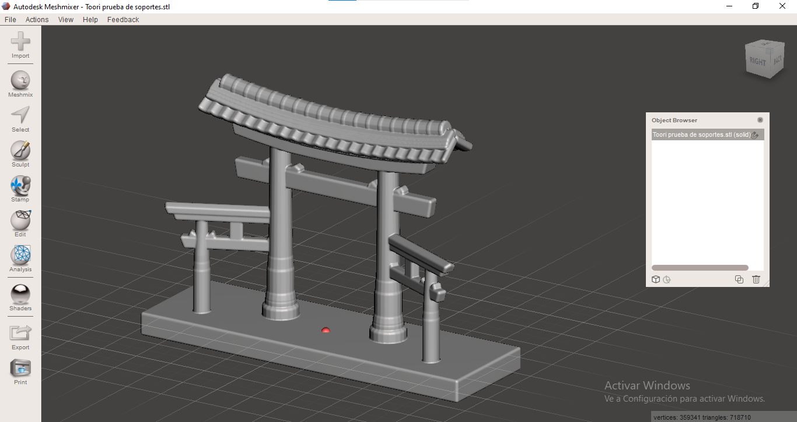
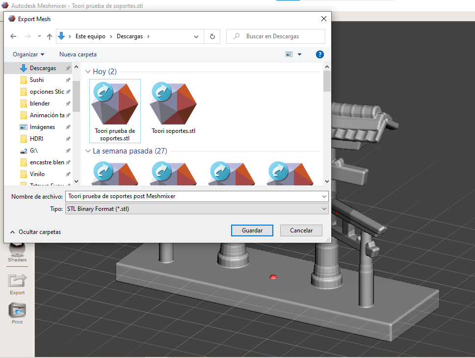

# Prueba de Soportes




[black-frost.md](../impresion-3d/black-frost.md)


En este documento, se detalla el proceso de reutilización de un modelo Toori previamente configurado en el archivo de Jack Frost. El objetivo principal de esta adaptación es mostrar los soportes de ramificaciones y pilares, lo que implica realizar modificaciones significativas en el diseño original. En este caso, se ha optado por sustituir la base redonda por una base rectangular para satisfacer los requisitos específicos de soporte.

## Proceso de Reutilización del Toori Configurado en el Archivo de Jack Frost

#### 1. Eliminación de Jack Frost

El primer paso consistió en eliminar el modelo de Jack Frost del archivo existente.

#### 2. Sustitución de la Base

Con Jack Frost eliminado, se procedió a reemplazar la base redonda por una base rectangular. Esto se hizo mediante la creación de una nueva geometría y su ubicación adecuada en el modelo Toori.

<figure><figcaption></figcaption></figure>

#### 3. Ajuste de Normales en la Base

Al verificar las normales en la nueva base rectangular, se identificó que estaban orientadas incorrectamente. Para corregir esto, se utilizó el comando Ctrl + N para abrir un menú emergente y cambiar la dirección de las normales.

<figure><figcaption></figcaption></figure>

<figure><figcaption></figcaption></figure>

 

<figure><figcaption></figcaption></figure>

#### 4. Exportación del Proceso

Una vez completadas todas las modificaciones, se procedió a exportar el modelo Toori en formato .stl con las nuevas configuraciones.

<figure><figcaption></figcaption></figure>





***

## <mark style="color:purple;">Proceso de Ajuste en Meshmixer para el Modelo Toori</mark>

### Importación del Archivo

**Abrir Meshmixer:**

* Inicie Meshmixer y seleccione la opción para abrir un nuevo proyecto.

<figure><figcaption></figcaption></figure>

**Importar el Archivo:**

* Utilice la función de importación para cargar el archivo del modelo Toori, que ha sido configurado en el archivo de Jack Frost.

<figure><figcaption></figcaption></figure>

### <mark style="color:purple;">Ajuste con "Make Solid"</mark>

**Acceso a la Opción "Make Solid":**

* Diríjase al menú "Edit" y elija la opción "Make Solid" para comenzar el proceso de ajuste del modelo.

<figure><figcaption></figcaption></figure>

**Configuración de Parámetros:**

* Ajuste los siguientes parámetros para obtener un resultado óptimo:
  * **Solid Type:** Seleccionar "Accurate".
  * **Solid Accuracy:** Configurar al máximo para mejorar la precisión del sólido.
  * **Mesh Density:** Experimentar con diferentes valores hasta lograr un resultado aceptable.
  * **Offset Distance:** Ajustar a 0.1 mm o un valor similar.

<figure><figcaption></figcaption></figure>

**Visualización de Resultados:**

Después de cada modificación de parámetros, seleccione "Update" para visualizar el impacto en el modelo.

**Aceptar el Resultado Satisfactorio:**

Una vez que se logre un resultado satisfactorio, seleccione "Accept" para aplicar los cambios.

### <mark style="color:purple;">Eliminación del Archivo Original y Guardado</mark>

**Eliminar el Archivo Original:**

* Elimine el archivo original sin las modificaciones realizadas con "Make Solid". Mantenga solo la versión editada.

<figure><figcaption></figcaption></figure>

**Guardar el Archivo:**

* Guarde el archivo en formato STL, ya que Meshmixer trabaja con este formato. Asegúrese de proporcionar un nombre descriptivo al archivo para facilitar la identificación.

<figure><figcaption></figcaption></figure>

 

<figure><figcaption></figcaption></figure>

El archivo editado y ajustado con "Make Solid" ahora está listo para su uso. Recuerde que este archivo optimizado es el que debe conservar, y puede ser utilizado en aplicaciones posteriores.



***

## <mark style="color:purple;">Proceso de Preparación e Impresión en FlashPrint</mark>

*   **Iniciar FlashPrint:**

    Abra FlashPrint y seleccione la opción para comenzar un nuevo proyecto.
*   **Importar Archivo STL:**

    Utilice la función de importación para cargar el archivo STL del modelo Toori previamente editado en Meshmixer.

<figure><figcaption></figcaption></figure>

### <mark style="color:purple;">Escalado del Modelo</mark>

*   <mark style="color:purple;">**Escalado del Modelo:**</mark>

    Ajuste el tamaño del modelo según sus preferencias. Busque un equilibrio entre un tamaño que no sea muy pequeño para mantener los detalles y no muy grande para agilizar el tiempo de impresión.

<figure><figcaption></figcaption></figure>

### <mark style="color:purple;">Agregar Soportes de Ramificaciones</mark>

*   <mark style="color:purple;">**Agregar Soportes:**</mark>

    Diríjase a la ventana de soportes y seleccione la opción de ramificaciones.

<figure><figcaption></figcaption></figure>

*   <mark style="color:purple;">**Generar Autosoportes:**</mark>

    Utilice las opciones disponibles para generar autosoportes. Asegúrese de revisar la vista previa para confirmar la ubicación y la cantidad de los soportes.

<figure><figcaption></figcaption></figure>

*   <mark style="color:purple;">**Salir de la Ventana de Soportes:**</mark>

    Después de generar los autosoportes, salga de la ventana de soportes y prepárese para el siguiente paso.

### <mark style="color:purple;">Iniciar Corte</mark>

*   <mark style="color:purple;">**Dirigirse a Iniciar Corte:**</mark>

    Vaya a la opción correspondiente para iniciar el proceso de corte. Esto preparará el modelo para la impresión.
*   <mark style="color:purple;">**Configuración de Parámetros de Impresión:**</mark>

    Ajuste los parámetros de impresión según las necesidades del proyecto, como la calidad de impresión, tipo de material, y otros factores relevantes.

<figure><figcaption></figcaption></figure>

*   <mark style="color:purple;">**Guardar Configuración:**</mark>

    Guarde la configuración de impresión para poder replicarla en futuros proyectos similares.
*   <mark style="color:purple;">**Iniciar Corte:**</mark>

    Haga clic en "Iniciar Corte" para procesar el modelo con la configuración establecida. La ventana emergente se cerrará automáticamente.

<figure><figcaption></figcaption></figure>

### <mark style="color:purple;">Vista Previa de Corte</mark>

*   <mark style="color:purple;">**Visualizar Vista Previa:**</mark>

    Acceda a la función de "Vista Previa de Corte" para examinar el modelo en capas y evaluar el tiempo estimado de impresión.
*   <mark style="color:purple;">**Modificar Parámetros si es Necesario:**</mark>

    Si la duración de la impresión o la vista previa sugieren ajustes necesarios, regrese a la configuración y realice los cambios correspondientes.
*   <mark style="color:purple;">**Explorar Capas:**</mark>

    Utilice la vista previa para examinar las capas individuales del modelo y verificar la distribución de soportes y detalles.

<figure><figcaption>
alto de última capa 0.30mm.
</figcaption></figure>

<figure><figcaption>
alto de última capa 0.10mm.
</figcaption></figure>

<figure><figcaption>
altura de capa 0.10mm.
</figcaption></figure>

### <mark style="color:purple;">Guardar Archivo Configurado</mark>

*   <mark style="color:purple;">**Satisfacción con la Previsualización:**</mark>

    Una vez satisfecho con la vista previa y la configuración, proceda a guardar el archivo configurado para la impresión.
*   <mark style="color:purple;">**Guardar en Local:**</mark>

    Seleccione "Guardar en Local" para guardar el archivo en formato .gx, que es procesable por la impresora 3D.
*

    <figure><figcaption></figcaption></figure>
*   <mark style="color:purple;">**Nombrar y Guardar:**</mark>

    Proporcione un nombre descriptivo al archivo y guarde en una ubicación conveniente.

<figure><figcaption></figcaption></figure>


Archivo de la prueba con soportes ramificados.


## <mark style="color:purple;">Repetición del Proceso con Soporte en Pilares</mark>

Si se desea imprimir el modelo Toori con un tipo de soporte diferente, específicamente utilizando soportes en pilares en lugar de ramificaciones, se puede repetir el proceso siguiendo los pasos anteriores con las siguientes modificaciones:

### <mark style="color:purple;">Cambio de Tipo de Soporte</mark>

1. <mark style="color:purple;">**Seleccionar Soporte en Pilares:**</mark>
   * En la ventana de soportes en FlashPrint, elija la opción de soportes en pilares en lugar de ramificaciones.
2. <mark style="color:purple;">**Generar Autosoportes para Pilares:**</mark>
   * Utilice las opciones disponibles para generar autosoportes específicamente diseñados para pilares. Ajuste la configuración según sea necesario.

<figure><figcaption>
Vista del Toori con autosoportes de pilares.
</figcaption></figure>

### <mark style="color:purple;">Guardado del Archivo Configurad</mark>o

3. <mark style="color:purple;">**Guardar en Local:**</mark>
   * Después de realizar los cambios en los soportes, seleccione "Guardar en Local" para guardar el archivo en formato .gx. Asegúrese de proporcionar un nombre descriptivo al archivo.
4.

    <figure><figcaption></figcaption></figure>
5. <mark style="color:purple;">**Nombrar y Guardar:**</mark>
   * Proporcione un nombre descriptivo al archivo y guarde en una ubicación conveniente.


Archivo del Toori con soporte de pilares.


### <mark style="color:purple;">Impresión</mark>

*   <mark style="color:purple;">**Proceso Listo para Impresión:**</mark>

    El archivo .gx generado, ahora con soporte en pilares, está listo para ser transferido a la impresora 3D. Asegúrese de que la impresora esté conectada y cargue el archivo según las instrucciones del fabricante.
*   <mark style="color:purple;">**Supervisar la Impresión:**</mark>

    Durante la impresión, supervise el progreso y ajuste según sea necesario para garantizar resultados óptimos.

***

## <mark style="color:purple;">Resultados Finales del Proceso de Impresión 3D del Modelo Toori</mark>

Después de completar el proceso de configuración en Blender, Meshmixer y FlashPrint, y de realizar la impresión 3D con soportes tanto en ramificaciones como en pilares, se obtienen los siguientes resultados finales:

### Modelo Toori con Soportes en Ramificaciones

* El modelo Toori, optimizado y ajustado en Meshmixer con soportes en ramificaciones, ha sido procesado y cortado en FlashPrint para su impresión 3D.
* La selección de soportes en ramificaciones ha proporcionado un buen equilibrio entre estabilidad y minimización del material de soporte, permitiendo una impresión exitosa del modelo.
* La vista previa de corte en FlashPrint y la duración estimada de la impresión han sido revisadas y validadas, asegurando un proceso de impresión eficiente y con resultados de calidad.

### Modelo Toori con Soportes en Pilares

* Para comparar, el mismo modelo Toori ha sido procesado nuevamente en FlashPrint, esta vez utilizando soportes en pilares en lugar de ramificaciones.
* Los soportes en pilares proporcionan una estructura diferente para mantener la estabilidad del modelo durante la impresión, especialmente en áreas que requieren un soporte vertical más robusto.
* La vista previa de corte y el tiempo estimado de impresión han sido evaluados nuevamente para garantizar que los ajustes en los soportes no afecten negativamente la eficiencia del proceso.

***

### <mark style="color:purple;">Conclusiones</mark>&#x20;

#### <mark style="color:purple;">Comparación de Soportes en Ramificaciones y Pilares para el Modelo Toori</mark>

<table><thead><tr><th width="209">Aspecto</th><th>Soportes en Ramificaciones</th><th>Soportes en Pilares</th></tr></thead><tbody><tr><td><mark style="color:purple;"><strong>Estabilidad y Minimización de Material</strong></mark></td><td>Buen equilibrio entre estabilidad y material.</td><td>Enfoque robusto verticalmente, potencial ahorro de material.</td></tr><tr><td><mark style="color:purple;"><strong>Detalles y Complejidad</strong></mark></td><td>Ideal para áreas detalladas y complejas.</td><td>Mejor adaptación a geometrías más simples.</td></tr><tr><td><mark style="color:purple;"><strong>Eficiencia en Tiempo de Impresión</strong></mark></td><td>Puede contribuir a una impresión más rápida.</td><td>Potencial reducción del tiempo de impresión.</td></tr><tr><td><mark style="color:purple;"><strong>Robustez Vertical</strong></mark></td><td>Menos robusto verticalmente que pilares.</td><td>Mayor robustez vertical, especialmente en líneas rectas.</td></tr><tr><td><mark style="color:purple;"><strong>Reducción de Material Residual</strong></mark></td><td>Uso eficiente del material, pero con más pilares.</td><td>Potencial reducción significativa del material.</td></tr><tr><td><mark style="color:purple;"><strong>Adaptabilidad a Geometrías Simples</strong></mark></td><td>Ideal para geometrías complejas.</td><td>Mejor rendimiento en áreas con geometrías más simples.</td></tr></tbody></table>

#### <mark style="color:purple;">**Observaciones Adicionales:**</mark>

<mark style="color:purple;">**Autosoportes en Pilares:**</mark>

* Experimentar con la densidad y la configuración puede optimizar el resultado.
* Realizar pruebas de impresión de muestra para validar ajustes.

#### **Despedida:**

En la exploración y comparación de soportes en ramificaciones y pilares para el modelo Toori, hemos identificado sus ventajas y consideraciones específicas. Este proceso demuestra la importancia de ajustar las configuraciones según las necesidades únicas de cada proyecto. Al experimentar con las opciones de soporte, logramos adaptar el proceso de impresión a las características particulares del modelo, permitiendo una toma de decisiones informada para futuros proyectos. ¡Que tus impresiones 3D estén llenas de éxito y creatividad!

